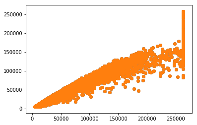

```python
import phenograph
import fcsparser
import matplotlib
import matplotlib.pyplot
import pylab

path = "/Volumes/Beta/data/FCS/fcs/2016-05-26_PANEL 1_ZF_panel one_F1631027_002.fcs"
meta, data = fcsparser.parse(path, meta_data_only=False, reformat_meta=True)
data
```


<div>
<table border="1" class="dataframe">
  <thead>
    <tr style="text-align: right;">
      <th></th>
      <th>FSC-A</th>
      <th>FSC-H</th>
      <th>FSC-W</th>
      <th>SSC-A</th>
      <th>SSC-H</th>
      <th>SSC-W</th>
      <th>BB515-A</th>
      <th>PE-A</th>
      <th>PE-CF594-A</th>
      <th>PE-Cy7-A</th>
      <th>BUV 395-A</th>
      <th>BUV 737-A</th>
      <th>APC-A</th>
      <th>BV 421-A</th>
      <th>BV 510-A</th>
      <th>BV 605-A</th>
      <th>BV 711-A</th>
      <th>APC-Cy7-A</th>
      <th>Time</th>
    </tr>
  </thead>
  <tbody>
    <tr>
      <th>0</th>
      <td>7101.439941</td>
      <td>6411.0</td>
      <td>72593.984375</td>
      <td>15312.879883</td>
      <td>14379.0</td>
      <td>69792.398438</td>
      <td>-5.280000</td>
      <td>441.760010</td>
      <td>194.479996</td>
      <td>43.119999</td>
      <td>177.599991</td>
      <td>-105.599998</td>
      <td>112.860008</td>
      <td>1052.869995</td>
      <td>213.599991</td>
      <td>400.500000</td>
      <td>32.930000</td>
      <td>-262.020020</td>
      <td>52.000000</td>
    </tr>
    <tr>
      <th>1</th>
      <td>15695.519531</td>
      <td>14141.0</td>
      <td>72740.375000</td>
      <td>15575.120117</td>
      <td>13997.0</td>
      <td>72924.984375</td>
      <td>-60.720001</td>
      <td>330.000000</td>
      <td>-7.920000</td>
      <td>-299.200012</td>
      <td>-79.680000</td>
      <td>203.519989</td>
      <td>7.260000</td>
      <td>307.940002</td>
      <td>272.339996</td>
      <td>283.019989</td>
      <td>321.290009</td>
      <td>130.680008</td>
      <td>52.500000</td>
    </tr>
    <tr>
      <th>2</th>
      <td>7790.759766</td>
      <td>7566.0</td>
      <td>67482.859375</td>
      <td>6102.799805</td>
      <td>5994.0</td>
      <td>66725.578125</td>
      <td>39.599998</td>
      <td>78.320000</td>
      <td>50.160000</td>
      <td>-81.839996</td>
      <td>-39.360001</td>
      <td>-38.399998</td>
      <td>48.840000</td>
      <td>-134.389999</td>
      <td>-256.320007</td>
      <td>44.500000</td>
      <td>16.020000</td>
      <td>-3.960000</td>
      <td>52.599998</td>
    </tr>
    <tr>
      <th>3</th>
      <td>5386.879883</td>
      <td>5191.0</td>
      <td>68008.968750</td>
      <td>6640.479980</td>
      <td>6291.0</td>
      <td>69176.679688</td>
      <td>-153.119995</td>
      <td>-542.960022</td>
      <td>-21.119999</td>
      <td>7.040000</td>
      <td>-7.680000</td>
      <td>148.800003</td>
      <td>1.980000</td>
      <td>-1141.869995</td>
      <td>-169.989990</td>
      <td>-271.449982</td>
      <td>-107.689995</td>
      <td>730.620056</td>
      <td>52.700001</td>
    </tr>
    <tr>
      <th>4</th>
      <td>7976.199707</td>
      <td>7611.0</td>
      <td>68680.617188</td>
      <td>11382.799805</td>
      <td>9647.0</td>
      <td>77328.000000</td>
      <td>-20.240000</td>
      <td>-93.279999</td>
      <td>-32.560001</td>
      <td>32.560001</td>
      <td>112.320000</td>
      <td>-188.159988</td>
      <td>-189.420013</td>
      <td>-267.889984</td>
      <td>307.940002</td>
      <td>15.130000</td>
      <td>-129.940002</td>
      <td>147.840012</td>
      <td>52.700001</td>
    </tr>
    <tr>
      <th>5</th>
      <td>8011.919922</td>
      <td>6684.0</td>
      <td>78556.125000</td>
      <td>11522.719727</td>
      <td>8796.0</td>
      <td>85851.859375</td>
      <td>174.240005</td>
      <td>-323.839996</td>
      <td>-69.519997</td>
      <td>-192.720001</td>
      <td>27.840000</td>
      <td>95.040001</td>
      <td>213.180008</td>
      <td>817.909973</td>
      <td>273.229980</td>
      <td>-47.169998</td>
      <td>169.099991</td>
      <td>435.600006</td>
      <td>53.400002</td>
    </tr>
    <tr>
      <th>6</th>
      <td>7929.839844</td>
      <td>7462.0</td>
      <td>69644.867188</td>
      <td>8306.320312</td>
      <td>8082.0</td>
      <td>67354.984375</td>
      <td>-76.559998</td>
      <td>-110.879997</td>
      <td>75.680000</td>
      <td>158.399994</td>
      <td>37.439999</td>
      <td>313.919983</td>
      <td>31.020000</td>
      <td>640.799988</td>
      <td>-48.950001</td>
      <td>-56.959999</td>
      <td>-26.699999</td>
      <td>155.760010</td>
      <td>53.900002</td>
    </tr>
    <tr>
      <th>7</th>
      <td>6466.080078</td>
      <td>5911.0</td>
      <td>71690.242188</td>
      <td>10665.599609</td>
      <td>10355.0</td>
      <td>67501.757812</td>
      <td>-28.160000</td>
      <td>-79.199997</td>
      <td>117.919998</td>
      <td>207.679993</td>
      <td>-112.320000</td>
      <td>-348.479980</td>
      <td>-90.420006</td>
      <td>-922.929993</td>
      <td>-354.220001</td>
      <td>275.010010</td>
      <td>-43.610001</td>
      <td>-204.600006</td>
      <td>54.000000</td>
    </tr>
    <tr>
      <th>8</th>
      <td>10015.280273</td>
      <td>9220.0</td>
      <td>71188.867188</td>
      <td>6336.879883</td>
      <td>6208.0</td>
      <td>66896.546875</td>
      <td>-344.959991</td>
      <td>-18.480000</td>
      <td>13.200000</td>
      <td>117.040001</td>
      <td>5.760000</td>
      <td>-118.079994</td>
      <td>-60.060001</td>
      <td>1253.119995</td>
      <td>489.500000</td>
      <td>114.809998</td>
      <td>-88.110001</td>
      <td>505.560028</td>
      <td>54.000000</td>
    </tr>
    <tr>
      <th>9</th>
      <td>9918.759766</td>
      <td>9675.0</td>
      <td>67187.164062</td>
      <td>5780.719727</td>
      <td>5467.0</td>
      <td>69296.742188</td>
      <td>-90.639999</td>
      <td>179.520004</td>
      <td>-50.160000</td>
      <td>175.119995</td>
      <td>48.959999</td>
      <td>160.319992</td>
      <td>-143.880005</td>
      <td>336.419983</td>
      <td>67.639999</td>
      <td>107.689995</td>
      <td>40.939999</td>
      <td>15.180000</td>
      <td>54.599998</td>
    </tr>
    <tr>
      <th>10</th>
      <td>10839.879883</td>
      <td>9525.0</td>
      <td>74582.921875</td>
      <td>16018.639648</td>
      <td>14145.0</td>
      <td>74216.867188</td>
      <td>224.399994</td>
      <td>-197.119995</td>
      <td>146.960007</td>
      <td>9.680000</td>
      <td>48.000000</td>
      <td>283.199982</td>
      <td>-20.460001</td>
      <td>1128.520020</td>
      <td>53.399998</td>
      <td>403.169983</td>
      <td>185.119995</td>
      <td>592.020020</td>
      <td>54.799999</td>
    </tr>
    <tr>
      <th>11</th>
      <td>18343.359375</td>
      <td>15882.0</td>
      <td>75692.632812</td>
      <td>42841.917969</td>
      <td>36554.0</td>
      <td>76809.320312</td>
      <td>324.720001</td>
      <td>481.359985</td>
      <td>179.520004</td>
      <td>732.159973</td>
      <td>235.199997</td>
      <td>-92.159996</td>
      <td>47.520000</td>
      <td>3820.770020</td>
      <td>913.140015</td>
      <td>280.350006</td>
      <td>117.479996</td>
      <td>316.800018</td>
      <td>54.799999</td>
    </tr>
    <tr>
      <th>12</th>
      <td>22948.199219</td>
      <td>19187.0</td>
      <td>78382.921875</td>
      <td>18051.439453</td>
      <td>15075.0</td>
      <td>78475.562500</td>
      <td>21.119999</td>
      <td>-330.880005</td>
      <td>-21.119999</td>
      <td>-46.639999</td>
      <td>143.039993</td>
      <td>-349.440002</td>
      <td>247.500015</td>
      <td>721.789978</td>
      <td>309.720001</td>
      <td>32.930000</td>
      <td>9.790000</td>
      <td>644.820007</td>
      <td>55.700001</td>
    </tr>
    <tr>
      <th>13</th>
      <td>10524.479492</td>
      <td>9863.0</td>
      <td>69931.289062</td>
      <td>16260.639648</td>
      <td>14855.0</td>
      <td>71737.281250</td>
      <td>-281.600006</td>
      <td>-190.080002</td>
      <td>58.959999</td>
      <td>-111.760002</td>
      <td>144.959991</td>
      <td>-251.519989</td>
      <td>-206.580002</td>
      <td>1727.489990</td>
      <td>-170.880005</td>
      <td>-286.579987</td>
      <td>-18.690001</td>
      <td>266.640015</td>
      <td>56.700001</td>
    </tr>
    <tr>
      <th>14</th>
      <td>10709.919922</td>
      <td>10391.0</td>
      <td>67547.429688</td>
      <td>14235.759766</td>
      <td>13603.0</td>
      <td>68584.484375</td>
      <td>-1.760000</td>
      <td>-518.320007</td>
      <td>28.160000</td>
      <td>-7.920000</td>
      <td>-165.119995</td>
      <td>-210.239990</td>
      <td>-213.180008</td>
      <td>286.579987</td>
      <td>-22.250000</td>
      <td>397.829987</td>
      <td>92.559998</td>
      <td>341.220001</td>
      <td>56.700001</td>
    </tr>
    <tr>
      <th>15</th>
      <td>10707.639648</td>
      <td>9915.0</td>
      <td>70775.179688</td>
      <td>6885.120117</td>
      <td>6635.0</td>
      <td>68006.523438</td>
      <td>138.160004</td>
      <td>-49.279999</td>
      <td>-43.119999</td>
      <td>-411.839996</td>
      <td>-12.480000</td>
      <td>-179.519989</td>
      <td>175.560013</td>
      <td>69.419998</td>
      <td>339.089996</td>
      <td>859.739990</td>
      <td>-36.489998</td>
      <td>-233.640015</td>
      <td>56.700001</td>
    </tr>
    <tr>
      <th>16</th>
      <td>7581.000000</td>
      <td>7347.0</td>
      <td>67623.304688</td>
      <td>10921.679688</td>
      <td>10567.0</td>
      <td>67735.710938</td>
      <td>131.119995</td>
      <td>14.080000</td>
      <td>-50.160000</td>
      <td>108.239998</td>
      <td>73.919998</td>
      <td>472.319977</td>
      <td>-115.500008</td>
      <td>404.949982</td>
      <td>242.080002</td>
      <td>8.900000</td>
      <td>-4.450000</td>
      <td>-994.620056</td>
      <td>57.200001</td>
    </tr>
    <tr>
      <th>17</th>
      <td>262143.000000</td>
      <td>257610.0</td>
      <td>66689.203125</td>
      <td>262143.000000</td>
      <td>256590.0</td>
      <td>66954.304688</td>
      <td>47600.078125</td>
      <td>111012.882812</td>
      <td>54592.558594</td>
      <td>34175.679688</td>
      <td>47970.238281</td>
      <td>37690.558594</td>
      <td>44618.640625</td>
      <td>262143.000000</td>
      <td>101555.226562</td>
      <td>106482.265625</td>
      <td>38694.531250</td>
      <td>80191.984375</td>
      <td>57.299999</td>
    </tr>
    <tr>
      <th>18</th>
      <td>10098.120117</td>
      <td>9712.0</td>
      <td>68141.515625</td>
      <td>5182.319824</td>
      <td>4932.0</td>
      <td>68862.226562</td>
      <td>-190.959991</td>
      <td>265.760010</td>
      <td>9.680000</td>
      <td>-94.159996</td>
      <td>-145.919998</td>
      <td>-268.799988</td>
      <td>84.480003</td>
      <td>-1136.530029</td>
      <td>-82.769997</td>
      <td>80.099998</td>
      <td>-94.339996</td>
      <td>383.460022</td>
      <td>57.400002</td>
    </tr>
    <tr>
      <th>19</th>
      <td>36736.878906</td>
      <td>27621.0</td>
      <td>87165.132812</td>
      <td>122300.640625</td>
      <td>103633.0</td>
      <td>77341.148438</td>
      <td>638.880005</td>
      <td>4244.239746</td>
      <td>827.200012</td>
      <td>852.719971</td>
      <td>537.599976</td>
      <td>622.079956</td>
      <td>530.640015</td>
      <td>3685.489990</td>
      <td>2370.959961</td>
      <td>2863.129883</td>
      <td>509.970001</td>
      <td>638.880005</td>
      <td>57.500000</td>
    </tr>
    <tr>
      <th>20</th>
      <td>12769.519531</td>
      <td>11969.0</td>
      <td>69919.234375</td>
      <td>14117.839844</td>
      <td>12357.0</td>
      <td>74874.710938</td>
      <td>-239.360001</td>
      <td>190.080002</td>
      <td>82.720001</td>
      <td>334.399994</td>
      <td>6.720000</td>
      <td>-13.440000</td>
      <td>-211.860016</td>
      <td>-206.479996</td>
      <td>14.240000</td>
      <td>172.660004</td>
      <td>172.660004</td>
      <td>826.320007</td>
      <td>58.400002</td>
    </tr>
    <tr>
      <th>21</th>
      <td>10852.040039</td>
      <td>8954.0</td>
      <td>79428.117188</td>
      <td>12796.080078</td>
      <td>11402.0</td>
      <td>73548.843750</td>
      <td>-141.679993</td>
      <td>448.799988</td>
      <td>51.919998</td>
      <td>13.200000</td>
      <td>152.639999</td>
      <td>113.279999</td>
      <td>317.460022</td>
      <td>242.970001</td>
      <td>72.089996</td>
      <td>563.369995</td>
      <td>-11.570000</td>
      <td>102.300003</td>
      <td>58.400002</td>
    </tr>
    <tr>
      <th>22</th>
      <td>6162.080078</td>
      <td>6078.0</td>
      <td>66442.593750</td>
      <td>5657.520020</td>
      <td>5390.0</td>
      <td>68788.726562</td>
      <td>-11.440000</td>
      <td>-139.039993</td>
      <td>-2.640000</td>
      <td>475.200012</td>
      <td>128.639999</td>
      <td>-194.879990</td>
      <td>143.220001</td>
      <td>665.719971</td>
      <td>-23.139999</td>
      <td>84.549995</td>
      <td>46.279999</td>
      <td>-250.800003</td>
      <td>58.400002</td>
    </tr>
    <tr>
      <th>23</th>
      <td>7824.959961</td>
      <td>7726.0</td>
      <td>66375.437500</td>
      <td>15970.240234</td>
      <td>14622.0</td>
      <td>71578.835938</td>
      <td>-91.519997</td>
      <td>35.200001</td>
      <td>-27.280001</td>
      <td>505.119995</td>
      <td>78.720001</td>
      <td>134.399994</td>
      <td>-97.680000</td>
      <td>317.729980</td>
      <td>-73.869995</td>
      <td>135.279999</td>
      <td>-94.339996</td>
      <td>709.500000</td>
      <td>58.700001</td>
    </tr>
    <tr>
      <th>24</th>
      <td>12301.359375</td>
      <td>11530.0</td>
      <td>69920.375000</td>
      <td>10504.559570</td>
      <td>9434.0</td>
      <td>72972.953125</td>
      <td>-214.720001</td>
      <td>-121.440002</td>
      <td>-6.160000</td>
      <td>208.559998</td>
      <td>-73.919998</td>
      <td>197.759995</td>
      <td>-8.580000</td>
      <td>-773.409973</td>
      <td>-257.209991</td>
      <td>-445.889984</td>
      <td>-6.230000</td>
      <td>830.940063</td>
      <td>59.000000</td>
    </tr>
    <tr>
      <th>25</th>
      <td>18103.199219</td>
      <td>10883.0</td>
      <td>109015.093750</td>
      <td>36961.761719</td>
      <td>24707.0</td>
      <td>98042.093750</td>
      <td>411.839996</td>
      <td>745.359985</td>
      <td>103.839996</td>
      <td>207.679993</td>
      <td>21.119999</td>
      <td>321.600006</td>
      <td>81.840004</td>
      <td>6768.449707</td>
      <td>699.539978</td>
      <td>442.329987</td>
      <td>71.199997</td>
      <td>4.620000</td>
      <td>59.200001</td>
    </tr>
    <tr>
      <th>26</th>
      <td>8466.399414</td>
      <td>7890.0</td>
      <td>70323.695312</td>
      <td>4890.160156</td>
      <td>4742.0</td>
      <td>67583.625000</td>
      <td>11.440000</td>
      <td>344.959991</td>
      <td>-70.400002</td>
      <td>-204.160004</td>
      <td>-71.040001</td>
      <td>147.839996</td>
      <td>-246.180008</td>
      <td>-66.750000</td>
      <td>-29.369999</td>
      <td>248.309998</td>
      <td>82.769997</td>
      <td>205.920013</td>
      <td>59.400002</td>
    </tr>
    <tr>
      <th>27</th>
      <td>24429.439453</td>
      <td>23015.0</td>
      <td>69563.664062</td>
      <td>168296.484375</td>
      <td>157335.0</td>
      <td>70101.882812</td>
      <td>638.000000</td>
      <td>1047.199951</td>
      <td>1177.439941</td>
      <td>2768.479980</td>
      <td>13995.839844</td>
      <td>1814.399902</td>
      <td>569.580017</td>
      <td>28612.609375</td>
      <td>7040.790039</td>
      <td>1793.349976</td>
      <td>1816.489990</td>
      <td>914.100037</td>
      <td>59.700001</td>
    </tr>
    <tr>
      <th>28</th>
      <td>9874.679688</td>
      <td>9098.0</td>
      <td>71130.687500</td>
      <td>7458.000000</td>
      <td>7070.0</td>
      <td>69132.601562</td>
      <td>-181.279999</td>
      <td>-167.199997</td>
      <td>-143.440002</td>
      <td>408.320007</td>
      <td>43.200001</td>
      <td>-372.479980</td>
      <td>-126.060005</td>
      <td>-1158.780029</td>
      <td>137.949997</td>
      <td>389.820007</td>
      <td>154.860001</td>
      <td>396.000031</td>
      <td>59.799999</td>
    </tr>
    <tr>
      <th>29</th>
      <td>122756.718750</td>
      <td>97742.0</td>
      <td>82308.375000</td>
      <td>66235.835938</td>
      <td>57918.0</td>
      <td>74947.890625</td>
      <td>280.720001</td>
      <td>201.520004</td>
      <td>246.399994</td>
      <td>7363.839844</td>
      <td>1936.319946</td>
      <td>16529.279297</td>
      <td>10.560000</td>
      <td>8572.479492</td>
      <td>1301.179932</td>
      <td>761.839966</td>
      <td>24028.218750</td>
      <td>9021.540039</td>
      <td>59.900002</td>
    </tr>
    <tr>
      <th>...</th>
      <td>...</td>
      <td>...</td>
      <td>...</td>
      <td>...</td>
      <td>...</td>
      <td>...</td>
      <td>...</td>
      <td>...</td>
      <td>...</td>
      <td>...</td>
      <td>...</td>
      <td>...</td>
      <td>...</td>
      <td>...</td>
      <td>...</td>
      <td>...</td>
      <td>...</td>
      <td>...</td>
      <td>...</td>
    </tr>
    <tr>
      <th>87322</th>
      <td>10901.439453</td>
      <td>9947.0</td>
      <td>71824.351562</td>
      <td>8417.200195</td>
      <td>8031.0</td>
      <td>68687.539062</td>
      <td>-166.319992</td>
      <td>12.320000</td>
      <td>-37.840000</td>
      <td>-223.520004</td>
      <td>-35.520000</td>
      <td>-51.840000</td>
      <td>50.820004</td>
      <td>646.140015</td>
      <td>6.230000</td>
      <td>75.650002</td>
      <td>0.000000</td>
      <td>-152.460007</td>
      <td>32214.400391</td>
    </tr>
    <tr>
      <th>87323</th>
      <td>7866.000000</td>
      <td>7663.0</td>
      <td>67272.109375</td>
      <td>12073.599609</td>
      <td>11643.0</td>
      <td>67959.750000</td>
      <td>120.559998</td>
      <td>-139.919998</td>
      <td>69.519997</td>
      <td>249.039993</td>
      <td>-13.440000</td>
      <td>-207.360001</td>
      <td>108.900002</td>
      <td>120.150002</td>
      <td>129.940002</td>
      <td>117.479996</td>
      <td>2.670000</td>
      <td>-265.320007</td>
      <td>32214.699219</td>
    </tr>
    <tr>
      <th>87324</th>
      <td>8895.040039</td>
      <td>8739.0</td>
      <td>66706.179688</td>
      <td>20928.160156</td>
      <td>20595.0</td>
      <td>66596.156250</td>
      <td>283.359985</td>
      <td>303.600006</td>
      <td>-48.400002</td>
      <td>-533.279968</td>
      <td>-36.480000</td>
      <td>3.840000</td>
      <td>14.520000</td>
      <td>-6.230000</td>
      <td>-183.339996</td>
      <td>108.580002</td>
      <td>-1.780000</td>
      <td>-166.320007</td>
      <td>32214.800781</td>
    </tr>
    <tr>
      <th>87325</th>
      <td>5502.399902</td>
      <td>5287.0</td>
      <td>68206.031250</td>
      <td>4248.640137</td>
      <td>4227.0</td>
      <td>65871.515625</td>
      <td>-389.839996</td>
      <td>-200.639999</td>
      <td>-84.479996</td>
      <td>320.320007</td>
      <td>-27.840000</td>
      <td>59.520000</td>
      <td>113.520004</td>
      <td>2119.979980</td>
      <td>96.119995</td>
      <td>2.670000</td>
      <td>-9.790000</td>
      <td>-306.240021</td>
      <td>32215.099609</td>
    </tr>
    <tr>
      <th>87326</th>
      <td>9724.200195</td>
      <td>9511.0</td>
      <td>67005.070312</td>
      <td>8040.560059</td>
      <td>7827.0</td>
      <td>67324.156250</td>
      <td>35.200001</td>
      <td>-102.080002</td>
      <td>41.360001</td>
      <td>205.039993</td>
      <td>80.639999</td>
      <td>356.160004</td>
      <td>-48.180000</td>
      <td>-398.720001</td>
      <td>253.649994</td>
      <td>158.419998</td>
      <td>143.289993</td>
      <td>123.420006</td>
      <td>32215.199219</td>
    </tr>
    <tr>
      <th>87327</th>
      <td>6702.439941</td>
      <td>6437.0</td>
      <td>68238.492188</td>
      <td>9235.599609</td>
      <td>8629.0</td>
      <td>70143.031250</td>
      <td>47.520000</td>
      <td>-40.480000</td>
      <td>-25.520000</td>
      <td>70.400002</td>
      <td>16.320000</td>
      <td>-1.920000</td>
      <td>-170.280014</td>
      <td>-440.549988</td>
      <td>198.470001</td>
      <td>346.209991</td>
      <td>11.570000</td>
      <td>-13.860001</td>
      <td>32215.800781</td>
    </tr>
    <tr>
      <th>87328</th>
      <td>37791.757812</td>
      <td>35067.0</td>
      <td>70628.242188</td>
      <td>20576.160156</td>
      <td>19311.0</td>
      <td>69829.593750</td>
      <td>211.199997</td>
      <td>-523.599976</td>
      <td>-0.880000</td>
      <td>446.160004</td>
      <td>47.039997</td>
      <td>-115.199997</td>
      <td>81.840004</td>
      <td>1993.599976</td>
      <td>268.779999</td>
      <td>153.970001</td>
      <td>26.699999</td>
      <td>-129.360001</td>
      <td>32216.199219</td>
    </tr>
    <tr>
      <th>87329</th>
      <td>10548.799805</td>
      <td>9202.0</td>
      <td>75127.820312</td>
      <td>16645.199219</td>
      <td>13378.0</td>
      <td>81541.312500</td>
      <td>381.040009</td>
      <td>171.600006</td>
      <td>469.919983</td>
      <td>150.479996</td>
      <td>73.919998</td>
      <td>363.839996</td>
      <td>253.440002</td>
      <td>125.489998</td>
      <td>97.010002</td>
      <td>459.239990</td>
      <td>988.789978</td>
      <td>475.200012</td>
      <td>32216.599609</td>
    </tr>
    <tr>
      <th>87330</th>
      <td>5658.959961</td>
      <td>5290.0</td>
      <td>70106.921875</td>
      <td>3630.000000</td>
      <td>3642.0</td>
      <td>65320.066406</td>
      <td>129.360001</td>
      <td>43.119999</td>
      <td>-40.480000</td>
      <td>62.480000</td>
      <td>144.000000</td>
      <td>-185.279999</td>
      <td>194.700012</td>
      <td>212.709991</td>
      <td>232.289993</td>
      <td>531.330017</td>
      <td>120.150002</td>
      <td>-561.660034</td>
      <td>32216.599609</td>
    </tr>
    <tr>
      <th>87331</th>
      <td>18170.839844</td>
      <td>12039.0</td>
      <td>98915.539062</td>
      <td>40134.160156</td>
      <td>31191.0</td>
      <td>84326.648438</td>
      <td>23.760000</td>
      <td>683.760010</td>
      <td>59.840000</td>
      <td>35.200001</td>
      <td>56.639999</td>
      <td>-510.720001</td>
      <td>7.920000</td>
      <td>1726.599976</td>
      <td>380.029999</td>
      <td>428.089996</td>
      <td>-74.760002</td>
      <td>577.500000</td>
      <td>32216.900391</td>
    </tr>
    <tr>
      <th>87332</th>
      <td>9920.280273</td>
      <td>9498.0</td>
      <td>68449.726562</td>
      <td>11595.759766</td>
      <td>10986.0</td>
      <td>69173.468750</td>
      <td>-41.360001</td>
      <td>-139.919998</td>
      <td>108.239998</td>
      <td>-287.760010</td>
      <td>53.759998</td>
      <td>257.279999</td>
      <td>-43.560001</td>
      <td>-832.149963</td>
      <td>168.209991</td>
      <td>96.119995</td>
      <td>90.779999</td>
      <td>411.180023</td>
      <td>32217.500000</td>
    </tr>
    <tr>
      <th>87333</th>
      <td>8258.919922</td>
      <td>7966.0</td>
      <td>67945.835938</td>
      <td>6155.600098</td>
      <td>5978.0</td>
      <td>67483.015625</td>
      <td>-260.480011</td>
      <td>-32.560001</td>
      <td>26.400000</td>
      <td>7.040000</td>
      <td>44.160000</td>
      <td>-176.639999</td>
      <td>135.960007</td>
      <td>999.469971</td>
      <td>-77.430000</td>
      <td>54.290001</td>
      <td>148.630005</td>
      <td>76.560005</td>
      <td>32217.500000</td>
    </tr>
    <tr>
      <th>87334</th>
      <td>12509.599609</td>
      <td>11853.0</td>
      <td>69166.390625</td>
      <td>9226.799805</td>
      <td>9117.0</td>
      <td>66325.281250</td>
      <td>288.639984</td>
      <td>-343.200012</td>
      <td>-40.480000</td>
      <td>-249.039993</td>
      <td>69.119995</td>
      <td>232.319992</td>
      <td>36.960003</td>
      <td>-952.299988</td>
      <td>-228.729996</td>
      <td>150.410004</td>
      <td>-28.480000</td>
      <td>415.800018</td>
      <td>32218.099609</td>
    </tr>
    <tr>
      <th>87335</th>
      <td>9523.559570</td>
      <td>8935.0</td>
      <td>69852.945312</td>
      <td>6202.239746</td>
      <td>5879.0</td>
      <td>69139.304688</td>
      <td>-1.760000</td>
      <td>198.880005</td>
      <td>51.040001</td>
      <td>-77.440002</td>
      <td>45.119999</td>
      <td>-48.959999</td>
      <td>1.320000</td>
      <td>954.969971</td>
      <td>431.649994</td>
      <td>23.139999</td>
      <td>-29.369999</td>
      <td>297.000000</td>
      <td>32218.199219</td>
    </tr>
    <tr>
      <th>87336</th>
      <td>11735.160156</td>
      <td>8815.0</td>
      <td>87246.226562</td>
      <td>47863.199219</td>
      <td>42463.0</td>
      <td>73870.492188</td>
      <td>1354.319946</td>
      <td>2566.959961</td>
      <td>632.719971</td>
      <td>5623.200195</td>
      <td>8335.679688</td>
      <td>11330.879883</td>
      <td>4326.300293</td>
      <td>6512.129883</td>
      <td>1404.419922</td>
      <td>885.549988</td>
      <td>16691.949219</td>
      <td>8698.800781</td>
      <td>32218.300781</td>
    </tr>
    <tr>
      <th>87337</th>
      <td>6558.040039</td>
      <td>6233.0</td>
      <td>68953.593750</td>
      <td>8554.479492</td>
      <td>7677.0</td>
      <td>73026.757812</td>
      <td>109.120003</td>
      <td>228.800003</td>
      <td>-80.080002</td>
      <td>-117.919998</td>
      <td>56.639999</td>
      <td>-76.799995</td>
      <td>-9.240001</td>
      <td>-226.059998</td>
      <td>89.889999</td>
      <td>-58.739998</td>
      <td>162.869995</td>
      <td>474.540009</td>
      <td>32218.400391</td>
    </tr>
    <tr>
      <th>87338</th>
      <td>7109.799805</td>
      <td>5350.0</td>
      <td>87093.054688</td>
      <td>19740.160156</td>
      <td>16854.0</td>
      <td>76758.703125</td>
      <td>66.000000</td>
      <td>492.799988</td>
      <td>166.319992</td>
      <td>52.799999</td>
      <td>-5.760000</td>
      <td>-287.040009</td>
      <td>274.559998</td>
      <td>1358.140015</td>
      <td>161.979996</td>
      <td>388.929993</td>
      <td>-64.970001</td>
      <td>-375.540009</td>
      <td>32218.800781</td>
    </tr>
    <tr>
      <th>87339</th>
      <td>6545.120117</td>
      <td>6005.0</td>
      <td>71430.648438</td>
      <td>14024.559570</td>
      <td>12149.0</td>
      <td>75653.429688</td>
      <td>-52.799999</td>
      <td>116.159996</td>
      <td>-73.040001</td>
      <td>29.920000</td>
      <td>57.599998</td>
      <td>-55.680000</td>
      <td>-21.780001</td>
      <td>807.229980</td>
      <td>114.809998</td>
      <td>294.589996</td>
      <td>49.840000</td>
      <td>607.200012</td>
      <td>32219.099609</td>
    </tr>
    <tr>
      <th>87340</th>
      <td>6005.520020</td>
      <td>5447.0</td>
      <td>72255.882812</td>
      <td>11144.320312</td>
      <td>10503.0</td>
      <td>69537.671875</td>
      <td>-60.720001</td>
      <td>444.399994</td>
      <td>170.720001</td>
      <td>13.200000</td>
      <td>21.119999</td>
      <td>-170.879990</td>
      <td>0.000000</td>
      <td>769.849976</td>
      <td>164.649994</td>
      <td>62.299999</td>
      <td>-32.930000</td>
      <td>49.500004</td>
      <td>32219.500000</td>
    </tr>
    <tr>
      <th>87341</th>
      <td>22414.679688</td>
      <td>20822.0</td>
      <td>70548.867188</td>
      <td>11786.719727</td>
      <td>11058.0</td>
      <td>69854.812500</td>
      <td>1.760000</td>
      <td>117.040001</td>
      <td>-142.559998</td>
      <td>380.160004</td>
      <td>-84.479996</td>
      <td>0.960000</td>
      <td>-11.220000</td>
      <td>1071.559937</td>
      <td>17.799999</td>
      <td>493.059998</td>
      <td>-56.070000</td>
      <td>-221.760010</td>
      <td>32219.599609</td>
    </tr>
    <tr>
      <th>87342</th>
      <td>7273.199707</td>
      <td>6617.0</td>
      <td>72035.125000</td>
      <td>8118.000000</td>
      <td>7533.0</td>
      <td>70625.414062</td>
      <td>5.280000</td>
      <td>-141.679993</td>
      <td>-24.639999</td>
      <td>443.519989</td>
      <td>140.160004</td>
      <td>383.039978</td>
      <td>129.360001</td>
      <td>-962.089966</td>
      <td>-95.229996</td>
      <td>243.860001</td>
      <td>98.790001</td>
      <td>-547.800049</td>
      <td>32220.099609</td>
    </tr>
    <tr>
      <th>87343</th>
      <td>6230.479980</td>
      <td>5946.0</td>
      <td>68671.500000</td>
      <td>3608.879883</td>
      <td>3550.0</td>
      <td>66622.984375</td>
      <td>-215.600006</td>
      <td>-23.760000</td>
      <td>41.360001</td>
      <td>250.800003</td>
      <td>-119.040001</td>
      <td>49.919998</td>
      <td>-33.000000</td>
      <td>1350.130005</td>
      <td>52.509998</td>
      <td>32.930000</td>
      <td>169.989990</td>
      <td>-861.300049</td>
      <td>32220.900391</td>
    </tr>
    <tr>
      <th>87344</th>
      <td>5757.000000</td>
      <td>5283.0</td>
      <td>71416.007812</td>
      <td>7817.040039</td>
      <td>7091.0</td>
      <td>72246.164062</td>
      <td>-13.200000</td>
      <td>-349.359985</td>
      <td>-193.600006</td>
      <td>53.680000</td>
      <td>12.480000</td>
      <td>290.880005</td>
      <td>97.020004</td>
      <td>799.219971</td>
      <td>109.470001</td>
      <td>-120.150002</td>
      <td>-131.720001</td>
      <td>-391.380005</td>
      <td>32221.300781</td>
    </tr>
    <tr>
      <th>87345</th>
      <td>7677.520020</td>
      <td>6955.0</td>
      <td>72344.203125</td>
      <td>12730.080078</td>
      <td>11083.0</td>
      <td>75275.523438</td>
      <td>75.680000</td>
      <td>243.759995</td>
      <td>-4.400000</td>
      <td>47.520000</td>
      <td>128.639999</td>
      <td>-109.439995</td>
      <td>136.620010</td>
      <td>1432.900024</td>
      <td>-573.159973</td>
      <td>419.190002</td>
      <td>-97.900002</td>
      <td>147.180008</td>
      <td>32221.800781</td>
    </tr>
    <tr>
      <th>87346</th>
      <td>12204.839844</td>
      <td>9812.0</td>
      <td>81518.179688</td>
      <td>53900.000000</td>
      <td>48452.0</td>
      <td>72904.953125</td>
      <td>1972.079956</td>
      <td>2826.560059</td>
      <td>626.559998</td>
      <td>1195.040039</td>
      <td>60.480000</td>
      <td>2237.760010</td>
      <td>561.000000</td>
      <td>3558.219971</td>
      <td>1033.290039</td>
      <td>784.089966</td>
      <td>3283.209961</td>
      <td>4779.060059</td>
      <td>32222.199219</td>
    </tr>
    <tr>
      <th>87347</th>
      <td>7495.879883</td>
      <td>6926.0</td>
      <td>70928.390625</td>
      <td>4831.200195</td>
      <td>4650.0</td>
      <td>68089.796875</td>
      <td>-99.440002</td>
      <td>68.639999</td>
      <td>36.079998</td>
      <td>709.279968</td>
      <td>-93.119995</td>
      <td>299.519989</td>
      <td>58.080002</td>
      <td>267.889984</td>
      <td>-25.809999</td>
      <td>469.919983</td>
      <td>-35.599998</td>
      <td>354.420013</td>
      <td>32222.400391</td>
    </tr>
    <tr>
      <th>87348</th>
      <td>9363.959961</td>
      <td>8931.0</td>
      <td>68713.070312</td>
      <td>9510.160156</td>
      <td>9027.0</td>
      <td>69043.750000</td>
      <td>190.959991</td>
      <td>7.920000</td>
      <td>-9.680000</td>
      <td>-249.919998</td>
      <td>-111.360001</td>
      <td>30.719999</td>
      <td>188.100006</td>
      <td>162.869995</td>
      <td>-100.570000</td>
      <td>202.919998</td>
      <td>86.330002</td>
      <td>-877.800049</td>
      <td>32223.199219</td>
    </tr>
    <tr>
      <th>87349</th>
      <td>8011.159668</td>
      <td>7497.0</td>
      <td>70030.601562</td>
      <td>7525.759766</td>
      <td>7149.0</td>
      <td>68989.812500</td>
      <td>135.520004</td>
      <td>134.639999</td>
      <td>74.800003</td>
      <td>-74.800003</td>
      <td>12.480000</td>
      <td>55.680000</td>
      <td>72.600006</td>
      <td>-949.630005</td>
      <td>-79.209999</td>
      <td>-12.460000</td>
      <td>-45.389999</td>
      <td>654.059998</td>
      <td>32223.900391</td>
    </tr>
    <tr>
      <th>87350</th>
      <td>7423.679688</td>
      <td>6783.0</td>
      <td>71726.132812</td>
      <td>5255.359863</td>
      <td>5131.0</td>
      <td>67124.390625</td>
      <td>353.760010</td>
      <td>159.279999</td>
      <td>107.360001</td>
      <td>411.839996</td>
      <td>17.279999</td>
      <td>317.759979</td>
      <td>129.360001</td>
      <td>1321.650024</td>
      <td>80.099998</td>
      <td>489.500000</td>
      <td>186.899994</td>
      <td>279.839996</td>
      <td>32224.199219</td>
    </tr>
    <tr>
      <th>87351</th>
      <td>46917.839844</td>
      <td>39711.0</td>
      <td>77429.617188</td>
      <td>155600.718750</td>
      <td>139659.0</td>
      <td>73016.765625</td>
      <td>670.559998</td>
      <td>697.839966</td>
      <td>387.200012</td>
      <td>-376.639984</td>
      <td>2132.159912</td>
      <td>191.039993</td>
      <td>191.400009</td>
      <td>14043.309570</td>
      <td>2390.540039</td>
      <td>1205.059937</td>
      <td>219.830002</td>
      <td>619.740051</td>
      <td>32225.300781</td>
    </tr>
  </tbody>
</table>
<p>87352 rows × 19 columns</p>
</div>


```python
matplotlib.pyplot.scatter(data['FSC-A'], data['FSC-H'])
matplotlib.pyplot.show()
```





```python

```


```python

```
