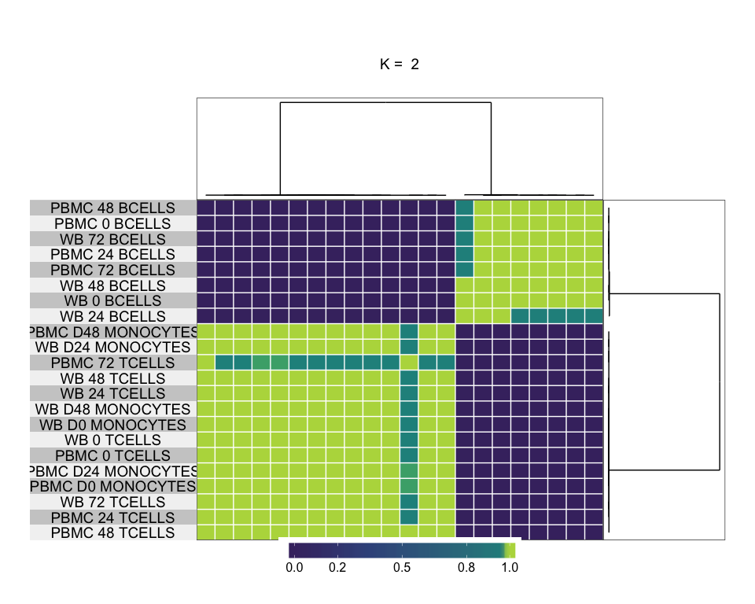
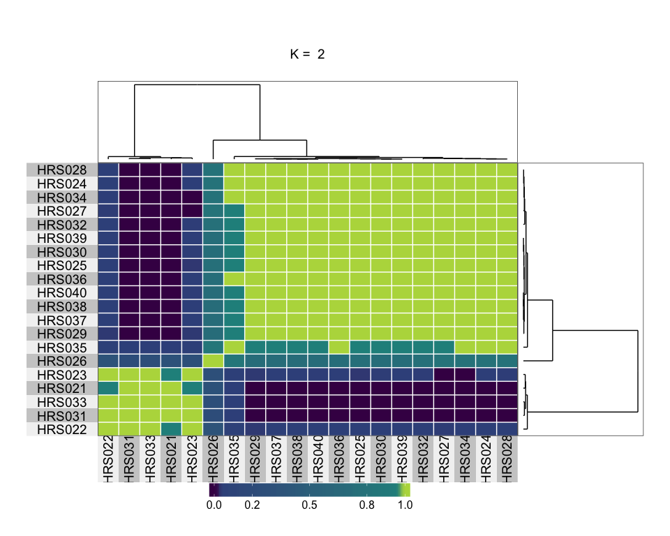
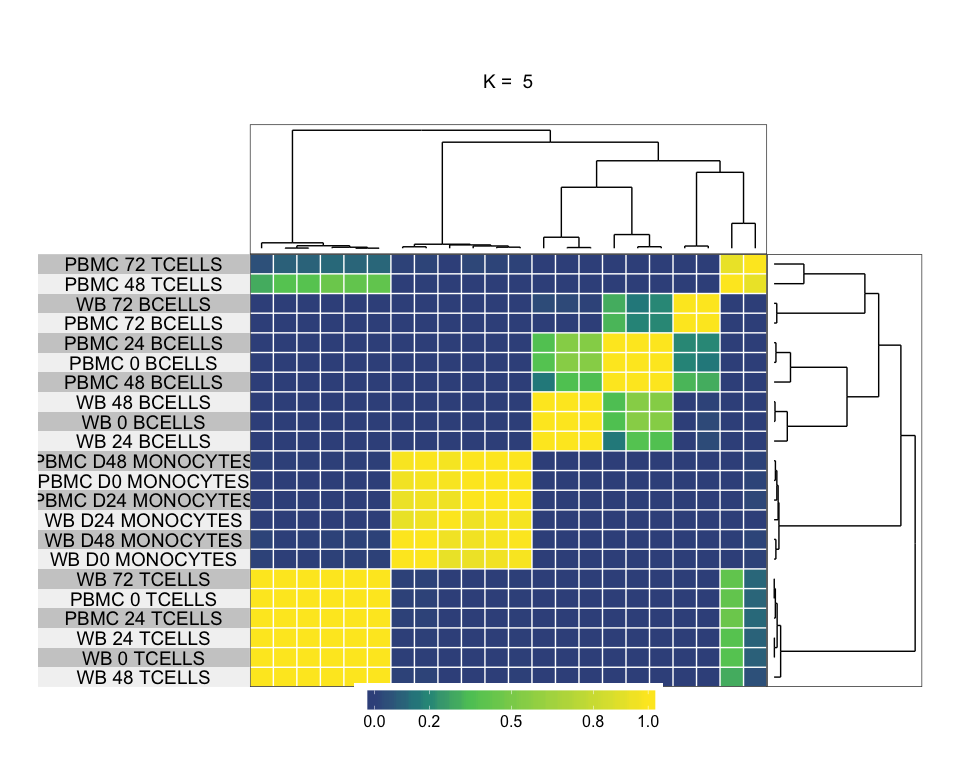
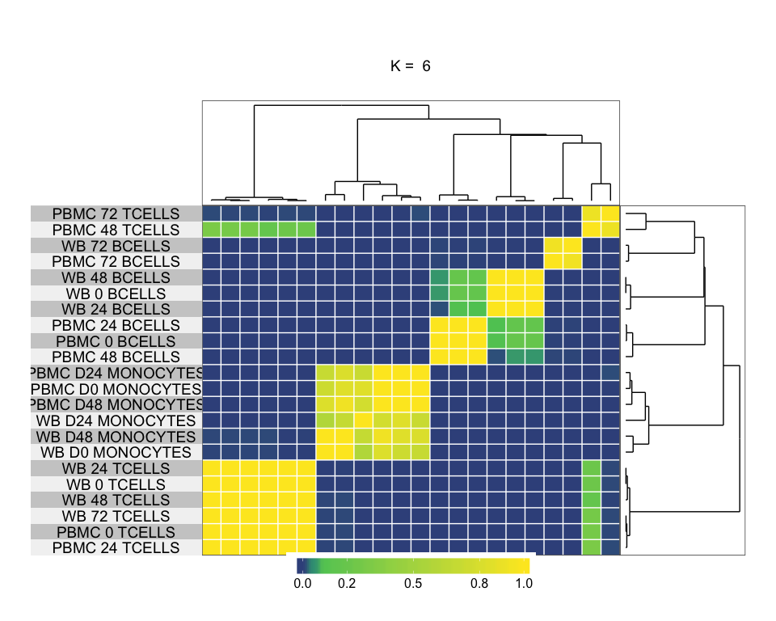
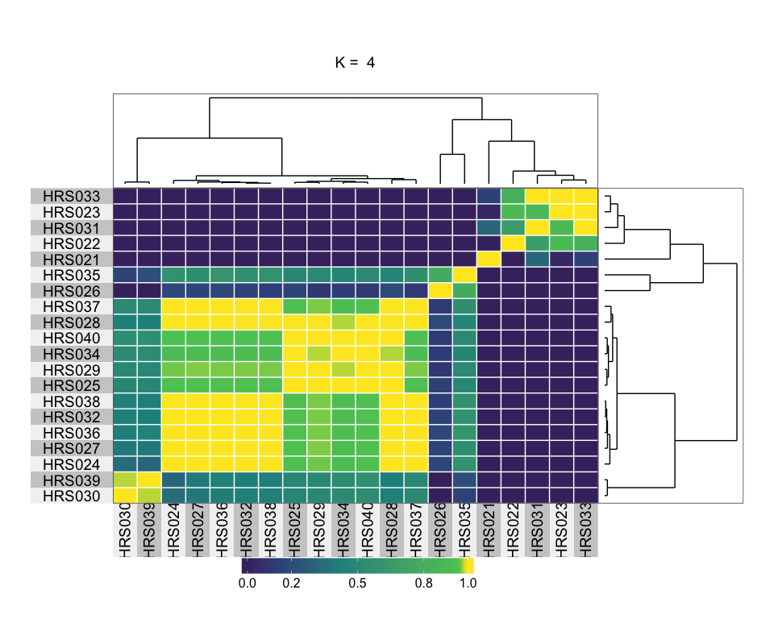
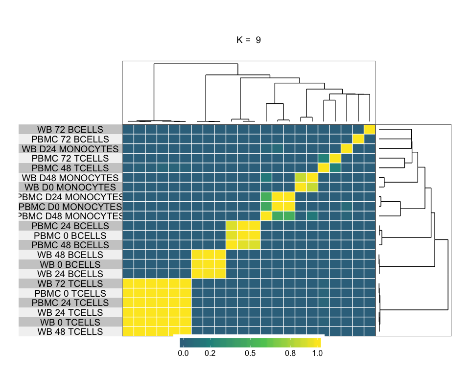
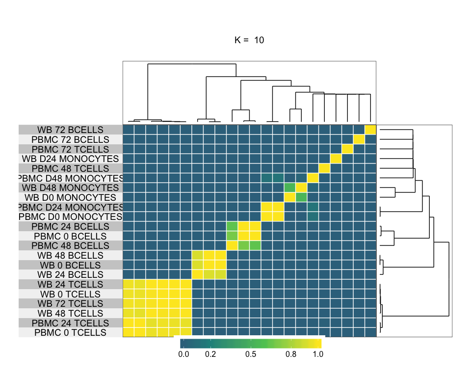

# ccplus
JL  
6/2/2017  


maxk = 10
iter = 1.5\times 10^{4}


```
## end fraction
```

```
## clustered
## clustered
## clustered
## clustered
## clustered
## clustered
## clustered
## clustered
## clustered
```

```
## end fraction
```

```
## clustered
## clustered
## clustered
## clustered
## clustered
## clustered
## clustered
## clustered
## clustered
```

<!-- --><!-- --><!-- --><!-- --><!-- --><!-- --><!-- --><!-- --><!-- -->


>  The purpose of CM plots is to find the ‘cleanest’ cluster partition where items nearly always either cluster together giving a high consensus (dark blue colour) or do not cluster together giving a low consensus (white)

> Empirical cumulative distribution function (CDF) plots display consensus distributions for each k (Fig. 1C). The purpose of the CDF plot is to find the k at which the distribution reaches an approximate maximum, which indicates a maximum stability and after which divisions are equivalent to random picks rather than true cluster structure.


