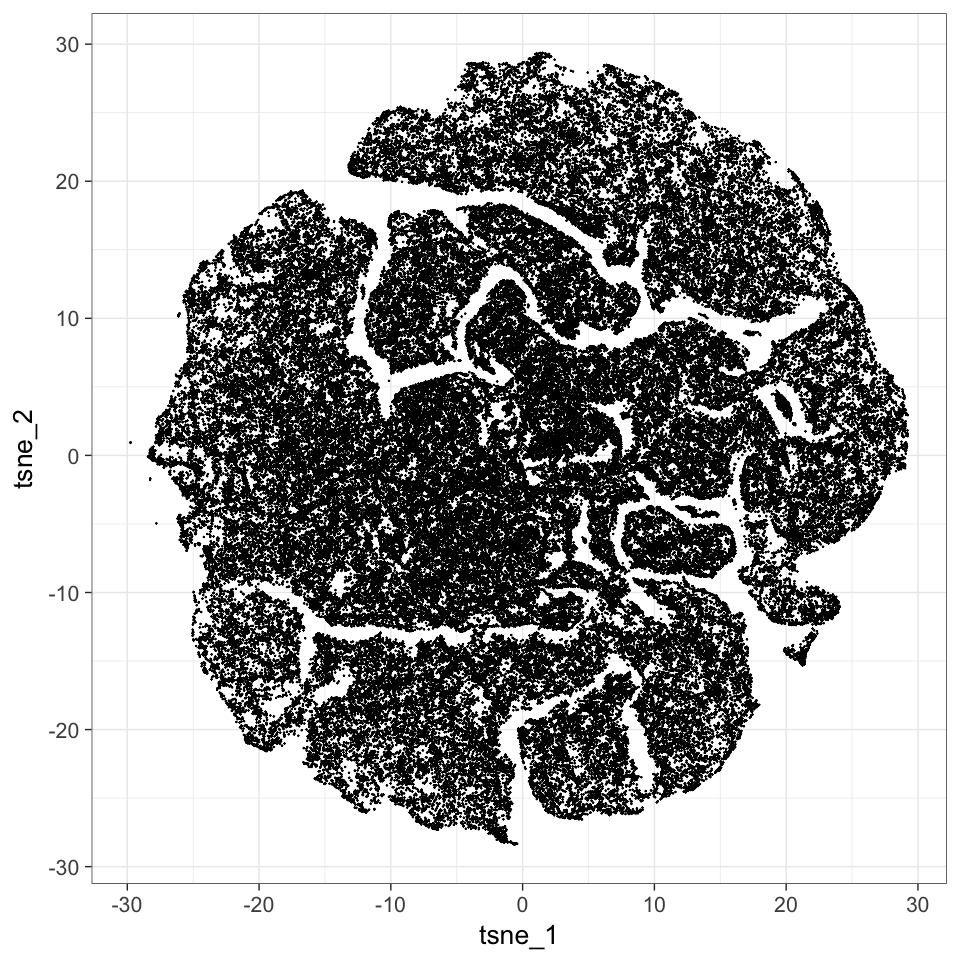
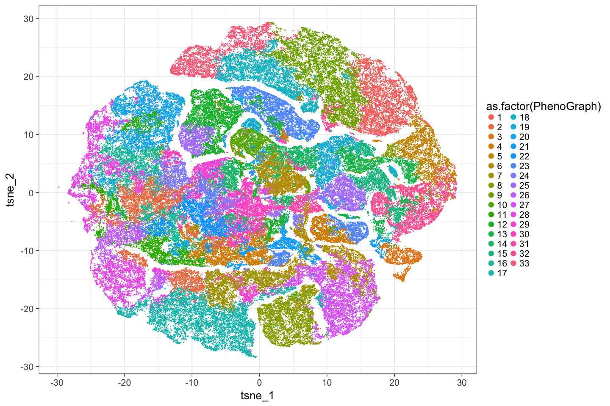
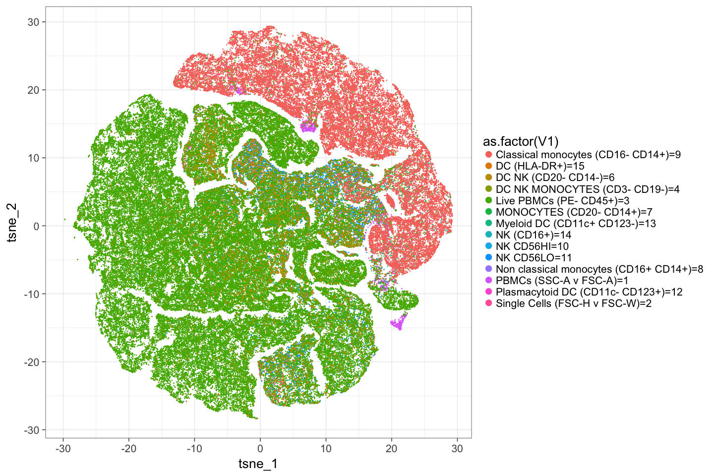
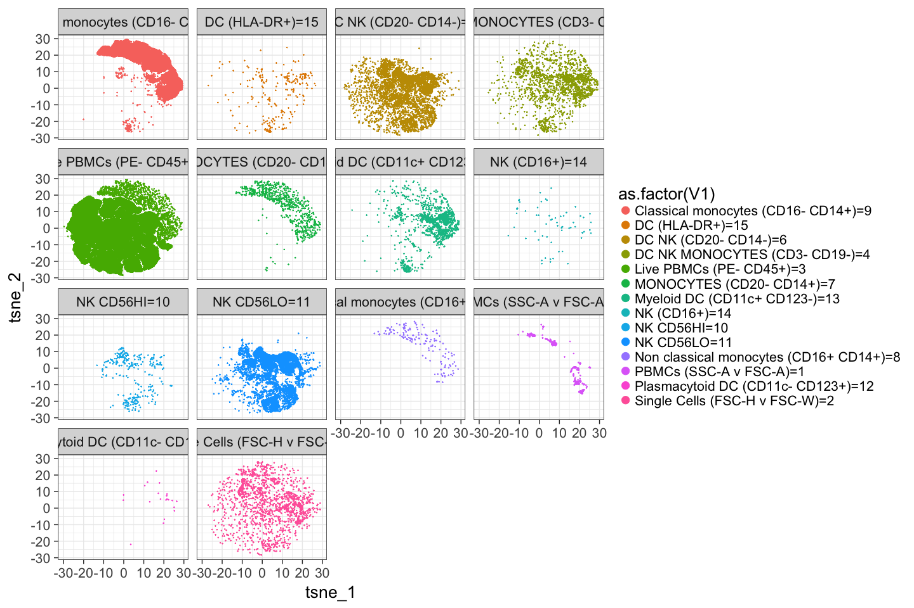
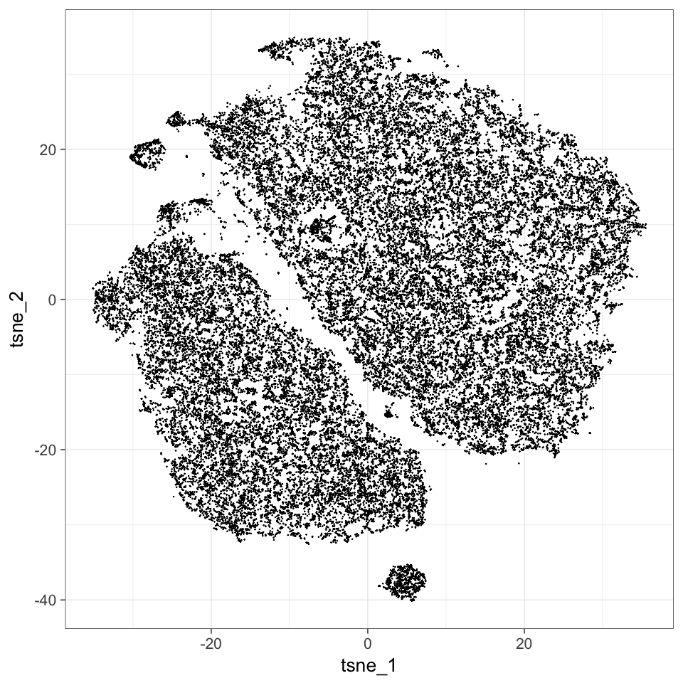
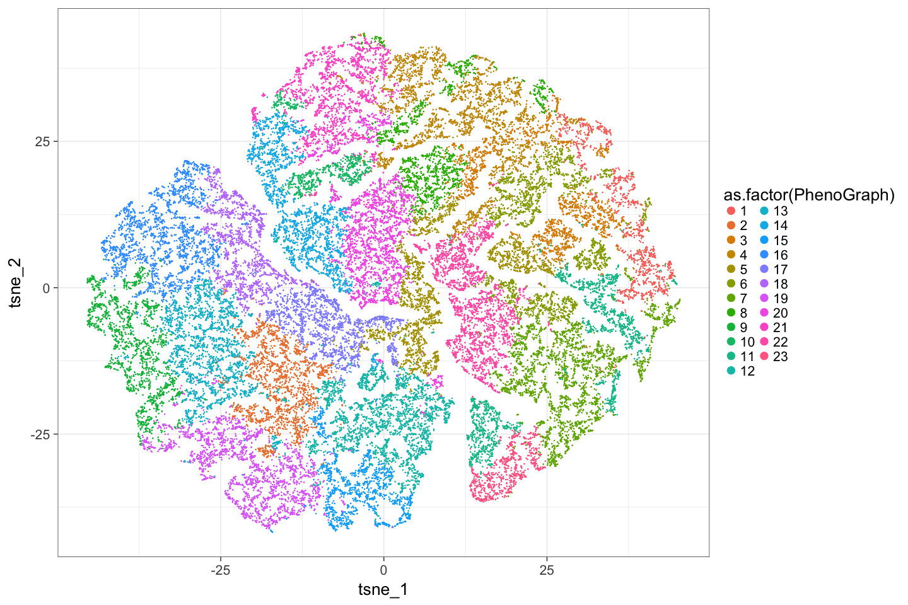
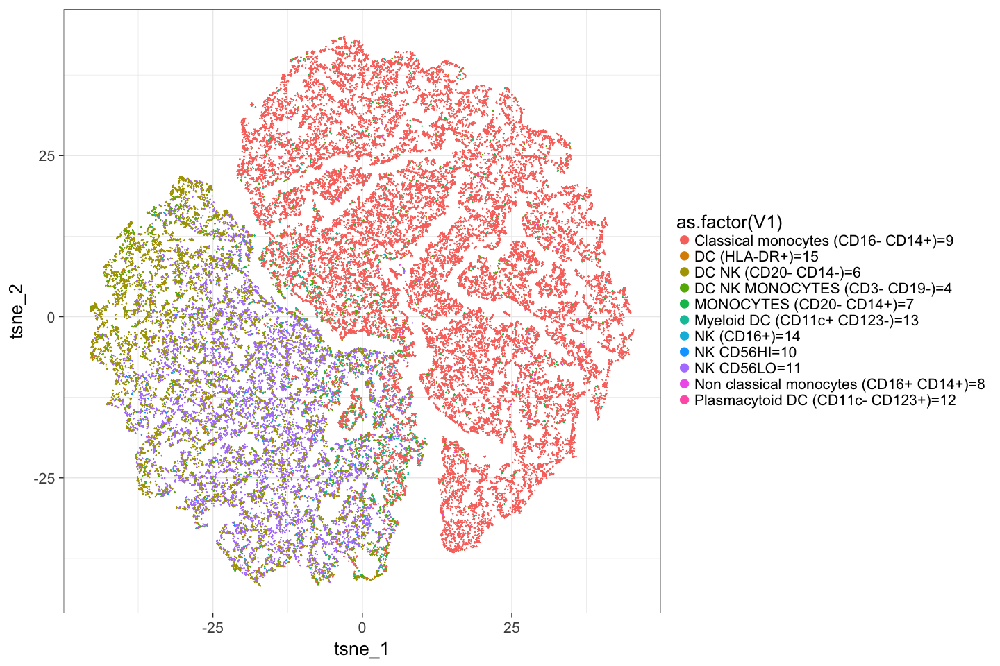
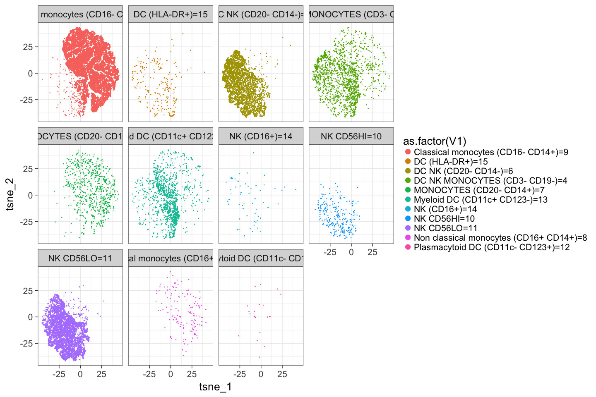

# plotTSNE
JL  
2/15/2017  


## Analysis

```
## Loading required package: ggplot2
```

```
## Loading required package: plyr
```

```
##   Runing PhenoGraph...
```

```
## Run Rphenograph starts:
##   -Input data of 43333 rows and 17 columns
##   -k is set to 30
```

```
##   Finding nearest neighbors...DONE ~ 2.316 s
##   Compute jaccard coefficient between nearest-neighbor sets...DONE ~ 16.681 s
##   Build undirected graph from the weighted links...DONE ~ 3.846 s
##   Run louvain clustering on the graph ...DONE ~ 3.885 s
```

```
## Run Rphenograph DONE, totally takes 26.728s.
```

```
##   Return a community class
##   -Modularity value: 0.863889 
##   -Number of clusters: 23 DONE!
##   Runing t-SNE...with seed 42  DONE
```

```
##   Runing PhenoGraph...
```

```
## Run Rphenograph starts:
##   -Input data of 138570 rows and 17 columns
##   -k is set to 30
```

```
##   Finding nearest neighbors...DONE ~ 9.945 s
##   Compute jaccard coefficient between nearest-neighbor sets...DONE ~ 52.86 s
##   Build undirected graph from the weighted links...DONE ~ 13.499 s
##   Run louvain clustering on the graph ...DONE ~ 15.151 s
```

```
## Run Rphenograph DONE, totally takes 91.455s.
```

```
##   Return a community class
##   -Modularity value: 0.8810334 
##   -Number of clusters: 33 DONE!
##   Runing t-SNE...with seed 42  DONE
```

# Starting from PBMCs, I think

## TSNE results
<!-- -->

## TSNE results, colored by Phenograph clusters detected
<!-- -->

## TSNE results, colored by manual gates 
<!-- -->

## TSNE results, Manually gated 
<!-- -->


# Starting from Dendritic, I think

## TSNE results
<!-- -->

## TSNE results, colored by Phenograph clusters detected
<!-- -->

## TSNE results, colored by manual gates 
<!-- -->

## TSNE results, Manually gated 
<!-- -->
