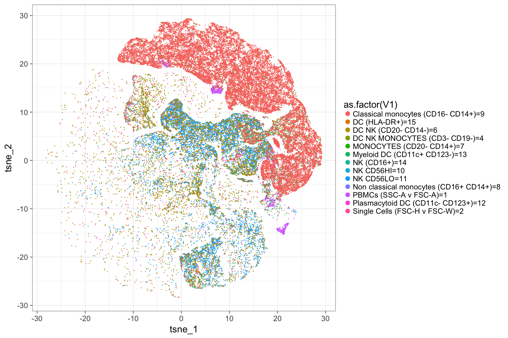

# plotTSNE
JL  
2/15/2017  

## Analysis

```r
library(cytofkit)
library(flowCore)

file = "~/temp/fcs/2016-05-20_PANEL 2_ZF_panel 2_F1632217_009.fcs"
manual = read.delim("~/temp/fcs/2016-05-20_PANEL 2_ZF_panel 2_F1632217_009_coding.xln",header = FALSE)

#load example fcs, logicle scaling on load
data_transformed <- cytof_exprsExtract(fcsFile = file, markers = NULL, 
                                       comp = FALSE,
                                       transformMethod = "autoLgcl")

#sub-setting to points that were manually gate already, for comparison
data_transformed_xk <- data_transformed[ which(manual$V1>0), ]

manualUsed = manual[ which(manual$V1>0), ]
## run PhenoGraph
cluster_PhenoGraph <- cytof_cluster(xdata = data_transformed_xk, method = "Rphenograph")

# run tsne
data_transformed_xk_tsne <- cytof_dimReduction(data=data_transformed_xk, method = "tsne")

#combine with original
data_xk_all <- cbind(data_transformed_xk, data_transformed_xk_tsne, manualUsed,
                     PhenoGraph = cluster_PhenoGraph)
data_xk_all <- as.data.frame(data_xk_all)

save(data_xk_all,file = "~/temp/fcs/testRun2.rdata")

# cytof_addToFCS(data_xk_all, rawFCSdir=dir, analyzedFCSdir="analysed_FCS", 
#                transformed_cols = c("tsne_1", "tsne_2"), 
#                cluster_cols = c("PhenoGraph", "ClusterX", "FlowSOM"))
```


## TSNE results
<!-- -->

## TSNE results, colored by Phenograph clusters detected
<!-- -->

## TSNE results, colored by manual gates 
<!-- -->

## TSNE results, Manually gated (minus Live PBMCs)
<!-- -->

## TSNE results, Manually gated 
<!-- -->
