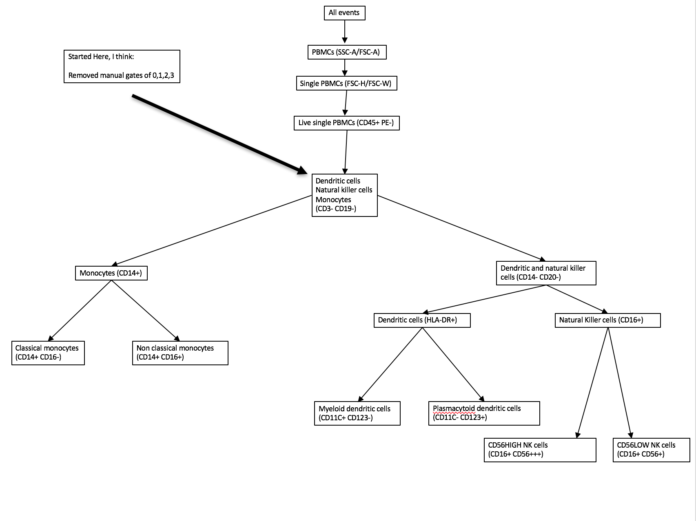
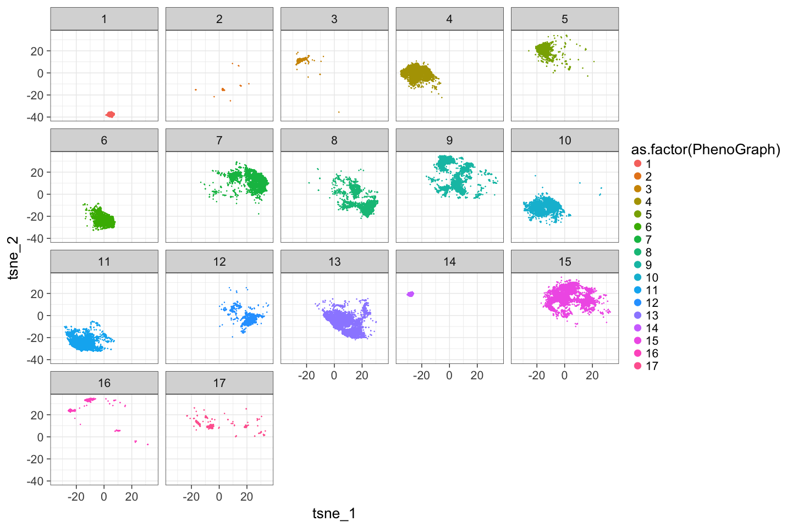

# plotTSNE
JL  
2/15/2017  

## Analysis

### Used these markers

|markersDNM |
|:----------|
|HLA-DR     |
|CD3        |
|CD19       |
|CD14       |
|CD16       |
|CD20       |
|CD11c      |
|CD123      |
|CD56       |
## TSNE results
<!-- -->

## TSNE results, colored by Phenograph clusters detected
<!-- -->

## TSNE results, colored by manual gates 
<!-- -->

## TSNE results, colored by manual gates 
<!-- -->

## TSNE results, colored by Phenograph clusters detected
<!-- -->
