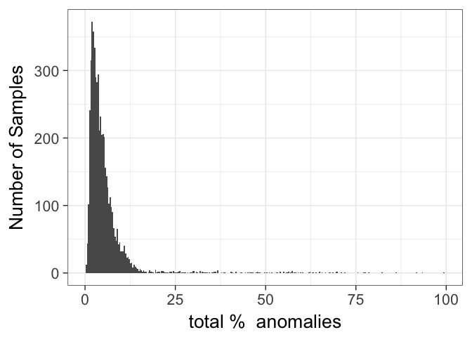
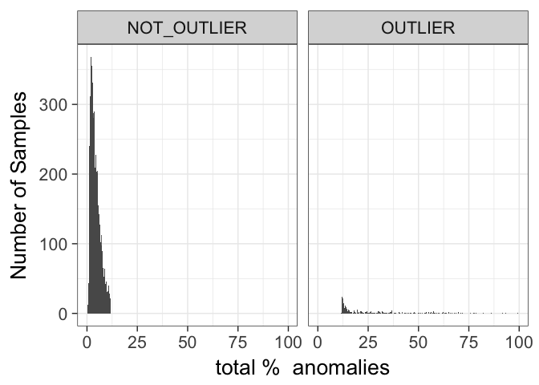
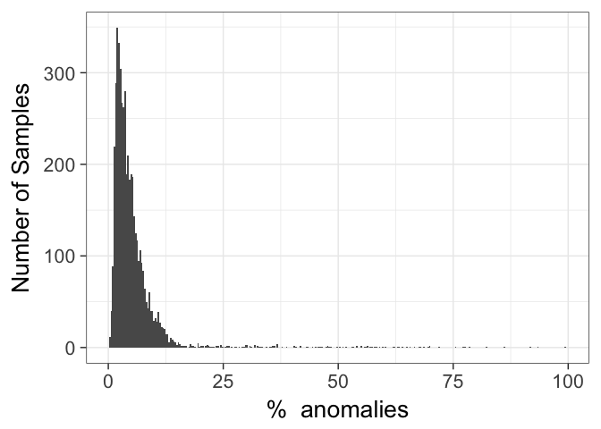
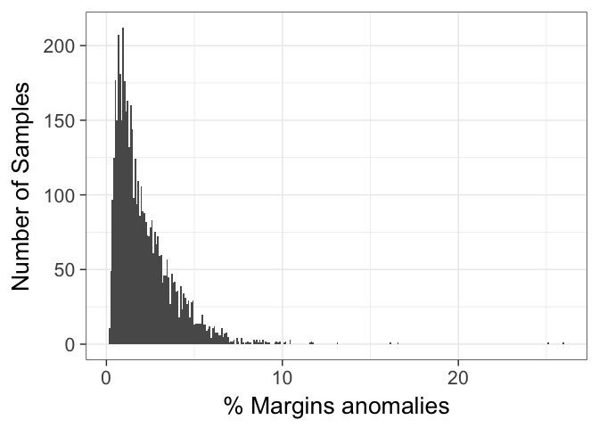
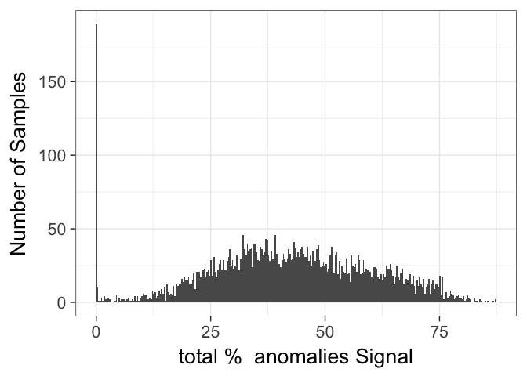
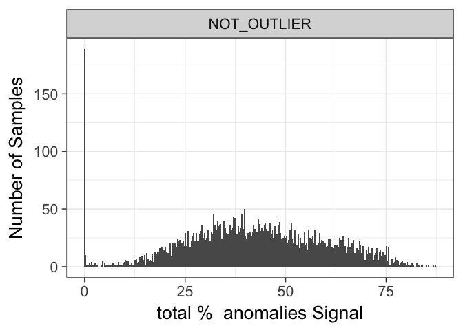
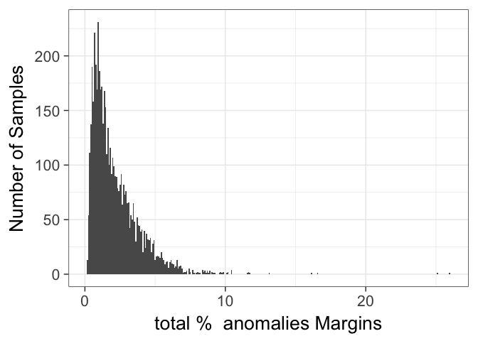
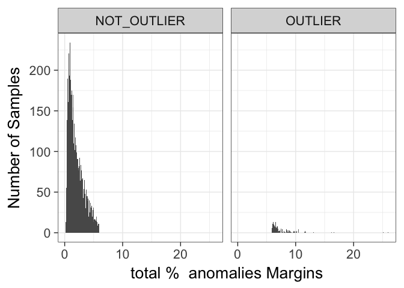

# QC_EVAL
JL  
7/21/2017  

### NOTES

- Currently not removing cells filtered by signal acquisition metric
     - unsure if accurate, and removes a lot
     - So, "total % anomalies" only includes flow rate and flow margin
- Metrics from FlowAI

TODO, can split by panel

## Anomaly distributions

Currently 5330 samples

<!-- --><!-- --><!-- --><!-- --><!-- --><!-- --><!-- --><!-- -->
