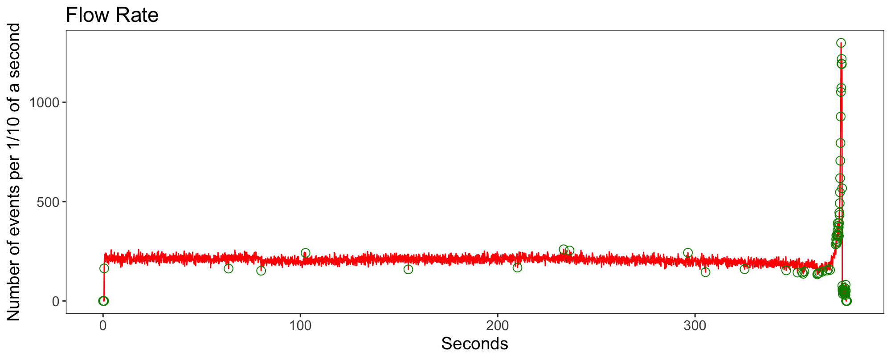
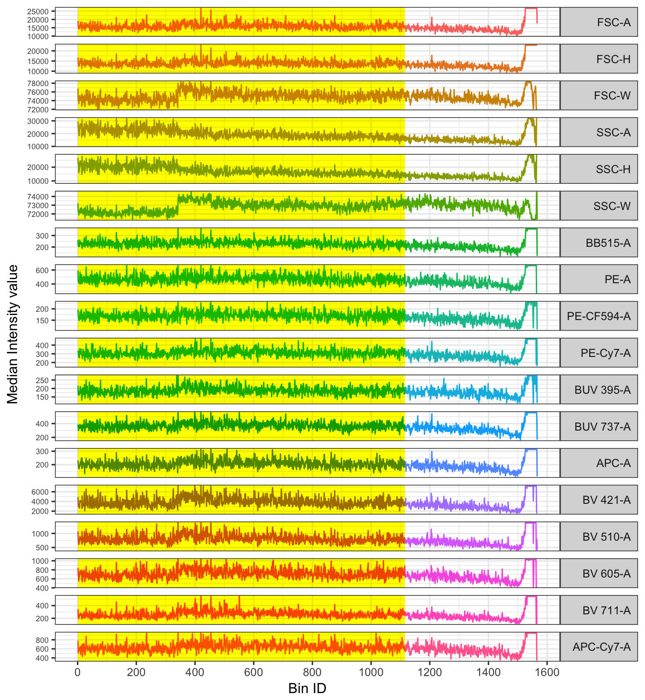
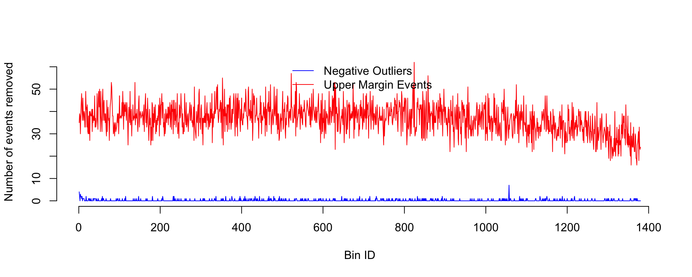

## FCS file information

> Input file name: 2016-08-01_PANEL 1_DHS_Group two_F1631383_031    
> Number of events: 689945


## Quality control analysis 

### Summary

> The anomalies were removed from:  Flow Rate and Flow Margin  
> Anomalies detected in total: **9.05** %  
> Number of high quality events: 627489  


### Flow rate check

> **1.8** % anomalies detected in the flow rate check.




The plot reconstructs the flow rate with a resolution of 1/10 of a second. Anomalies in the flow rate are identified with an algorithm based on the generalied ESD outlier detection method. The anomalies are circled in green. 

### Signals acquisition check

> **29.12** % anomalies detected in the signal aquisition check. 




The more stable region selected consistent for all channels is highlighted in yellow. If the removal of outliers has been required before the execution of the changepoint analysis, the detected outliers are cicled in green.

The FCS file was divided in 1380 bins. The stable region is located between the bins 1 and 978.

##### More info on the changepoints detected:

Changepoints detected in channels with shifts in signal acquisition:  


```
##               1
## BB515-A    1075
## PE-A       1183
## PE-CF594-A 1204
## BUV 395-A   978
## BV 421-A   1084
## BV 510-A   1183
## BV 605-A   1305
## BV 711-A   1247
## APC-Cy7-A  1303
```

Channels excluded from the analysis: FSC-A, FSC-H, FSC-W, SSC-A, SSC-H, SSC-W. 
 
No changepoints were detected in the channels: PE-Cy7-A, BUV 737-A, APC-A. 


### Dynamic range check

> **7.39** % anomalies detected in dynamic range check.  



The plot shows where the anomalies occured the most. The x-axis scale is complementary to the one of the signal acquisition plot. 


##### More info on the anomalies detected in the dynamic range check:

for each channel, The table shows the number of events that did not pass the dynamic range check:


```
##              lower_range upper_range
## FSC-A                  0       38859
## FSC-H                  0           0
## FSC-W                  0          10
## SSC-A                  0       33894
## SSC-H                  0           0
## SSC-W                  0          12
## BB515-A               37           7
## PE-A                  38          28
## PE-CF594-A            23        3978
## PE-Cy7-A               0        3787
## BUV 395-A             12         173
## BUV 737-A              9        2673
## APC-A                  4          10
## BV 421-A              61        1240
## BV 510-A              23         220
## BV 605-A              47        1198
## BV 711-A              15        2325
## APC-Cy7-A             16         342
## total_SUM            354       88756
## total_UNIQUE         326       50680
```
