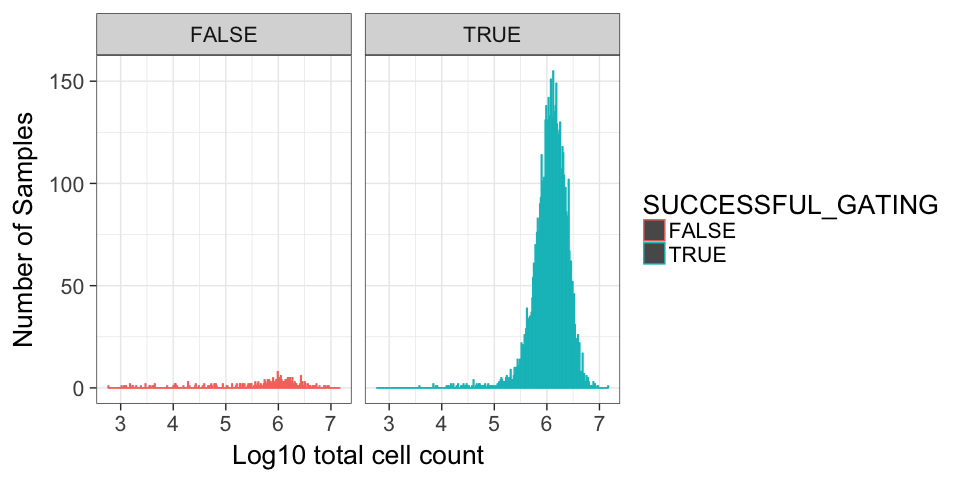
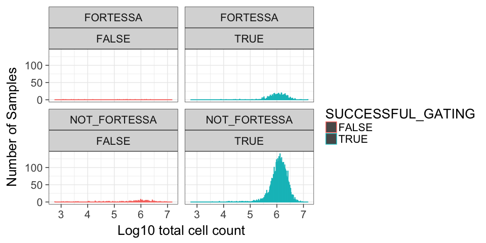
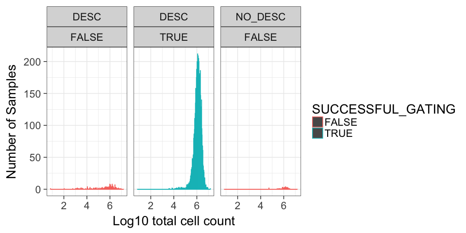
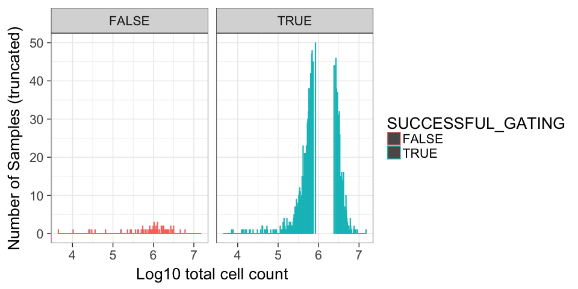
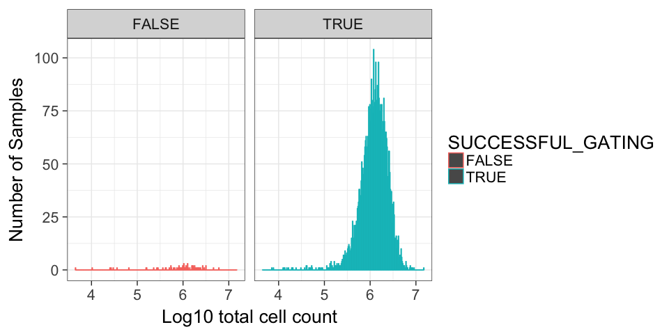
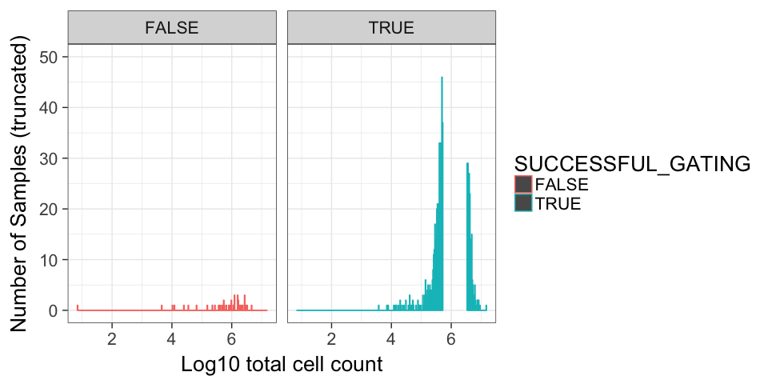

# Review OpenCyto fails
JL  
6/30/2017  
### NOTES:
 - FORTESSA determined by filename, nothing else
 - date determined by filename, nothing else


### SUCCESSFUL_GATING Cell counts: All samples

<!-- -->

### SUCCESSFUL_GATING Cell counts: Split by machine


<!-- -->


### SUCCESSFUL_GATING Cell counts: Only Batches with >5% failure rate (1799 total samples)


<!-- -->

### SUCCESSFUL_GATING Cell counts: Only Batches with <=5% failure rate (4777 total samples)


```
## Warning: Removed 36 rows containing missing values (geom_bar).
```

<!-- --><!-- -->

### SUCCESSFUL_GATING QC comparison


<!-- -->


### SUCCESSFUL_GATING NOTES

***3.9689781% failure rate**


|    |Var1                           |Var2.x | Freq.x|Var2.y | Freq.y| PERCENT_FAIL_BY_BATCH| FAIL_RANK|
|:---|:------------------------------|:------|------:|:------|------:|---------------------:|---------:|
|188 |2017-03-15_ NOT_FORTESSA       |FALSE  |     11|TRUE   |      9|             55.000000|     287.0|
|222 |2017-04-11_ NOT_FORTESSA       |FALSE  |     12|TRUE   |     16|             42.857143|     286.0|
|21  |2016-06-03_ NOT_FORTESSA       |FALSE  |      5|TRUE   |      9|             35.714286|     285.0|
|15  |2016-05-24_ NOT_FORTESSA       |FALSE  |      5|TRUE   |     15|             25.000000|     283.0|
|121 |2016-12-21_ NOT_FORTESSA       |FALSE  |      4|TRUE   |     12|             25.000000|     283.0|
|272 |2017-06-06- NOT_FORTESSA       |FALSE  |      4|TRUE   |     12|             25.000000|     283.0|
|116 |2016-12-14_ NOT_FORTESSA       |FALSE  |      5|TRUE   |     16|             23.809524|     281.0|
|100 |2016-11-17_ NOT_FORTESSA       |FALSE  |      8|TRUE   |     28|             22.222222|     280.0|
|2   |2016-05-05_ NOT_FORTESSA       |FALSE  |      1|TRUE   |      4|             20.000000|     278.5|
|5   |2016-05-10_ NOT_FORTESSA       |FALSE  |      2|TRUE   |      8|             20.000000|     278.5|
|273 |2017-06-07_ NOT_FORTESSA       |FALSE  |      5|TRUE   |     22|             18.518518|     277.0|
|224 |2017-04-12_ NOT_FORTESSA       |FALSE  |      3|TRUE   |     14|             17.647059|     276.0|
|221 |2017-04-11_ FORTESSA           |FALSE  |      5|TRUE   |     25|             16.666667|     275.0|
|142 |2017-01-30_ NOT_FORTESSA       |FALSE  |      8|TRUE   |     42|             16.000000|     274.0|
|34  |2016-06-23_ NOT_FORTESSA       |FALSE  |      3|TRUE   |     17|             15.000000|     273.0|
|201 |2017-03-27_ NOT_FORTESSA       |FALSE  |      2|TRUE   |     12|             14.285714|     271.5|
|284 |2017-06-22_ FORTESSA           |FALSE  |      1|TRUE   |      6|             14.285714|     271.5|
|7   |2016-05-12_ NOT_FORTESSA       |FALSE  |      2|TRUE   |     13|             13.333333|     269.5|
|227 |2017-04-14_ NOT_FORTESSA       |FALSE  |      2|TRUE   |     13|             13.333333|     269.5|
|278 |2017-06-14_ NOT_FORTESSA       |FALSE  |      4|TRUE   |     27|             12.903226|     268.0|
|13  |2016-05-20_ NOT_FORTESSA       |FALSE  |      1|TRUE   |      8|             11.111111|     266.5|
|78  |2016-09-26_ NOT_FORTESSA       |FALSE  |      1|TRUE   |      8|             11.111111|     266.5|
|58  |2016-08-10_ NOT_FORTESSA       |FALSE  |      2|TRUE   |     17|             10.526316|     264.5|
|61  |2016-08-15_ NOT_FORTESSA       |FALSE  |      2|TRUE   |     17|             10.526316|     264.5|
|270 |2017-06-02_ NOT_FORTESSA       |FALSE  |      3|TRUE   |     26|             10.344828|     263.0|
|17  |2016-05-26_ NOT_FORTESSA       |FALSE  |      2|TRUE   |     18|             10.000000|     257.5|
|39  |2016-07-07_ NOT_FORTESSA       |FALSE  |      2|TRUE   |     18|             10.000000|     257.5|
|40  |2016-07-08_ NOT_FORTESSA       |FALSE  |      2|TRUE   |     18|             10.000000|     257.5|
|55  |2016-08-04_ NOT_FORTESSA       |FALSE  |      2|TRUE   |     18|             10.000000|     257.5|
|59  |2016-08-11_ NOT_FORTESSA       |FALSE  |      1|TRUE   |      9|             10.000000|     257.5|
|88  |2016-10-25_ NOT_FORTESSA       |FALSE  |      1|TRUE   |      9|             10.000000|     257.5|
|141 |2017-01-27_ NOT_FORTESSA       |FALSE  |      4|TRUE   |     36|             10.000000|     257.5|
|255 |2017-05-13_ NOT_FORTESSA       |FALSE  |      1|TRUE   |      9|             10.000000|     257.5|
|266 |2017-05-23_ NOT_FORTESSA       |FALSE  |      3|TRUE   |     27|             10.000000|     257.5|
|267 |2017-05-26_ FORTESSA           |FALSE  |      3|TRUE   |     27|             10.000000|     257.5|
|268 |2017-05-31_ NOT_FORTESSA       |FALSE  |      3|TRUE   |     28|              9.677419|     252.0|
|219 |2017-04-10_ FORTESSA           |FALSE  |      2|TRUE   |     19|              9.523810|     251.0|
|269 |2017-06-01_ NOT_FORTESSA       |FALSE  |      3|TRUE   |     29|              9.375000|     250.0|
|193 |2017-03-21_ FORTESSA           |FALSE  |      2|TRUE   |     21|              8.695652|     249.0|
|126 |2017-01-04_ NOT_FORTESSA       |FALSE  |      2|TRUE   |     22|              8.333333|     247.5|
|234 |2017-04-20_ NOT_FORTESSA       |FALSE  |      2|TRUE   |     22|              8.333333|     247.5|
|210 |2017-04-03_ NOT_FORTESSA       |FALSE  |      2|TRUE   |     23|              8.000000|     245.5|
|248 |2017-05-05_ NOT_FORTESSA       |FALSE  |      2|TRUE   |     23|              8.000000|     245.5|
|89  |2016-10-27_ NOT_FORTESSA       |FALSE  |      2|TRUE   |     24|              7.692308|     242.0|
|91  |2016-10-31_ NOT_FORTESSA       |FALSE  |      2|TRUE   |     24|              7.692308|     242.0|
|92  |2016-11-01_ NOT_FORTESSA       |FALSE  |      2|TRUE   |     24|              7.692308|     242.0|
|124 |2016-12-29_ NOT_FORTESSA       |FALSE  |      2|TRUE   |     24|              7.692308|     242.0|
|161 |2017-02-21_ NOT_FORTESSA       |FALSE  |      4|TRUE   |     48|              7.692308|     242.0|
|261 |2017-05-18_ NOT_FORTESSA       |FALSE  |      2|TRUE   |     25|              7.407407|     238.5|
|271 |2017-06-05_ NOT_FORTESSA       |FALSE  |      2|TRUE   |     25|              7.407407|     238.5|
|131 |2017-01-11_ NOT_FORTESSA       |FALSE  |      1|TRUE   |     13|              7.142857|     236.5|
|205 |2017-03-29_ NOT_FORTESSA       |FALSE  |      1|TRUE   |     13|              7.142857|     236.5|
|10  |2016-05-17_ NOT_FORTESSA       |FALSE  |      1|TRUE   |     14|              6.666667|     233.5|
|11  |2016-05-18_ NOT_FORTESSA       |FALSE  |      1|TRUE   |     14|              6.666667|     233.5|
|14  |2016-05-23_ NOT_FORTESSA       |FALSE  |      1|TRUE   |     14|              6.666667|     233.5|
|252 |2017-05-11_ NOT_FORTESSA       |FALSE  |      2|TRUE   |     28|              6.666667|     233.5|
|122 |2016-12-22_ NOT_FORTESSA       |FALSE  |      2|TRUE   |     29|              6.451613|     230.5|
|262 |2017-05-19_ FORTESSA           |FALSE  |      2|TRUE   |     29|              6.451613|     230.5|
|189 |2017-03-16_ FORTESSA           |FALSE  |      1|TRUE   |     15|              6.250000|     226.5|
|218 |2017-04-07_ NOT_FORTESSA       |FALSE  |      1|TRUE   |     15|              6.250000|     226.5|
|274 |2017-06-08_ NOT_FORTESSA       |FALSE  |      2|TRUE   |     30|              6.250000|     226.5|
|277 |2017-06-13_ NOT_FORTESSA       |FALSE  |      2|TRUE   |     30|              6.250000|     226.5|
|280 |2017-06-16_ NOT_FORTESSA       |FALSE  |      2|TRUE   |     30|              6.250000|     226.5|
|281 |2017-06-19_ NOT_FORTESSA       |FALSE  |      2|TRUE   |     30|              6.250000|     226.5|
|106 |2016-11-29_ NOT_FORTESSA       |FALSE  |      2|TRUE   |     32|              5.882353|     222.5|
|159 |2017-02-17_ NOT_FORTESSA       |FALSE  |      2|TRUE   |     32|              5.882353|     222.5|
|138 |2017-01-24_ NOT_FORTESSA       |FALSE  |      2|TRUE   |     35|              5.405405|     221.0|
|12  |2016-05-19_ NOT_FORTESSA       |FALSE  |      1|TRUE   |     18|              5.263158|     214.0|
|23  |2016-06-07_ NOT_FORTESSA       |FALSE  |      1|TRUE   |     18|              5.263158|     214.0|
|25  |2016-06-09_ NOT_FORTESSA       |FALSE  |      1|TRUE   |     18|              5.263158|     214.0|
|28  |2016-06-14_ NOT_FORTESSA       |FALSE  |      1|TRUE   |     18|              5.263158|     214.0|
|29  |2016-06-15_ NOT_FORTESSA       |FALSE  |      1|TRUE   |     18|              5.263158|     214.0|
|33  |2016-06-22_ NOT_FORTESSA       |FALSE  |      1|TRUE   |     18|              5.263158|     214.0|
|36  |2016-06-27_ NOT_FORTESSA       |FALSE  |      1|TRUE   |     18|              5.263158|     214.0|
|47  |2016-07-20_ NOT_FORTESSA       |FALSE  |      1|TRUE   |     18|              5.263158|     214.0|
|50  |2016-07-27_ NOT_FORTESSA       |FALSE  |      1|TRUE   |     18|              5.263158|     214.0|
|52  |2016-08-01_ NOT_FORTESSA       |FALSE  |      1|TRUE   |     18|              5.263158|     214.0|
|67  |2016-08-30_ NOT_FORTESSA       |FALSE  |      1|TRUE   |     18|              5.263158|     214.0|
|72  |2016-09-13_ NOT_FORTESSA       |FALSE  |      1|TRUE   |     18|              5.263158|     214.0|
|76  |2016-09-19_ NOT_FORTESSA       |FALSE  |      1|TRUE   |     18|              5.263158|     214.0|
|42  |2016-07-12_ NOT_FORTESSA       |FALSE  |      1|TRUE   |     19|              5.000000|     200.0|
|51  |2016-07-29_ NOT_FORTESSA       |FALSE  |      1|TRUE   |     19|              5.000000|     200.0|
|60  |2016-08-12_ NOT_FORTESSA       |FALSE  |      1|TRUE   |     19|              5.000000|     200.0|
|62  |2016-08-16_ NOT_FORTESSA       |FALSE  |      1|TRUE   |     19|              5.000000|     200.0|
|66  |2016-08-29_ NOT_FORTESSA       |FALSE  |      1|TRUE   |     19|              5.000000|     200.0|
|71  |2016-09-09_ NOT_FORTESSA       |FALSE  |      1|TRUE   |     19|              5.000000|     200.0|
|74  |2016-09-15_ NOT_FORTESSA       |FALSE  |      1|TRUE   |     19|              5.000000|     200.0|
|81  |2016-10-04_ NOT_FORTESSA       |FALSE  |      1|TRUE   |     19|              5.000000|     200.0|
|87  |2016-10-24_ NOT_FORTESSA       |FALSE  |      1|TRUE   |     19|              5.000000|     200.0|
|120 |2016-12-20_ NOT_FORTESSA       |FALSE  |      2|TRUE   |     38|              5.000000|     200.0|
|144 |2017-02_08_ NOT_FORTESSA       |FALSE  |      1|TRUE   |     19|              5.000000|     200.0|
|146 |2017-02-02_ NOT_FORTESSA       |FALSE  |      1|TRUE   |     19|              5.000000|     200.0|
|203 |2017-03-28_ NOT_FORTESSA       |FALSE  |      1|TRUE   |     19|              5.000000|     200.0|
|228 |2017-04-17_ FORTESSA           |FALSE  |      1|TRUE   |     19|              5.000000|     200.0|
|250 |2017-05-09_ NOT_FORTESSA       |FALSE  |      2|TRUE   |     38|              5.000000|     200.0|
|213 |2017-04-05_ FORTESSA           |FALSE  |      1|TRUE   |     20|              4.761905|     191.5|
|220 |2017-04-10_ NOT_FORTESSA       |FALSE  |      1|TRUE   |     20|              4.761905|     191.5|
|158 |2017-02-16_ NOT_FORTESSA       |FALSE  |      2|TRUE   |     42|              4.545454|     189.0|
|214 |2017-04-05_ NOT_FORTESSA       |FALSE  |      1|TRUE   |     21|              4.545454|     189.0|
|240 |2017-04-26_ NOT_FORTESSA       |FALSE  |      1|TRUE   |     21|              4.545454|     189.0|
|132 |2017-01-12_ NOT_FORTESSA       |FALSE  |      2|TRUE   |     44|              4.347826|     185.0|
|157 |2017-02-15_ NOT_FORTESSA       |FALSE  |      2|TRUE   |     44|              4.347826|     185.0|
|187 |2017-03-14_ NOT_FORTESSA       |FALSE  |      1|TRUE   |     22|              4.347826|     185.0|
|246 |2017-05-04_ FORTESSA           |FALSE  |      1|TRUE   |     22|              4.347826|     185.0|
|282 |2017-06-20_ NOT_FORTESSA       |FALSE  |      1|TRUE   |     22|              4.347826|     185.0|
|164 |2017-02-24_ NOT_FORTESSA       |FALSE  |      1|TRUE   |     23|              4.166667|     181.0|
|199 |2017-03-24_ FORTESSA           |FALSE  |      1|TRUE   |     23|              4.166667|     181.0|
|208 |2017-03-31_ NOT_FORTESSA       |FALSE  |      1|TRUE   |     23|              4.166667|     181.0|
|167 |2017-02-28_ NOT_FORTESSA       |FALSE  |      2|TRUE   |     48|              4.000000|     178.5|
|241 |2017-04-27_ NOT_FORTESSA       |FALSE  |      1|TRUE   |     24|              4.000000|     178.5|
|215 |2017-04-06_ FORTESSA           |FALSE  |      1|TRUE   |     25|              3.846154|     176.5|
|236 |2017-04-21_ NOT_FORTESSA       |FALSE  |      1|TRUE   |     25|              3.846154|     176.5|
|194 |2017-03-21_ NOT_FORTESSA       |FALSE  |      1|TRUE   |     26|              3.703704|     174.0|
|230 |2017-04-18_ NOT_FORTESSA       |FALSE  |      1|TRUE   |     26|              3.703704|     174.0|
|263 |2017-05-19_ NOT_FORTESSA       |FALSE  |      1|TRUE   |     26|              3.703704|     174.0|
|139 |2017-01-25_ NOT_FORTESSA       |FALSE  |      1|TRUE   |     27|              3.571429|     171.5|
|287 |2017-1-03_ NOT_FORTESSA        |FALSE  |      1|TRUE   |     27|              3.571429|     171.5|
|98  |2016-11-14_ NOT_FORTESSA       |FALSE  |      1|TRUE   |     28|              3.448276|     169.5|
|244 |2017-05-02_ NOT_FORTESSA       |FALSE  |      1|TRUE   |     28|              3.448276|     169.5|
|162 |2017-02-22_ NOT_FORTESSA       |FALSE  |      1|TRUE   |     29|              3.333333|     167.0|
|225 |2017-04-13_ NOT_FORTESSA       |FALSE  |      1|TRUE   |     29|              3.333333|     167.0|
|283 |2017-06-21_ NOT_FORTESSA       |FALSE  |      1|TRUE   |     29|              3.333333|     167.0|
|198 |2017-03-23_ NOT_FORTESSA       |FALSE  |      1|TRUE   |     30|              3.225807|     163.0|
|256 |2017-05-15_ NOT_FORTESSA       |FALSE  |      1|TRUE   |     30|              3.225807|     163.0|
|257 |2017-05-16_ NOT_FORTESSA       |FALSE  |      1|TRUE   |     30|              3.225807|     163.0|
|275 |2017-06-09_ NOT_FORTESSA       |FALSE  |      1|TRUE   |     30|              3.225807|     163.0|
|276 |2017-06-12_ NOT_FORTESSA       |FALSE  |      1|TRUE   |     30|              3.225807|     163.0|
|239 |2017-04-25_ NOT_FORTESSA       |FALSE  |      1|TRUE   |     31|              3.125000|     160.0|
|103 |2016-11-23_ NOT_FORTESSA       |FALSE  |      1|TRUE   |     34|              2.857143|     159.0|
|118 |2016-12-16_ NOT_FORTESSA       |FALSE  |      1|TRUE   |     35|              2.777778|     158.0|
|99  |2016-11-15_ NOT_FORTESSA       |FALSE  |      1|TRUE   |     36|              2.702703|     157.0|
|136 |2017-01-19_ NOT_FORTESSA       |FALSE  |      1|TRUE   |     39|              2.500000|     155.5|
|156 |2017-02-14_ NOT_FORTESSA       |FALSE  |      1|TRUE   |     39|              2.500000|     155.5|
|149 |2017-02-07_ NOT_FORTESSA       |FALSE  |      1|TRUE   |     41|              2.380952|     154.0|
|152 |2017-02-09_ NOT_FORTESSA       |FALSE  |      1|TRUE   |     42|              2.325581|     153.0|
|123 |2016-12-27_ NOT_FORTESSA       |FALSE  |      1|TRUE   |     44|              2.222222|     152.0|
|143 |2017-01-31_ NOT_FORTESSA       |FALSE  |      1|TRUE   |     49|              2.000000|     150.5|
|148 |2017-02-06_ NOT_FORTESSA       |FALSE  |      1|TRUE   |     49|              2.000000|     150.5|
|155 |2017-02-13_ NOT_FORTESSA       |FALSE  |      1|TRUE   |     51|              1.923077|     149.0|
|1   |2016-01-08_ NOT_FORTESSA       |FALSE  |      0|TRUE   |      5|              0.000000|      74.5|
|3   |2016-05-06_ NOT_FORTESSA       |FALSE  |      0|TRUE   |      5|              0.000000|      74.5|
|4   |2016-05-09_ NOT_FORTESSA       |FALSE  |      0|TRUE   |      3|              0.000000|      74.5|
|6   |2016-05-11_ NOT_FORTESSA       |FALSE  |      0|TRUE   |     10|              0.000000|      74.5|
|8   |2016-05-13_ NOT_FORTESSA       |FALSE  |      0|TRUE   |      5|              0.000000|      74.5|
|9   |2016-05-16_ NOT_FORTESSA       |FALSE  |      0|TRUE   |     15|              0.000000|      74.5|
|16  |2016-05-25_ NOT_FORTESSA       |FALSE  |      0|TRUE   |     10|              0.000000|      74.5|
|18  |2016-05-27_ NOT_FORTESSA       |FALSE  |      0|TRUE   |     14|              0.000000|      74.5|
|19  |2016-05-29_ NOT_FORTESSA       |FALSE  |      0|TRUE   |      9|              0.000000|      74.5|
|20  |2016-05-31_ NOT_FORTESSA       |FALSE  |      0|TRUE   |      9|              0.000000|      74.5|
|22  |2016-06-06_ NOT_FORTESSA       |FALSE  |      0|TRUE   |     19|              0.000000|      74.5|
|24  |2016-06-08_ NOT_FORTESSA       |FALSE  |      0|TRUE   |     19|              0.000000|      74.5|
|26  |2016-06-10_ NOT_FORTESSA       |FALSE  |      0|TRUE   |      9|              0.000000|      74.5|
|27  |2016-06-13_ NOT_FORTESSA       |FALSE  |      0|TRUE   |     19|              0.000000|      74.5|
|30  |2016-06-16_ NOT_FORTESSA       |FALSE  |      0|TRUE   |     19|              0.000000|      74.5|
|31  |2016-06-20_ NOT_FORTESSA       |FALSE  |      0|TRUE   |     19|              0.000000|      74.5|
|32  |2016-06-21_ NOT_FORTESSA       |FALSE  |      0|TRUE   |     19|              0.000000|      74.5|
|35  |2016-06-24_ NOT_FORTESSA       |FALSE  |      0|TRUE   |     10|              0.000000|      74.5|
|37  |2016-06-28_ NOT_FORTESSA       |FALSE  |      0|TRUE   |     10|              0.000000|      74.5|
|38  |2016-07-06_ NOT_FORTESSA       |FALSE  |      0|TRUE   |     10|              0.000000|      74.5|
|41  |2016-07-11_ NOT_FORTESSA       |FALSE  |      0|TRUE   |     19|              0.000000|      74.5|
|43  |2016-07-13_ NOT_FORTESSA       |FALSE  |      0|TRUE   |     19|              0.000000|      74.5|
|44  |2016-07-14_ NOT_FORTESSA       |FALSE  |      0|TRUE   |     20|              0.000000|      74.5|
|45  |2016-07-15_ NOT_FORTESSA       |FALSE  |      0|TRUE   |     10|              0.000000|      74.5|
|46  |2016-07-18_ NOT_FORTESSA       |FALSE  |      0|TRUE   |     19|              0.000000|      74.5|
|48  |2016-07-21_ NOT_FORTESSA       |FALSE  |      0|TRUE   |     20|              0.000000|      74.5|
|49  |2016-07-22_ NOT_FORTESSA       |FALSE  |      0|TRUE   |     10|              0.000000|      74.5|
|53  |2016-08-02_ NOT_FORTESSA       |FALSE  |      0|TRUE   |     20|              0.000000|      74.5|
|54  |2016-08-03_ NOT_FORTESSA       |FALSE  |      0|TRUE   |     19|              0.000000|      74.5|
|56  |2016-08-05_ NOT_FORTESSA       |FALSE  |      0|TRUE   |     20|              0.000000|      74.5|
|57  |2016-08-09_ NOT_FORTESSA       |FALSE  |      0|TRUE   |     19|              0.000000|      74.5|
|63  |2016-08-17_ NOT_FORTESSA       |FALSE  |      0|TRUE   |     19|              0.000000|      74.5|
|64  |2016-08-18_ NOT_FORTESSA       |FALSE  |      0|TRUE   |     20|              0.000000|      74.5|
|65  |2016-08-19_ NOT_FORTESSA       |FALSE  |      0|TRUE   |     10|              0.000000|      74.5|
|68  |2016-08-31_ NOT_FORTESSA       |FALSE  |      0|TRUE   |     10|              0.000000|      74.5|
|69  |2016-09-06_ NOT_FORTESSA       |FALSE  |      0|TRUE   |     18|              0.000000|      74.5|
|70  |2016-09-08_ NOT_FORTESSA       |FALSE  |      0|TRUE   |     19|              0.000000|      74.5|
|73  |2016-09-14_ NOT_FORTESSA       |FALSE  |      0|TRUE   |      9|              0.000000|      74.5|
|75  |2016-09-16_ NOT_FORTESSA       |FALSE  |      0|TRUE   |     20|              0.000000|      74.5|
|77  |2016-09-20_ NOT_FORTESSA       |FALSE  |      0|TRUE   |     16|              0.000000|      74.5|
|79  |2016-09-27_ NOT_FORTESSA       |FALSE  |      0|TRUE   |     19|              0.000000|      74.5|
|80  |2016-10-03_ NOT_FORTESSA       |FALSE  |      0|TRUE   |     19|              0.000000|      74.5|
|82  |2016-10-10_ NOT_FORTESSA       |FALSE  |      0|TRUE   |     19|              0.000000|      74.5|
|83  |2016-10-11_ NOT_FORTESSA       |FALSE  |      0|TRUE   |     10|              0.000000|      74.5|
|84  |2016-10-17_ NOT_FORTESSA       |FALSE  |      0|TRUE   |     29|              0.000000|      74.5|
|85  |2016-10-18_ NOT_FORTESSA       |FALSE  |      0|TRUE   |     20|              0.000000|      74.5|
|86  |2016-10-20_ NOT_FORTESSA       |FALSE  |      0|TRUE   |      5|              0.000000|      74.5|
|90  |2016-10-28_ NOT_FORTESSA       |FALSE  |      0|TRUE   |     15|              0.000000|      74.5|
|93  |2016-11-02_ NOT_FORTESSA       |FALSE  |      0|TRUE   |     14|              0.000000|      74.5|
|94  |2016-11-07_ NOT_FORTESSA       |FALSE  |      0|TRUE   |     14|              0.000000|      74.5|
|95  |2016-11-08_ NOT_FORTESSA       |FALSE  |      0|TRUE   |     10|              0.000000|      74.5|
|96  |2016-11-10_ NOT_FORTESSA       |FALSE  |      0|TRUE   |     14|              0.000000|      74.5|
|97  |2016-11-11_ NOT_FORTESSA       |FALSE  |      0|TRUE   |     15|              0.000000|      74.5|
|101 |2016-11-18_ NOT_FORTESSA       |FALSE  |      0|TRUE   |     12|              0.000000|      74.5|
|102 |2016-11-22_ NOT_FORTESSA       |FALSE  |      0|TRUE   |     39|              0.000000|      74.5|
|104 |2016-11-24_ NOT_FORTESSA       |FALSE  |      0|TRUE   |     20|              0.000000|      74.5|
|105 |2016-11-28_ NOT_FORTESSA       |FALSE  |      0|TRUE   |     28|              0.000000|      74.5|
|107 |2016-11-30_ NOT_FORTESSA       |FALSE  |      0|TRUE   |     30|              0.000000|      74.5|
|108 |2016-12-01_ NOT_FORTESSA       |FALSE  |      0|TRUE   |     15|              0.000000|      74.5|
|109 |2016-12-02_ NOT_FORTESSA       |FALSE  |      0|TRUE   |     32|              0.000000|      74.5|
|110 |2016-12-03_ NOT_FORTESSA       |FALSE  |      0|TRUE   |     16|              0.000000|      74.5|
|111 |2016-12-05_ NOT_FORTESSA       |FALSE  |      0|TRUE   |     28|              0.000000|      74.5|
|112 |2016-12-08_ NOT_FORTESSA       |FALSE  |      0|TRUE   |     31|              0.000000|      74.5|
|113 |2016-12-09_ NOT_FORTESSA       |FALSE  |      0|TRUE   |     32|              0.000000|      74.5|
|114 |2016-12-12_ NOT_FORTESSA       |FALSE  |      0|TRUE   |     28|              0.000000|      74.5|
|115 |2016-12-13_ NOT_FORTESSA       |FALSE  |      0|TRUE   |     28|              0.000000|      74.5|
|117 |2016-12-15_ NOT_FORTESSA       |FALSE  |      0|TRUE   |     36|              0.000000|      74.5|
|119 |2016-12-19_ NOT_FORTESSA       |FALSE  |      0|TRUE   |     32|              0.000000|      74.5|
|125 |2016-12-30_ NOT_FORTESSA       |FALSE  |      0|TRUE   |     36|              0.000000|      74.5|
|127 |2017-01-05_ NOT_FORTESSA       |FALSE  |      0|TRUE   |     28|              0.000000|      74.5|
|128 |2017-01-06_ NOT_FORTESSA       |FALSE  |      0|TRUE   |     20|              0.000000|      74.5|
|129 |2017-01-09_ NOT_FORTESSA       |FALSE  |      0|TRUE   |     10|              0.000000|      74.5|
|130 |2017-01-10_ NOT_FORTESSA       |FALSE  |      0|TRUE   |     48|              0.000000|      74.5|
|133 |2017-01-13_ NOT_FORTESSA       |FALSE  |      0|TRUE   |     36|              0.000000|      74.5|
|134 |2017-01-17_ NOT_FORTESSA       |FALSE  |      0|TRUE   |     36|              0.000000|      74.5|
|135 |2017-01-18_ NOT_FORTESSA       |FALSE  |      0|TRUE   |     20|              0.000000|      74.5|
|137 |2017-01-20_ NOT_FORTESSA       |FALSE  |      0|TRUE   |     40|              0.000000|      74.5|
|140 |2017-01-26_ NOT_FORTESSA       |FALSE  |      0|TRUE   |     58|              0.000000|      74.5|
|145 |2017-02-01_ NOT_FORTESSA       |FALSE  |      0|TRUE   |     14|              0.000000|      74.5|
|147 |2017-02-03_ NOT_FORTESSA       |FALSE  |      0|TRUE   |     40|              0.000000|      74.5|
|150 |2017-02-07_ASMIC_ NOT_FORTESSA |FALSE  |      0|TRUE   |      1|              0.000000|      74.5|
|151 |2017-02-08_ NOT_FORTESSA       |FALSE  |      0|TRUE   |     26|              0.000000|      74.5|
|153 |2017-02-09_ASMIC_ NOT_FORTESSA |FALSE  |      0|TRUE   |      1|              0.000000|      74.5|
|154 |2017-02-10_ NOT_FORTESSA       |FALSE  |      0|TRUE   |     44|              0.000000|      74.5|
|160 |2017-02-20_ NOT_FORTESSA       |FALSE  |      0|TRUE   |     16|              0.000000|      74.5|
|163 |2017-02-23_ NOT_FORTESSA       |FALSE  |      0|TRUE   |     24|              0.000000|      74.5|
|165 |2017-02-25_ NOT_FORTESSA       |FALSE  |      0|TRUE   |     12|              0.000000|      74.5|
|166 |2017-02-27_ NOT_FORTESSA       |FALSE  |      0|TRUE   |     54|              0.000000|      74.5|
|168 |2017-02-30_ NOT_FORTESSA       |FALSE  |      0|TRUE   |     22|              0.000000|      74.5|
|169 |2017-03-01_ FORTESSA           |FALSE  |      0|TRUE   |     25|              0.000000|      74.5|
|170 |2017-03-01_ NOT_FORTESSA       |FALSE  |      0|TRUE   |     19|              0.000000|      74.5|
|171 |2017-03-02_ FORTESSA           |FALSE  |      0|TRUE   |     24|              0.000000|      74.5|
|172 |2017-03-02_ NOT_FORTESSA       |FALSE  |      0|TRUE   |     20|              0.000000|      74.5|
|173 |2017-03-02_ASMIC_ FORTESSA     |FALSE  |      0|TRUE   |      1|              0.000000|      74.5|
|174 |2017-03-03_ FORTESSA           |FALSE  |      0|TRUE   |     24|              0.000000|      74.5|
|175 |2017-03-03_ NOT_FORTESSA       |FALSE  |      0|TRUE   |     20|              0.000000|      74.5|
|176 |2017-03-06_ FORTESSA           |FALSE  |      0|TRUE   |     30|              0.000000|      74.5|
|177 |2017-03-06_ NOT_FORTESSA       |FALSE  |      0|TRUE   |     20|              0.000000|      74.5|
|178 |2017-03-07_ FORTESSA           |FALSE  |      0|TRUE   |     25|              0.000000|      74.5|
|179 |2017-03-07_ NOT_FORTESSA       |FALSE  |      0|TRUE   |     25|              0.000000|      74.5|
|180 |2017-03-08_ FORTESSA           |FALSE  |      0|TRUE   |      9|              0.000000|      74.5|
|181 |2017-03-08_ NOT_FORTESSA       |FALSE  |      0|TRUE   |     21|              0.000000|      74.5|
|182 |2017-03-09_ FORTESSA           |FALSE  |      0|TRUE   |      7|              0.000000|      74.5|
|183 |2017-03-09_ NOT_FORTESSA       |FALSE  |      0|TRUE   |     29|              0.000000|      74.5|
|184 |2017-03-10_ NOT_FORTESSA       |FALSE  |      0|TRUE   |     24|              0.000000|      74.5|
|185 |2017-03-13_ NOT_FORTESSA       |FALSE  |      0|TRUE   |     28|              0.000000|      74.5|
|186 |2017-03-14_ FORTESSA           |FALSE  |      0|TRUE   |     33|              0.000000|      74.5|
|190 |2017-03-16_ NOT_FORTESSA       |FALSE  |      0|TRUE   |     14|              0.000000|      74.5|
|191 |2017-03-20_ FORTESSA           |FALSE  |      0|TRUE   |     19|              0.000000|      74.5|
|192 |2017-03-20_ NOT_FORTESSA       |FALSE  |      0|TRUE   |     23|              0.000000|      74.5|
|195 |2017-03-22_ FORTESSA           |FALSE  |      0|TRUE   |     19|              0.000000|      74.5|
|196 |2017-03-22_ NOT_FORTESSA       |FALSE  |      0|TRUE   |     19|              0.000000|      74.5|
|197 |2017-03-23_ FORTESSA           |FALSE  |      0|TRUE   |     14|              0.000000|      74.5|
|200 |2017-03-24_ NOT_FORTESSA       |FALSE  |      0|TRUE   |     20|              0.000000|      74.5|
|202 |2017-03-28_ FORTESSA           |FALSE  |      0|TRUE   |     30|              0.000000|      74.5|
|204 |2017-03-29_ FORTESSA           |FALSE  |      0|TRUE   |     17|              0.000000|      74.5|
|206 |2017-03-30_ FORTESSA           |FALSE  |      0|TRUE   |     20|              0.000000|      74.5|
|207 |2017-03-31_ FORTESSA           |FALSE  |      0|TRUE   |     24|              0.000000|      74.5|
|209 |2017-04-03_ FORTESSA           |FALSE  |      0|TRUE   |     21|              0.000000|      74.5|
|211 |2017-04-04_ FORTESSA           |FALSE  |      0|TRUE   |     30|              0.000000|      74.5|
|212 |2017-04-04_ NOT_FORTESSA       |FALSE  |      0|TRUE   |     28|              0.000000|      74.5|
|216 |2017-04-06_ NOT_FORTESSA       |FALSE  |      0|TRUE   |     29|              0.000000|      74.5|
|217 |2017-04-07_ FORTESSA           |FALSE  |      0|TRUE   |     14|              0.000000|      74.5|
|223 |2017-04-12_ FORTESSA           |FALSE  |      0|TRUE   |     13|              0.000000|      74.5|
|226 |2017-04-13_ASMIC_ FORTESSA     |FALSE  |      0|TRUE   |      2|              0.000000|      74.5|
|229 |2017-04-17_ NOT_FORTESSA       |FALSE  |      0|TRUE   |     22|              0.000000|      74.5|
|231 |2017-04-19_ FORTESSA           |FALSE  |      0|TRUE   |     15|              0.000000|      74.5|
|232 |2017-04-19_ NOT_FORTESSA       |FALSE  |      0|TRUE   |     21|              0.000000|      74.5|
|233 |2017-04-20_ FORTESSA           |FALSE  |      0|TRUE   |      6|              0.000000|      74.5|
|235 |2017-04-21_ FORTESSA           |FALSE  |      0|TRUE   |     15|              0.000000|      74.5|
|237 |2017-04-24_ FORTESSA           |FALSE  |      0|TRUE   |     26|              0.000000|      74.5|
|238 |2017-04-24_ NOT_FORTESSA       |FALSE  |      0|TRUE   |     28|              0.000000|      74.5|
|242 |2017-04-28_ NOT_FORTESSA       |FALSE  |      0|TRUE   |     30|              0.000000|      74.5|
|243 |2017-05-01_ NOT_FORTESSA       |FALSE  |      0|TRUE   |     30|              0.000000|      74.5|
|245 |2017-05-03_ NOT_FORTESSA       |FALSE  |      0|TRUE   |     21|              0.000000|      74.5|
|247 |2017-05-04_ NOT_FORTESSA       |FALSE  |      0|TRUE   |     32|              0.000000|      74.5|
|249 |2017-05-08_ NOT_FORTESSA       |FALSE  |      0|TRUE   |     40|              0.000000|      74.5|
|251 |2017-05-11_ FORTESSA           |FALSE  |      0|TRUE   |      2|              0.000000|      74.5|
|253 |2017-05-12_ FORTESSA           |FALSE  |      0|TRUE   |     19|              0.000000|      74.5|
|254 |2017-05-12_ NOT_FORTESSA       |FALSE  |      0|TRUE   |     24|              0.000000|      74.5|
|258 |2017-05-17_ FORTESSA           |FALSE  |      0|TRUE   |     13|              0.000000|      74.5|
|259 |2017-05-17_ NOT_FORTESSA       |FALSE  |      0|TRUE   |     19|              0.000000|      74.5|
|260 |2017-05-18_ FORTESSA           |FALSE  |      0|TRUE   |     29|              0.000000|      74.5|
|264 |2017-05-22_ NOT_FORTESSA       |FALSE  |      0|TRUE   |      7|              0.000000|      74.5|
|265 |2017-05-23_ FORTESSA           |FALSE  |      0|TRUE   |     31|              0.000000|      74.5|
|279 |2017-06-15_ NOT_FORTESSA       |FALSE  |      0|TRUE   |     19|              0.000000|      74.5|
|285 |2017-06-22_ NOT_FORTESSA       |FALSE  |      0|TRUE   |     25|              0.000000|      74.5|
|286 |2017-06-23_ NOT_FORTESSA       |FALSE  |      0|TRUE   |     21|              0.000000|      74.5|

```
## 
## FALSE  TRUE 
##   261  6315
```


|      |FILE                                                                       | TOTAL_COUNTS|QC    |PANEL  |SUCCESSFUL_GATING | LOG_TOTAL_COUNT|PROCESS_DATE             |FORTESSA     |
|:-----|:--------------------------------------------------------------------------|------------:|:-----|:------|:-----------------|---------------:|:------------------------|:------------|
|5162  |2017-01-27_PANEL 1_ZF_Group two_F1637151_026.fcs                           |      9234774|FALSE |panel1 |FALSE             |        6.965426|2017-01-27_ NOT_FORTESSA |NOT_FORTESSA |
|931   |2016-05-10_PANEL 1_HB_panel one_F1632223_007.fcs                           |      8403049|FALSE |panel1 |FALSE             |        6.924437|2016-05-10_ NOT_FORTESSA |NOT_FORTESSA |
|24417 |2017-03-29_PANEL 1_LSR_HB_Group one_F1642540_002.fcs                       |      7646601|FALSE |panel1 |FALSE             |        6.883468|2017-03-29_ NOT_FORTESSA |NOT_FORTESSA |
|925   |2016-05-10_PANEL 1_HB_panel one_F1632175_010.fcs                           |      7535590|FALSE |panel1 |FALSE             |        6.877117|2016-05-10_ NOT_FORTESSA |NOT_FORTESSA |
|24125 |2017-03-28_PANEL 1_LSR_RR_Group one_F1634093_004.fcs                       |      6058069|FALSE |panel1 |FALSE             |        6.782334|2017-03-28_ NOT_FORTESSA |NOT_FORTESSA |
|5153  |2017-01-27_PANEL 1_ZF_Group two_F1637065_025.fcs                           |      5755691|FALSE |panel1 |FALSE             |        6.760097|2017-01-27_ NOT_FORTESSA |NOT_FORTESSA |
|13323 |2016-08-04_PANEL 1_ZF_Group one_F1631106_002.fcs                           |      5343678|FALSE |panel1 |FALSE             |        6.727840|2016-08-04_ NOT_FORTESSA |NOT_FORTESSA |
|17255 |2017-05-31_PANEL 1_LSR_001_Group two_ZF_F1635116_040.fcs                   |      5243242|FALSE |panel1 |FALSE             |        6.719600|2017-05-31_ NOT_FORTESSA |NOT_FORTESSA |
|23168 |2017-04-07_PANEL 1_LSR_RR_Group two_F1642889_022.fcs                       |      4923030|FALSE |panel1 |FALSE             |        6.692233|2017-04-07_ NOT_FORTESSA |NOT_FORTESSA |
|23335 |2017-04-10_PANEL 1_LSR_DHS_Group one_F1643036_005.fcs                      |      4675731|FALSE |panel1 |FALSE             |        6.669849|2017-04-10_ NOT_FORTESSA |NOT_FORTESSA |
|17769 |2017-06-07_PANEL 1_LSR_ZF_RR_Group one_ZF_F1635100_004.fcs                 |      4473941|FALSE |panel1 |FALSE             |        6.650690|2017-06-07_ NOT_FORTESSA |NOT_FORTESSA |
|11883 |2016-06-23_PANEL 1_ZF_Group two_F1632045_031.fcs                           |      4050573|FALSE |panel1 |FALSE             |        6.607517|2016-06-23_ NOT_FORTESSA |NOT_FORTESSA |
|17229 |2017-05-31_PANEL 1_LSR_001_Group one_ZF_F1634953_029.fcs                   |      3878465|FALSE |panel1 |FALSE             |        6.588660|2017-05-31_ NOT_FORTESSA |NOT_FORTESSA |
|5158  |2017-01-27_PANEL 1_ZF_Group two_F1637085_028.fcs                           |      3688864|FALSE |panel1 |FALSE             |        6.566893|2017-01-27_ NOT_FORTESSA |NOT_FORTESSA |
|11881 |2016-06-23_PANEL 1_ZF_Group two_F1632341_032.fcs                           |      3610727|FALSE |panel1 |FALSE             |        6.557595|2016-06-23_ NOT_FORTESSA |NOT_FORTESSA |
|1543  |2016-05-19_PANEL 1_HB_panel one_F1631964_005.fcs                           |      3280223|FALSE |panel1 |FALSE             |        6.515903|2016-05-19_ NOT_FORTESSA |NOT_FORTESSA |
|13313 |2016-08-04_PANEL 1_ZF_Group one_F1631387_007.fcs                           |      3270885|FALSE |panel1 |FALSE             |        6.514665|2016-08-04_ NOT_FORTESSA |NOT_FORTESSA |
|15719 |2017-06-20_PANEL 1_LSR_DHS_Group one_DHS_F1632979_002.fcs                  |      3207390|FALSE |panel1 |FALSE             |        6.506152|2017-06-20_ NOT_FORTESSA |NOT_FORTESSA |
|16105 |2017-06-08_PANEL 1_LSR_ZF_RR_Group one_RR_F1635020_037.fcs                 |      3173662|FALSE |panel1 |FALSE             |        6.501561|2017-06-08_ NOT_FORTESSA |NOT_FORTESSA |
|2829  |2017-02-16_PANEL 1_HB_group one_F1635444_017.fcs                           |      3169170|FALSE |panel1 |FALSE             |        6.500946|2017-02-16_ NOT_FORTESSA |NOT_FORTESSA |
|5342  |2017-01-30_PANEL 1_DHS_Group one_F1637147_002.fcs                          |      3113822|FALSE |panel1 |FALSE             |        6.493294|2017-01-30_ NOT_FORTESSA |NOT_FORTESSA |
|11879 |2016-06-23_PANEL 1_ZF_Group two_F1632013_033.fcs                           |      3016837|FALSE |panel1 |FALSE             |        6.479552|2016-06-23_ NOT_FORTESSA |NOT_FORTESSA |
|5344  |2017-01-30_PANEL 1_DHS_Group one_F1637108_013.fcs                          |      2913000|FALSE |panel1 |FALSE             |        6.464340|2017-01-30_ NOT_FORTESSA |NOT_FORTESSA |
|2729  |2017-02-15_PANEL 1_ZF_Group two_F1653068_039.fcs                           |      2882333|FALSE |panel1 |FALSE             |        6.459744|2017-02-15_ NOT_FORTESSA |NOT_FORTESSA |
|13633 |2016-06-03_PANEL 1_ZF_Group one_F1636743-bad_002.fcs                       |      2830766|FALSE |panel1 |FALSE             |        6.451904|2016-06-03_ NOT_FORTESSA |NOT_FORTESSA |
|17763 |2017-06-07_PANEL 1_LSR_ZF_RR_Group one_RR_F1634971_032.fcs                 |      2762721|FALSE |panel1 |FALSE             |        6.441337|2017-06-07_ NOT_FORTESSA |NOT_FORTESSA |
|25584 |2017-03-21_PANEL 1_LSR_RR_Group two_F1638185_031.fcs                       |      2727311|FALSE |panel1 |FALSE             |        6.435735|2017-03-21_ NOT_FORTESSA |NOT_FORTESSA |
|1281  |2016-05-18_PANEL 1_ZF_panel one_F1636724_015.fcs                           |      2720340|FALSE |panel1 |FALSE             |        6.434623|2016-05-18_ NOT_FORTESSA |NOT_FORTESSA |
|7331  |2017-1-03_PANEL 1_DHS_Group two_F1652369_028.fcs                           |      2672825|FALSE |panel1 |FALSE             |        6.426971|2017-1-03_ NOT_FORTESSA  |NOT_FORTESSA |
|22100 |2017-04-20_PANEL 1_LSR_ZF_Group one_F1642736_001.fcs                       |      2669219|FALSE |panel1 |FALSE             |        6.426384|2017-04-20_ NOT_FORTESSA |NOT_FORTESSA |
|3297  |2017-02-21_PANEL 1_ZF_Group one_F1635515_004.fcs                           |      2668371|FALSE |panel1 |FALSE             |        6.426246|2017-02-21_ NOT_FORTESSA |NOT_FORTESSA |
|17725 |2017-06-06-PANEL 1_LSR_DHS_Group one_F1635352_001.fcs                      |      2666586|FALSE |panel1 |FALSE             |        6.425956|2017-06-06- NOT_FORTESSA |NOT_FORTESSA |
|7113  |2017-01-24_PANEL 1_DHS_Group two_F1637401_028.fcs                          |      2635726|FALSE |panel1 |FALSE             |        6.420900|2017-01-24_ NOT_FORTESSA |NOT_FORTESSA |
|9123  |2016-11-29_PANEL 1_HB_group two_F1636960_026.fcs                           |      2583810|FALSE |panel1 |FALSE             |        6.412261|2016-11-29_ NOT_FORTESSA |NOT_FORTESSA |
|5370  |2017-01-30_PANEL 1_DHS_Group one_F1653144_004.fcs                          |      2418575|FALSE |panel1 |FALSE             |        6.383560|2017-01-30_ NOT_FORTESSA |NOT_FORTESSA |
|2759  |2017-02-16_PANEL 1_RR_Group two_F1636386_024.fcs                           |      2386035|FALSE |panel1 |FALSE             |        6.377677|2017-02-16_ NOT_FORTESSA |NOT_FORTESSA |
|22774 |2017-04-05_PANEL 1_FORTESSA_HB_group two_F1640854_027.fcs                  |      2275824|FALSE |panel1 |FALSE             |        6.357139|2017-04-05_ FORTESSA     |FORTESSA     |
|17785 |2017-06-07_PANEL 1_LSR_ZF_RR_Group two_ZF_F1638338_024.fcs                 |      2232542|FALSE |panel1 |FALSE             |        6.348800|2017-06-07_ NOT_FORTESSA |NOT_FORTESSA |
|5755  |2017-02-02_PANEL 1_ZF_Group one_F1652751_006.fcs                           |      2160230|FALSE |panel1 |FALSE             |        6.334500|2017-02-02_ NOT_FORTESSA |NOT_FORTESSA |
|8745  |2016-11-23_PANEL 1_ZF_Group two_F1635604_026.fcs                           |      2124381|FALSE |panel1 |FALSE             |        6.327232|2016-11-23_ NOT_FORTESSA |NOT_FORTESSA |
|5374  |2017-01-30_PANEL 1_DHS_Group two_F1635468_037.fcs                          |      2107626|FALSE |panel1 |FALSE             |        6.323793|2017-01-30_ NOT_FORTESSA |NOT_FORTESSA |
|11311 |2016-06-09_PANEL 1_ZF_Group two_F1636728_030.fcs                           |      2083417|FALSE |panel1 |FALSE             |        6.318776|2016-06-09_ NOT_FORTESSA |NOT_FORTESSA |
|16969 |2016-10-27_PANEL 1_DHS_Group one_F1637016_003.fcs                          |      2040655|FALSE |panel1 |FALSE             |        6.309770|2016-10-27_ NOT_FORTESSA |NOT_FORTESSA |
|20646 |2017-04-26_PANEL 1_LSR_ZF_Group two_F1640769_025.fcs                       |      2025074|FALSE |panel1 |FALSE             |        6.306441|2017-04-26_ NOT_FORTESSA |NOT_FORTESSA |
|18825 |2017-05-23_PANEL 1_LSR_DHS_ZF_Group two_DHS_F1635062_021.fcs               |      1983815|FALSE |panel1 |FALSE             |        6.297501|2017-05-23_ NOT_FORTESSA |NOT_FORTESSA |
|3337  |2017-02-21_PANEL 1_ZF_Group two_F1652505_031.fcs                           |      1971031|FALSE |panel1 |FALSE             |        6.294694|2017-02-21_ NOT_FORTESSA |NOT_FORTESSA |
|15573 |2016-10-25_PANEL 1_ZF_Group one_F1636987_003.fcs                           |      1922599|FALSE |panel1 |FALSE             |        6.283889|2016-10-25_ NOT_FORTESSA |NOT_FORTESSA |
|19891 |2017-05-13_PANEL 1_LSR_ZF_Group one_F1641966_003.fcs                       |      1915033|FALSE |panel1 |FALSE             |        6.282176|2017-05-13_ NOT_FORTESSA |NOT_FORTESSA |
|13571 |2016-08-10_PANEL 1_ZF_Group two_F1632084_029.fcs                           |      1881645|FALSE |panel1 |FALSE             |        6.274538|2016-08-10_ NOT_FORTESSA |NOT_FORTESSA |
|21582 |2017-04-13_PANEL 1_LSR_HB_Group three_F1642565_031.fcs                     |      1872023|FALSE |panel1 |FALSE             |        6.272311|2017-04-13_ NOT_FORTESSA |NOT_FORTESSA |
|5137  |2017-01-27_PANEL 1_ZF_Group one_F1636113_009.fcs                           |      1867671|FALSE |panel1 |FALSE             |        6.271300|2017-01-27_ NOT_FORTESSA |NOT_FORTESSA |
|20085 |2016-10-31_PANEL 1_DHS_Group one_F1636973_008.fcs                          |      1827313|FALSE |panel1 |FALSE             |        6.261813|2016-10-31_ NOT_FORTESSA |NOT_FORTESSA |
|8179  |2016-12-29_PANEL 1_HB_group one_F1636342_023.fcs                           |      1823207|FALSE |panel1 |FALSE             |        6.260836|2016-12-29_ NOT_FORTESSA |NOT_FORTESSA |
|17751 |2017-06-06-PANEL 1_LSR_DHS_Group two_F1641861_025.fcs                      |      1786904|FALSE |panel1 |FALSE             |        6.252101|2017-06-06- NOT_FORTESSA |NOT_FORTESSA |
|4187  |2017-02_08_PANEL 1_ZF_group one_F1653104_027.fcs                           |      1774392|FALSE |panel1 |FALSE             |        6.249050|2017-02_08_ NOT_FORTESSA |NOT_FORTESSA |
|2399  |2017-02-14_PANEL 1_HB_Group one_F1635461_009.fcs                           |      1774274|FALSE |panel1 |FALSE             |        6.249021|2017-02-14_ NOT_FORTESSA |NOT_FORTESSA |
|5368  |2017-01-30_PANEL 1_DHS_Group one_F1652689_006.fcs                          |      1740433|FALSE |panel1 |FALSE             |        6.240657|2017-01-30_ NOT_FORTESSA |NOT_FORTESSA |
|6141  |2017-01-12_PANEL 1_HB_group three_F1637045_042.fcs                         |      1684835|FALSE |panel1 |FALSE             |        6.226557|2017-01-12_ NOT_FORTESSA |NOT_FORTESSA |
|16399 |2017-06-12_PANEL 1_LSR_DHS_ZF_Group two_DHS_F1632574_026.fcs               |      1672188|FALSE |panel1 |FALSE             |        6.223285|2017-06-12_ NOT_FORTESSA |NOT_FORTESSA |
|23407 |2017-04-11_PANEL 1_LSR_RR_Group two_F1642992_030.fcs                       |      1669927|FALSE |panel1 |FALSE             |        6.222697|2017-04-11_ NOT_FORTESSA |NOT_FORTESSA |
|11119 |2016-05-17_PANEL 1_DHS_panel one_F1632221_011.fcs                          |      1658605|FALSE |panel1 |FALSE             |        6.219743|2016-05-17_ NOT_FORTESSA |NOT_FORTESSA |
|15877 |2017-06-21_PANEL 1_LSR_ZF_RR_Group one_RR_F1632599_035.fcs                 |      1651040|FALSE |panel1 |FALSE             |        6.217758|2017-06-21_ NOT_FORTESSA |NOT_FORTESSA |
|6677  |2017-01-19_PANEL 1_ZF_Group two_001_F1638604_035.fcs                       |      1618011|FALSE |panel1 |FALSE             |        6.208982|2017-01-19_ NOT_FORTESSA |NOT_FORTESSA |
|23411 |2017-04-11_PANEL 1_LSR_RR_Group two_F1642982_035.fcs                       |      1613555|FALSE |panel1 |FALSE             |        6.207784|2017-04-11_ NOT_FORTESSA |NOT_FORTESSA |
|17133 |2017-05-26_PANEL 1_FORTESSA_ZF_group one_ZF_F1638368_028.fcs               |      1602471|FALSE |panel1 |FALSE             |        6.204790|2017-05-26_ FORTESSA     |FORTESSA     |
|17747 |2017-06-06-PANEL 1_LSR_DHS_Group two_F1635262_027.fcs                      |      1600720|FALSE |panel1 |FALSE             |        6.204315|2017-06-06- NOT_FORTESSA |NOT_FORTESSA |
|17359 |2017-06-01_PANEL 1_LSR_HB_ZF_Group two_ZF_F1641458_037.fcs                 |      1598493|FALSE |panel1 |FALSE             |        6.203711|2017-06-01_ NOT_FORTESSA |NOT_FORTESSA |
|23278 |2017-04-10_PANEL 1_FORTESSA_DHS_group two_F1634189_023.fcs                 |      1588140|FALSE |panel1 |FALSE             |        6.200889|2017-04-10_ FORTESSA     |FORTESSA     |
|14787 |2016-09-19_PANEL 1_DHS_Group one_F1636585_001.fcs                          |      1570353|FALSE |panel1 |FALSE             |        6.195997|2016-09-19_ NOT_FORTESSA |NOT_FORTESSA |
|4093  |2017-02-07_PANEL 1_DHS_Group two_F1652699_034.fcs                          |      1564256|FALSE |panel1 |FALSE             |        6.194308|2017-02-07_ NOT_FORTESSA |NOT_FORTESSA |
|13969 |2016-08-16_PANEL 1_DHS_Group one_F1630981_001.fcs                          |      1549208|FALSE |panel1 |FALSE             |        6.190110|2016-08-16_ NOT_FORTESSA |NOT_FORTESSA |
|17615 |2017-06-05_PANEL 1_LSR_DHS_Group two_DHS_F1635069_024.fcs                  |      1532057|FALSE |panel1 |FALSE             |        6.185275|2017-06-05_ NOT_FORTESSA |NOT_FORTESSA |
|5390  |2017-01-30_PANEL 1_DHS_Group two_F1652784_036.fcs                          |      1524489|FALSE |panel1 |FALSE             |        6.183124|2017-01-30_ NOT_FORTESSA |NOT_FORTESSA |
|16657 |2017-06-14_PANEL 1_LSR_ZF_RR_Group two_RR_F1633345_044.fcs                 |      1502834|FALSE |panel1 |FALSE             |        6.176911|2017-06-14_ NOT_FORTESSA |NOT_FORTESSA |
|23425 |2017-04-11_PANEL 1_LSR_RR_Group two_F1642816_033.fcs                       |      1496952|FALSE |panel1 |FALSE             |        6.175208|2017-04-11_ NOT_FORTESSA |NOT_FORTESSA |
|1665  |2016-05-24_PANEL 1_DHS_panel one_F1636740_021.fcs                          |      1496322|FALSE |panel1 |FALSE             |        6.175025|2016-05-24_ NOT_FORTESSA |NOT_FORTESSA |
|16135 |2017-06-08_PANEL 1_LSR_ZF_RR_Group two_ZF_F1638094_024.fcs                 |      1471095|FALSE |panel1 |FALSE             |        6.167641|2017-06-08_ NOT_FORTESSA |NOT_FORTESSA |
|15309 |2016-09-26_PANEL 1_DHS_Group one_F1636673_008.fcs                          |      1453815|FALSE |panel1 |FALSE             |        6.162509|2016-09-26_ NOT_FORTESSA |NOT_FORTESSA |
|1695  |2016-05-24_PANEL 1_DHS_panel one_F1636493_006.fcs                          |      1452429|FALSE |panel1 |FALSE             |        6.162095|2016-05-24_ NOT_FORTESSA |NOT_FORTESSA |
|17563 |2017-06-02_PANEL 1_LSR_HB_Group two-ZF_F1632425_038.fcs                    |      1428901|FALSE |panel1 |FALSE             |        6.155002|2017-06-02_ NOT_FORTESSA |NOT_FORTESSA |
|16945 |2016-10-27_PANEL 1_DHS_Group two_F1637306_028.fcs                          |      1425165|FALSE |panel1 |FALSE             |        6.153865|2016-10-27_ NOT_FORTESSA |NOT_FORTESSA |
|10989 |2016-06-07_PANEL 1_DHS_Group two_F1631350_025.fcs                          |      1421419|FALSE |panel1 |FALSE             |        6.152722|2016-06-07_ NOT_FORTESSA |NOT_FORTESSA |
|6143  |2017-01-12_PANEL 1_HB_group three_F1638506_035.fcs                         |      1411363|FALSE |panel1 |FALSE             |        6.149639|2017-01-12_ NOT_FORTESSA |NOT_FORTESSA |
|6025  |2017-01-11_PANEL 1_ZF_Group one_F1635528_002.fcs                           |      1383118|FALSE |panel1 |FALSE             |        6.140859|2017-01-11_ NOT_FORTESSA |NOT_FORTESSA |
|16031 |2017-06-22_PANEL 1_FORTESSA_ZF-over4hrsonice_group two_ZF_F1632928_001.fcs |      1378394|FALSE |panel1 |FALSE             |        6.139373|2017-06-22_ FORTESSA     |FORTESSA     |
|10973 |2016-08-30_PANEL 1_DHS_Group one_F1631103_001.fcs                          |      1367718|FALSE |panel1 |FALSE             |        6.135997|2016-08-30_ NOT_FORTESSA |NOT_FORTESSA |
|19605 |2017-05-11_PANEL 1_LSR_ZF_Group one_F1641897_013.fcs                       |      1355274|FALSE |panel1 |FALSE             |        6.132027|2017-05-11_ NOT_FORTESSA |NOT_FORTESSA |
|15093 |2016-10-04_PANEL 1_DHS_Group two_F1636703_032.fcs                          |      1311584|FALSE |panel1 |FALSE             |        6.117796|2016-10-04_ NOT_FORTESSA |NOT_FORTESSA |
|25118 |2017-03-15_PANEL 1_LSR_HB_Group two_HRS033-WEEK2_026.fcs                   |      1268591|FALSE |panel1 |FALSE             |        6.103322|2017-03-15_ NOT_FORTESSA |NOT_FORTESSA |
|2687  |2017-02-15_PANEL 1_ZF_Group one_F1652510_004.fcs                           |      1266400|FALSE |panel1 |FALSE             |        6.102571|2017-02-15_ NOT_FORTESSA |NOT_FORTESSA |
|13797 |2016-08-15_PANEL 1_DHS_Group one_F1630919_009.fcs                          |      1255331|FALSE |panel1 |FALSE             |        6.098758|2016-08-15_ NOT_FORTESSA |NOT_FORTESSA |
|9971  |2016-12-16_PANEL 1_HB_group one_F1636290_018.fcs                           |      1250028|FALSE |panel1 |FALSE             |        6.096920|2016-12-16_ NOT_FORTESSA |NOT_FORTESSA |
|14155 |2016-08-29_PANEL 1_DHS_Group one_F1631182_008.fcs                          |      1247178|FALSE |panel1 |FALSE             |        6.095928|2016-08-29_ NOT_FORTESSA |NOT_FORTESSA |
|3923  |2017-02-06_PANEL 1_ZF_Group two_F1652203_025.fcs                           |      1224187|FALSE |panel1 |FALSE             |        6.087848|2017-02-06_ NOT_FORTESSA |NOT_FORTESSA |
|7427  |2017-01-04_PANEL 1_DHS_Group two_F1637359_026.fcs                          |      1188391|FALSE |panel1 |FALSE             |        6.074959|2017-01-04_ NOT_FORTESSA |NOT_FORTESSA |
|14521 |2016-09-13_PANEL 1_DHS_Group two_F1636892_030.fcs                          |      1166506|FALSE |panel1 |FALSE             |        6.066887|2016-09-13_ NOT_FORTESSA |NOT_FORTESSA |
|21890 |2017-04-18_PANEL 1_LSR_DHS_Group one_F1642704_005.fcs                      |      1157598|FALSE |panel1 |FALSE             |        6.063558|2017-04-18_ NOT_FORTESSA |NOT_FORTESSA |
|21126 |2017-05-02_PANEL 1_LSR_RR_Group three_DHS_F1642588_038.fcs                 |      1148605|FALSE |panel1 |FALSE             |        6.060171|2017-05-02_ NOT_FORTESSA |NOT_FORTESSA |
|13629 |2016-06-03_PANEL 1_ZF_Group one_F1631116-bad_003.fcs                       |      1137742|FALSE |panel1 |FALSE             |        6.056044|2016-06-03_ NOT_FORTESSA |NOT_FORTESSA |
|21622 |2017-04-14_PANEL 1_LSR_RR_Group two_F1642673_027.fcs                       |      1122557|FALSE |panel1 |FALSE             |        6.050208|2017-04-14_ NOT_FORTESSA |NOT_FORTESSA |
|17551 |2017-06-02_PANEL 1_LSR_HB_Group two-ZF_F1635135_041.fcs                    |      1122119|FALSE |panel1 |FALSE             |        6.050039|2017-06-02_ NOT_FORTESSA |NOT_FORTESSA |
|1693  |2016-05-24_PANEL 1_DHS_panel one_F1636747_007.fcs                          |      1116543|FALSE |panel1 |FALSE             |        6.047875|2016-05-24_ NOT_FORTESSA |NOT_FORTESSA |
|11825 |2016-06-22_PANEL 1_ZF_Group one_F1632316_007.fcs                           |      1113466|FALSE |panel1 |FALSE             |        6.046677|2016-06-22_ NOT_FORTESSA |NOT_FORTESSA |
|12895 |2016-07-27_PANEL 1_ZF_Group one_F1636531_001.fcs                           |      1109876|FALSE |panel1 |FALSE             |        6.045274|2016-07-27_ NOT_FORTESSA |NOT_FORTESSA |
|18439 |2017-05-19_PANEL 1_LSR_ZF_HB_Group two_HB_F1638118_035.fcs                 |      1107907|FALSE |panel1 |FALSE             |        6.044503|2017-05-19_ NOT_FORTESSA |NOT_FORTESSA |
|21818 |2017-04-17_PANEL 1_FORTESSA_DHS_group three_F1642949_032.fcs               |      1065934|FALSE |panel1 |FALSE             |        6.027730|2017-04-17_ FORTESSA     |FORTESSA     |
|17393 |2017-06-01_PANEL 1_LSR_HB_ZF_Group two-HB_F1635007_026.fcs                 |      1059916|FALSE |panel1 |FALSE             |        6.025271|2017-06-01_ NOT_FORTESSA |NOT_FORTESSA |
|13511 |2016-11-17_PANEL 1_HB_HRS-GROUP2_F1652316_025.fcs                          |      1047222|FALSE |panel1 |FALSE             |        6.020039|2016-11-17_ NOT_FORTESSA |NOT_FORTESSA |
|4853  |2017-01-25_PANEL 1_ZF_Group one_F1637076_003.fcs                           |      1047116|FALSE |panel1 |FALSE             |        6.019995|2017-01-25_ NOT_FORTESSA |NOT_FORTESSA |
|3301  |2017-02-21_PANEL 1_ZF_Group one_F1635443_008.fcs                           |      1040264|FALSE |panel1 |FALSE             |        6.017144|2017-02-21_ NOT_FORTESSA |NOT_FORTESSA |
|2275  |2017-02-13_PANEL 1_DHS_Group one_F1638515_002.fcs                          |      1040094|FALSE |panel1 |FALSE             |        6.017073|2017-02-13_ NOT_FORTESSA |NOT_FORTESSA |
|3455  |2017-02-22_PANEL 1_ZF_Group one_F1652748_009.fcs                           |      1029061|FALSE |panel1 |FALSE             |        6.012441|2017-02-22_ NOT_FORTESSA |NOT_FORTESSA |
|18785 |2017-05-23_PANEL 1_LSR_DHS_ZF_Group one_DHS_F1641906_003.fcs               |      1010820|FALSE |panel1 |FALSE             |        6.004674|2017-05-23_ NOT_FORTESSA |NOT_FORTESSA |
|13509 |2016-11-17_PANEL 1_HB_HRS-GROUP2_F1652315_026.fcs                          |      1007820|FALSE |panel1 |FALSE             |        6.003383|2016-11-17_ NOT_FORTESSA |NOT_FORTESSA |
|13083 |2016-08-01_PANEL 1_DHS_Group one_F1636533_004.fcs                          |      1007063|FALSE |panel1 |FALSE             |        6.003057|2016-08-01_ NOT_FORTESSA |NOT_FORTESSA |
|16515 |2017-06-13_PANEL 1_LSR_DHS_Group one_RR_F1637734_037.fcs                   |      1002796|FALSE |panel1 |FALSE             |        6.001213|2017-06-13_ NOT_FORTESSA |NOT_FORTESSA |
|19549 |2017-05-09_PANEL 1_LSR_DHS_Group two_F1640763_037.fcs                      |       989723|FALSE |panel1 |FALSE             |        5.995514|2017-05-09_ NOT_FORTESSA |NOT_FORTESSA |
|25029 |2017-03-14_PANEL 1_LSR_HB_Group one_F1638517_009.fcs                       |       988890|FALSE |panel1 |FALSE             |        5.995148|2017-03-14_ NOT_FORTESSA |NOT_FORTESSA |
|12023 |2016-06-27_PANEL 1_DHS_Group one_F1631267_006.fcs                          |       987258|FALSE |panel1 |FALSE             |        5.994431|2016-06-27_ NOT_FORTESSA |NOT_FORTESSA |
|13573 |2016-08-10_PANEL 1_ZF_Group two_F1636876_028.fcs                           |       974304|FALSE |panel1 |FALSE             |        5.988695|2016-08-10_ NOT_FORTESSA |NOT_FORTESSA |
|13517 |2016-11-17_PANEL 1_HB_HRS-GROUP2_F1652371_031.fcs                          |       967844|FALSE |panel1 |FALSE             |        5.985805|2016-11-17_ NOT_FORTESSA |NOT_FORTESSA |
|3651  |2017-02-24_PANEL 1_ZF_Group one_F1652685_009.fcs                           |       963407|FALSE |panel1 |FALSE             |        5.983810|2017-02-24_ NOT_FORTESSA |NOT_FORTESSA |
|11411 |2016-06-14_PANEL 1_DHS_Group one_F1631921_005.fcs                          |       963313|FALSE |panel1 |FALSE             |        5.983767|2016-06-14_ NOT_FORTESSA |NOT_FORTESSA |
|3053  |2017-02-17_PANEL 1_ZF_group one_F1637061_020.fcs                           |       962550|FALSE |panel1 |FALSE             |        5.983423|2017-02-17_ NOT_FORTESSA |NOT_FORTESSA |
|12683 |2016-07-20_PANEL 1_ZF_Group one_F1630933_009.fcs                           |       952364|FALSE |panel1 |FALSE             |        5.978803|2016-07-20_ NOT_FORTESSA |NOT_FORTESSA |
|19243 |2017-05-05_PANEL 1_LSR_RR_Group two_F1641860_031.fcs                       |       922046|FALSE |panel1 |FALSE             |        5.964753|2017-05-05_ NOT_FORTESSA |NOT_FORTESSA |
|13523 |2016-11-17_PANEL 1_HB_HRS-GROUP2_F1652910_029.fcs                          |       918126|FALSE |panel1 |FALSE             |        5.962902|2016-11-17_ NOT_FORTESSA |NOT_FORTESSA |
|23723 |2017-03-23_PANEL 1_LSR_ZF_Group two_HB_F1638817_038.fcs                    |       914260|FALSE |panel1 |FALSE             |        5.961070|2017-03-23_ NOT_FORTESSA |NOT_FORTESSA |
|13525 |2016-11-17_PANEL 1_HB_HRS-GROUP2_F1652918_028.fcs                          |       899142|FALSE |panel1 |FALSE             |        5.953828|2016-11-17_ NOT_FORTESSA |NOT_FORTESSA |
|10375 |2016-12-21_PANEL 1_ZF_Group one_F1631240_003.fcs                           |       877625|FALSE |panel1 |FALSE             |        5.943309|2016-12-21_ NOT_FORTESSA |NOT_FORTESSA |
|19541 |2017-05-09_PANEL 1_LSR_DHS_Group two_F1641506_042.fcs                      |       862733|FALSE |panel1 |FALSE             |        5.935876|2017-05-09_ NOT_FORTESSA |NOT_FORTESSA |
|19227 |2017-05-05_PANEL 1_LSR_RR_Group one_F1641717_005.fcs                       |       847179|FALSE |panel1 |FALSE             |        5.927975|2017-05-05_ NOT_FORTESSA |NOT_FORTESSA |
|10525 |2016-05-24_PANEL 1_DHS_panel one_F1632188_001.fcs                          |       835312|FALSE |panel1 |FALSE             |        5.921849|2016-05-24_ NOT_FORTESSA |NOT_FORTESSA |
|16275 |2017-06-09_PANEL 1_LSR_ZF_RR_Group two_RR_F1633115_040.fcs                 |       823310|FALSE |panel1 |FALSE             |        5.915563|2017-06-09_ NOT_FORTESSA |NOT_FORTESSA |
|10269 |2016-12-20_PANEL 1_HB_group two_F1636190_030.fcs                           |       816185|FALSE |panel1 |FALSE             |        5.911789|2016-12-20_ NOT_FORTESSA |NOT_FORTESSA |
|8183  |2016-12-29_PANEL 1_HB_group one_F1636457_022.fcs                           |       800820|FALSE |panel1 |FALSE             |        5.903535|2016-12-29_ NOT_FORTESSA |NOT_FORTESSA |
|17965 |2017-05-16_PANEL 1_LSR_DHS_Group two_ZF_F1632692_039.fcs                   |       796059|FALSE |panel1 |FALSE             |        5.900945|2017-05-16_ NOT_FORTESSA |NOT_FORTESSA |
|13491 |2016-11-17_PANEL 1_HB_HRS-GROUP1_F1652333_019.fcs                          |       791550|FALSE |panel1 |FALSE             |        5.898478|2016-11-17_ NOT_FORTESSA |NOT_FORTESSA |
|21250 |2016-11-01_PANEL 1_DHS_Group one_F1636981_001.fcs                          |       784924|FALSE |panel1 |FALSE             |        5.894828|2016-11-01_ NOT_FORTESSA |NOT_FORTESSA |
|24057 |2017-03-27_PANEL 1_LSR_HB_Group one_F1638242_005.fcs                       |       781252|FALSE |panel1 |FALSE             |        5.892791|2017-03-27_ NOT_FORTESSA |NOT_FORTESSA |
|1201  |2016-05-12_PANEL 1_HB_panel one_F1631928_016.fcs                           |       752199|FALSE |panel1 |FALSE             |        5.876333|2016-05-12_ NOT_FORTESSA |NOT_FORTESSA |
|4395  |2017-02-09_PANEL 1_ZF_Group one_F1638444_001.fcs                           |       734118|FALSE |panel1 |FALSE             |        5.865766|2017-02-09_ NOT_FORTESSA |NOT_FORTESSA |
|1203  |2016-05-12_PANEL 1_HB_panel one_F1631932_015.fcs                           |       714357|FALSE |panel1 |FALSE             |        5.853915|2016-05-12_ NOT_FORTESSA |NOT_FORTESSA |
|21284 |2016-11-01_PANEL 1_DHS_Group two_F1637039_033.fcs                          |       708938|FALSE |panel1 |FALSE             |        5.850608|2016-11-01_ NOT_FORTESSA |NOT_FORTESSA |
|22434 |2017-04-03_PANEL 1_LSR_DHS_Group three_F1642542_035.fcs                    |       706163|FALSE |panel1 |FALSE             |        5.848905|2017-04-03_ NOT_FORTESSA |NOT_FORTESSA |
|16653 |2017-06-14_PANEL 1_LSR_ZF_RR_Group two_RR_F1633154_040.fcs                 |       693362|FALSE |panel1 |FALSE             |        5.840960|2017-06-14_ NOT_FORTESSA |NOT_FORTESSA |
|16647 |2017-06-14_PANEL 1_LSR_ZF_RR_Group two_ZF_F1632753_029.fcs                 |       679150|FALSE |panel1 |FALSE             |        5.831966|2017-06-14_ NOT_FORTESSA |NOT_FORTESSA |
|20087 |2016-10-31_PANEL 1_DHS_Group one_F1636426_007.fcs                          |       673897|FALSE |panel1 |FALSE             |        5.828594|2016-10-31_ NOT_FORTESSA |NOT_FORTESSA |
|1687  |2016-05-24_PANEL 1_DHS_panel one_F1636497_010.fcs                          |       672350|FALSE |panel1 |FALSE             |        5.827595|2016-05-24_ NOT_FORTESSA |NOT_FORTESSA |
|1487  |2016-10-24_PANEL 1_DHS_Group one_F1636424_003.fcs                          |       664797|FALSE |panel1 |FALSE             |        5.822689|2016-10-24_ NOT_FORTESSA |NOT_FORTESSA |
|21626 |2017-04-14_PANEL 1_LSR_RR_Group two_F1642772_022.fcs                       |       629612|FALSE |panel1 |FALSE             |        5.799073|2017-04-14_ NOT_FORTESSA |NOT_FORTESSA |
|13787 |2016-08-15_PANEL 1_DHS_Group one_F1636844_014.fcs                          |       626994|FALSE |panel1 |FALSE             |        5.797263|2016-08-15_ NOT_FORTESSA |NOT_FORTESSA |
|22234 |2017-03-31_PANEL 1_LSR_HB_Group one_F1634159_004.fcs                       |       626892|FALSE |panel1 |FALSE             |        5.797193|2017-03-31_ NOT_FORTESSA |NOT_FORTESSA |
|18193 |2017-05-18_PANEL 1_LSR_ZF_HB_Group one_ZF_F1635697_006.fcs                 |       623458|FALSE |panel1 |FALSE             |        5.794807|2017-05-18_ NOT_FORTESSA |NOT_FORTESSA |
|389   |2016-12-14_PANEL 1_ZF_Group one_F1636388_003.fcs                           |       602623|FALSE |panel1 |FALSE             |        5.780046|2016-12-14_ NOT_FORTESSA |NOT_FORTESSA |
|25478 |2017-03-21_PANEL 1_FORTESSA_DHS_group one_F1638000_016.fcs                 |       602480|FALSE |panel1 |FALSE             |        5.779943|2017-03-21_ FORTESSA     |FORTESSA     |
|18811 |2017-05-23_PANEL 1_LSR_DHS_ZF_Group two_ZF_F1638114_041.fcs                |       561439|FALSE |panel1 |FALSE             |        5.749303|2017-05-23_ NOT_FORTESSA |NOT_FORTESSA |
|16493 |2017-06-13_PANEL 1_LSR_DHS_Group two_RR_F1638394_038.fcs                   |       559609|FALSE |panel1 |FALSE             |        5.747885|2017-06-13_ NOT_FORTESSA |NOT_FORTESSA |
|14669 |2016-09-15_PANEL 1_ZF_Group one_F1636625_001.fcs                           |       558598|FALSE |panel1 |FALSE             |        5.747099|2016-09-15_ NOT_FORTESSA |NOT_FORTESSA |
|22124 |2017-04-20_PANEL 1_LSR_ZF_Group two_F1642841_036.fcs                       |       551208|FALSE |panel1 |FALSE             |        5.741315|2017-04-20_ NOT_FORTESSA |NOT_FORTESSA |
|5933  |2016-11-15_PANEL 1_DHS_Group two_F1637268_028.fcs                          |       549219|FALSE |panel1 |FALSE             |        5.739746|2016-11-15_ NOT_FORTESSA |NOT_FORTESSA |
|20752 |2017-04-27_PANEL 1_LSR_RR_Group one_RR_F1640715_003.fcs                    |       549178|FALSE |panel1 |FALSE             |        5.739713|2017-04-27_ NOT_FORTESSA |NOT_FORTESSA |
|10361 |2016-12-21_PANEL 1_ZF_Group one_F1636200_002.fcs                           |       547944|FALSE |panel1 |FALSE             |        5.738736|2016-12-21_ NOT_FORTESSA |NOT_FORTESSA |
|17733 |2017-06-06-PANEL 1_LSR_DHS_Group one_F1635102_002.fcs                      |       532104|FALSE |panel1 |FALSE             |        5.725996|2017-06-06- NOT_FORTESSA |NOT_FORTESSA |
|8019  |2016-05-05_PANEL 1_HB_panel one_F1631931_006.fcs                           |       520693|FALSE |panel1 |FALSE             |        5.716582|2016-05-05_ NOT_FORTESSA |NOT_FORTESSA |
|8077  |2016-12-27_PANEL 1_ZF_Group two_F1652614_030.fcs                           |       503169|FALSE |panel1 |FALSE             |        5.701714|2016-12-27_ NOT_FORTESSA |NOT_FORTESSA |
|19623 |2017-05-11_PANEL 1_LSR_ZF_Group two_F1641915_035.fcs                       |       477683|FALSE |panel1 |FALSE             |        5.679140|2017-05-11_ NOT_FORTESSA |NOT_FORTESSA |
|9061  |2016-11-29_PANEL 1_ZF_Group one_F1635903_011.fcs                           |       465244|FALSE |panel1 |FALSE             |        5.667681|2016-11-29_ NOT_FORTESSA |NOT_FORTESSA |
|17261 |2017-05-31_PANEL 1_LSR_001_Group two_DHS_F1634955_022.fcs                  |       458813|FALSE |panel1 |FALSE             |        5.661636|2017-05-31_ NOT_FORTESSA |NOT_FORTESSA |
|10775 |2016-06-03_PANEL 1_ZF_Group two_F1631115_026.fcs                           |       446352|FALSE |panel1 |FALSE             |        5.649678|2016-06-03_ NOT_FORTESSA |NOT_FORTESSA |
|22866 |2017-04-05_PANEL 1_LSR_HB_Group two_F1640882_026.fcs                       |       423434|FALSE |panel1 |FALSE             |        5.626786|2017-04-05_ NOT_FORTESSA |NOT_FORTESSA |
|10275 |2016-12-20_PANEL 1_HB_group two_F1636196_025.fcs                           |       412344|FALSE |panel1 |FALSE             |        5.615260|2016-12-20_ NOT_FORTESSA |NOT_FORTESSA |
|24075 |2017-03-27_PANEL 1_LSR_HB_Group two_DHS_F1634308_027.fcs                   |       410873|FALSE |panel1 |FALSE             |        5.613708|2017-03-27_ NOT_FORTESSA |NOT_FORTESSA |
|17595 |2017-06-05_PANEL 1_LSR_DHS_Group one_ZF_F1635229_027.fcs                   |       410074|FALSE |panel1 |FALSE             |        5.612862|2017-06-05_ NOT_FORTESSA |NOT_FORTESSA |
|10383 |2016-12-21_PANEL 1_ZF_Group one_F1636291_016.fcs                           |       409054|FALSE |panel1 |FALSE             |        5.611781|2016-12-21_ NOT_FORTESSA |NOT_FORTESSA |
|17107 |2017-05-26_PANEL 1_FORTESSA_ZF_group one_HB_F1635003_040.fcs               |       386002|FALSE |panel1 |FALSE             |        5.586590|2017-05-26_ FORTESSA     |FORTESSA     |
|13631 |2016-06-03_PANEL 1_ZF_Group one_F1631261-bad_001.fcs                       |       378184|FALSE |panel1 |FALSE             |        5.577703|2016-06-03_ NOT_FORTESSA |NOT_FORTESSA |
|13627 |2016-06-03_PANEL 1_ZF_Group one_F1631019-bad_004.fcs                       |       370527|FALSE |panel1 |FALSE             |        5.568820|2016-06-03_ NOT_FORTESSA |NOT_FORTESSA |
|13519 |2016-11-17_PANEL 1_HB_HRS-GROUP2_F1652383_024.fcs                          |       368241|FALSE |panel1 |FALSE             |        5.566132|2016-11-17_ NOT_FORTESSA |NOT_FORTESSA |
|14451 |2016-09-09_PANEL 1_ZF_Group two_F1636780_027.fcs                           |       363519|FALSE |panel1 |FALSE             |        5.560527|2016-09-09_ NOT_FORTESSA |NOT_FORTESSA |
|17541 |2017-06-02_PANEL 1_LSR_HB_Group one-ZF_F1635180_030.fcs                    |       344012|FALSE |panel1 |FALSE             |        5.536574|2017-06-02_ NOT_FORTESSA |NOT_FORTESSA |
|12193 |2016-07-08_PANEL 1_ZF_Group one_F1632342_002.fcs                           |       311814|FALSE |panel1 |FALSE             |        5.493896|2016-07-08_ NOT_FORTESSA |NOT_FORTESSA |
|18519 |2017-05-19_PANEL 1_FORTESSA_ZF_HB_group one_HB_F1635022_035.fcs            |       305103|FALSE |panel1 |FALSE             |        5.484446|2017-05-19_ FORTESSA     |FORTESSA     |
|25226 |2017-03-16_PANEL 1_FORTESSA_HB_group one_F1637955_022.fcs                  |       300424|FALSE |panel1 |FALSE             |        5.477735|2017-03-16_ FORTESSA     |FORTESSA     |
|13677 |2016-08-11_PANEL 1_ZF_Group one_F1632141_004.fcs                           |       294661|FALSE |panel1 |FALSE             |        5.469323|2016-08-11_ NOT_FORTESSA |NOT_FORTESSA |
|10455 |2016-12-22_PANEL 1_HB_group one_F1635968_016.fcs                           |       287010|FALSE |panel1 |FALSE             |        5.457897|2016-12-22_ NOT_FORTESSA |NOT_FORTESSA |
|5482  |2017-01-31_PANEL 1_HB_group two_F1653170,5c,_024.fcs                       |       283323|FALSE |panel1 |FALSE             |        5.452282|2017-01-31_ NOT_FORTESSA |NOT_FORTESSA |
|22998 |2017-04-06_PANEL 1_FORTESSA_HB_group three_F1640519_023.fcs                |       271065|FALSE |panel1 |FALSE             |        5.433073|2017-04-06_ FORTESSA     |FORTESSA     |
|4835  |2017-01-24_PANEL 1_ZF_group one_F1652631_025.fcs                           |       270432|FALSE |panel1 |FALSE             |        5.432058|2017-01-24_ NOT_FORTESSA |NOT_FORTESSA |
|10459 |2016-12-22_PANEL 1_HB_group one_F1636059_018.fcs                           |       262638|FALSE |panel1 |FALSE             |        5.419358|2016-12-22_ NOT_FORTESSA |NOT_FORTESSA |
|23989 |2017-03-24_PANEL 1_FORTESSA_HB_group two_F1634345_035.fcs                  |       227358|FALSE |panel1 |FALSE             |        5.356710|2017-03-24_ FORTESSA     |FORTESSA     |
|11475 |2016-06-15_PANEL 1_ZF_Group two_F1636753_024.fcs                           |       223057|FALSE |panel1 |FALSE             |        5.348416|2016-06-15_ NOT_FORTESSA |NOT_FORTESSA |
|15699 |2017-06-19_PANEL 1_LSR_DHS_Group two_DHS_F1633302_023.fcs                  |       218501|FALSE |panel1 |FALSE             |        5.339453|2017-06-19_ NOT_FORTESSA |NOT_FORTESSA |
|25103 |2017-03-15_PANEL 1_LSR_HB_Group one_HRS023-WEEK2_001.fcs                   |       214285|FALSE |panel1 |FALSE             |        5.330992|2017-03-15_ NOT_FORTESSA |NOT_FORTESSA |
|13505 |2016-11-17_PANEL 1_HB_HRS-GROUP2_CTL-A_034.fcs                             |       210006|FALSE |panel1 |FALSE             |        5.322232|2016-11-17_ NOT_FORTESSA |NOT_FORTESSA |
|17765 |2017-06-07_PANEL 1_LSR_ZF_RR_Group one_RR_F1632916_034.fcs                 |       190570|FALSE |panel1 |FALSE             |        5.280055|2017-06-07_ NOT_FORTESSA |NOT_FORTESSA |
|12159 |2016-07-08_PANEL 1_ZF_Group two_F1632054_032.fcs                           |       190349|FALSE |panel1 |FALSE             |        5.279551|2016-07-08_ NOT_FORTESSA |NOT_FORTESSA |
|10371 |2016-12-21_PANEL 1_ZF_Group one_F1635945_014.fcs                           |       184705|FALSE |panel1 |FALSE             |        5.266479|2016-12-21_ NOT_FORTESSA |NOT_FORTESSA |
|9815  |2016-12-14_PANEL 1_TORI_Specimen_001_P1-FMO CD19_017.fcs                   |       183345|FALSE |panel1 |FALSE             |        5.263269|2016-12-14_ NOT_FORTESSA |NOT_FORTESSA |
|12357 |2016-07-12_PANEL 1_DHS_Group two_F1632285_030.fcs                          |       162554|FALSE |panel1 |FALSE             |        5.210998|2016-07-12_ NOT_FORTESSA |NOT_FORTESSA |
|9809  |2016-12-14_PANEL 1_TORI_Specimen_001_P2 in P1 template_016.fcs             |       162432|FALSE |panel1 |FALSE             |        5.210672|2016-12-14_ NOT_FORTESSA |NOT_FORTESSA |
|19081 |2017-05-04_PANEL 1_FORTESSA_ZF_group one_F1641773_023.fcs                  |       154139|FALSE |panel1 |FALSE             |        5.187913|2017-05-04_ FORTESSA     |FORTESSA     |
|25480 |2017-03-21_PANEL 1_FORTESSA_DHS_group one_F1638003_015.fcs                 |       130713|FALSE |panel1 |FALSE             |        5.116319|2017-03-21_ FORTESSA     |FORTESSA     |
|9807  |2016-12-14_PANEL 1_TORI_Specimen_001_UNSTAINED_018.fcs                     |       130085|FALSE |panel1 |FALSE             |        5.114227|2016-12-14_ NOT_FORTESSA |NOT_FORTESSA |
|17387 |2017-06-01_PANEL 1_LSR_HB_ZF_Group two-HB_F1641449_027.fcs                 |       108375|FALSE |panel1 |FALSE             |        5.034929|2017-06-01_ NOT_FORTESSA |NOT_FORTESSA |
|16641 |2017-06-14_PANEL 1_LSR_ZF_RR_Group two_RR_F1632573_043.fcs                 |       105026|FALSE |panel1 |FALSE             |        5.021297|2017-06-14_ NOT_FORTESSA |NOT_FORTESSA |
|9813  |2016-12-14_PANEL 1_TORI_Specimen_001_P1-no comp_014.fcs                    |        88150|FALSE |panel1 |FALSE             |        4.945222|2016-12-14_ NOT_FORTESSA |NOT_FORTESSA |
|10699 |2016-05-26_PANEL 1_ZF_panel one_F1631027_002.fcs                           |        87352|FALSE |panel1 |FALSE             |        4.941273|2016-05-26_ NOT_FORTESSA |NOT_FORTESSA |
|18199 |2017-05-18_PANEL 1_LSR_ZF_HB_Group one_ZF_F1641949_003.fcs                 |        67813|FALSE |panel1 |FALSE             |        4.831313|2017-05-18_ NOT_FORTESSA |NOT_FORTESSA |
|26162 |2017-02-28_PANEL 1_DHS_Group two_F1635734_035.fcs                          |        65195|FALSE |panel1 |FALSE             |        4.814214|2017-02-28_ NOT_FORTESSA |NOT_FORTESSA |
|25099 |2017-03-15_PANEL 1_LSR_HB_Group one_HRS025-WEEK2_004_006.fcs               |        64294|FALSE |panel1 |FALSE             |        4.808170|2017-03-15_ NOT_FORTESSA |NOT_FORTESSA |
|15671 |2017-06-19_PANEL 1_LSR_DHS_Group one_ZF_F1632696_030.fcs                   |        63563|FALSE |panel1 |FALSE             |        4.803204|2017-06-19_ NOT_FORTESSA |NOT_FORTESSA |
|17761 |2017-06-07_PANEL 1_LSR_ZF_RR_Group one_RR_F1635253_031.fcs                 |        60248|FALSE |panel1 |FALSE             |        4.779943|2017-06-07_ NOT_FORTESSA |NOT_FORTESSA |
|11173 |2016-05-23_PANEL 1_DHS_panel one_F1631996_015.fcs                          |        60219|FALSE |panel1 |FALSE             |        4.779733|2016-05-23_ NOT_FORTESSA |NOT_FORTESSA |
|10661 |2016-05-26_PANEL 1_ZF_panel one_F1636727_020.fcs                           |        54778|FALSE |panel1 |FALSE             |        4.738606|2016-05-26_ NOT_FORTESSA |NOT_FORTESSA |
|25097 |2017-03-15_PANEL 1_LSR_HB_Group one_HRS025-WEEK2_005_007.fcs               |        53312|FALSE |panel1 |FALSE             |        4.726825|2017-03-15_ NOT_FORTESSA |NOT_FORTESSA |
|25108 |2017-03-15_PANEL 1_LSR_HB_Group one_HRS021-WEEK2_001_003.fcs               |        52428|FALSE |panel1 |FALSE             |        4.719563|2017-03-15_ NOT_FORTESSA |NOT_FORTESSA |
|3313  |2017-02-21_PANEL 1_ZF_Group three_DHS_F1635676_038.fcs                     |        49759|FALSE |panel1 |FALSE             |        4.696872|2017-02-21_ NOT_FORTESSA |NOT_FORTESSA |
|16811 |2017-06-16_PANEL 1_LSR_ZF_RR_Group one_RR_F1633410_032.fcs                 |        46733|FALSE |panel1 |FALSE             |        4.669624|2017-06-16_ NOT_FORTESSA |NOT_FORTESSA |
|12151 |2016-07-07_PANEL 1_ZF_Group one_F1631284_003.fcs                           |        38693|FALSE |panel1 |FALSE             |        4.587632|2016-07-07_ NOT_FORTESSA |NOT_FORTESSA |
|12115 |2016-07-07_PANEL 1_ZF_Group two_F1632161_033.fcs                           |        38533|FALSE |panel1 |FALSE             |        4.585833|2016-07-07_ NOT_FORTESSA |NOT_FORTESSA |
|20029 |2017-05-15_PANEL 1_LSR_ZF,2f,DHS_Group two_DHS_F1641954_039.fcs            |        35904|FALSE |panel1 |FALSE             |        4.555143|2017-05-15_ NOT_FORTESSA |NOT_FORTESSA |
|4747  |2016-11-14_PANEL 1_DHS_Group one_F1652456-post computer restart_008.fcs    |        30266|FALSE |panel1 |FALSE             |        4.480955|2016-11-14_ NOT_FORTESSA |NOT_FORTESSA |
|23409 |2017-04-11_PANEL 1_LSR_RR_Group two_F1642589_037.fcs                       |        26826|FALSE |panel1 |FALSE             |        4.428556|2017-04-11_ NOT_FORTESSA |NOT_FORTESSA |
|26154 |2017-02-28_PANEL 1_DHS_Group one_F1638828_012.fcs                          |        26690|FALSE |panel1 |FALSE             |        4.426349|2017-02-28_ NOT_FORTESSA |NOT_FORTESSA |
|22192 |2017-04-21_PANEL 1_LSR_ZF_Group one_F1642945_002.fcs                       |        25670|FALSE |panel1 |FALSE             |        4.409426|2017-04-21_ NOT_FORTESSA |NOT_FORTESSA |
|25112 |2017-03-15_PANEL 1_LSR_HB_Group one_HRS025-WEEK2_008_010.fcs               |        20332|FALSE |panel1 |FALSE             |        4.308180|2017-03-15_ NOT_FORTESSA |NOT_FORTESSA |
|25106 |2017-03-15_PANEL 1_LSR_HB_Group one_HRS024-WEEK2_002_004.fcs               |        19210|FALSE |panel1 |FALSE             |        4.283527|2017-03-15_ NOT_FORTESSA |NOT_FORTESSA |
|25095 |2017-03-15_PANEL 1_LSR_HB_Group one_HRS025-WEEK2_006_008.fcs               |        18972|FALSE |panel1 |FALSE             |        4.278113|2017-03-15_ NOT_FORTESSA |NOT_FORTESSA |
|25110 |2017-03-15_PANEL 1_LSR_HB_Group one_HRS025-WEEK2_007_009.fcs               |        18938|FALSE |panel1 |FALSE             |        4.277334|2017-03-15_ NOT_FORTESSA |NOT_FORTESSA |
|23276 |2017-04-10_PANEL 1_FORTESSA_DHS_group three_F1643035_033.fcs               |        15844|FALSE |panel1 |FALSE             |        4.199865|2017-04-10_ FORTESSA     |FORTESSA     |
|7431  |2017-01-04_PANEL 1_DHS_Group two_F1638685_031.fcs                          |        11858|FALSE |panel1 |FALSE             |        4.074011|2017-01-04_ NOT_FORTESSA |NOT_FORTESSA |
|25101 |2017-03-15_PANEL 1_LSR_HB_Group one_HRS025-WEEK2_003_005.fcs               |        11125|FALSE |panel1 |FALSE             |        4.046300|2017-03-15_ NOT_FORTESSA |NOT_FORTESSA |
|16821 |2017-06-16_PANEL 1_LSR_ZF_RR_Group one_RR_F1632537_035.fcs                 |        11096|FALSE |panel1 |FALSE             |        4.045166|2017-06-16_ NOT_FORTESSA |NOT_FORTESSA |
|23417 |2017-04-11_PANEL 1_LSR_RR_Group two_F1642674_038.fcs                       |        10903|FALSE |panel1 |FALSE             |        4.037546|2017-04-11_ NOT_FORTESSA |NOT_FORTESSA |
|5384  |2017-01-30_PANEL 1_DHS_Group two_F1637365_033.fcs                          |        10725|FALSE |panel1 |FALSE             |        4.030397|2017-01-30_ NOT_FORTESSA |NOT_FORTESSA |
|13607 |2016-08-12_PANEL 1_ZF_Group two_F1631034_024.fcs                           |        10407|FALSE |panel1 |FALSE             |        4.017326|2016-08-12_ NOT_FORTESSA |NOT_FORTESSA |
|21336 |2017-04-12_PANEL 1_LSR_ZF_Group one_F1642815_007.fcs                       |         9991|FALSE |panel1 |FALSE             |        3.999609|2017-04-12_ NOT_FORTESSA |NOT_FORTESSA |
|23491 |2017-04-11_PANEL 1_FORTESSA_DHS_group one_F1642594_015.fcs                 |         7563|FALSE |panel1 |FALSE             |        3.878694|2017-04-11_ FORTESSA     |FORTESSA     |
|12951 |2016-07-29_PANEL 1_ZF_Group two_F1636816_025.fcs                           |         4463|FALSE |panel1 |FALSE             |        3.649627|2016-07-29_ NOT_FORTESSA |NOT_FORTESSA |
|18509 |2017-05-19_PANEL 1_FORTESSA_ZF_HB_group one_HB_F1638096_031.fcs            |         4381|FALSE |panel1 |FALSE             |        3.641573|2017-05-19_ FORTESSA     |FORTESSA     |
|23415 |2017-04-11_PANEL 1_LSR_RR_Group two_F1642979_039.fcs                       |         4284|FALSE |panel1 |FALSE             |        3.631849|2017-04-11_ NOT_FORTESSA |NOT_FORTESSA |
|23421 |2017-04-11_PANEL 1_LSR_RR_Group two_F1642779_040.fcs                       |         4063|FALSE |panel1 |FALSE             |        3.608847|2017-04-11_ NOT_FORTESSA |NOT_FORTESSA |
|1593  |2016-05-20_PANEL 1_ZF_panel one_F1632212_008.fcs                           |         3628|FALSE |panel1 |FALSE             |        3.559667|2016-05-20_ NOT_FORTESSA |NOT_FORTESSA |
|22436 |2017-04-03_PANEL 1_LSR_DHS_Group three_F1642546_036.fcs                    |         3572|FALSE |panel1 |FALSE             |        3.552912|2017-04-03_ NOT_FORTESSA |NOT_FORTESSA |
|17125 |2017-05-26_PANEL 1_FORTESSA_ZF_group one_ZF_F1641443_027.fcs               |         2959|FALSE |panel1 |FALSE             |        3.471145|2017-05-26_ FORTESSA     |FORTESSA     |
|23395 |2017-04-11_PANEL 1_LSR_RR_Group one_F1642913_005.fcs                       |         2935|FALSE |panel1 |FALSE             |        3.467608|2017-04-11_ NOT_FORTESSA |NOT_FORTESSA |
|23515 |2017-04-11_PANEL 1_FORTESSA_DHS_group one_F1642904_017.fcs                 |         2419|FALSE |panel1 |FALSE             |        3.383636|2017-04-11_ FORTESSA     |FORTESSA     |
|23385 |2017-04-11_PANEL 1_LSR_RR_Group one_F1640514_006.fcs                       |         1986|FALSE |panel1 |FALSE             |        3.297979|2017-04-11_ NOT_FORTESSA |NOT_FORTESSA |
|3065  |2017-02-17_PANEL 1_ZF_group two_F1635481_036.fcs                           |         1710|FALSE |panel1 |FALSE             |        3.232996|2017-02-17_ NOT_FORTESSA |NOT_FORTESSA |
|21340 |2017-04-12_PANEL 1_LSR_ZF_Group one_F1642822_006.fcs                       |         1656|FALSE |panel1 |FALSE             |        3.219060|2017-04-12_ NOT_FORTESSA |NOT_FORTESSA |
|23523 |2017-04-11_PANEL 1_FORTESSA_DHS_group one_F1642932_018.fcs                 |         1515|FALSE |panel1 |FALSE             |        3.180413|2017-04-11_ FORTESSA     |FORTESSA     |
|5330  |2017-01-30_PANEL 1_ZF_group two_F1635817_031.fcs                           |         1495|FALSE |panel1 |FALSE             |        3.174641|2017-01-30_ NOT_FORTESSA |NOT_FORTESSA |
|23519 |2017-04-11_PANEL 1_FORTESSA_DHS_group one_F1642912_028.fcs                 |         1289|FALSE |panel1 |FALSE             |        3.110253|2017-04-11_ FORTESSA     |FORTESSA     |
|23393 |2017-04-11_PANEL 1_LSR_RR_Group one_F1642909_007.fcs                       |         1237|FALSE |panel1 |FALSE             |        3.092370|2017-04-11_ NOT_FORTESSA |NOT_FORTESSA |
|21338 |2017-04-12_PANEL 1_LSR_ZF_Group one_F1642776_002.fcs                       |         1196|FALSE |panel1 |FALSE             |        3.077731|2017-04-12_ NOT_FORTESSA |NOT_FORTESSA |
|23485 |2017-04-11_PANEL 1_FORTESSA_DHS_group one_F1642643_016.fcs                 |         1135|FALSE |panel1 |FALSE             |        3.054996|2017-04-11_ FORTESSA     |FORTESSA     |
|23391 |2017-04-11_PANEL 1_LSR_RR_Group one_F1642906_009.fcs                       |         1031|FALSE |panel1 |FALSE             |        3.013259|2017-04-11_ NOT_FORTESSA |NOT_FORTESSA |
|23379 |2017-04-11_PANEL 1_LSR_RR_Group one_F1642656_008.fcs                       |          591|FALSE |panel1 |FALSE             |        2.771587|2017-04-11_ NOT_FORTESSA |NOT_FORTESSA |
|25105 |2017-03-15_PANEL 1_LSR_HB_Group one_HRS022-WEEK2_002.fcs                   |          107|FALSE |panel1 |FALSE             |        2.029384|2017-03-15_ NOT_FORTESSA |NOT_FORTESSA |
|20535 |2017-04-25_PANEL 1_LSR_DHS_Group two_F1640717_028.fcs                      |            7|FALSE |panel1 |FALSE             |        0.845098|2017-04-25_ NOT_FORTESSA |NOT_FORTESSA |
