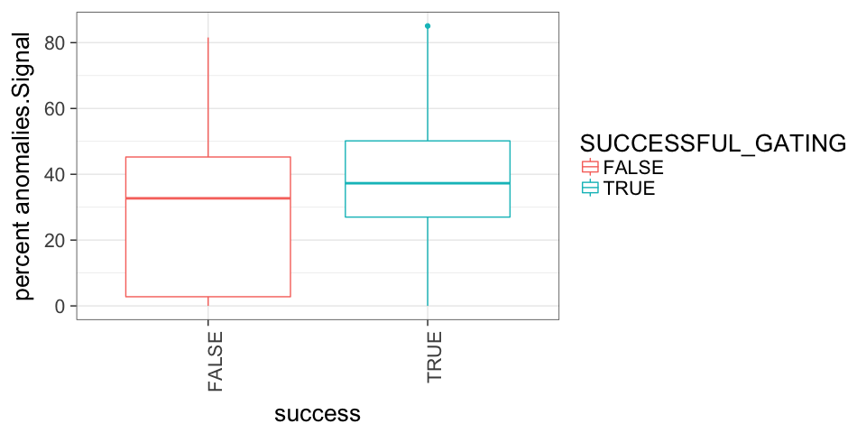
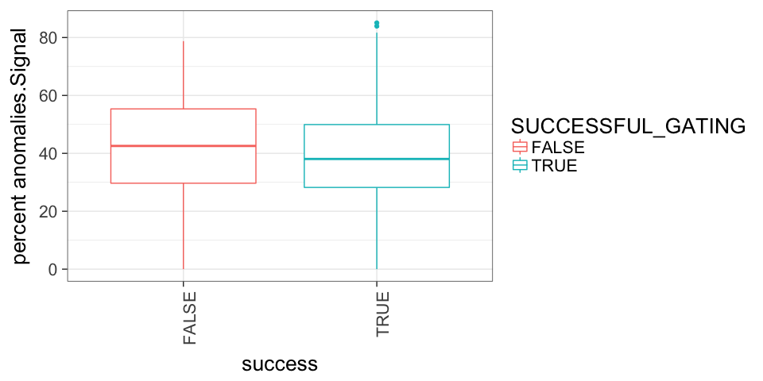
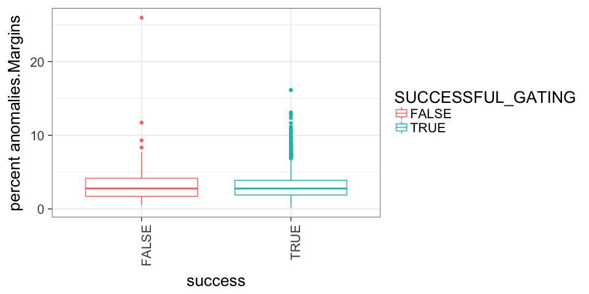
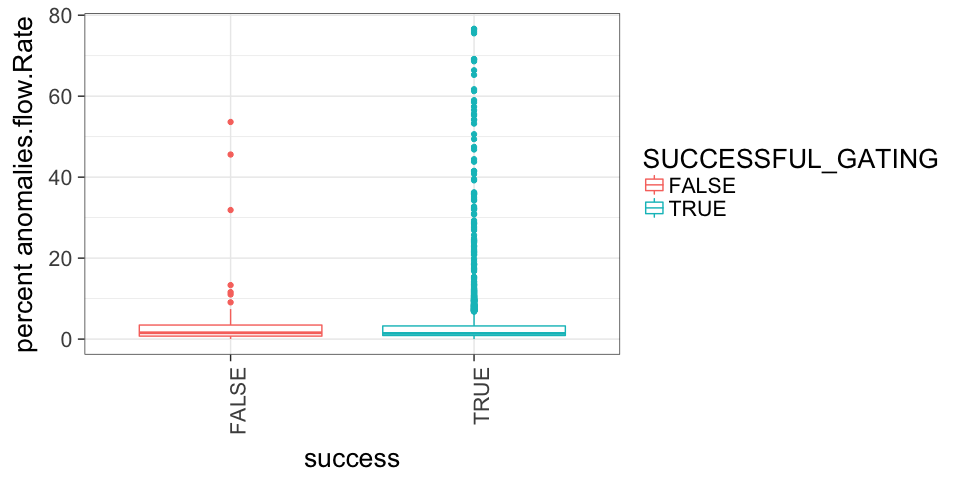
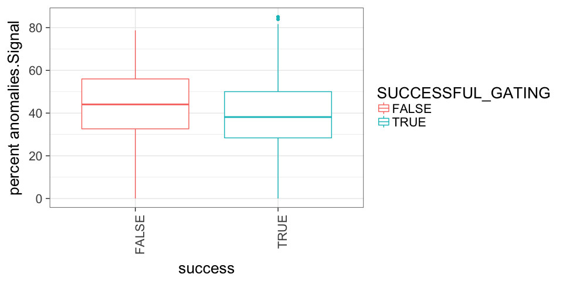
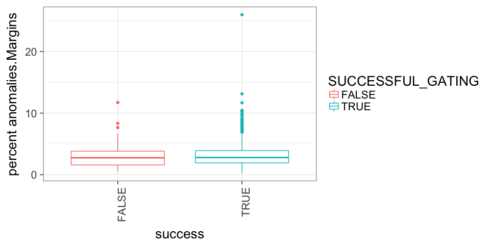

# Review OpenCyto fails
JL  
6/30/2017  
### NOTES:
 - FORTESSA determined by filename, nothing else
 - date determined by filename, nothing else


### SUCCESSFUL_GATING Cell counts: All samples

<!-- -->

### SUCCESSFUL_GATING Cell counts: Split by machine


<!-- -->

### SUCCESSFUL_GATING Cell counts: Split by files with no desc column


<!-- -->

|Var1  |Var2    | Freq|
|:-----|:-------|----:|
|FALSE |DESC    |  209|
|TRUE  |DESC    | 6367|
|FALSE |NO_DESC |   49|
|TRUE  |NO_DESC |    0|


### SUCCESSFUL_GATING Cell counts: Only Batches with >5% failure rate (1694 total samples)


<!-- -->

### SUCCESSFUL_GATING Cell counts: Only Batches with <=5% failure rate (4931 total samples)


```
## Warning: Removed 38 rows containing missing values (geom_bar).
```

<!-- --><!-- -->

### SUCCESSFUL_GATING QC comparison


 All event counts

```
## Warning: Removed 4174 rows containing non-finite values (stat_boxplot).
```

<!-- -->

```
## Warning: Removed 4174 rows containing non-finite values (stat_boxplot).
```

<!-- -->

```
## Warning: Removed 4174 rows containing non-finite values (stat_boxplot).
```

<!-- -->


Event counts >100k

```
## Warning: Removed 4082 rows containing non-finite values (stat_boxplot).
```

<!-- -->

```
## Warning: Removed 4082 rows containing non-finite values (stat_boxplot).
```

<!-- -->

```
## Warning: Removed 4082 rows containing non-finite values (stat_boxplot).
```

<!-- -->


### SUCCESSFUL_GATING NOTES

***3.8943396% failure rate**


|    |Var1                           |Var2.x | Freq.x|Var2.y | Freq.y| PERCENT_FAIL_BY_BATCH| FAIL_RANK|
|:---|:------------------------------|:------|------:|:------|------:|---------------------:|---------:|
|129 |2017-01-09_ NOT_FORTESSA       |FALSE  |     29|TRUE   |     10|             74.358974|     287.0|
|188 |2017-03-15_ NOT_FORTESSA       |FALSE  |     11|TRUE   |      9|             55.000000|     286.0|
|4   |2016-05-09_ NOT_FORTESSA       |FALSE  |      2|TRUE   |      3|             40.000000|     285.0|
|222 |2017-04-11_ NOT_FORTESSA       |FALSE  |     11|TRUE   |     17|             39.285714|     284.0|
|21  |2016-06-03_ NOT_FORTESSA       |FALSE  |      5|TRUE   |      9|             35.714286|     283.0|
|159 |2017-02-17_ NOT_FORTESSA       |FALSE  |     12|TRUE   |     32|             27.272727|     282.0|
|121 |2016-12-21_ NOT_FORTESSA       |FALSE  |      4|TRUE   |     12|             25.000000|     280.5|
|272 |2017-06-06- NOT_FORTESSA       |FALSE  |      4|TRUE   |     12|             25.000000|     280.5|
|203 |2017-03-28_ NOT_FORTESSA       |FALSE  |      5|TRUE   |     19|             20.833333|     279.0|
|15  |2016-05-24_ NOT_FORTESSA       |FALSE  |      4|TRUE   |     16|             20.000000|     278.0|
|100 |2016-11-17_ NOT_FORTESSA       |FALSE  |      7|TRUE   |     29|             19.444444|     277.0|
|116 |2016-12-14_ NOT_FORTESSA       |FALSE  |      4|TRUE   |     17|             19.047619|     276.0|
|273 |2017-06-07_ NOT_FORTESSA       |FALSE  |      5|TRUE   |     22|             18.518518|     275.0|
|224 |2017-04-12_ NOT_FORTESSA       |FALSE  |      3|TRUE   |     14|             17.647059|     274.0|
|221 |2017-04-11_ FORTESSA           |FALSE  |      5|TRUE   |     25|             16.666667|     273.0|
|284 |2017-06-22_ FORTESSA           |FALSE  |      1|TRUE   |      6|             14.285714|     272.0|
|142 |2017-01-30_ NOT_FORTESSA       |FALSE  |      7|TRUE   |     43|             14.000000|     271.0|
|227 |2017-04-14_ NOT_FORTESSA       |FALSE  |      2|TRUE   |     13|             13.333333|     270.0|
|13  |2016-05-20_ NOT_FORTESSA       |FALSE  |      1|TRUE   |      8|             11.111111|     268.5|
|78  |2016-09-26_ NOT_FORTESSA       |FALSE  |      1|TRUE   |      8|             11.111111|     268.5|
|58  |2016-08-10_ NOT_FORTESSA       |FALSE  |      2|TRUE   |     17|             10.526316|     267.0|
|270 |2017-06-02_ NOT_FORTESSA       |FALSE  |      3|TRUE   |     26|             10.344828|     266.0|
|17  |2016-05-26_ NOT_FORTESSA       |FALSE  |      2|TRUE   |     18|             10.000000|     262.0|
|34  |2016-06-23_ NOT_FORTESSA       |FALSE  |      2|TRUE   |     18|             10.000000|     262.0|
|39  |2016-07-07_ NOT_FORTESSA       |FALSE  |      2|TRUE   |     18|             10.000000|     262.0|
|55  |2016-08-04_ NOT_FORTESSA       |FALSE  |      2|TRUE   |     18|             10.000000|     262.0|
|88  |2016-10-25_ NOT_FORTESSA       |FALSE  |      1|TRUE   |      9|             10.000000|     262.0|
|255 |2017-05-13_ NOT_FORTESSA       |FALSE  |      1|TRUE   |      9|             10.000000|     262.0|
|266 |2017-05-23_ NOT_FORTESSA       |FALSE  |      3|TRUE   |     27|             10.000000|     262.0|
|268 |2017-05-31_ NOT_FORTESSA       |FALSE  |      3|TRUE   |     28|              9.677419|     258.0|
|219 |2017-04-10_ FORTESSA           |FALSE  |      2|TRUE   |     19|              9.523810|     257.0|
|269 |2017-06-01_ NOT_FORTESSA       |FALSE  |      3|TRUE   |     29|              9.375000|     256.0|
|262 |2017-05-19_ FORTESSA           |FALSE  |      3|TRUE   |     30|              9.090909|     255.0|
|193 |2017-03-21_ FORTESSA           |FALSE  |      2|TRUE   |     21|              8.695652|     254.0|
|168 |2017-02-30_ NOT_FORTESSA       |FALSE  |      2|TRUE   |     22|              8.333333|     253.0|
|210 |2017-04-03_ NOT_FORTESSA       |FALSE  |      2|TRUE   |     23|              8.000000|     251.5|
|248 |2017-05-05_ NOT_FORTESSA       |FALSE  |      2|TRUE   |     23|              8.000000|     251.5|
|91  |2016-10-31_ NOT_FORTESSA       |FALSE  |      2|TRUE   |     24|              7.692308|     248.5|
|92  |2016-11-01_ NOT_FORTESSA       |FALSE  |      2|TRUE   |     24|              7.692308|     248.5|
|124 |2016-12-29_ NOT_FORTESSA       |FALSE  |      2|TRUE   |     24|              7.692308|     248.5|
|161 |2017-02-21_ NOT_FORTESSA       |FALSE  |      4|TRUE   |     48|              7.692308|     248.5|
|141 |2017-01-27_ NOT_FORTESSA       |FALSE  |      3|TRUE   |     37|              7.500000|     246.0|
|261 |2017-05-18_ NOT_FORTESSA       |FALSE  |      2|TRUE   |     25|              7.407407|     244.5|
|271 |2017-06-05_ NOT_FORTESSA       |FALSE  |      2|TRUE   |     25|              7.407407|     244.5|
|131 |2017-01-11_ NOT_FORTESSA       |FALSE  |      1|TRUE   |     13|              7.142857|     242.0|
|201 |2017-03-27_ NOT_FORTESSA       |FALSE  |      1|TRUE   |     13|              7.142857|     242.0|
|205 |2017-03-29_ NOT_FORTESSA       |FALSE  |      1|TRUE   |     13|              7.142857|     242.0|
|7   |2016-05-12_ NOT_FORTESSA       |FALSE  |      1|TRUE   |     14|              6.666667|     237.5|
|10  |2016-05-17_ NOT_FORTESSA       |FALSE  |      1|TRUE   |     14|              6.666667|     237.5|
|11  |2016-05-18_ NOT_FORTESSA       |FALSE  |      1|TRUE   |     14|              6.666667|     237.5|
|14  |2016-05-23_ NOT_FORTESSA       |FALSE  |      1|TRUE   |     14|              6.666667|     237.5|
|252 |2017-05-11_ NOT_FORTESSA       |FALSE  |      2|TRUE   |     28|              6.666667|     237.5|
|267 |2017-05-26_ FORTESSA           |FALSE  |      2|TRUE   |     28|              6.666667|     237.5|
|122 |2016-12-22_ NOT_FORTESSA       |FALSE  |      2|TRUE   |     29|              6.451613|     233.5|
|278 |2017-06-14_ NOT_FORTESSA       |FALSE  |      2|TRUE   |     29|              6.451613|     233.5|
|189 |2017-03-16_ FORTESSA           |FALSE  |      1|TRUE   |     15|              6.250000|     229.5|
|218 |2017-04-07_ NOT_FORTESSA       |FALSE  |      1|TRUE   |     15|              6.250000|     229.5|
|274 |2017-06-08_ NOT_FORTESSA       |FALSE  |      2|TRUE   |     30|              6.250000|     229.5|
|277 |2017-06-13_ NOT_FORTESSA       |FALSE  |      2|TRUE   |     30|              6.250000|     229.5|
|280 |2017-06-16_ NOT_FORTESSA       |FALSE  |      2|TRUE   |     30|              6.250000|     229.5|
|281 |2017-06-19_ NOT_FORTESSA       |FALSE  |      2|TRUE   |     30|              6.250000|     229.5|
|12  |2016-05-19_ NOT_FORTESSA       |FALSE  |      1|TRUE   |     18|              5.263158|     220.0|
|25  |2016-06-09_ NOT_FORTESSA       |FALSE  |      1|TRUE   |     18|              5.263158|     220.0|
|28  |2016-06-14_ NOT_FORTESSA       |FALSE  |      1|TRUE   |     18|              5.263158|     220.0|
|29  |2016-06-15_ NOT_FORTESSA       |FALSE  |      1|TRUE   |     18|              5.263158|     220.0|
|33  |2016-06-22_ NOT_FORTESSA       |FALSE  |      1|TRUE   |     18|              5.263158|     220.0|
|36  |2016-06-27_ NOT_FORTESSA       |FALSE  |      1|TRUE   |     18|              5.263158|     220.0|
|47  |2016-07-20_ NOT_FORTESSA       |FALSE  |      1|TRUE   |     18|              5.263158|     220.0|
|50  |2016-07-27_ NOT_FORTESSA       |FALSE  |      1|TRUE   |     18|              5.263158|     220.0|
|52  |2016-08-01_ NOT_FORTESSA       |FALSE  |      1|TRUE   |     18|              5.263158|     220.0|
|61  |2016-08-15_ NOT_FORTESSA       |FALSE  |      1|TRUE   |     18|              5.263158|     220.0|
|67  |2016-08-30_ NOT_FORTESSA       |FALSE  |      1|TRUE   |     18|              5.263158|     220.0|
|72  |2016-09-13_ NOT_FORTESSA       |FALSE  |      1|TRUE   |     18|              5.263158|     220.0|
|76  |2016-09-19_ NOT_FORTESSA       |FALSE  |      1|TRUE   |     18|              5.263158|     220.0|
|51  |2016-07-29_ NOT_FORTESSA       |FALSE  |      1|TRUE   |     19|              5.000000|     209.5|
|60  |2016-08-12_ NOT_FORTESSA       |FALSE  |      1|TRUE   |     19|              5.000000|     209.5|
|62  |2016-08-16_ NOT_FORTESSA       |FALSE  |      1|TRUE   |     19|              5.000000|     209.5|
|66  |2016-08-29_ NOT_FORTESSA       |FALSE  |      1|TRUE   |     19|              5.000000|     209.5|
|71  |2016-09-09_ NOT_FORTESSA       |FALSE  |      1|TRUE   |     19|              5.000000|     209.5|
|74  |2016-09-15_ NOT_FORTESSA       |FALSE  |      1|TRUE   |     19|              5.000000|     209.5|
|87  |2016-10-24_ NOT_FORTESSA       |FALSE  |      1|TRUE   |     19|              5.000000|     209.5|
|120 |2016-12-20_ NOT_FORTESSA       |FALSE  |      2|TRUE   |     38|              5.000000|     209.5|
|213 |2017-04-05_ FORTESSA           |FALSE  |      1|TRUE   |     20|              4.761905|     204.5|
|220 |2017-04-10_ NOT_FORTESSA       |FALSE  |      1|TRUE   |     20|              4.761905|     204.5|
|158 |2017-02-16_ NOT_FORTESSA       |FALSE  |      2|TRUE   |     42|              4.545454|     202.5|
|240 |2017-04-26_ NOT_FORTESSA       |FALSE  |      1|TRUE   |     21|              4.545454|     202.5|
|157 |2017-02-15_ NOT_FORTESSA       |FALSE  |      2|TRUE   |     44|              4.347826|     199.5|
|187 |2017-03-14_ NOT_FORTESSA       |FALSE  |      1|TRUE   |     22|              4.347826|     199.5|
|246 |2017-05-04_ FORTESSA           |FALSE  |      1|TRUE   |     22|              4.347826|     199.5|
|282 |2017-06-20_ NOT_FORTESSA       |FALSE  |      1|TRUE   |     22|              4.347826|     199.5|
|126 |2017-01-04_ NOT_FORTESSA       |FALSE  |      1|TRUE   |     23|              4.166667|     195.5|
|164 |2017-02-24_ NOT_FORTESSA       |FALSE  |      1|TRUE   |     23|              4.166667|     195.5|
|199 |2017-03-24_ FORTESSA           |FALSE  |      1|TRUE   |     23|              4.166667|     195.5|
|234 |2017-04-20_ NOT_FORTESSA       |FALSE  |      1|TRUE   |     23|              4.166667|     195.5|
|241 |2017-04-27_ NOT_FORTESSA       |FALSE  |      1|TRUE   |     24|              4.000000|     193.0|
|236 |2017-04-21_ NOT_FORTESSA       |FALSE  |      1|TRUE   |     25|              3.846154|     192.0|
|194 |2017-03-21_ NOT_FORTESSA       |FALSE  |      1|TRUE   |     26|              3.703704|     190.0|
|230 |2017-04-18_ NOT_FORTESSA       |FALSE  |      1|TRUE   |     26|              3.703704|     190.0|
|263 |2017-05-19_ NOT_FORTESSA       |FALSE  |      1|TRUE   |     26|              3.703704|     190.0|
|287 |2017-1-03_ NOT_FORTESSA        |FALSE  |      1|TRUE   |     27|              3.571429|     188.0|
|225 |2017-04-13_ NOT_FORTESSA       |FALSE  |      1|TRUE   |     29|              3.333333|     186.5|
|283 |2017-06-21_ NOT_FORTESSA       |FALSE  |      1|TRUE   |     29|              3.333333|     186.5|
|256 |2017-05-15_ NOT_FORTESSA       |FALSE  |      1|TRUE   |     30|              3.225807|     184.5|
|276 |2017-06-12_ NOT_FORTESSA       |FALSE  |      1|TRUE   |     30|              3.225807|     184.5|
|239 |2017-04-25_ NOT_FORTESSA       |FALSE  |      1|TRUE   |     31|              3.125000|     183.0|
|106 |2016-11-29_ NOT_FORTESSA       |FALSE  |      1|TRUE   |     33|              2.941177|     182.0|
|118 |2016-12-16_ NOT_FORTESSA       |FALSE  |      1|TRUE   |     35|              2.777778|     181.0|
|99  |2016-11-15_ NOT_FORTESSA       |FALSE  |      1|TRUE   |     36|              2.702703|     179.5|
|138 |2017-01-24_ NOT_FORTESSA       |FALSE  |      1|TRUE   |     36|              2.702703|     179.5|
|136 |2017-01-19_ NOT_FORTESSA       |FALSE  |      1|TRUE   |     39|              2.500000|     177.5|
|250 |2017-05-09_ NOT_FORTESSA       |FALSE  |      1|TRUE   |     39|              2.500000|     177.5|
|149 |2017-02-07_ NOT_FORTESSA       |FALSE  |      1|TRUE   |     41|              2.380952|     176.0|
|123 |2016-12-27_ NOT_FORTESSA       |FALSE  |      1|TRUE   |     44|              2.222222|     175.0|
|167 |2017-02-28_ NOT_FORTESSA       |FALSE  |      1|TRUE   |     49|              2.000000|     174.0|
|1   |2016-01-08_ NOT_FORTESSA       |FALSE  |      0|TRUE   |      5|              0.000000|      87.0|
|2   |2016-05-05_ NOT_FORTESSA       |FALSE  |      0|TRUE   |      5|              0.000000|      87.0|
|3   |2016-05-06_ NOT_FORTESSA       |FALSE  |      0|TRUE   |      5|              0.000000|      87.0|
|5   |2016-05-10_ NOT_FORTESSA       |FALSE  |      0|TRUE   |     10|              0.000000|      87.0|
|6   |2016-05-11_ NOT_FORTESSA       |FALSE  |      0|TRUE   |     10|              0.000000|      87.0|
|8   |2016-05-13_ NOT_FORTESSA       |FALSE  |      0|TRUE   |      5|              0.000000|      87.0|
|9   |2016-05-16_ NOT_FORTESSA       |FALSE  |      0|TRUE   |     15|              0.000000|      87.0|
|16  |2016-05-25_ NOT_FORTESSA       |FALSE  |      0|TRUE   |     10|              0.000000|      87.0|
|18  |2016-05-27_ NOT_FORTESSA       |FALSE  |      0|TRUE   |     14|              0.000000|      87.0|
|19  |2016-05-29_ NOT_FORTESSA       |FALSE  |      0|TRUE   |      9|              0.000000|      87.0|
|20  |2016-05-31_ NOT_FORTESSA       |FALSE  |      0|TRUE   |      9|              0.000000|      87.0|
|22  |2016-06-06_ NOT_FORTESSA       |FALSE  |      0|TRUE   |     19|              0.000000|      87.0|
|23  |2016-06-07_ NOT_FORTESSA       |FALSE  |      0|TRUE   |     19|              0.000000|      87.0|
|24  |2016-06-08_ NOT_FORTESSA       |FALSE  |      0|TRUE   |     19|              0.000000|      87.0|
|26  |2016-06-10_ NOT_FORTESSA       |FALSE  |      0|TRUE   |      9|              0.000000|      87.0|
|27  |2016-06-13_ NOT_FORTESSA       |FALSE  |      0|TRUE   |     19|              0.000000|      87.0|
|30  |2016-06-16_ NOT_FORTESSA       |FALSE  |      0|TRUE   |     19|              0.000000|      87.0|
|31  |2016-06-20_ NOT_FORTESSA       |FALSE  |      0|TRUE   |     19|              0.000000|      87.0|
|32  |2016-06-21_ NOT_FORTESSA       |FALSE  |      0|TRUE   |     19|              0.000000|      87.0|
|35  |2016-06-24_ NOT_FORTESSA       |FALSE  |      0|TRUE   |     10|              0.000000|      87.0|
|37  |2016-06-28_ NOT_FORTESSA       |FALSE  |      0|TRUE   |     10|              0.000000|      87.0|
|38  |2016-07-06_ NOT_FORTESSA       |FALSE  |      0|TRUE   |     10|              0.000000|      87.0|
|40  |2016-07-08_ NOT_FORTESSA       |FALSE  |      0|TRUE   |     20|              0.000000|      87.0|
|41  |2016-07-11_ NOT_FORTESSA       |FALSE  |      0|TRUE   |     19|              0.000000|      87.0|
|42  |2016-07-12_ NOT_FORTESSA       |FALSE  |      0|TRUE   |     20|              0.000000|      87.0|
|43  |2016-07-13_ NOT_FORTESSA       |FALSE  |      0|TRUE   |     19|              0.000000|      87.0|
|44  |2016-07-14_ NOT_FORTESSA       |FALSE  |      0|TRUE   |     20|              0.000000|      87.0|
|45  |2016-07-15_ NOT_FORTESSA       |FALSE  |      0|TRUE   |     10|              0.000000|      87.0|
|46  |2016-07-18_ NOT_FORTESSA       |FALSE  |      0|TRUE   |     19|              0.000000|      87.0|
|48  |2016-07-21_ NOT_FORTESSA       |FALSE  |      0|TRUE   |     20|              0.000000|      87.0|
|49  |2016-07-22_ NOT_FORTESSA       |FALSE  |      0|TRUE   |     10|              0.000000|      87.0|
|53  |2016-08-02_ NOT_FORTESSA       |FALSE  |      0|TRUE   |     20|              0.000000|      87.0|
|54  |2016-08-03_ NOT_FORTESSA       |FALSE  |      0|TRUE   |     19|              0.000000|      87.0|
|56  |2016-08-05_ NOT_FORTESSA       |FALSE  |      0|TRUE   |     20|              0.000000|      87.0|
|57  |2016-08-09_ NOT_FORTESSA       |FALSE  |      0|TRUE   |     19|              0.000000|      87.0|
|59  |2016-08-11_ NOT_FORTESSA       |FALSE  |      0|TRUE   |     10|              0.000000|      87.0|
|63  |2016-08-17_ NOT_FORTESSA       |FALSE  |      0|TRUE   |     19|              0.000000|      87.0|
|64  |2016-08-18_ NOT_FORTESSA       |FALSE  |      0|TRUE   |     20|              0.000000|      87.0|
|65  |2016-08-19_ NOT_FORTESSA       |FALSE  |      0|TRUE   |     10|              0.000000|      87.0|
|68  |2016-08-31_ NOT_FORTESSA       |FALSE  |      0|TRUE   |     10|              0.000000|      87.0|
|69  |2016-09-06_ NOT_FORTESSA       |FALSE  |      0|TRUE   |     18|              0.000000|      87.0|
|70  |2016-09-08_ NOT_FORTESSA       |FALSE  |      0|TRUE   |     19|              0.000000|      87.0|
|73  |2016-09-14_ NOT_FORTESSA       |FALSE  |      0|TRUE   |      9|              0.000000|      87.0|
|75  |2016-09-16_ NOT_FORTESSA       |FALSE  |      0|TRUE   |     20|              0.000000|      87.0|
|77  |2016-09-20_ NOT_FORTESSA       |FALSE  |      0|TRUE   |     16|              0.000000|      87.0|
|79  |2016-09-27_ NOT_FORTESSA       |FALSE  |      0|TRUE   |     19|              0.000000|      87.0|
|80  |2016-10-03_ NOT_FORTESSA       |FALSE  |      0|TRUE   |     19|              0.000000|      87.0|
|81  |2016-10-04_ NOT_FORTESSA       |FALSE  |      0|TRUE   |     20|              0.000000|      87.0|
|82  |2016-10-10_ NOT_FORTESSA       |FALSE  |      0|TRUE   |     19|              0.000000|      87.0|
|83  |2016-10-11_ NOT_FORTESSA       |FALSE  |      0|TRUE   |     10|              0.000000|      87.0|
|84  |2016-10-17_ NOT_FORTESSA       |FALSE  |      0|TRUE   |     29|              0.000000|      87.0|
|85  |2016-10-18_ NOT_FORTESSA       |FALSE  |      0|TRUE   |     20|              0.000000|      87.0|
|86  |2016-10-20_ NOT_FORTESSA       |FALSE  |      0|TRUE   |      5|              0.000000|      87.0|
|89  |2016-10-27_ NOT_FORTESSA       |FALSE  |      0|TRUE   |     26|              0.000000|      87.0|
|90  |2016-10-28_ NOT_FORTESSA       |FALSE  |      0|TRUE   |     15|              0.000000|      87.0|
|93  |2016-11-02_ NOT_FORTESSA       |FALSE  |      0|TRUE   |     14|              0.000000|      87.0|
|94  |2016-11-07_ NOT_FORTESSA       |FALSE  |      0|TRUE   |     14|              0.000000|      87.0|
|95  |2016-11-08_ NOT_FORTESSA       |FALSE  |      0|TRUE   |     10|              0.000000|      87.0|
|96  |2016-11-10_ NOT_FORTESSA       |FALSE  |      0|TRUE   |     14|              0.000000|      87.0|
|97  |2016-11-11_ NOT_FORTESSA       |FALSE  |      0|TRUE   |     15|              0.000000|      87.0|
|98  |2016-11-14_ NOT_FORTESSA       |FALSE  |      0|TRUE   |     29|              0.000000|      87.0|
|101 |2016-11-18_ NOT_FORTESSA       |FALSE  |      0|TRUE   |     12|              0.000000|      87.0|
|102 |2016-11-22_ NOT_FORTESSA       |FALSE  |      0|TRUE   |     39|              0.000000|      87.0|
|103 |2016-11-23_ NOT_FORTESSA       |FALSE  |      0|TRUE   |     35|              0.000000|      87.0|
|104 |2016-11-24_ NOT_FORTESSA       |FALSE  |      0|TRUE   |     20|              0.000000|      87.0|
|105 |2016-11-28_ NOT_FORTESSA       |FALSE  |      0|TRUE   |     28|              0.000000|      87.0|
|107 |2016-11-30_ NOT_FORTESSA       |FALSE  |      0|TRUE   |     30|              0.000000|      87.0|
|108 |2016-12-01_ NOT_FORTESSA       |FALSE  |      0|TRUE   |     15|              0.000000|      87.0|
|109 |2016-12-02_ NOT_FORTESSA       |FALSE  |      0|TRUE   |     32|              0.000000|      87.0|
|110 |2016-12-03_ NOT_FORTESSA       |FALSE  |      0|TRUE   |     16|              0.000000|      87.0|
|111 |2016-12-05_ NOT_FORTESSA       |FALSE  |      0|TRUE   |     28|              0.000000|      87.0|
|112 |2016-12-08_ NOT_FORTESSA       |FALSE  |      0|TRUE   |     31|              0.000000|      87.0|
|113 |2016-12-09_ NOT_FORTESSA       |FALSE  |      0|TRUE   |     32|              0.000000|      87.0|
|114 |2016-12-12_ NOT_FORTESSA       |FALSE  |      0|TRUE   |     28|              0.000000|      87.0|
|115 |2016-12-13_ NOT_FORTESSA       |FALSE  |      0|TRUE   |     28|              0.000000|      87.0|
|117 |2016-12-15_ NOT_FORTESSA       |FALSE  |      0|TRUE   |     36|              0.000000|      87.0|
|119 |2016-12-19_ NOT_FORTESSA       |FALSE  |      0|TRUE   |     32|              0.000000|      87.0|
|125 |2016-12-30_ NOT_FORTESSA       |FALSE  |      0|TRUE   |     36|              0.000000|      87.0|
|127 |2017-01-05_ NOT_FORTESSA       |FALSE  |      0|TRUE   |     28|              0.000000|      87.0|
|128 |2017-01-06_ NOT_FORTESSA       |FALSE  |      0|TRUE   |     20|              0.000000|      87.0|
|130 |2017-01-10_ NOT_FORTESSA       |FALSE  |      0|TRUE   |     48|              0.000000|      87.0|
|132 |2017-01-12_ NOT_FORTESSA       |FALSE  |      0|TRUE   |     46|              0.000000|      87.0|
|133 |2017-01-13_ NOT_FORTESSA       |FALSE  |      0|TRUE   |     36|              0.000000|      87.0|
|134 |2017-01-17_ NOT_FORTESSA       |FALSE  |      0|TRUE   |     36|              0.000000|      87.0|
|135 |2017-01-18_ NOT_FORTESSA       |FALSE  |      0|TRUE   |     20|              0.000000|      87.0|
|137 |2017-01-20_ NOT_FORTESSA       |FALSE  |      0|TRUE   |     40|              0.000000|      87.0|
|139 |2017-01-25_ NOT_FORTESSA       |FALSE  |      0|TRUE   |     28|              0.000000|      87.0|
|140 |2017-01-26_ NOT_FORTESSA       |FALSE  |      0|TRUE   |     58|              0.000000|      87.0|
|143 |2017-01-31_ NOT_FORTESSA       |FALSE  |      0|TRUE   |     50|              0.000000|      87.0|
|144 |2017-02_08_ NOT_FORTESSA       |FALSE  |      0|TRUE   |     20|              0.000000|      87.0|
|145 |2017-02-01_ NOT_FORTESSA       |FALSE  |      0|TRUE   |     14|              0.000000|      87.0|
|146 |2017-02-02_ NOT_FORTESSA       |FALSE  |      0|TRUE   |     20|              0.000000|      87.0|
|147 |2017-02-03_ NOT_FORTESSA       |FALSE  |      0|TRUE   |     40|              0.000000|      87.0|
|148 |2017-02-06_ NOT_FORTESSA       |FALSE  |      0|TRUE   |     50|              0.000000|      87.0|
|150 |2017-02-07_ASMIC_ NOT_FORTESSA |FALSE  |      0|TRUE   |      1|              0.000000|      87.0|
|151 |2017-02-08_ NOT_FORTESSA       |FALSE  |      0|TRUE   |     26|              0.000000|      87.0|
|152 |2017-02-09_ NOT_FORTESSA       |FALSE  |      0|TRUE   |     43|              0.000000|      87.0|
|153 |2017-02-09_ASMIC_ NOT_FORTESSA |FALSE  |      0|TRUE   |      1|              0.000000|      87.0|
|154 |2017-02-10_ NOT_FORTESSA       |FALSE  |      0|TRUE   |     44|              0.000000|      87.0|
|155 |2017-02-13_ NOT_FORTESSA       |FALSE  |      0|TRUE   |     52|              0.000000|      87.0|
|156 |2017-02-14_ NOT_FORTESSA       |FALSE  |      0|TRUE   |     40|              0.000000|      87.0|
|160 |2017-02-20_ NOT_FORTESSA       |FALSE  |      0|TRUE   |     16|              0.000000|      87.0|
|162 |2017-02-22_ NOT_FORTESSA       |FALSE  |      0|TRUE   |     30|              0.000000|      87.0|
|163 |2017-02-23_ NOT_FORTESSA       |FALSE  |      0|TRUE   |     24|              0.000000|      87.0|
|165 |2017-02-25_ NOT_FORTESSA       |FALSE  |      0|TRUE   |     12|              0.000000|      87.0|
|166 |2017-02-27_ NOT_FORTESSA       |FALSE  |      0|TRUE   |     54|              0.000000|      87.0|
|169 |2017-03-01_ FORTESSA           |FALSE  |      0|TRUE   |     25|              0.000000|      87.0|
|170 |2017-03-01_ NOT_FORTESSA       |FALSE  |      0|TRUE   |     19|              0.000000|      87.0|
|171 |2017-03-02_ FORTESSA           |FALSE  |      0|TRUE   |     24|              0.000000|      87.0|
|172 |2017-03-02_ NOT_FORTESSA       |FALSE  |      0|TRUE   |     20|              0.000000|      87.0|
|173 |2017-03-02_ASMIC_ FORTESSA     |FALSE  |      0|TRUE   |      1|              0.000000|      87.0|
|174 |2017-03-03_ FORTESSA           |FALSE  |      0|TRUE   |     24|              0.000000|      87.0|
|175 |2017-03-03_ NOT_FORTESSA       |FALSE  |      0|TRUE   |     20|              0.000000|      87.0|
|176 |2017-03-06_ FORTESSA           |FALSE  |      0|TRUE   |     30|              0.000000|      87.0|
|177 |2017-03-06_ NOT_FORTESSA       |FALSE  |      0|TRUE   |     20|              0.000000|      87.0|
|178 |2017-03-07_ FORTESSA           |FALSE  |      0|TRUE   |     25|              0.000000|      87.0|
|179 |2017-03-07_ NOT_FORTESSA       |FALSE  |      0|TRUE   |     25|              0.000000|      87.0|
|180 |2017-03-08_ FORTESSA           |FALSE  |      0|TRUE   |      9|              0.000000|      87.0|
|181 |2017-03-08_ NOT_FORTESSA       |FALSE  |      0|TRUE   |     21|              0.000000|      87.0|
|182 |2017-03-09_ FORTESSA           |FALSE  |      0|TRUE   |      7|              0.000000|      87.0|
|183 |2017-03-09_ NOT_FORTESSA       |FALSE  |      0|TRUE   |     29|              0.000000|      87.0|
|184 |2017-03-10_ NOT_FORTESSA       |FALSE  |      0|TRUE   |     24|              0.000000|      87.0|
|185 |2017-03-13_ NOT_FORTESSA       |FALSE  |      0|TRUE   |     28|              0.000000|      87.0|
|186 |2017-03-14_ FORTESSA           |FALSE  |      0|TRUE   |     33|              0.000000|      87.0|
|190 |2017-03-16_ NOT_FORTESSA       |FALSE  |      0|TRUE   |     14|              0.000000|      87.0|
|191 |2017-03-20_ FORTESSA           |FALSE  |      0|TRUE   |     19|              0.000000|      87.0|
|192 |2017-03-20_ NOT_FORTESSA       |FALSE  |      0|TRUE   |     23|              0.000000|      87.0|
|195 |2017-03-22_ FORTESSA           |FALSE  |      0|TRUE   |     19|              0.000000|      87.0|
|196 |2017-03-22_ NOT_FORTESSA       |FALSE  |      0|TRUE   |     19|              0.000000|      87.0|
|197 |2017-03-23_ FORTESSA           |FALSE  |      0|TRUE   |     14|              0.000000|      87.0|
|198 |2017-03-23_ NOT_FORTESSA       |FALSE  |      0|TRUE   |     31|              0.000000|      87.0|
|200 |2017-03-24_ NOT_FORTESSA       |FALSE  |      0|TRUE   |     20|              0.000000|      87.0|
|202 |2017-03-28_ FORTESSA           |FALSE  |      0|TRUE   |     30|              0.000000|      87.0|
|204 |2017-03-29_ FORTESSA           |FALSE  |      0|TRUE   |     17|              0.000000|      87.0|
|206 |2017-03-30_ FORTESSA           |FALSE  |      0|TRUE   |     20|              0.000000|      87.0|
|207 |2017-03-31_ FORTESSA           |FALSE  |      0|TRUE   |     24|              0.000000|      87.0|
|208 |2017-03-31_ NOT_FORTESSA       |FALSE  |      0|TRUE   |     24|              0.000000|      87.0|
|209 |2017-04-03_ FORTESSA           |FALSE  |      0|TRUE   |     21|              0.000000|      87.0|
|211 |2017-04-04_ FORTESSA           |FALSE  |      0|TRUE   |     30|              0.000000|      87.0|
|212 |2017-04-04_ NOT_FORTESSA       |FALSE  |      0|TRUE   |     28|              0.000000|      87.0|
|214 |2017-04-05_ NOT_FORTESSA       |FALSE  |      0|TRUE   |     22|              0.000000|      87.0|
|215 |2017-04-06_ FORTESSA           |FALSE  |      0|TRUE   |     26|              0.000000|      87.0|
|216 |2017-04-06_ NOT_FORTESSA       |FALSE  |      0|TRUE   |     29|              0.000000|      87.0|
|217 |2017-04-07_ FORTESSA           |FALSE  |      0|TRUE   |     14|              0.000000|      87.0|
|223 |2017-04-12_ FORTESSA           |FALSE  |      0|TRUE   |     13|              0.000000|      87.0|
|226 |2017-04-13_ASMIC_ FORTESSA     |FALSE  |      0|TRUE   |      2|              0.000000|      87.0|
|228 |2017-04-17_ FORTESSA           |FALSE  |      0|TRUE   |     20|              0.000000|      87.0|
|229 |2017-04-17_ NOT_FORTESSA       |FALSE  |      0|TRUE   |     22|              0.000000|      87.0|
|231 |2017-04-19_ FORTESSA           |FALSE  |      0|TRUE   |     15|              0.000000|      87.0|
|232 |2017-04-19_ NOT_FORTESSA       |FALSE  |      0|TRUE   |     21|              0.000000|      87.0|
|233 |2017-04-20_ FORTESSA           |FALSE  |      0|TRUE   |      6|              0.000000|      87.0|
|235 |2017-04-21_ FORTESSA           |FALSE  |      0|TRUE   |     15|              0.000000|      87.0|
|237 |2017-04-24_ FORTESSA           |FALSE  |      0|TRUE   |     26|              0.000000|      87.0|
|238 |2017-04-24_ NOT_FORTESSA       |FALSE  |      0|TRUE   |     28|              0.000000|      87.0|
|242 |2017-04-28_ NOT_FORTESSA       |FALSE  |      0|TRUE   |     30|              0.000000|      87.0|
|243 |2017-05-01_ NOT_FORTESSA       |FALSE  |      0|TRUE   |     30|              0.000000|      87.0|
|244 |2017-05-02_ NOT_FORTESSA       |FALSE  |      0|TRUE   |     29|              0.000000|      87.0|
|245 |2017-05-03_ NOT_FORTESSA       |FALSE  |      0|TRUE   |     21|              0.000000|      87.0|
|247 |2017-05-04_ NOT_FORTESSA       |FALSE  |      0|TRUE   |     32|              0.000000|      87.0|
|249 |2017-05-08_ NOT_FORTESSA       |FALSE  |      0|TRUE   |     40|              0.000000|      87.0|
|251 |2017-05-11_ FORTESSA           |FALSE  |      0|TRUE   |      2|              0.000000|      87.0|
|253 |2017-05-12_ FORTESSA           |FALSE  |      0|TRUE   |     19|              0.000000|      87.0|
|254 |2017-05-12_ NOT_FORTESSA       |FALSE  |      0|TRUE   |     24|              0.000000|      87.0|
|257 |2017-05-16_ NOT_FORTESSA       |FALSE  |      0|TRUE   |     31|              0.000000|      87.0|
|258 |2017-05-17_ FORTESSA           |FALSE  |      0|TRUE   |     13|              0.000000|      87.0|
|259 |2017-05-17_ NOT_FORTESSA       |FALSE  |      0|TRUE   |     19|              0.000000|      87.0|
|260 |2017-05-18_ FORTESSA           |FALSE  |      0|TRUE   |     29|              0.000000|      87.0|
|264 |2017-05-22_ NOT_FORTESSA       |FALSE  |      0|TRUE   |      7|              0.000000|      87.0|
|265 |2017-05-23_ FORTESSA           |FALSE  |      0|TRUE   |     31|              0.000000|      87.0|
|275 |2017-06-09_ NOT_FORTESSA       |FALSE  |      0|TRUE   |     31|              0.000000|      87.0|
|279 |2017-06-15_ NOT_FORTESSA       |FALSE  |      0|TRUE   |     19|              0.000000|      87.0|
|285 |2017-06-22_ NOT_FORTESSA       |FALSE  |      0|TRUE   |     25|              0.000000|      87.0|
|286 |2017-06-23_ NOT_FORTESSA       |FALSE  |      0|TRUE   |     21|              0.000000|      87.0|

```
## 
## FALSE  TRUE 
##   258  6367
```


|     |FILE                                                                       | TOTAL_COUNTS| n..of.events| X..anomalies|analysis.from             | X..anomalies.flow.Rate| X..anomalies.Signal| X..anomalies.Margins|SUCCESSFUL_GATING |NO_DESC | LOG_TOTAL_COUNT|PROCESS_DATE             |FORTESSA     |
|:----|:--------------------------------------------------------------------------|------------:|------------:|------------:|:-------------------------|----------------------:|-------------------:|--------------------:|:-----------------|:-------|---------------:|:------------------------|:------------|
|2954 |2017-01-27_PANEL 1_ZF_Group two_F1637151_026.fcs                           |      9234774|      9234774|         1.24|Flow Rate and Flow Margin |                   0.71|               49.14|                 0.60|FALSE             |DESC    |        6.965426|2017-01-27_ NOT_FORTESSA |NOT_FORTESSA |
|4640 |2017-03-29_PANEL 1_LSR_HB_Group one_F1642540_002.fcs                       |      7646601|           NA|           NA|NA                        |                     NA|                  NA|                   NA|FALSE             |DESC    |        6.883468|2017-03-29_ NOT_FORTESSA |NOT_FORTESSA |
|4588 |2017-03-28_PANEL 1_LSR_RR_Group one_F1634093_004.fcs                       |      6058069|           NA|           NA|NA                        |                     NA|                  NA|                   NA|FALSE             |DESC    |        6.782334|2017-03-28_ NOT_FORTESSA |NOT_FORTESSA |
|830  |2016-08-04_PANEL 1_ZF_Group one_F1631106_002.fcs                           |      5343678|           NA|           NA|NA                        |                     NA|                  NA|                   NA|FALSE             |DESC    |        6.727840|2016-08-04_ NOT_FORTESSA |NOT_FORTESSA |
|6117 |2017-05-31_PANEL 1_LSR_001_Group two_ZF_F1635116_040.fcs                   |      5243242|           NA|           NA|NA                        |                     NA|                  NA|                   NA|FALSE             |DESC    |        6.719600|2017-05-31_ NOT_FORTESSA |NOT_FORTESSA |
|4940 |2017-04-07_PANEL 1_LSR_RR_Group two_F1642889_022.fcs                       |      4923030|           NA|           NA|NA                        |                     NA|                  NA|                   NA|FALSE             |DESC    |        6.692233|2017-04-07_ NOT_FORTESSA |NOT_FORTESSA |
|4969 |2017-04-10_PANEL 1_LSR_DHS_Group one_F1643036_005.fcs                      |      4675731|           NA|           NA|NA                        |                     NA|                  NA|                   NA|FALSE             |DESC    |        6.669849|2017-04-10_ NOT_FORTESSA |NOT_FORTESSA |
|6236 |2017-06-07_PANEL 1_LSR_ZF_RR_Group one_ZF_F1635100_004.fcs                 |      4473941|           NA|           NA|NA                        |                     NA|                  NA|                   NA|FALSE             |DESC    |        6.650690|2017-06-07_ NOT_FORTESSA |NOT_FORTESSA |
|476  |2016-06-23_PANEL 1_ZF_Group two_F1632045_031.fcs                           |      4050573|           NA|           NA|NA                        |                     NA|                  NA|                   NA|FALSE             |DESC    |        6.607517|2016-06-23_ NOT_FORTESSA |NOT_FORTESSA |
|6100 |2017-05-31_PANEL 1_LSR_001_Group one_ZF_F1634953_029.fcs                   |      3878465|           NA|           NA|NA                        |                     NA|                  NA|                   NA|FALSE             |DESC    |        6.588660|2017-05-31_ NOT_FORTESSA |NOT_FORTESSA |
|2952 |2017-01-27_PANEL 1_ZF_Group two_F1637085_028.fcs                           |      3688864|      3688864|         1.87|Flow Rate and Flow Margin |                   0.64|               67.75|                 1.24|FALSE             |DESC    |        6.566893|2017-01-27_ NOT_FORTESSA |NOT_FORTESSA |
|483  |2016-06-23_PANEL 1_ZF_Group two_F1632341_032.fcs                           |      3610727|           NA|           NA|NA                        |                     NA|                  NA|                   NA|FALSE             |DESC    |        6.557595|2016-06-23_ NOT_FORTESSA |NOT_FORTESSA |
|108  |2016-05-19_PANEL 1_HB_panel one_F1631964_005.fcs                           |      3280223|           NA|           NA|NA                        |                     NA|                  NA|                   NA|FALSE             |DESC    |        6.515903|2016-05-19_ NOT_FORTESSA |NOT_FORTESSA |
|835  |2016-08-04_PANEL 1_ZF_Group one_F1631387_007.fcs                           |      3270885|           NA|           NA|NA                        |                     NA|                  NA|                   NA|FALSE             |DESC    |        6.514665|2016-08-04_ NOT_FORTESSA |NOT_FORTESSA |
|3552 |2017-02-17_PANEL 1_RR_group one_RR_F1635743_018.fcs                        |      3218706|      3218706|         2.76|Flow Rate and Flow Margin |                   1.48|               56.50|                 1.30|FALSE             |NO_DESC |        6.507681|2017-02-17_ NOT_FORTESSA |NOT_FORTESSA |
|6495 |2017-06-20_PANEL 1_LSR_DHS_Group one_DHS_F1632979_002.fcs                  |      3207390|           NA|           NA|NA                        |                     NA|                  NA|                   NA|FALSE             |DESC    |        6.506152|2017-06-20_ NOT_FORTESSA |NOT_FORTESSA |
|6257 |2017-06-08_PANEL 1_LSR_ZF_RR_Group one_RR_F1635020_037.fcs                 |      3173662|           NA|           NA|NA                        |                     NA|                  NA|                   NA|FALSE             |DESC    |        6.501561|2017-06-08_ NOT_FORTESSA |NOT_FORTESSA |
|3495 |2017-02-16_PANEL 1_HB_group one_F1635444_017.fcs                           |      3169170|      3169170|         2.73|Flow Rate and Flow Margin |                   1.86|               73.73|                 0.88|FALSE             |DESC    |        6.500946|2017-02-16_ NOT_FORTESSA |NOT_FORTESSA |
|2961 |2017-01-30_PANEL 1_DHS_Group one_F1637147_002.fcs                          |      3113822|      3113822|         9.04|Flow Rate and Flow Margin |                   6.02|               78.76|                 3.11|FALSE             |DESC    |        6.493294|2017-01-30_ NOT_FORTESSA |NOT_FORTESSA |
|2960 |2017-01-30_PANEL 1_DHS_Group one_F1637108_013.fcs                          |      2913000|      2913000|         9.75|Flow Rate and Flow Margin |                   7.42|               41.21|                 2.42|FALSE             |DESC    |        6.464340|2017-01-30_ NOT_FORTESSA |NOT_FORTESSA |
|3493 |2017-02-15_PANEL 1_ZF_Group two_F1653068_039.fcs                           |      2882333|      2882333|         7.28|Flow Rate and Flow Margin |                   5.85|               10.72|                 1.54|FALSE             |DESC    |        6.459744|2017-02-15_ NOT_FORTESSA |NOT_FORTESSA |
|4589 |2017-03-28_PANEL 1_LSR_RR_Group one_F1634098_012.fcs                       |      2879596|           NA|           NA|NA                        |                     NA|                  NA|                   NA|FALSE             |NO_DESC |        6.459332|2017-03-28_ NOT_FORTESSA |NOT_FORTESSA |
|236  |2016-06-03_PANEL 1_ZF_Group one_F1636743-bad_002.fcs                       |      2830766|           NA|           NA|NA                        |                     NA|                  NA|                   NA|FALSE             |DESC    |        6.451904|2016-06-03_ NOT_FORTESSA |NOT_FORTESSA |
|6228 |2017-06-07_PANEL 1_LSR_ZF_RR_Group one_RR_F1634971_032.fcs                 |      2762721|           NA|           NA|NA                        |                     NA|                  NA|                   NA|FALSE             |DESC    |        6.441337|2017-06-07_ NOT_FORTESSA |NOT_FORTESSA |
|4416 |2017-03-21_PANEL 1_LSR_RR_Group two_F1638185_031.fcs                       |      2727311|           NA|           NA|NA                        |                     NA|                  NA|                   NA|FALSE             |DESC    |        6.435735|2017-03-21_ NOT_FORTESSA |NOT_FORTESSA |
|105  |2016-05-18_PANEL 1_ZF_panel one_F1636724_015.fcs                           |      2720340|           NA|           NA|NA                        |                     NA|                  NA|                   NA|FALSE             |DESC    |        6.434623|2016-05-18_ NOT_FORTESSA |NOT_FORTESSA |
|6625 |2017-1-03_PANEL 1_DHS_Group two_F1652369_028.fcs                           |      2672825|      2672825|         3.78|Flow Rate and Flow Margin |                   0.69|               31.16|                 3.12|FALSE             |DESC    |        6.426971|2017-1-03_ NOT_FORTESSA  |NOT_FORTESSA |
|5241 |2017-04-20_PANEL 1_LSR_ZF_Group one_F1642736_001.fcs                       |      2669219|           NA|           NA|NA                        |                     NA|                  NA|                   NA|FALSE             |DESC    |        6.426384|2017-04-20_ NOT_FORTESSA |NOT_FORTESSA |
|3624 |2017-02-21_PANEL 1_ZF_Group one_F1635515_004.fcs                           |      2668371|      2668371|         2.56|Flow Rate and Flow Margin |                   0.86|               36.83|                 1.72|FALSE             |DESC    |        6.426246|2017-02-21_ NOT_FORTESSA |NOT_FORTESSA |
|6216 |2017-06-06-PANEL 1_LSR_DHS_Group one_F1635352_001.fcs                      |      2666586|           NA|           NA|NA                        |                     NA|                  NA|                   NA|FALSE             |DESC    |        6.425956|2017-06-06- NOT_FORTESSA |NOT_FORTESSA |
|3551 |2017-02-17_PANEL 1_RR_group one_RR_F1635498_015.fcs                        |      2500326|      2500326|         3.25|Flow Rate and Flow Margin |                   0.36|               46.35|                 2.89|FALSE             |NO_DESC |        6.397997|2017-02-17_ NOT_FORTESSA |NOT_FORTESSA |
|2497 |2017-01-09_PANEL 1_DHS_Group Three_ZF_F1636284_039.fcs                     |      2474672|      2474672|        12.57|Flow Rate and Flow Margin |                  11.02|               44.74|                 2.34|FALSE             |NO_DESC |        6.393518|2017-01-09_ NOT_FORTESSA |NOT_FORTESSA |
|2970 |2017-01-30_PANEL 1_DHS_Group one_F1653144_004.fcs                          |      2418575|      2418575|         5.22|Flow Rate and Flow Margin |                   2.52|               21.38|                 2.73|FALSE             |DESC    |        6.383560|2017-01-30_ NOT_FORTESSA |NOT_FORTESSA |
|3528 |2017-02-16_PANEL 1_RR_Group two_F1636386_024.fcs                           |      2386035|      2386035|         3.44|Flow Rate and Flow Margin |                   0.70|               74.46|                 2.78|FALSE             |DESC    |        6.377677|2017-02-16_ NOT_FORTESSA |NOT_FORTESSA |
|4832 |2017-04-05_PANEL 1_FORTESSA_HB_group two_F1640854_027.fcs                  |      2275824|           NA|           NA|NA                        |                     NA|                  NA|                   NA|FALSE             |DESC    |        6.357139|2017-04-05_ FORTESSA     |FORTESSA     |
|6252 |2017-06-07_PANEL 1_LSR_ZF_RR_Group two_ZF_F1638338_024.fcs                 |      2232542|           NA|           NA|NA                        |                     NA|                  NA|                   NA|FALSE             |DESC    |        6.348800|2017-06-07_ NOT_FORTESSA |NOT_FORTESSA |
|2510 |2017-01-09_PANEL 1_DHS_Group Two_F1638712_026.fcs                          |      2166388|      2166388|        46.08|Flow Rate and Flow Margin |                  45.59|               65.52|                 1.10|FALSE             |NO_DESC |        6.335736|2017-01-09_ NOT_FORTESSA |NOT_FORTESSA |
|2476 |2017-01-09_PANEL 1_DHS_Group four_F1636257_043.fcs                         |      2130732|      2130732|         1.87|Flow Rate and Flow Margin |                   0.61|               12.73|                 1.27|FALSE             |NO_DESC |        6.328529|2017-01-09_ NOT_FORTESSA |NOT_FORTESSA |
|2972 |2017-01-30_PANEL 1_DHS_Group two_F1635468_037.fcs                          |      2107626|      2107626|         4.90|Flow Rate and Flow Margin |                   1.02|               55.26|                 3.91|FALSE             |DESC    |        6.323793|2017-01-30_ NOT_FORTESSA |NOT_FORTESSA |
|321  |2016-06-09_PANEL 1_ZF_Group two_F1636728_030.fcs                           |      2083417|      2083417|         6.28|Flow Rate and Flow Margin |                   4.45|               39.71|                 2.42|FALSE             |DESC    |        6.318776|2016-06-09_ NOT_FORTESSA |NOT_FORTESSA |
|22   |2016-05-09_PANEL 1_DHS_panel one_F1631955_005.fcs                          |      2078898|           NA|           NA|NA                        |                     NA|                  NA|                   NA|FALSE             |NO_DESC |        6.317833|2016-05-09_ NOT_FORTESSA |NOT_FORTESSA |
|3555 |2017-02-17_PANEL 1_RR_group one_RR_F1635781_012.fcs                        |      2061329|      2061329|         6.40|Flow Rate and Flow Margin |                   3.84|               29.68|                 2.97|FALSE             |NO_DESC |        6.314147|2017-02-17_ NOT_FORTESSA |NOT_FORTESSA |
|5401 |2017-04-26_PANEL 1_LSR_ZF_Group two_F1640769_025.fcs                       |      2025074|           NA|           NA|NA                        |                     NA|                  NA|                   NA|FALSE             |DESC    |        6.306441|2017-04-26_ NOT_FORTESSA |NOT_FORTESSA |
|2508 |2017-01-09_PANEL 1_DHS_Group Two_F1638678_031.fcs                          |      2013623|      2013623|         4.55|Flow Rate and Flow Margin |                   3.38|               16.89|                 1.27|FALSE             |NO_DESC |        6.303978|2017-01-09_ NOT_FORTESSA |NOT_FORTESSA |
|6048 |2017-05-23_PANEL 1_LSR_DHS_ZF_Group two_DHS_F1635062_021.fcs               |      1983815|           NA|           NA|NA                        |                     NA|                  NA|                   NA|FALSE             |DESC    |        6.297501|2017-05-23_ NOT_FORTESSA |NOT_FORTESSA |
|3647 |2017-02-21_PANEL 1_ZF_Group two_F1652505_031.fcs                           |      1971031|      1971031|         3.70|Flow Rate and Flow Margin |                   1.29|               41.35|                 2.44|FALSE             |DESC    |        6.294694|2017-02-21_ NOT_FORTESSA |NOT_FORTESSA |
|4608 |2017-03-28_PANEL 1_LSR_RR_Group two_F1638213_036.fcs                       |      1951872|           NA|           NA|NA                        |                     NA|                  NA|                   NA|FALSE             |NO_DESC |        6.290451|2017-03-28_ NOT_FORTESSA |NOT_FORTESSA |
|1405 |2016-10-25_PANEL 1_ZF_Group one_F1636987_003.fcs                           |      1922599|           NA|           NA|NA                        |                     NA|                  NA|                   NA|FALSE             |DESC    |        6.283889|2016-10-25_ NOT_FORTESSA |NOT_FORTESSA |
|5778 |2017-05-13_PANEL 1_LSR_ZF_Group one_F1641966_003.fcs                       |      1915033|           NA|           NA|NA                        |                     NA|                  NA|                   NA|FALSE             |DESC    |        6.282176|2017-05-13_ NOT_FORTESSA |NOT_FORTESSA |
|901  |2016-08-10_PANEL 1_ZF_Group two_F1632084_029.fcs                           |      1881645|           NA|           NA|NA                        |                     NA|                  NA|                   NA|FALSE             |DESC    |        6.274538|2016-08-10_ NOT_FORTESSA |NOT_FORTESSA |
|5092 |2017-04-13_PANEL 1_LSR_HB_Group three_F1642565_031.fcs                     |      1872023|           NA|           NA|NA                        |                     NA|                  NA|                   NA|FALSE             |DESC    |        6.272311|2017-04-13_ NOT_FORTESSA |NOT_FORTESSA |
|2936 |2017-01-27_PANEL 1_ZF_Group one_F1636113_009.fcs                           |      1867671|      1867671|        14.96|Flow Rate and Flow Margin |                  13.33|               45.79|                 1.85|FALSE             |DESC    |        6.271300|2017-01-27_ NOT_FORTESSA |NOT_FORTESSA |
|1460 |2016-10-31_PANEL 1_DHS_Group one_F1636973_008.fcs                          |      1827313|           NA|           NA|NA                        |                     NA|                  NA|                   NA|FALSE             |DESC    |        6.261813|2016-10-31_ NOT_FORTESSA |NOT_FORTESSA |
|2341 |2016-12-29_PANEL 1_HB_group one_F1636342_023.fcs                           |      1823207|      1823207|         1.49|Flow Rate and Flow Margin |                   0.72|               58.40|                 0.77|FALSE             |DESC    |        6.260836|2016-12-29_ NOT_FORTESSA |NOT_FORTESSA |
|6226 |2017-06-06-PANEL 1_LSR_DHS_Group two_F1641861_025.fcs                      |      1786904|           NA|           NA|NA                        |                     NA|                  NA|                   NA|FALSE             |DESC    |        6.252101|2017-06-06- NOT_FORTESSA |NOT_FORTESSA |
|3556 |2017-02-17_PANEL 1_RR_group one_RR_F1638533_013.fcs                        |      1778931|      1778931|         4.06|Flow Rate and Flow Margin |                   1.65|               44.66|                 2.57|FALSE             |NO_DESC |        6.250159|2017-02-17_ NOT_FORTESSA |NOT_FORTESSA |
|2481 |2017-01-09_PANEL 1_DHS_Group four_F1652290_051.fcs                         |      1764432|      1764432|         2.16|Flow Rate and Flow Margin |                   0.73|               52.73|                 1.44|FALSE             |NO_DESC |        6.246605|2017-01-09_ NOT_FORTESSA |NOT_FORTESSA |
|2969 |2017-01-30_PANEL 1_DHS_Group one_F1652689_006.fcs                          |      1740433|      1740433|         7.06|Flow Rate and Flow Margin |                   2.24|               44.35|                 4.90|FALSE             |DESC    |        6.240657|2017-01-30_ NOT_FORTESSA |NOT_FORTESSA |
|2473 |2017-01-09_PANEL 1_DHS_Group four_F1635803_049.fcs                         |      1688008|      1688008|         2.22|Flow Rate and Flow Margin |                   0.57|                9.86|                 1.66|FALSE             |NO_DESC |        6.227374|2017-01-09_ NOT_FORTESSA |NOT_FORTESSA |
|6335 |2017-06-12_PANEL 1_LSR_DHS_ZF_Group two_DHS_F1632574_026.fcs               |      1672188|           NA|           NA|NA                        |                     NA|                  NA|                   NA|FALSE             |DESC    |        6.223285|2017-06-12_ NOT_FORTESSA |NOT_FORTESSA |
|87   |2016-05-17_PANEL 1_DHS_panel one_F1632221_011.fcs                          |      1658605|      1658605|         3.26|Flow Rate and Flow Margin |                   0.40|               39.20|                 2.90|FALSE             |DESC    |        6.219743|2016-05-17_ NOT_FORTESSA |NOT_FORTESSA |
|6517 |2017-06-21_PANEL 1_LSR_ZF_RR_Group one_RR_F1632599_035.fcs                 |      1651040|           NA|           NA|NA                        |                     NA|                  NA|                   NA|FALSE             |DESC    |        6.217758|2017-06-21_ NOT_FORTESSA |NOT_FORTESSA |
|2506 |2017-01-09_PANEL 1_DHS_Group Two_F1638500_030.fcs                          |      1635463|           NA|           NA|NA                        |                     NA|                  NA|                   NA|FALSE             |NO_DESC |        6.213641|2017-01-09_ NOT_FORTESSA |NOT_FORTESSA |
|2504 |2017-01-09_PANEL 1_DHS_Group Two_F1636171_032.fcs                          |      1632932|      1632932|         7.00|Flow Rate and Flow Margin |                   4.99|               39.43|                 3.09|FALSE             |NO_DESC |        6.212968|2017-01-09_ NOT_FORTESSA |NOT_FORTESSA |
|2739 |2017-01-19_PANEL 1_ZF_Group two_001_F1638604_035.fcs                       |      1618011|      1618011|         6.14|Flow Rate and Flow Margin |                   3.17|               43.79|                 3.52|FALSE             |DESC    |        6.208982|2017-01-19_ NOT_FORTESSA |NOT_FORTESSA |
|5041 |2017-04-11_PANEL 1_LSR_RR_Group two_F1642982_035.fcs                       |      1613555|           NA|           NA|NA                        |                     NA|                  NA|                   NA|FALSE             |DESC    |        6.207784|2017-04-11_ NOT_FORTESSA |NOT_FORTESSA |
|2511 |2017-01-09_PANEL 1_DHS_Group Two_F1638754_029.fcs                          |      1610063|      1610063|         3.46|Flow Rate and Flow Margin |                   1.93|               45.87|                 1.56|FALSE             |NO_DESC |        6.206843|2017-01-09_ NOT_FORTESSA |NOT_FORTESSA |
|6224 |2017-06-06-PANEL 1_LSR_DHS_Group two_F1635262_027.fcs                      |      1600720|           NA|           NA|NA                        |                     NA|                  NA|                   NA|FALSE             |DESC    |        6.204315|2017-06-06- NOT_FORTESSA |NOT_FORTESSA |
|6144 |2017-06-01_PANEL 1_LSR_HB_ZF_Group two_ZF_F1641458_037.fcs                 |      1598493|           NA|           NA|NA                        |                     NA|                  NA|                   NA|FALSE             |DESC    |        6.203711|2017-06-01_ NOT_FORTESSA |NOT_FORTESSA |
|4958 |2017-04-10_PANEL 1_FORTESSA_DHS_group two_F1634189_023.fcs                 |      1588140|           NA|           NA|NA                        |                     NA|                  NA|                   NA|FALSE             |DESC    |        6.200889|2017-04-10_ FORTESSA     |FORTESSA     |
|1201 |2016-09-19_PANEL 1_DHS_Group one_F1636585_001.fcs                          |      1570353|           NA|           NA|NA                        |                     NA|                  NA|                   NA|FALSE             |DESC    |        6.195997|2016-09-19_ NOT_FORTESSA |NOT_FORTESSA |
|3218 |2017-02-07_PANEL 1_DHS_Group two_F1652699_034.fcs                          |      1564256|      1564256|         7.01|Flow Rate and Flow Margin |                   3.74|                2.62|                 3.43|FALSE             |DESC    |        6.194308|2017-02-07_ NOT_FORTESSA |NOT_FORTESSA |
|956  |2016-08-16_PANEL 1_DHS_Group one_F1630981_001.fcs                          |      1549208|           NA|           NA|NA                        |                     NA|                  NA|                   NA|FALSE             |DESC    |        6.190110|2016-08-16_ NOT_FORTESSA |NOT_FORTESSA |
|2482 |2017-01-09_PANEL 1_DHS_Group four_F1652313_047.fcs                         |      1547406|      1547406|         2.00|Flow Rate and Flow Margin |                   0.68|               35.15|                 1.33|FALSE             |NO_DESC |        6.189604|2017-01-09_ NOT_FORTESSA |NOT_FORTESSA |
|3554 |2017-02-17_PANEL 1_RR_group one_RR_F1635770_014.fcs                        |      1533859|      1533859|         5.36|Flow Rate and Flow Margin |                   1.14|               43.31|                 4.25|FALSE             |NO_DESC |        6.185785|2017-02-17_ NOT_FORTESSA |NOT_FORTESSA |
|6200 |2017-06-05_PANEL 1_LSR_DHS_Group two_DHS_F1635069_024.fcs                  |      1532057|           NA|           NA|NA                        |                     NA|                  NA|                   NA|FALSE             |DESC    |        6.185275|2017-06-05_ NOT_FORTESSA |NOT_FORTESSA |
|2505 |2017-01-09_PANEL 1_DHS_Group Two_F1636279_028.fcs                          |      1525862|           NA|           NA|NA                        |                     NA|                  NA|                   NA|FALSE             |NO_DESC |        6.183515|2017-01-09_ NOT_FORTESSA |NOT_FORTESSA |
|6399 |2017-06-14_PANEL 1_LSR_ZF_RR_Group two_RR_F1633345_044.fcs                 |      1502834|           NA|           NA|NA                        |                     NA|                  NA|                   NA|FALSE             |DESC    |        6.176911|2017-06-14_ NOT_FORTESSA |NOT_FORTESSA |
|5036 |2017-04-11_PANEL 1_LSR_RR_Group two_F1642816_033.fcs                       |      1496952|           NA|           NA|NA                        |                     NA|                  NA|                   NA|FALSE             |DESC    |        6.175208|2017-04-11_ NOT_FORTESSA |NOT_FORTESSA |
|3550 |2017-02-17_PANEL 1_RR_group one_RR_F1635454_016.fcs                        |      1494460|      1494460|         2.09|Flow Rate and Flow Margin |                   0.04|               54.80|                 2.05|FALSE             |NO_DESC |        6.174484|2017-02-17_ NOT_FORTESSA |NOT_FORTESSA |
|6280 |2017-06-08_PANEL 1_LSR_ZF_RR_Group two_ZF_F1638094_024.fcs                 |      1471095|           NA|           NA|NA                        |                     NA|                  NA|                   NA|FALSE             |DESC    |        6.167641|2017-06-08_ NOT_FORTESSA |NOT_FORTESSA |
|3557 |2017-02-17_PANEL 1_RR_group one_RR_F1652676_020.fcs                        |      1466699|      1466699|         4.90|Flow Rate and Flow Margin |                   2.54|               28.27|                 3.04|FALSE             |NO_DESC |        6.166341|2017-02-17_ NOT_FORTESSA |NOT_FORTESSA |
|2480 |2017-01-09_PANEL 1_DHS_Group four_F1638502_050.fcs                         |      1463958|      1463958|         2.70|Flow Rate and Flow Margin |                   0.53|               32.72|                 2.19|FALSE             |NO_DESC |        6.165529|2017-01-09_ NOT_FORTESSA |NOT_FORTESSA |
|1234 |2016-09-26_PANEL 1_DHS_Group one_F1636673_008.fcs                          |      1453815|           NA|           NA|NA                        |                     NA|                  NA|                   NA|FALSE             |DESC    |        6.162509|2016-09-26_ NOT_FORTESSA |NOT_FORTESSA |
|157  |2016-05-24_PANEL 1_DHS_panel one_F1636493_006.fcs                          |      1452429|           NA|           NA|NA                        |                     NA|                  NA|                   NA|FALSE             |DESC    |        6.162095|2016-05-24_ NOT_FORTESSA |NOT_FORTESSA |
|2475 |2017-01-09_PANEL 1_DHS_Group four_F1636161_044.fcs                         |      1437498|      1437498|         3.21|Flow Rate and Flow Margin |                   1.04|               19.03|                 2.20|FALSE             |NO_DESC |        6.157607|2017-01-09_ NOT_FORTESSA |NOT_FORTESSA |
|6179 |2017-06-02_PANEL 1_LSR_HB_Group two-ZF_F1632425_038.fcs                    |      1428901|           NA|           NA|NA                        |                     NA|                  NA|                   NA|FALSE             |DESC    |        6.155002|2017-06-02_ NOT_FORTESSA |NOT_FORTESSA |
|2474 |2017-01-09_PANEL 1_DHS_Group four_F1636001_045.fcs                         |      1420329|      1420329|         2.49|Flow Rate and Flow Margin |                   0.74|               29.70|                 1.77|FALSE             |NO_DESC |        6.152389|2017-01-09_ NOT_FORTESSA |NOT_FORTESSA |
|2561 |2017-01-11_PANEL 1_ZF_Group one_F1635528_002.fcs                           |      1383118|           NA|           NA|NA                        |                     NA|                  NA|                   NA|FALSE             |DESC    |        6.140859|2017-01-11_ NOT_FORTESSA |NOT_FORTESSA |
|6550 |2017-06-22_PANEL 1_FORTESSA_ZF-over4hrsonice_group two_ZF_F1632928_001.fcs |      1378394|           NA|           NA|NA                        |                     NA|                  NA|                   NA|FALSE             |DESC    |        6.139373|2017-06-22_ FORTESSA     |FORTESSA     |
|1047 |2016-08-30_PANEL 1_DHS_Group one_F1631103_001.fcs                          |      1367718|      1367718|         4.65|Flow Rate and Flow Margin |                   3.30|               55.84|                 1.40|FALSE             |DESC    |        6.135997|2016-08-30_ NOT_FORTESSA |NOT_FORTESSA |
|5711 |2017-05-11_PANEL 1_LSR_ZF_Group one_F1641897_013.fcs                       |      1355274|           NA|           NA|NA                        |                     NA|                  NA|                   NA|FALSE             |DESC    |        6.132027|2017-05-11_ NOT_FORTESSA |NOT_FORTESSA |
|2501 |2017-01-09_PANEL 1_DHS_Group Three_ZF_F1638594_042.fcs                     |      1325304|      1325304|         3.81|Flow Rate and Flow Margin |                   0.78|               60.84|                 3.05|FALSE             |NO_DESC |        6.122316|2017-01-09_ NOT_FORTESSA |NOT_FORTESSA |
|4287 |2017-03-15_PANEL 1_LSR_HB_Group two_HRS033-WEEK2_026.fcs                   |      1268591|           NA|           NA|NA                        |                     NA|                  NA|                   NA|FALSE             |DESC    |        6.103322|2017-03-15_ NOT_FORTESSA |NOT_FORTESSA |
|3458 |2017-02-15_PANEL 1_ZF_Group one_F1652510_004.fcs                           |      1266400|      1266400|         9.82|Flow Rate and Flow Margin |                   6.41|               35.09|                 5.53|FALSE             |DESC    |        6.102571|2017-02-15_ NOT_FORTESSA |NOT_FORTESSA |
|2143 |2016-12-16_PANEL 1_HB_group one_F1636290_018.fcs                           |      1250028|      1250028|         5.47|Flow Rate and Flow Margin |                   2.12|               45.16|                 3.39|FALSE             |DESC    |        6.096920|2016-12-16_ NOT_FORTESSA |NOT_FORTESSA |
|1029 |2016-08-29_PANEL 1_DHS_Group one_F1631182_008.fcs                          |      1247178|           NA|           NA|NA                        |                     NA|                  NA|                   NA|FALSE             |DESC    |        6.095928|2016-08-29_ NOT_FORTESSA |NOT_FORTESSA |
|3549 |2017-02-17_PANEL 1_RR_group one_RR_F1635430_019.fcs                        |      1181738|      1181738|         3.67|Flow Rate and Flow Margin |                   0.64|               63.23|                 3.05|FALSE             |NO_DESC |        6.072521|2017-02-17_ NOT_FORTESSA |NOT_FORTESSA |
|2493 |2017-01-09_PANEL 1_DHS_Group Three_ZF_F1635807_038.fcs                     |      1179396|      1179396|        54.07|Flow Rate and Flow Margin |                  53.63|               60.70|                 1.69|FALSE             |NO_DESC |        6.071660|2017-01-09_ NOT_FORTESSA |NOT_FORTESSA |
|1147 |2016-09-13_PANEL 1_DHS_Group two_F1636892_030.fcs                          |      1166506|           NA|           NA|NA                        |                     NA|                  NA|                   NA|FALSE             |DESC    |        6.066887|2016-09-13_ NOT_FORTESSA |NOT_FORTESSA |
|5168 |2017-04-18_PANEL 1_LSR_DHS_Group one_F1642704_005.fcs                      |      1157598|           NA|           NA|NA                        |                     NA|                  NA|                   NA|FALSE             |DESC    |        6.063558|2017-04-18_ NOT_FORTESSA |NOT_FORTESSA |
|3548 |2017-02-17_PANEL 1_RR_group one_RR_F1635421_017.fcs                        |      1157496|      1157496|         4.65|Flow Rate and Flow Margin |                   0.84|               52.44|                 3.84|FALSE             |NO_DESC |        6.063519|2017-02-17_ NOT_FORTESSA |NOT_FORTESSA |
|234  |2016-06-03_PANEL 1_ZF_Group one_F1631116-bad_003.fcs                       |      1137742|           NA|           NA|NA                        |                     NA|                  NA|                   NA|FALSE             |DESC    |        6.056044|2016-06-03_ NOT_FORTESSA |NOT_FORTESSA |
|5113 |2017-04-14_PANEL 1_LSR_RR_Group two_F1642673_027.fcs                       |      1122557|           NA|           NA|NA                        |                     NA|                  NA|                   NA|FALSE             |DESC    |        6.050208|2017-04-14_ NOT_FORTESSA |NOT_FORTESSA |
|6182 |2017-06-02_PANEL 1_LSR_HB_Group two-ZF_F1635135_041.fcs                    |      1122119|           NA|           NA|NA                        |                     NA|                  NA|                   NA|FALSE             |DESC    |        6.050039|2017-06-02_ NOT_FORTESSA |NOT_FORTESSA |
|167  |2016-05-24_PANEL 1_DHS_panel one_F1636747_007.fcs                          |      1116543|           NA|           NA|NA                        |                     NA|                  NA|                   NA|FALSE             |DESC    |        6.047875|2016-05-24_ NOT_FORTESSA |NOT_FORTESSA |
|451  |2016-06-22_PANEL 1_ZF_Group one_F1632316_007.fcs                           |      1113466|      1113466|        34.55|Flow Rate and Flow Margin |                  31.88|               64.79|                 3.97|FALSE             |DESC    |        6.046677|2016-06-22_ NOT_FORTESSA |NOT_FORTESSA |
|3850 |2017-02-30_PANEL 1_LSR_RR_Group one_F1634337_011.fcs                       |      1112191|           NA|           NA|NA                        |                     NA|                  NA|                   NA|FALSE             |NO_DESC |        6.046179|2017-02-30_ NOT_FORTESSA |NOT_FORTESSA |
|737  |2016-07-27_PANEL 1_ZF_Group one_F1636531_001.fcs                           |      1109876|           NA|           NA|NA                        |                     NA|                  NA|                   NA|FALSE             |DESC    |        6.045274|2016-07-27_ NOT_FORTESSA |NOT_FORTESSA |
|5985 |2017-05-19_PANEL 1_LSR_ZF_HB_Group two_HB_F1638118_035.fcs                 |      1107907|           NA|           NA|NA                        |                     NA|                  NA|                   NA|FALSE             |DESC    |        6.044503|2017-05-19_ NOT_FORTESSA |NOT_FORTESSA |
|4598 |2017-03-28_PANEL 1_LSR_RR_Group one_F1638324_011.fcs                       |      1090193|           NA|           NA|NA                        |                     NA|                  NA|                   NA|FALSE             |NO_DESC |        6.037503|2017-03-28_ NOT_FORTESSA |NOT_FORTESSA |
|2503 |2017-01-09_PANEL 1_DHS_Group Two_F1636013_025.fcs                          |      1076158|      1076158|         7.46|Flow Rate and Flow Margin |                   6.62|               54.56|                 0.88|FALSE             |NO_DESC |        6.031876|2017-01-09_ NOT_FORTESSA |NOT_FORTESSA |
|6150 |2017-06-01_PANEL 1_LSR_HB_ZF_Group two-HB_F1635007_026.fcs                 |      1059916|           NA|           NA|NA                        |                     NA|                  NA|                   NA|FALSE             |DESC    |        6.025271|2017-06-01_ NOT_FORTESSA |NOT_FORTESSA |
|1651 |2016-11-17_PANEL 1_HB_HRS-GROUP2_F1652316_025.fcs                          |      1047222|           NA|           NA|NA                        |                     NA|                  NA|                   NA|FALSE             |DESC    |        6.020039|2016-11-17_ NOT_FORTESSA |NOT_FORTESSA |
|3622 |2017-02-21_PANEL 1_ZF_Group one_F1635443_008.fcs                           |      1040264|      1040264|         3.78|Flow Rate and Flow Margin |                   1.18|               34.54|                 2.63|FALSE             |DESC    |        6.017144|2017-02-21_ NOT_FORTESSA |NOT_FORTESSA |
|2509 |2017-01-09_PANEL 1_DHS_Group Two_F1638681_024.fcs                          |      1034118|      1034118|         3.45|Flow Rate and Flow Margin |                   0.80|               64.56|                 2.66|FALSE             |NO_DESC |        6.014570|2017-01-09_ NOT_FORTESSA |NOT_FORTESSA |
|2495 |2017-01-09_PANEL 1_DHS_Group Three_ZF_F1636160_040.fcs                     |      1011330|      1011330|         4.39|Flow Rate and Flow Margin |                   1.90|               73.55|                 2.55|FALSE             |NO_DESC |        6.004893|2017-01-09_ NOT_FORTESSA |NOT_FORTESSA |
|6038 |2017-05-23_PANEL 1_LSR_DHS_ZF_Group one_DHS_F1641906_003.fcs               |      1010820|           NA|           NA|NA                        |                     NA|                  NA|                   NA|FALSE             |DESC    |        6.004674|2017-05-23_ NOT_FORTESSA |NOT_FORTESSA |
|1650 |2016-11-17_PANEL 1_HB_HRS-GROUP2_F1652315_026.fcs                          |      1007820|           NA|           NA|NA                        |                     NA|                  NA|                   NA|FALSE             |DESC    |        6.003383|2016-11-17_ NOT_FORTESSA |NOT_FORTESSA |
|774  |2016-08-01_PANEL 1_DHS_Group one_F1636533_004.fcs                          |      1007063|           NA|           NA|NA                        |                     NA|                  NA|                   NA|FALSE             |DESC    |        6.003057|2016-08-01_ NOT_FORTESSA |NOT_FORTESSA |
|6363 |2017-06-13_PANEL 1_LSR_DHS_Group one_RR_F1637734_037.fcs                   |      1002796|           NA|           NA|NA                        |                     NA|                  NA|                   NA|FALSE             |DESC    |        6.001213|2017-06-13_ NOT_FORTESSA |NOT_FORTESSA |
|4265 |2017-03-14_PANEL 1_LSR_HB_Group one_F1638517_009.fcs                       |       988890|           NA|           NA|NA                        |                     NA|                  NA|                   NA|FALSE             |DESC    |        5.995148|2017-03-14_ NOT_FORTESSA |NOT_FORTESSA |
|496  |2016-06-27_PANEL 1_DHS_Group one_F1631267_006.fcs                          |       987258|           NA|           NA|NA                        |                     NA|                  NA|                   NA|FALSE             |DESC    |        5.994431|2016-06-27_ NOT_FORTESSA |NOT_FORTESSA |
|903  |2016-08-10_PANEL 1_ZF_Group two_F1636876_028.fcs                           |       974304|           NA|           NA|NA                        |                     NA|                  NA|                   NA|FALSE             |DESC    |        5.988695|2016-08-10_ NOT_FORTESSA |NOT_FORTESSA |
|1654 |2016-11-17_PANEL 1_HB_HRS-GROUP2_F1652371_031.fcs                          |       967844|           NA|           NA|NA                        |                     NA|                  NA|                   NA|FALSE             |DESC    |        5.985805|2016-11-17_ NOT_FORTESSA |NOT_FORTESSA |
|3711 |2017-02-24_PANEL 1_ZF_Group one_F1652685_009.fcs                           |       963407|       963407|         4.27|Flow Rate and Flow Margin |                   0.81|               60.87|                 3.48|FALSE             |DESC    |        5.983810|2017-02-24_ NOT_FORTESSA |NOT_FORTESSA |
|352  |2016-06-14_PANEL 1_DHS_Group one_F1631921_005.fcs                          |       963313|       963313|         5.53|Flow Rate and Flow Margin |                   2.03|                0.00|                 3.58|FALSE             |DESC    |        5.983767|2016-06-14_ NOT_FORTESSA |NOT_FORTESSA |
|3565 |2017-02-17_PANEL 1_ZF_group one_F1637061_020.fcs                           |       962550|           NA|           NA|NA                        |                     NA|                  NA|                   NA|FALSE             |DESC    |        5.983423|2017-02-17_ NOT_FORTESSA |NOT_FORTESSA |
|2500 |2017-01-09_PANEL 1_DHS_Group Three_ZF_F1638505_036.fcs                     |       961434|       961434|         8.56|Flow Rate and Flow Margin |                   4.16|               52.52|                 4.48|FALSE             |NO_DESC |        5.982920|2017-01-09_ NOT_FORTESSA |NOT_FORTESSA |
|683  |2016-07-20_PANEL 1_ZF_Group one_F1630933_009.fcs                           |       952364|           NA|           NA|NA                        |                     NA|                  NA|                   NA|FALSE             |DESC    |        5.978803|2016-07-20_ NOT_FORTESSA |NOT_FORTESSA |
|5607 |2017-05-05_PANEL 1_LSR_RR_Group two_F1641860_031.fcs                       |       922046|           NA|           NA|NA                        |                     NA|                  NA|                   NA|FALSE             |DESC    |        5.964753|2017-05-05_ NOT_FORTESSA |NOT_FORTESSA |
|1658 |2016-11-17_PANEL 1_HB_HRS-GROUP2_F1652918_028.fcs                          |       899142|           NA|           NA|NA                        |                     NA|                  NA|                   NA|FALSE             |DESC    |        5.953828|2016-11-17_ NOT_FORTESSA |NOT_FORTESSA |
|2247 |2016-12-21_PANEL 1_ZF_Group one_F1631240_003.fcs                           |       877625|       877625|        12.44|Flow Rate and Flow Margin |                   0.82|               55.45|                11.72|FALSE             |DESC    |        5.943309|2016-12-21_ NOT_FORTESSA |NOT_FORTESSA |
|5687 |2017-05-09_PANEL 1_LSR_DHS_Group two_F1641506_042.fcs                      |       862733|           NA|           NA|NA                        |                     NA|                  NA|                   NA|FALSE             |DESC    |        5.935876|2017-05-09_ NOT_FORTESSA |NOT_FORTESSA |
|5596 |2017-05-05_PANEL 1_LSR_RR_Group one_F1641717_005.fcs                       |       847179|           NA|           NA|NA                        |                     NA|                  NA|                   NA|FALSE             |DESC    |        5.927975|2017-05-05_ NOT_FORTESSA |NOT_FORTESSA |
|2494 |2017-01-09_PANEL 1_DHS_Group Three_ZF_F1635996_041.fcs                     |       845715|       845715|         3.91|Flow Rate and Flow Margin |                   0.93|               42.59|                 3.02|FALSE             |NO_DESC |        5.927224|2017-01-09_ NOT_FORTESSA |NOT_FORTESSA |
|3854 |2017-02-30_PANEL 1_LSR_RR_Group one_F1640638_012.fcs                       |       844951|           NA|           NA|NA                        |                     NA|                  NA|                   NA|FALSE             |NO_DESC |        5.926831|2017-02-30_ NOT_FORTESSA |NOT_FORTESSA |
|152  |2016-05-24_PANEL 1_DHS_panel one_F1632188_001.fcs                          |       835312|       835312|         8.25|Flow Rate and Flow Margin |                   1.69|               52.47|                 6.70|FALSE             |DESC    |        5.921849|2016-05-24_ NOT_FORTESSA |NOT_FORTESSA |
|2507 |2017-01-09_PANEL 1_DHS_Group Two_F1638581_027.fcs                          |       835042|       835042|         5.64|Flow Rate and Flow Margin |                   0.69|               60.12|                 4.98|FALSE             |NO_DESC |        5.921708|2017-01-09_ NOT_FORTESSA |NOT_FORTESSA |
|2217 |2016-12-20_PANEL 1_HB_group two_F1636190_030.fcs                           |       816185|       816185|         8.26|Flow Rate and Flow Margin |                   3.32|               47.25|                 5.06|FALSE             |DESC    |        5.911789|2016-12-20_ NOT_FORTESSA |NOT_FORTESSA |
|4600 |2017-03-28_PANEL 1_LSR_RR_Group two_Ctl-E_037.fcs                          |       805426|           NA|           NA|NA                        |                     NA|                  NA|                   NA|FALSE             |NO_DESC |        5.906026|2017-03-28_ NOT_FORTESSA |NOT_FORTESSA |
|2478 |2017-01-09_PANEL 1_DHS_Group four_F1636282_052.fcs                         |       804312|       804312|         4.87|Flow Rate and Flow Margin |                   1.08|               42.56|                 3.82|FALSE             |NO_DESC |        5.905424|2017-01-09_ NOT_FORTESSA |NOT_FORTESSA |
|2343 |2016-12-29_PANEL 1_HB_group one_F1636457_022.fcs                           |       800820|       800820|         2.32|Flow Rate and Flow Margin |                   1.63|               31.76|                 0.70|FALSE             |DESC    |        5.903535|2016-12-29_ NOT_FORTESSA |NOT_FORTESSA |
|1641 |2016-11-17_PANEL 1_HB_HRS-GROUP1_F1652333_019.fcs                          |       791550|           NA|           NA|NA                        |                     NA|                  NA|                   NA|FALSE             |DESC    |        5.898478|2016-11-17_ NOT_FORTESSA |NOT_FORTESSA |
|1484 |2016-11-01_PANEL 1_DHS_Group one_F1636981_001.fcs                          |       784924|           NA|           NA|NA                        |                     NA|                  NA|                   NA|FALSE             |DESC    |        5.894828|2016-11-01_ NOT_FORTESSA |NOT_FORTESSA |
|2479 |2017-01-09_PANEL 1_DHS_Group four_F1638423_046.fcs                         |       769662|       769662|         2.40|Flow Rate and Flow Margin |                   0.76|               35.30|                 1.66|FALSE             |NO_DESC |        5.886300|2017-01-09_ NOT_FORTESSA |NOT_FORTESSA |
|2477 |2017-01-09_PANEL 1_DHS_Group four_F1636280_048.fcs                         |       764721|       764721|         4.66|Flow Rate and Flow Margin |                   1.75|               19.88|                 2.96|FALSE             |NO_DESC |        5.883503|2017-01-09_ NOT_FORTESSA |NOT_FORTESSA |
|2499 |2017-01-09_PANEL 1_DHS_Group Three_ZF_F1638431_034.fcs                     |       753660|       753660|         8.31|Flow Rate and Flow Margin |                   3.81|               44.94|                 4.58|FALSE             |NO_DESC |        5.877175|2017-01-09_ NOT_FORTESSA |NOT_FORTESSA |
|45   |2016-05-12_PANEL 1_HB_panel one_F1631932_015.fcs                           |       714357|           NA|           NA|NA                        |                     NA|                  NA|                   NA|FALSE             |DESC    |        5.853915|2016-05-12_ NOT_FORTESSA |NOT_FORTESSA |
|1498 |2016-11-01_PANEL 1_DHS_Group two_F1637039_033.fcs                          |       708938|           NA|           NA|NA                        |                     NA|                  NA|                   NA|FALSE             |DESC    |        5.850608|2016-11-01_ NOT_FORTESSA |NOT_FORTESSA |
|4745 |2017-04-03_PANEL 1_LSR_DHS_Group three_F1642542_035.fcs                    |       706163|           NA|           NA|NA                        |                     NA|                  NA|                   NA|FALSE             |DESC    |        5.848905|2017-04-03_ NOT_FORTESSA |NOT_FORTESSA |
|1453 |2016-10-31_PANEL 1_DHS_Group one_F1636426_007.fcs                          |       673897|           NA|           NA|NA                        |                     NA|                  NA|                   NA|FALSE             |DESC    |        5.828594|2016-10-31_ NOT_FORTESSA |NOT_FORTESSA |
|158  |2016-05-24_PANEL 1_DHS_panel one_F1636497_010.fcs                          |       672350|           NA|           NA|NA                        |                     NA|                  NA|                   NA|FALSE             |DESC    |        5.827595|2016-05-24_ NOT_FORTESSA |NOT_FORTESSA |
|1383 |2016-10-24_PANEL 1_DHS_Group one_F1636424_003.fcs                          |       664797|           NA|           NA|NA                        |                     NA|                  NA|                   NA|FALSE             |DESC    |        5.822689|2016-10-24_ NOT_FORTESSA |NOT_FORTESSA |
|5115 |2017-04-14_PANEL 1_LSR_RR_Group two_F1642772_022.fcs                       |       629612|           NA|           NA|NA                        |                     NA|                  NA|                   NA|FALSE             |DESC    |        5.799073|2017-04-14_ NOT_FORTESSA |NOT_FORTESSA |
|947  |2016-08-15_PANEL 1_DHS_Group one_F1636844_014.fcs                          |       626994|           NA|           NA|NA                        |                     NA|                  NA|                   NA|FALSE             |DESC    |        5.797263|2016-08-15_ NOT_FORTESSA |NOT_FORTESSA |
|5916 |2017-05-18_PANEL 1_LSR_ZF_HB_Group one_ZF_F1635697_006.fcs                 |       623458|           NA|           NA|NA                        |                     NA|                  NA|                   NA|FALSE             |DESC    |        5.794807|2017-05-18_ NOT_FORTESSA |NOT_FORTESSA |
|2496 |2017-01-09_PANEL 1_DHS_Group Three_ZF_F1636249_037.fcs                     |       608110|       608110|         2.63|Flow Rate and Flow Margin |                   0.58|               78.21|                 2.08|FALSE             |NO_DESC |        5.783982|2017-01-09_ NOT_FORTESSA |NOT_FORTESSA |
|4375 |2017-03-21_PANEL 1_FORTESSA_DHS_group one_F1638000_016.fcs                 |       602480|           NA|           NA|NA                        |                     NA|                  NA|                   NA|FALSE             |DESC    |        5.779943|2017-03-21_ FORTESSA     |FORTESSA     |
|6060 |2017-05-23_PANEL 1_LSR_DHS_ZF_Group two_ZF_F1638114_041.fcs                |       561439|           NA|           NA|NA                        |                     NA|                  NA|                   NA|FALSE             |DESC    |        5.749303|2017-05-23_ NOT_FORTESSA |NOT_FORTESSA |
|6379 |2017-06-13_PANEL 1_LSR_DHS_Group two_RR_F1638394_038.fcs                   |       559609|           NA|           NA|NA                        |                     NA|                  NA|                   NA|FALSE             |DESC    |        5.747885|2017-06-13_ NOT_FORTESSA |NOT_FORTESSA |
|1164 |2016-09-15_PANEL 1_ZF_Group one_F1636625_001.fcs                           |       558598|           NA|           NA|NA                        |                     NA|                  NA|                   NA|FALSE             |DESC    |        5.747099|2016-09-15_ NOT_FORTESSA |NOT_FORTESSA |
|1616 |2016-11-15_PANEL 1_DHS_Group two_F1637268_028.fcs                          |       549219|           NA|           NA|NA                        |                     NA|                  NA|                   NA|FALSE             |DESC    |        5.739746|2016-11-15_ NOT_FORTESSA |NOT_FORTESSA |
|5408 |2017-04-27_PANEL 1_LSR_RR_Group one_RR_F1640715_003.fcs                    |       549178|           NA|           NA|NA                        |                     NA|                  NA|                   NA|FALSE             |DESC    |        5.739713|2017-04-27_ NOT_FORTESSA |NOT_FORTESSA |
|2254 |2016-12-21_PANEL 1_ZF_Group one_F1636200_002.fcs                           |       547944|       547944|         4.92|Flow Rate and Flow Margin |                   0.73|               53.19|                 4.21|FALSE             |DESC    |        5.738736|2016-12-21_ NOT_FORTESSA |NOT_FORTESSA |
|6212 |2017-06-06-PANEL 1_LSR_DHS_Group one_F1635102_002.fcs                      |       532104|           NA|           NA|NA                        |                     NA|                  NA|                   NA|FALSE             |DESC    |        5.725996|2017-06-06- NOT_FORTESSA |NOT_FORTESSA |
|2335 |2016-12-27_PANEL 1_ZF_Group two_F1652614_030.fcs                           |       503169|       503169|        10.86|Flow Rate and Flow Margin |                   3.48|               40.74|                 7.66|FALSE             |DESC    |        5.701714|2016-12-27_ NOT_FORTESSA |NOT_FORTESSA |
|5727 |2017-05-11_PANEL 1_LSR_ZF_Group two_F1641915_035.fcs                       |       477683|           NA|           NA|NA                        |                     NA|                  NA|                   NA|FALSE             |DESC    |        5.679140|2017-05-11_ NOT_FORTESSA |NOT_FORTESSA |
|1831 |2016-11-29_PANEL 1_ZF_Group one_F1635903_011.fcs                           |       465244|           NA|           NA|NA                        |                     NA|                  NA|                   NA|FALSE             |DESC    |        5.667681|2016-11-29_ NOT_FORTESSA |NOT_FORTESSA |
|6109 |2017-05-31_PANEL 1_LSR_001_Group two_DHS_F1634955_022.fcs                  |       458813|           NA|           NA|NA                        |                     NA|                  NA|                   NA|FALSE             |DESC    |        5.661636|2017-05-31_ NOT_FORTESSA |NOT_FORTESSA |
|21   |2016-05-09_PANEL 1_DHS_panel one_F1631953_006.fcs                          |       458533|           NA|           NA|NA                        |                     NA|                  NA|                   NA|FALSE             |NO_DESC |        5.661371|2016-05-09_ NOT_FORTESSA |NOT_FORTESSA |
|242  |2016-06-03_PANEL 1_ZF_Group two_F1631115_026.fcs                           |       446352|       446352|         4.94|Flow Rate and Flow Margin |                   1.02|               32.34|                 3.95|FALSE             |DESC    |        5.649678|2016-06-03_ NOT_FORTESSA |NOT_FORTESSA |
|2220 |2016-12-20_PANEL 1_HB_group two_F1636196_025.fcs                           |       412344|       412344|         3.07|Flow Rate and Flow Margin |                   1.50|               31.73|                 1.59|FALSE             |DESC    |        5.615260|2016-12-20_ NOT_FORTESSA |NOT_FORTESSA |
|4554 |2017-03-27_PANEL 1_LSR_HB_Group two_DHS_F1634308_027.fcs                   |       410873|           NA|           NA|NA                        |                     NA|                  NA|                   NA|FALSE             |DESC    |        5.613708|2017-03-27_ NOT_FORTESSA |NOT_FORTESSA |
|6192 |2017-06-05_PANEL 1_LSR_DHS_Group one_ZF_F1635229_027.fcs                   |       410074|           NA|           NA|NA                        |                     NA|                  NA|                   NA|FALSE             |DESC    |        5.612862|2017-06-05_ NOT_FORTESSA |NOT_FORTESSA |
|2258 |2016-12-21_PANEL 1_ZF_Group one_F1636291_016.fcs                           |       409054|       409054|         6.65|Flow Rate and Flow Margin |                   1.40|               75.55|                 5.33|FALSE             |DESC    |        5.611781|2016-12-21_ NOT_FORTESSA |NOT_FORTESSA |
|3553 |2017-02-17_PANEL 1_RR_group one_RR_F1635749_011.fcs                        |       396724|       396724|         7.36|Flow Rate and Flow Margin |                   3.17|               67.11|                 4.69|FALSE             |NO_DESC |        5.598489|2017-02-17_ NOT_FORTESSA |NOT_FORTESSA |
|6062 |2017-05-26_PANEL 1_FORTESSA_ZF_group one_HB_F1635003_040.fcs               |       386002|           NA|           NA|NA                        |                     NA|                  NA|                   NA|FALSE             |DESC    |        5.586590|2017-05-26_ FORTESSA     |FORTESSA     |
|235  |2016-06-03_PANEL 1_ZF_Group one_F1631261-bad_001.fcs                       |       378184|           NA|           NA|NA                        |                     NA|                  NA|                   NA|FALSE             |DESC    |        5.577703|2016-06-03_ NOT_FORTESSA |NOT_FORTESSA |
|233  |2016-06-03_PANEL 1_ZF_Group one_F1631019-bad_004.fcs                       |       370527|           NA|           NA|NA                        |                     NA|                  NA|                   NA|FALSE             |DESC    |        5.568820|2016-06-03_ NOT_FORTESSA |NOT_FORTESSA |
|1655 |2016-11-17_PANEL 1_HB_HRS-GROUP2_F1652383_024.fcs                          |       368241|           NA|           NA|NA                        |                     NA|                  NA|                   NA|FALSE             |DESC    |        5.566132|2016-11-17_ NOT_FORTESSA |NOT_FORTESSA |
|1126 |2016-09-09_PANEL 1_ZF_Group two_F1636780_027.fcs                           |       363519|           NA|           NA|NA                        |                     NA|                  NA|                   NA|FALSE             |DESC    |        5.560527|2016-09-09_ NOT_FORTESSA |NOT_FORTESSA |
|2498 |2017-01-09_PANEL 1_DHS_Group Three_ZF_F1636286_035.fcs                     |       353303|       353303|        14.02|Flow Rate and Flow Margin |                  11.60|               58.96|                 3.36|FALSE             |NO_DESC |        5.548147|2017-01-09_ NOT_FORTESSA |NOT_FORTESSA |
|6165 |2017-06-02_PANEL 1_LSR_HB_Group one-ZF_F1635180_030.fcs                    |       344012|           NA|           NA|NA                        |                     NA|                  NA|                   NA|FALSE             |DESC    |        5.536574|2017-06-02_ NOT_FORTESSA |NOT_FORTESSA |
|5937 |2017-05-19_PANEL 1_FORTESSA_ZF_HB_group one_HB_F1635022_035.fcs            |       305103|           NA|           NA|NA                        |                     NA|                  NA|                   NA|FALSE             |DESC    |        5.484446|2017-05-19_ FORTESSA     |FORTESSA     |
|4305 |2017-03-16_PANEL 1_FORTESSA_HB_group one_F1637955_022.fcs                  |       300424|           NA|           NA|NA                        |                     NA|                  NA|                   NA|FALSE             |DESC    |        5.477735|2017-03-16_ FORTESSA     |FORTESSA     |
|2263 |2016-12-22_PANEL 1_HB_group one_F1635968_016.fcs                           |       287010|       287010|         1.81|Flow Rate and Flow Margin |                   1.08|                0.35|                 0.74|FALSE             |DESC    |        5.457897|2016-12-22_ NOT_FORTESSA |NOT_FORTESSA |
|2502 |2017-01-09_PANEL 1_DHS_Group Two_Ctl-C_033.fcs                             |       271674|       271674|         4.63|Flow Rate and Flow Margin |                   0.24|               29.14|                 4.40|FALSE             |NO_DESC |        5.434048|2017-01-09_ NOT_FORTESSA |NOT_FORTESSA |
|2823 |2017-01-24_PANEL 1_ZF_group one_F1652631_025.fcs                           |       270432|       270432|        10.08|Flow Rate and Flow Margin |                   9.08|                9.80|                 1.19|FALSE             |DESC    |        5.432058|2017-01-24_ NOT_FORTESSA |NOT_FORTESSA |
|2265 |2016-12-22_PANEL 1_HB_group one_F1636059_018.fcs                           |       262638|       262638|         3.32|Flow Rate and Flow Margin |                   1.80|               39.27|                 1.54|FALSE             |DESC    |        5.419358|2016-12-22_ NOT_FORTESSA |NOT_FORTESSA |
|4515 |2017-03-24_PANEL 1_FORTESSA_HB_group two_F1634345_035.fcs                  |       227358|           NA|           NA|NA                        |                     NA|                  NA|                   NA|FALSE             |DESC    |        5.356710|2017-03-24_ FORTESSA     |FORTESSA     |
|386  |2016-06-15_PANEL 1_ZF_Group two_F1636753_024.fcs                           |       223057|       223057|         9.38|Flow Rate and Flow Margin |                   4.63|               33.20|                 5.59|FALSE             |DESC    |        5.348416|2016-06-15_ NOT_FORTESSA |NOT_FORTESSA |
|6484 |2017-06-19_PANEL 1_LSR_DHS_Group two_DHS_F1633302_023.fcs                  |       218501|           NA|           NA|NA                        |                     NA|                  NA|                   NA|FALSE             |DESC    |        5.339453|2017-06-19_ NOT_FORTESSA |NOT_FORTESSA |
|4277 |2017-03-15_PANEL 1_LSR_HB_Group one_HRS023-WEEK2_001.fcs                   |       214285|           NA|           NA|NA                        |                     NA|                  NA|                   NA|FALSE             |DESC    |        5.330992|2017-03-15_ NOT_FORTESSA |NOT_FORTESSA |
|1648 |2016-11-17_PANEL 1_HB_HRS-GROUP2_CTL-A_034.fcs                             |       210006|           NA|           NA|NA                        |                     NA|                  NA|                   NA|FALSE             |DESC    |        5.322232|2016-11-17_ NOT_FORTESSA |NOT_FORTESSA |
|6227 |2017-06-07_PANEL 1_LSR_ZF_RR_Group one_RR_F1632916_034.fcs                 |       190570|           NA|           NA|NA                        |                     NA|                  NA|                   NA|FALSE             |DESC    |        5.280055|2017-06-07_ NOT_FORTESSA |NOT_FORTESSA |
|2249 |2016-12-21_PANEL 1_ZF_Group one_F1635945_014.fcs                           |       184705|       184705|         9.01|Flow Rate and Flow Margin |                   0.73|               62.64|                 8.34|FALSE             |DESC    |        5.266479|2016-12-21_ NOT_FORTESSA |NOT_FORTESSA |
|2082 |2016-12-14_PANEL 1_TORI_Specimen_001_P1-FMO CD19_017.fcs                   |       183345|       183345|         6.74|Flow Rate and Flow Margin |                   3.47|               33.73|                 3.64|FALSE             |DESC    |        5.263269|2016-12-14_ NOT_FORTESSA |NOT_FORTESSA |
|2085 |2016-12-14_PANEL 1_TORI_Specimen_001_P2 in P1 template_016.fcs             |       162432|       162432|         1.73|Flow Rate and Flow Margin |                   0.60|               40.59|                 1.14|FALSE             |DESC    |        5.210672|2016-12-14_ NOT_FORTESSA |NOT_FORTESSA |
|5543 |2017-05-04_PANEL 1_FORTESSA_ZF_group one_F1641773_023.fcs                  |       154139|           NA|           NA|NA                        |                     NA|                  NA|                   NA|FALSE             |DESC    |        5.187913|2017-05-04_ FORTESSA     |FORTESSA     |
|4376 |2017-03-21_PANEL 1_FORTESSA_DHS_group one_F1638003_015.fcs                 |       130713|           NA|           NA|NA                        |                     NA|                  NA|                   NA|FALSE             |DESC    |        5.116319|2017-03-21_ FORTESSA     |FORTESSA     |
|2086 |2016-12-14_PANEL 1_TORI_Specimen_001_UNSTAINED_018.fcs                     |       130085|       130085|         3.22|Flow Rate and Flow Margin |                   2.66|               26.20|                 0.57|FALSE             |DESC    |        5.114227|2016-12-14_ NOT_FORTESSA |NOT_FORTESSA |
|6154 |2017-06-01_PANEL 1_LSR_HB_ZF_Group two-HB_F1641449_027.fcs                 |       108375|           NA|           NA|NA                        |                     NA|                  NA|                   NA|FALSE             |DESC    |        5.034929|2017-06-01_ NOT_FORTESSA |NOT_FORTESSA |
|6395 |2017-06-14_PANEL 1_LSR_ZF_RR_Group two_RR_F1632573_043.fcs                 |       105026|           NA|           NA|NA                        |                     NA|                  NA|                   NA|FALSE             |DESC    |        5.021297|2017-06-14_ NOT_FORTESSA |NOT_FORTESSA |
|2083 |2016-12-14_PANEL 1_TORI_Specimen_001_P1-no comp_014.fcs                    |        88150|        88150|         4.76|Flow Rate and Flow Margin |                   1.90|                0.00|                 2.92|FALSE             |DESC    |        4.945222|2016-12-14_ NOT_FORTESSA |NOT_FORTESSA |
|181  |2016-05-26_PANEL 1_ZF_panel one_F1631027_002.fcs                           |        87352|        87352|         3.71|Flow Rate and Flow Margin |                   2.92|                0.00|                 0.83|FALSE             |DESC    |        4.941273|2016-05-26_ NOT_FORTESSA |NOT_FORTESSA |
|5919 |2017-05-18_PANEL 1_LSR_ZF_HB_Group one_ZF_F1641949_003.fcs                 |        67813|           NA|           NA|NA                        |                     NA|                  NA|                   NA|FALSE             |DESC    |        4.831313|2017-05-18_ NOT_FORTESSA |NOT_FORTESSA |
|3811 |2017-02-28_PANEL 1_DHS_Group two_F1635734_035.fcs                          |        65195|           NA|           NA|NA                        |                     NA|                  NA|                   NA|FALSE             |DESC    |        4.814214|2017-02-28_ NOT_FORTESSA |NOT_FORTESSA |
|4280 |2017-03-15_PANEL 1_LSR_HB_Group one_HRS025-WEEK2_004_006.fcs               |        64294|           NA|           NA|NA                        |                     NA|                  NA|                   NA|FALSE             |DESC    |        4.808170|2017-03-15_ NOT_FORTESSA |NOT_FORTESSA |
|6473 |2017-06-19_PANEL 1_LSR_DHS_Group one_ZF_F1632696_030.fcs                   |        63563|           NA|           NA|NA                        |                     NA|                  NA|                   NA|FALSE             |DESC    |        4.803204|2017-06-19_ NOT_FORTESSA |NOT_FORTESSA |
|6229 |2017-06-07_PANEL 1_LSR_ZF_RR_Group one_RR_F1635253_031.fcs                 |        60248|           NA|           NA|NA                        |                     NA|                  NA|                   NA|FALSE             |DESC    |        4.779943|2017-06-07_ NOT_FORTESSA |NOT_FORTESSA |
|136  |2016-05-23_PANEL 1_DHS_panel one_F1631996_015.fcs                          |        60219|        60219|         8.88|Flow Rate and Flow Margin |                   1.35|                0.00|                 7.65|FALSE             |DESC    |        4.779733|2016-05-23_ NOT_FORTESSA |NOT_FORTESSA |
|199  |2016-05-26_PANEL 1_ZF_panel one_F1636727_020.fcs                           |        54778|        54778|        12.14|Flow Rate and Flow Margin |                   3.30|               16.02|                11.63|FALSE             |DESC    |        4.738606|2016-05-26_ NOT_FORTESSA |NOT_FORTESSA |
|4281 |2017-03-15_PANEL 1_LSR_HB_Group one_HRS025-WEEK2_005_007.fcs               |        53312|           NA|           NA|NA                        |                     NA|                  NA|                   NA|FALSE             |DESC    |        4.726825|2017-03-15_ NOT_FORTESSA |NOT_FORTESSA |
|5934 |2017-05-19_PANEL 1_FORTESSA_ZF_HB_CD95_NEW STOCK- LOT_046.fcs              |        52710|           NA|           NA|NA                        |                     NA|                  NA|                   NA|FALSE             |NO_DESC |        4.721893|2017-05-19_ FORTESSA     |FORTESSA     |
|4275 |2017-03-15_PANEL 1_LSR_HB_Group one_HRS021-WEEK2_001_003.fcs               |        52428|           NA|           NA|NA                        |                     NA|                  NA|                   NA|FALSE             |DESC    |        4.719563|2017-03-15_ NOT_FORTESSA |NOT_FORTESSA |
|5935 |2017-05-19_PANEL 1_FORTESSA_ZF_HB_CD95_OLD STOCK- LOT_045.fcs              |        51585|           NA|           NA|NA                        |                     NA|                  NA|                   NA|FALSE             |NO_DESC |        4.712523|2017-05-19_ FORTESSA     |FORTESSA     |
|3635 |2017-02-21_PANEL 1_ZF_Group three_DHS_F1635676_038.fcs                     |        49759|        49759|         7.59|Flow Rate and Flow Margin |                   5.37|                0.00|                 2.34|FALSE             |DESC    |        4.696872|2017-02-21_ NOT_FORTESSA |NOT_FORTESSA |
|6435 |2017-06-16_PANEL 1_LSR_ZF_RR_Group one_RR_F1633410_032.fcs                 |        46733|           NA|           NA|NA                        |                     NA|                  NA|                   NA|FALSE             |DESC    |        4.669624|2017-06-16_ NOT_FORTESSA |NOT_FORTESSA |
|534  |2016-07-07_PANEL 1_ZF_Group one_F1631284_003.fcs                           |        38693|           NA|           NA|NA                        |                     NA|                  NA|                   NA|FALSE             |DESC    |        4.587632|2016-07-07_ NOT_FORTESSA |NOT_FORTESSA |
|550  |2016-07-07_PANEL 1_ZF_Group two_F1632161_033.fcs                           |        38533|           NA|           NA|NA                        |                     NA|                  NA|                   NA|FALSE             |DESC    |        4.585833|2016-07-07_ NOT_FORTESSA |NOT_FORTESSA |
|5804 |2017-05-15_PANEL 1_LSR_ZF,2f,DHS_Group two_DHS_F1641954_039.fcs            |        35904|           NA|           NA|NA                        |                     NA|                  NA|                   NA|FALSE             |DESC    |        4.555143|2017-05-15_ NOT_FORTESSA |NOT_FORTESSA |
|5032 |2017-04-11_PANEL 1_LSR_RR_Group two_F1642589_037.fcs                       |        26826|           NA|           NA|NA                        |                     NA|                  NA|                   NA|FALSE             |DESC    |        4.428556|2017-04-11_ NOT_FORTESSA |NOT_FORTESSA |
|5278 |2017-04-21_PANEL 1_LSR_ZF_Group one_F1642945_002.fcs                       |        25670|           NA|           NA|NA                        |                     NA|                  NA|                   NA|FALSE             |DESC    |        4.409426|2017-04-21_ NOT_FORTESSA |NOT_FORTESSA |
|4284 |2017-03-15_PANEL 1_LSR_HB_Group one_HRS025-WEEK2_008_010.fcs               |        20332|           NA|           NA|NA                        |                     NA|                  NA|                   NA|FALSE             |DESC    |        4.308180|2017-03-15_ NOT_FORTESSA |NOT_FORTESSA |
|4278 |2017-03-15_PANEL 1_LSR_HB_Group one_HRS024-WEEK2_002_004.fcs               |        19210|           NA|           NA|NA                        |                     NA|                  NA|                   NA|FALSE             |DESC    |        4.283527|2017-03-15_ NOT_FORTESSA |NOT_FORTESSA |
|4282 |2017-03-15_PANEL 1_LSR_HB_Group one_HRS025-WEEK2_006_008.fcs               |        18972|           NA|           NA|NA                        |                     NA|                  NA|                   NA|FALSE             |DESC    |        4.278113|2017-03-15_ NOT_FORTESSA |NOT_FORTESSA |
|4283 |2017-03-15_PANEL 1_LSR_HB_Group one_HRS025-WEEK2_007_009.fcs               |        18938|           NA|           NA|NA                        |                     NA|                  NA|                   NA|FALSE             |DESC    |        4.277334|2017-03-15_ NOT_FORTESSA |NOT_FORTESSA |
|4957 |2017-04-10_PANEL 1_FORTESSA_DHS_group three_F1643035_033.fcs               |        15844|           NA|           NA|NA                        |                     NA|                  NA|                   NA|FALSE             |DESC    |        4.199865|2017-04-10_ FORTESSA     |FORTESSA     |
|2423 |2017-01-04_PANEL 1_DHS_Group two_F1638685_031.fcs                          |        11858|           NA|           NA|NA                        |                     NA|                  NA|                   NA|FALSE             |DESC    |        4.074011|2017-01-04_ NOT_FORTESSA |NOT_FORTESSA |
|4279 |2017-03-15_PANEL 1_LSR_HB_Group one_HRS025-WEEK2_003_005.fcs               |        11125|           NA|           NA|NA                        |                     NA|                  NA|                   NA|FALSE             |DESC    |        4.046300|2017-03-15_ NOT_FORTESSA |NOT_FORTESSA |
|6430 |2017-06-16_PANEL 1_LSR_ZF_RR_Group one_RR_F1632537_035.fcs                 |        11096|           NA|           NA|NA                        |                     NA|                  NA|                   NA|FALSE             |DESC    |        4.045166|2017-06-16_ NOT_FORTESSA |NOT_FORTESSA |
|5034 |2017-04-11_PANEL 1_LSR_RR_Group two_F1642674_038.fcs                       |        10903|           NA|           NA|NA                        |                     NA|                  NA|                   NA|FALSE             |DESC    |        4.037546|2017-04-11_ NOT_FORTESSA |NOT_FORTESSA |
|2977 |2017-01-30_PANEL 1_DHS_Group two_F1637365_033.fcs                          |        10725|        10725|         4.31|Flow Rate and Flow Margin |                   1.26|                0.00|                 3.09|FALSE             |DESC    |        4.030397|2017-01-30_ NOT_FORTESSA |NOT_FORTESSA |
|928  |2016-08-12_PANEL 1_ZF_Group two_F1631034_024.fcs                           |        10407|           NA|           NA|NA                        |                     NA|                  NA|                   NA|FALSE             |DESC    |        4.017326|2016-08-12_ NOT_FORTESSA |NOT_FORTESSA |
|5060 |2017-04-12_PANEL 1_LSR_ZF_Group one_F1642815_007.fcs                       |         9991|           NA|           NA|NA                        |                     NA|                  NA|                   NA|FALSE             |DESC    |        3.999609|2017-04-12_ NOT_FORTESSA |NOT_FORTESSA |
|4989 |2017-04-11_PANEL 1_FORTESSA_DHS_group one_F1642594_015.fcs                 |         7563|           NA|           NA|NA                        |                     NA|                  NA|                   NA|FALSE             |DESC    |        3.878694|2017-04-11_ FORTESSA     |FORTESSA     |
|764  |2016-07-29_PANEL 1_ZF_Group two_F1636816_025.fcs                           |         4463|           NA|           NA|NA                        |                     NA|                  NA|                   NA|FALSE             |DESC    |        3.649627|2016-07-29_ NOT_FORTESSA |NOT_FORTESSA |
|5040 |2017-04-11_PANEL 1_LSR_RR_Group two_F1642979_039.fcs                       |         4284|           NA|           NA|NA                        |                     NA|                  NA|                   NA|FALSE             |DESC    |        3.631849|2017-04-11_ NOT_FORTESSA |NOT_FORTESSA |
|5035 |2017-04-11_PANEL 1_LSR_RR_Group two_F1642779_040.fcs                       |         4063|           NA|           NA|NA                        |                     NA|                  NA|                   NA|FALSE             |DESC    |        3.608847|2017-04-11_ NOT_FORTESSA |NOT_FORTESSA |
|134  |2016-05-20_PANEL 1_ZF_panel one_F1632212_008.fcs                           |         3628|           NA|           NA|NA                        |                     NA|                  NA|                   NA|FALSE             |DESC    |        3.559667|2016-05-20_ NOT_FORTESSA |NOT_FORTESSA |
|4746 |2017-04-03_PANEL 1_LSR_DHS_Group three_F1642546_036.fcs                    |         3572|           NA|           NA|NA                        |                     NA|                  NA|                   NA|FALSE             |DESC    |        3.552912|2017-04-03_ NOT_FORTESSA |NOT_FORTESSA |
|6089 |2017-05-26_PANEL 1_FORTESSA_ZF_group one_ZF_F1641443_027.fcs               |         2959|           NA|           NA|NA                        |                     NA|                  NA|                   NA|FALSE             |DESC    |        3.471145|2017-05-26_ FORTESSA     |FORTESSA     |
|5026 |2017-04-11_PANEL 1_LSR_RR_Group one_F1642913_005.fcs                       |         2935|           NA|           NA|NA                        |                     NA|                  NA|                   NA|FALSE             |DESC    |        3.467608|2017-04-11_ NOT_FORTESSA |NOT_FORTESSA |
|4998 |2017-04-11_PANEL 1_FORTESSA_DHS_group one_F1642904_017.fcs                 |         2419|           NA|           NA|NA                        |                     NA|                  NA|                   NA|FALSE             |DESC    |        3.383636|2017-04-11_ FORTESSA     |FORTESSA     |
|5016 |2017-04-11_PANEL 1_LSR_RR_Group one_F1640514_006.fcs                       |         1986|           NA|           NA|NA                        |                     NA|                  NA|                   NA|FALSE             |DESC    |        3.297979|2017-04-11_ NOT_FORTESSA |NOT_FORTESSA |
|3571 |2017-02-17_PANEL 1_ZF_group two_F1635481_036.fcs                           |         1710|           NA|           NA|NA                        |                     NA|                  NA|                   NA|FALSE             |DESC    |        3.232996|2017-02-17_ NOT_FORTESSA |NOT_FORTESSA |
|5061 |2017-04-12_PANEL 1_LSR_ZF_Group one_F1642822_006.fcs                       |         1656|           NA|           NA|NA                        |                     NA|                  NA|                   NA|FALSE             |DESC    |        3.219060|2017-04-12_ NOT_FORTESSA |NOT_FORTESSA |
|5000 |2017-04-11_PANEL 1_FORTESSA_DHS_group one_F1642932_018.fcs                 |         1515|           NA|           NA|NA                        |                     NA|                  NA|                   NA|FALSE             |DESC    |        3.180413|2017-04-11_ FORTESSA     |FORTESSA     |
|2999 |2017-01-30_PANEL 1_ZF_group two_F1635817_031.fcs                           |         1495|         1495|        11.30|Flow Rate and Flow Margin |                   9.30|               21.34|                 2.14|FALSE             |DESC    |        3.174641|2017-01-30_ NOT_FORTESSA |NOT_FORTESSA |
|4999 |2017-04-11_PANEL 1_FORTESSA_DHS_group one_F1642912_028.fcs                 |         1289|           NA|           NA|NA                        |                     NA|                  NA|                   NA|FALSE             |DESC    |        3.110253|2017-04-11_ FORTESSA     |FORTESSA     |
|5025 |2017-04-11_PANEL 1_LSR_RR_Group one_F1642909_007.fcs                       |         1237|           NA|           NA|NA                        |                     NA|                  NA|                   NA|FALSE             |DESC    |        3.092370|2017-04-11_ NOT_FORTESSA |NOT_FORTESSA |
|5059 |2017-04-12_PANEL 1_LSR_ZF_Group one_F1642776_002.fcs                       |         1196|           NA|           NA|NA                        |                     NA|                  NA|                   NA|FALSE             |DESC    |        3.077731|2017-04-12_ NOT_FORTESSA |NOT_FORTESSA |
|4992 |2017-04-11_PANEL 1_FORTESSA_DHS_group one_F1642643_016.fcs                 |         1135|           NA|           NA|NA                        |                     NA|                  NA|                   NA|FALSE             |DESC    |        3.054996|2017-04-11_ FORTESSA     |FORTESSA     |
|5024 |2017-04-11_PANEL 1_LSR_RR_Group one_F1642906_009.fcs                       |         1031|           NA|           NA|NA                        |                     NA|                  NA|                   NA|FALSE             |DESC    |        3.013259|2017-04-11_ NOT_FORTESSA |NOT_FORTESSA |
|5018 |2017-04-11_PANEL 1_LSR_RR_Group one_F1642656_008.fcs                       |          591|           NA|           NA|NA                        |                     NA|                  NA|                   NA|FALSE             |DESC    |        2.771587|2017-04-11_ NOT_FORTESSA |NOT_FORTESSA |
|4276 |2017-03-15_PANEL 1_LSR_HB_Group one_HRS022-WEEK2_002.fcs                   |          107|           NA|           NA|NA                        |                     NA|                  NA|                   NA|FALSE             |DESC    |        2.029384|2017-03-15_ NOT_FORTESSA |NOT_FORTESSA |
|5372 |2017-04-25_PANEL 1_LSR_DHS_Group two_F1640717_028.fcs                      |            7|           NA|           NA|NA                        |                     NA|                  NA|                   NA|FALSE             |DESC    |        0.845098|2017-04-25_ NOT_FORTESSA |NOT_FORTESSA |
