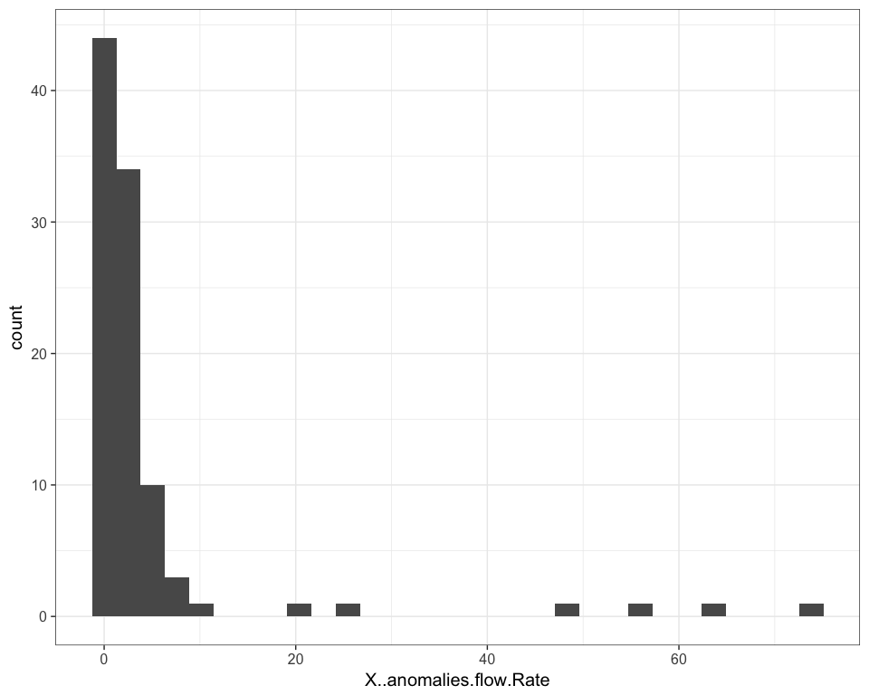
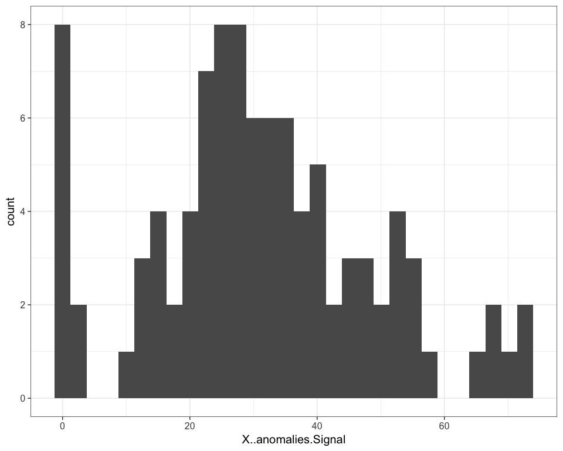
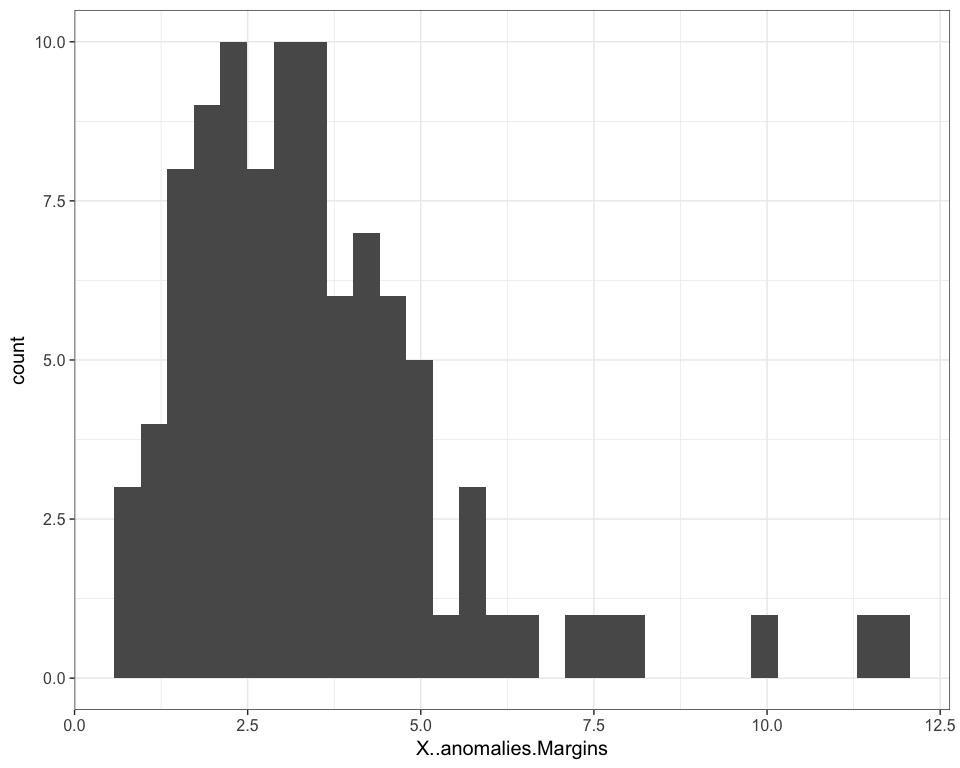

# FlowAIDists
JL  
3/30/2017  


## Plotting metrics from flowAI


```r
library(ggplot2)
theme_set(theme_bw(15))
library(knitr)
qcDir = "/Volumes/Beta/data/flow/fcs3Clean/QC"
reviewDir ="/Users/Kitty/git/auto-fcs/explore/openCyto/QC/qcReview"
collectResults <-
  list.files(qcDir,
             pattern = "mini.txt$",
             full = TRUE)
df = data.frame()
for (file in collectResults){
  tmp = read.delim(file,
stringsAsFactors = FALSE)
  
  df = rbind(df,tmp)
}

m <- ggplot( df , aes(x=X..anomalies.flow.Rate))
m + geom_histogram()
```

```
## `stat_bin()` using `bins = 30`. Pick better value with `binwidth`.
```

<!-- -->

```r
m <- ggplot( df , aes(x=X..anomalies.Signal))
m + geom_histogram()
```

```
## `stat_bin()` using `bins = 30`. Pick better value with `binwidth`.
```

<!-- -->

```r
m <- ggplot( df , aes(x=X..anomalies.Margins))
m + geom_histogram()
```

```
## `stat_bin()` using `bins = 30`. Pick better value with `binwidth`.
```

<!-- -->

```r
frCheck = df[which(df$X..anomalies.flow.Rate>20),]
kable(frCheck)
```

     Name.file                                       n..of.events   X..anomalies  analysis.from                X..anomalies.flow.Rate   X..anomalies.Signal   X..anomalies.Margins
---  ---------------------------------------------  -------------  -------------  --------------------------  -----------------------  --------------------  ---------------------
62   2016-07-08_PANEL 1_ZF_Group one_F1631269_003          876401          48.35  Flow Rate and Flow Margin                     47.23                 49.74                   2.03
66   2016-07-08_PANEL 1_ZF_Group one_F1632339_009          579479          23.80  Flow Rate and Flow Margin                     21.13                 58.07                   3.41
67   2016-07-08_PANEL 1_ZF_Group one_F1632342_002          311814          74.14  Flow Rate and Flow Margin                     73.81                 53.98                   1.27
74   2016-07-27_PANEL 1_ZF_Group one_F1631305_002          968033          57.17  Flow Rate and Flow Margin                     56.39                 68.03                   2.58
75   2016-07-27_PANEL 1_ZF_Group one_F1632384_007         1157243          64.86  Flow Rate and Flow Margin                     64.14                 41.24                   2.51
82   2016-07-29_PANEL 1_ZF_Group one_F1632280_001          455218          29.49  Flow Rate and Flow Margin                     26.22                 27.29                   4.24

```r
copy = paste(qcDir,"/",frCheck$Name.file,"_QC.html",sep = "")
file.copy(copy,reviewDir)
```

```
## [1] TRUE TRUE TRUE TRUE TRUE TRUE
```
