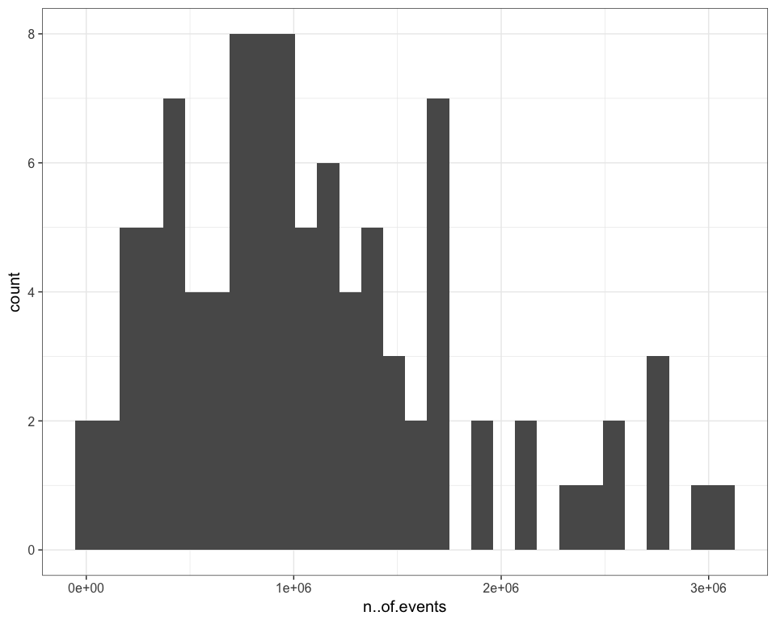

# FlowAIDists
JL  
3/30/2017  


## Plotting metrics from flowAI


```r
library(ggplot2)
theme_set(theme_bw(15))
library(knitr)
qcDir = "/Volumes/Beta/data/flow/fcs3Clean/QC"
reviewDir ="/Users/Kitty/git/auto-fcs/explore/openCyto/QC/qcReview"
collectResults <-
  list.files(qcDir,
             pattern = "mini.txt$",
             full = TRUE)
df = data.frame()
for (file in collectResults){
  tmp = read.delim(file,
stringsAsFactors = FALSE)
  
  df = rbind(df,tmp)
}

m <- ggplot( df , aes(x=X..anomalies.flow.Rate))
m + geom_histogram()
```

```
## `stat_bin()` using `bins = 30`. Pick better value with `binwidth`.
```

<!-- -->

```r
m <- ggplot( df , aes(x=X..anomalies.Signal))
m + geom_histogram()
```

```
## `stat_bin()` using `bins = 30`. Pick better value with `binwidth`.
```

<!-- -->

```r
m <- ggplot( df , aes(x=X..anomalies.Margins))
m + geom_histogram()
```

```
## `stat_bin()` using `bins = 30`. Pick better value with `binwidth`.
```

<!-- -->

```r
m <- ggplot( df , aes(x=n..of.events))
m + geom_histogram()
```

```
## `stat_bin()` using `bins = 30`. Pick better value with `binwidth`.
```

<!-- -->

```r
frCheck = df[which(df$X..anomalies.flow.Rate>20),]
kable(frCheck,format = "markdown")
```


|   |Name.file                                    | n..of.events| X..anomalies|analysis.from             | X..anomalies.flow.Rate| X..anomalies.Signal| X..anomalies.Margins|
|:--|:--------------------------------------------|------------:|------------:|:-------------------------|----------------------:|-------------------:|--------------------:|
|62 |2016-07-08_PANEL 1_ZF_Group one_F1631269_003 |       876401|        48.35|Flow Rate and Flow Margin |                  47.23|               49.74|                 2.03|
|66 |2016-07-08_PANEL 1_ZF_Group one_F1632339_009 |       579479|        23.80|Flow Rate and Flow Margin |                  21.13|               58.07|                 3.41|
|67 |2016-07-08_PANEL 1_ZF_Group one_F1632342_002 |       311814|        74.14|Flow Rate and Flow Margin |                  73.81|               53.98|                 1.27|
|74 |2016-07-27_PANEL 1_ZF_Group one_F1631305_002 |       968033|        57.17|Flow Rate and Flow Margin |                  56.39|               68.03|                 2.58|
|75 |2016-07-27_PANEL 1_ZF_Group one_F1632384_007 |      1157243|        64.86|Flow Rate and Flow Margin |                  64.14|               41.24|                 2.51|
|82 |2016-07-29_PANEL 1_ZF_Group one_F1632280_001 |       455218|        29.49|Flow Rate and Flow Margin |                  26.22|               27.29|                 4.24|

```r
copy = paste(qcDir,"/",frCheck$Name.file,"_QC.html",sep = "")
file.copy(copy,reviewDir)
```

```
## [1] FALSE FALSE FALSE FALSE FALSE FALSE
```

```r
frCheck = df[which(df$X..anomalies.Margins>6),]
kable(frCheck,format = "markdown")
```


|   |Name.file                                     | n..of.events| X..anomalies|analysis.from             | X..anomalies.flow.Rate| X..anomalies.Signal| X..anomalies.Margins|
|:--|:---------------------------------------------|------------:|------------:|:-------------------------|----------------------:|-------------------:|--------------------:|
|10 |2016-05-13_PANEL 1_ZF_panel one_F1632233_004  |       464848|         8.19|Flow Rate and Flow Margin |                   0.22|               68.48|                 7.98|
|17 |2016-05-20_PANEL 1_ZF_panel one_F1631992_004  |       746895|         7.70|Flow Rate and Flow Margin |                   1.13|               33.06|                 6.64|
|20 |2016-05-20_PANEL 1_ZF_panel one_F1632212_008  |         3628|        16.23|Flow Rate and Flow Margin |                   4.99|                0.00|                11.91|
|21 |2016-05-20_PANEL 1_ZF_panel one_F1632217_007  |       463488|         8.38|Flow Rate and Flow Margin |                   0.68|               40.34|                 7.75|
|33 |2016-05-26_PANEL 1_ZF_panel one_F1636727_020  |        54778|        12.14|Flow Rate and Flow Margin |                   3.30|               16.02|                11.63|
|83 |2016-07-29_PANEL 1_ZF_Group one_F1636783_009  |       197586|        13.59|Flow Rate and Flow Margin |                   4.77|               36.48|                 9.84|
|91 |2016-08-01_PANEL 1_DHS_Group one_F1630927_008 |       604877|        14.92|Flow Rate and Flow Margin |                  10.42|               24.70|                 6.32|
|98 |2016-08-01_PANEL 1_DHS_Group two_F1636830_032 |       459051|         8.01|Flow Rate and Flow Margin |                   0.78|               25.61|                 7.28|

```r
copy = paste(qcDir,"/",frCheck$Name.file,"_QC.html",sep = "")
file.copy(copy,reviewDir)
```

```
## [1] FALSE FALSE FALSE FALSE FALSE FALSE FALSE FALSE
```
