# openCyto
JL  
2/16/2017  

# Notes:

- Testing [openCyto automatic gating](http://journals.plos.org/ploscompbiol/article?id=10.1371/journal.pcbi.1003806)

- Loosely basing gate strategies off [existing templates](https://www.ncbi.nlm.nih.gov/pmc/articles/PMC4748244/)

- Pick your favorite gate strategy for each step in the hierarchy 

- Seems to  mimic manual gating, and results in labelled populations (as opposed to unlabled, like in PhenoGraph)


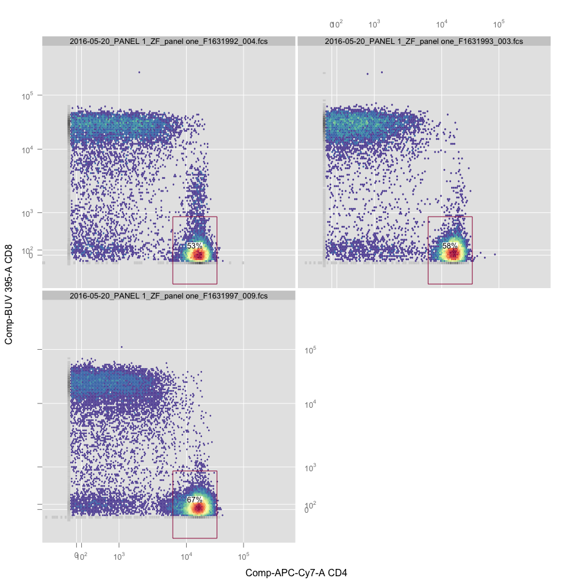<!-- -->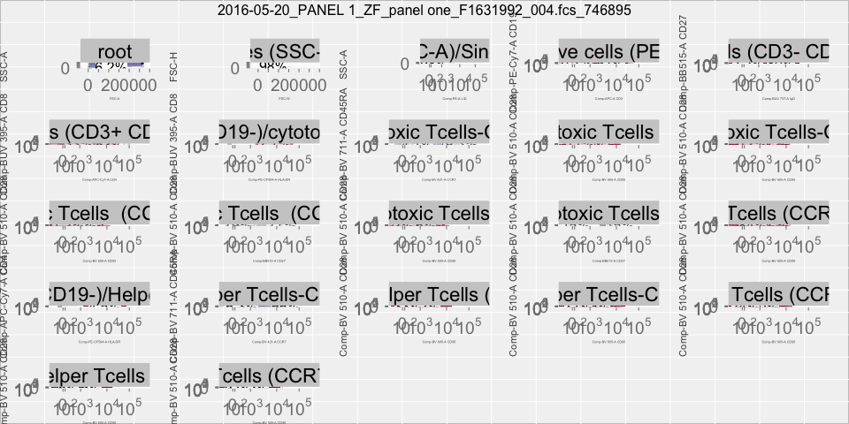<!-- -->

<!-- -->

```
## Registered flowDensity
```

```
## ...
```

```
## done
```

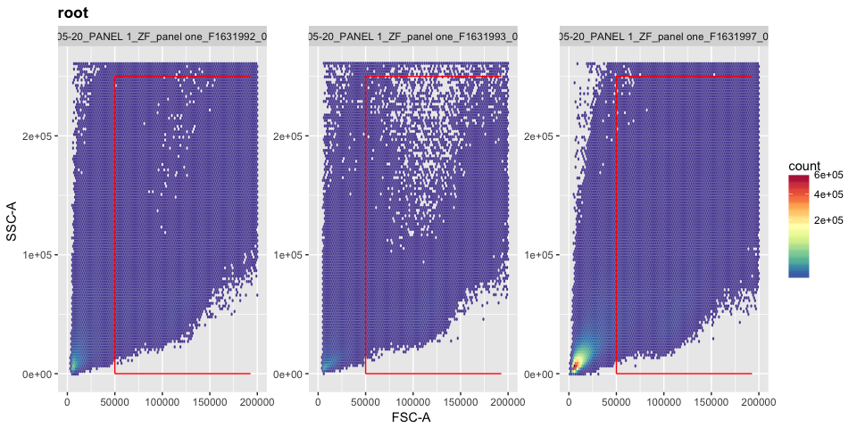<!-- -->

```
## ...
## done
```

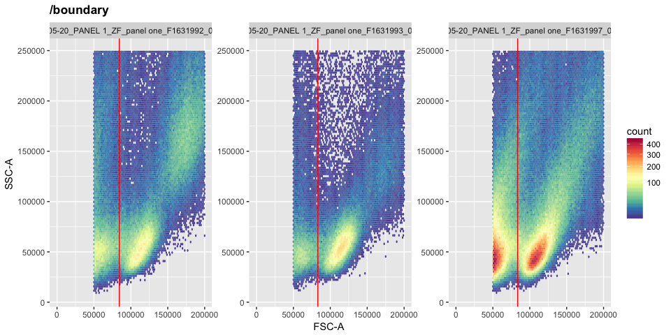<!-- -->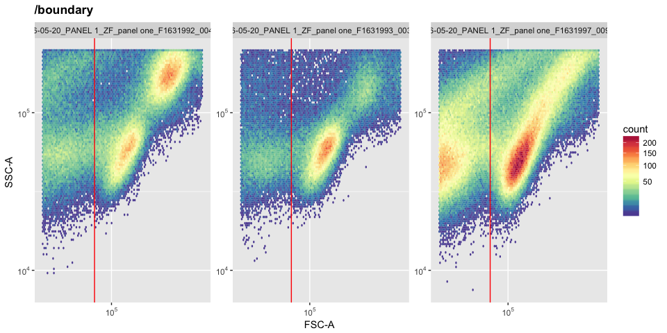<!-- -->

```
## ...
## done
```

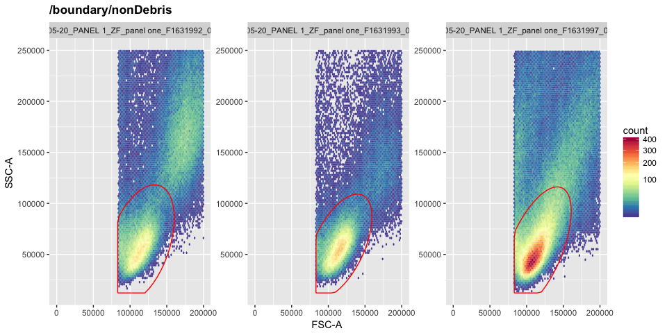<!-- --><!-- -->

```
## ...
## done
```

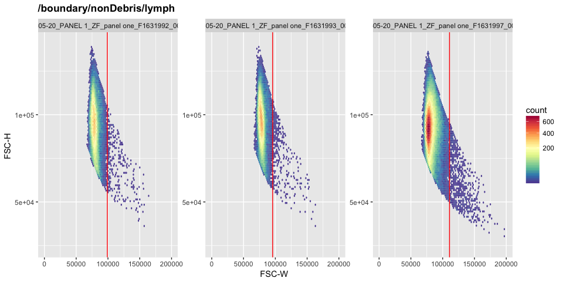<!-- --><!-- -->

```
## ...
## done
```

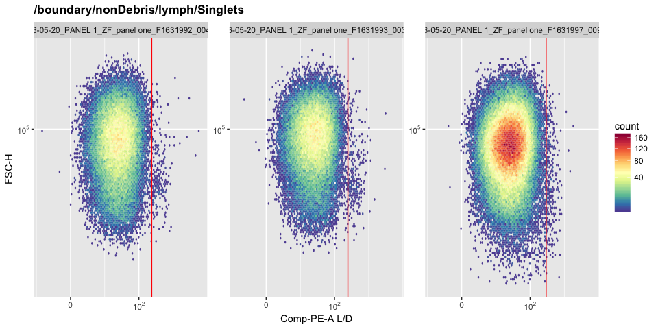<!-- -->

```
## ...
## done
```

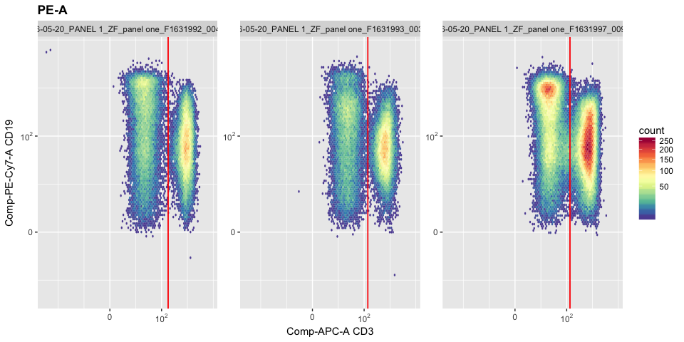<!-- -->

```
## ...
## done
```

```
## ...
```

```
## done
```

```
## ...
```

```
## done
```

```
## ...
```

```
## done
```

```
## ...
```

```
## done
```

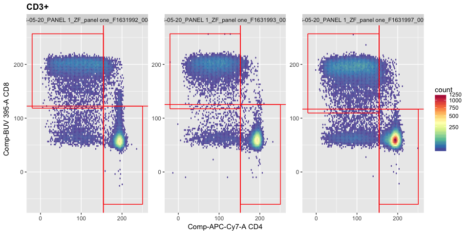<!-- -->

```
## ...
## done
```

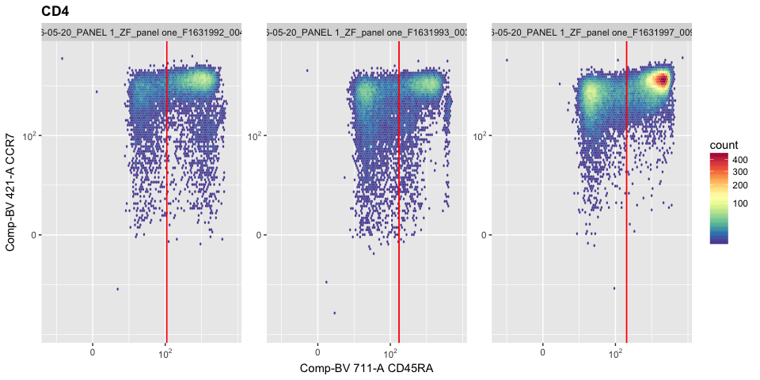<!-- -->

```
## ...
## done
```

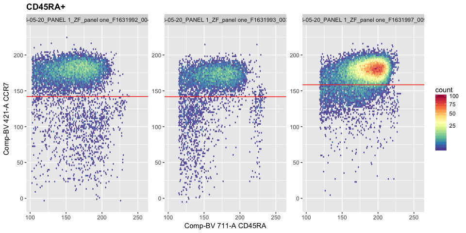<!-- -->

```
## ...
## done
```

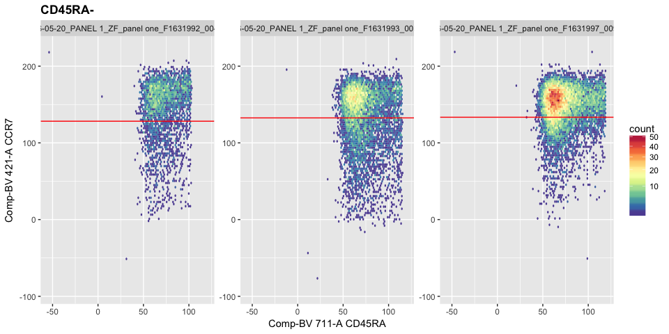<!-- -->

```
## ...
## done
```

```
## ...
```

```
## done
```

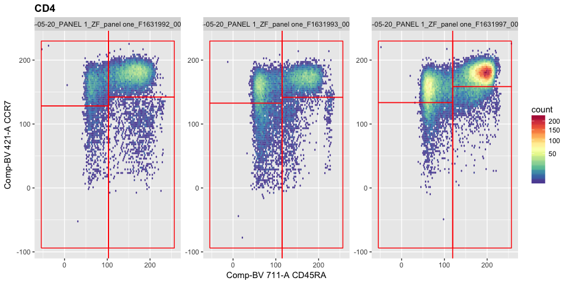<!-- --><!-- -->

