# plotPropCount
JL  
4/3/2017  


```r
library(knitr)
library(ggplot2)
theme_set(theme_bw(15))
map = read.delim("/Users/Kitty/git/auto-fcs/explore/openCyto/autoManMap.txt",stringsAsFactors = FALSE,sep = "\t") 
metrics =read.delim("/Volumes/Beta/data/flow/testTypesTestMetrics5.txt",stringsAsFactors = FALSE,sep = "\t") 
metrics$nameOrig = metrics$name
metrics$name =gsub(".fcs.*","",metrics$name ,fixed = FALSE)
metrics$name =gsub(" ","",metrics$name ,fixed = TRUE)

metricsMan = metrics[which(metrics$GATE=="MANUAL"&metrics$Population %in% map$Manual&metrics$METRIC=="count"),]
metricsAuto = metrics[which(metrics$GATE=="AUTOMATIC"&metrics$QC=="FALSE"&metrics$Population %in% map$Auto&metrics$METRIC=="count"),]

metricsMan = merge(metricsMan,map,by.x = "Population",by.y = "Manual")
metricsMan$Population =metricsMan$Auto
metricsMan$Merge=paste(metricsMan$Population,metricsMan$name,sep = "_")
metricsAuto = merge(metricsAuto,map,by.x = "Population",by.y = "Auto")
metricsAuto$Merge=paste(metricsAuto$Population,metricsAuto$name,sep = "_")
metricCombo = merge(metricsAuto,metricsMan,by.x = "Merge",by.y = "Merge")

p = ggplot(metricCombo,aes(x=Count.x,y=Count.y, color=Population.x)) +geom_point()+xlab("Autogating population count")+ylab("Manual gating population count")+geom_abline(intercept = 0, slope = 1) 
p 
```

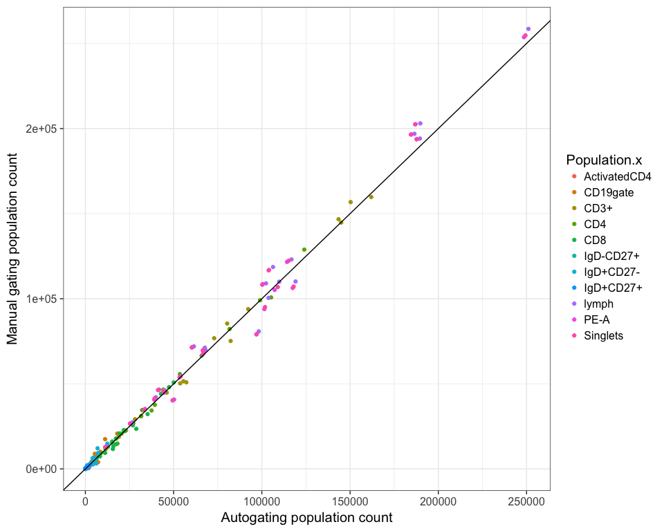<!-- -->

```r
p+facet_wrap(~Population.x)
```

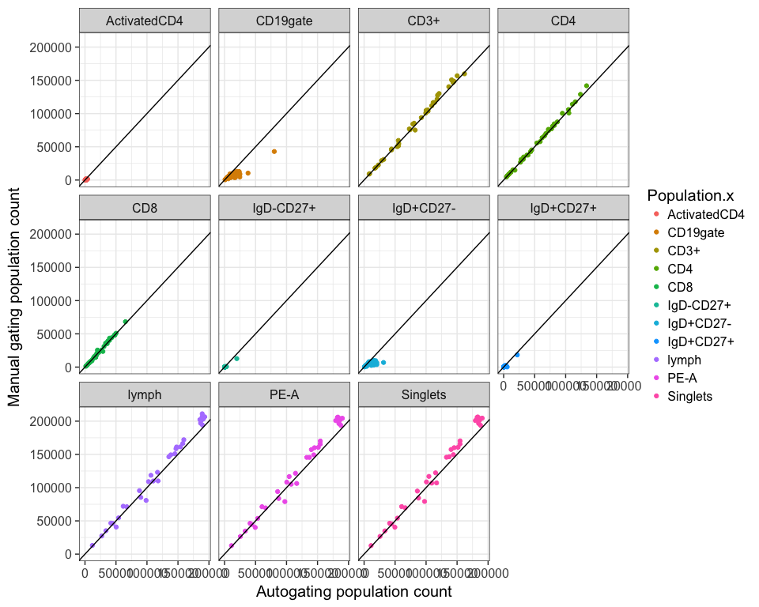<!-- -->

```r
for(pop in unique(map$Auto)) {
  sub = metricCombo[which(metricCombo$Population.x == pop), ]
  t =cor.test(sub$Count.x,sub$Count.y)
  ts =cor.test(sub$Count.x,sub$Count.y,method = "spearman")

  p = ggplot(sub, aes(x =
  Count.x, y = Count.y, color = Population.x)) + geom_point() + xlab("Autogating population count") +
  ylab("Manual gating population count") + geom_abline(intercept = 0, slope = 1)+ labs(title = paste(pop,"- pearson r =",signif(t$estimate,4),"- spearman r =",signif(ts$estimate,4)))
  print(p)
}
```

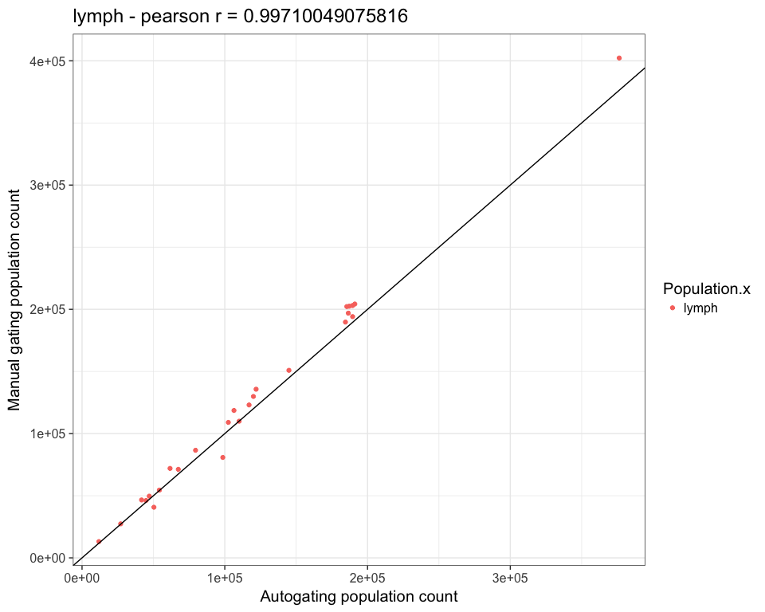<!-- -->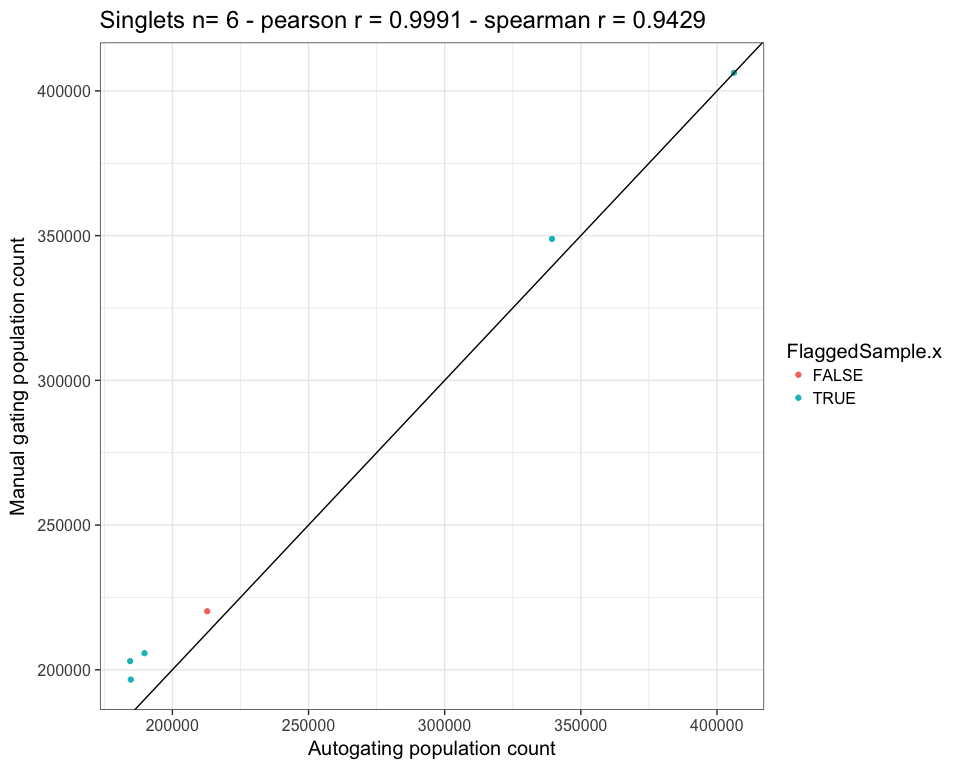<!-- -->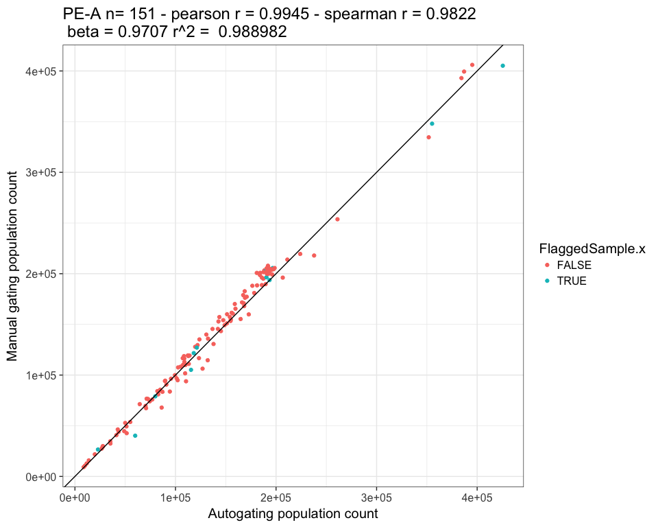<!-- -->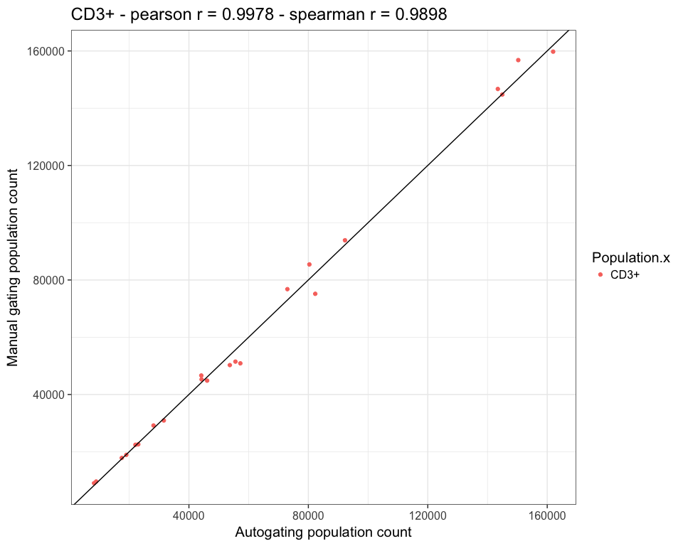<!-- -->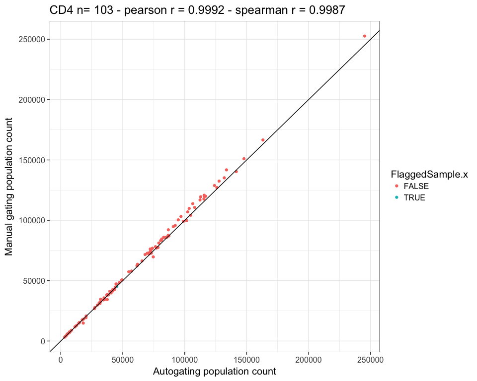<!-- -->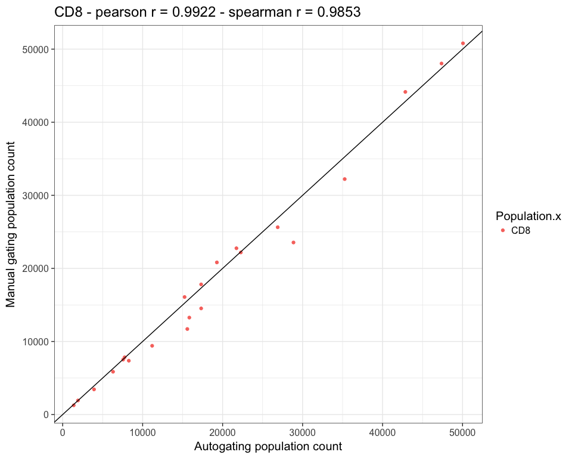<!-- -->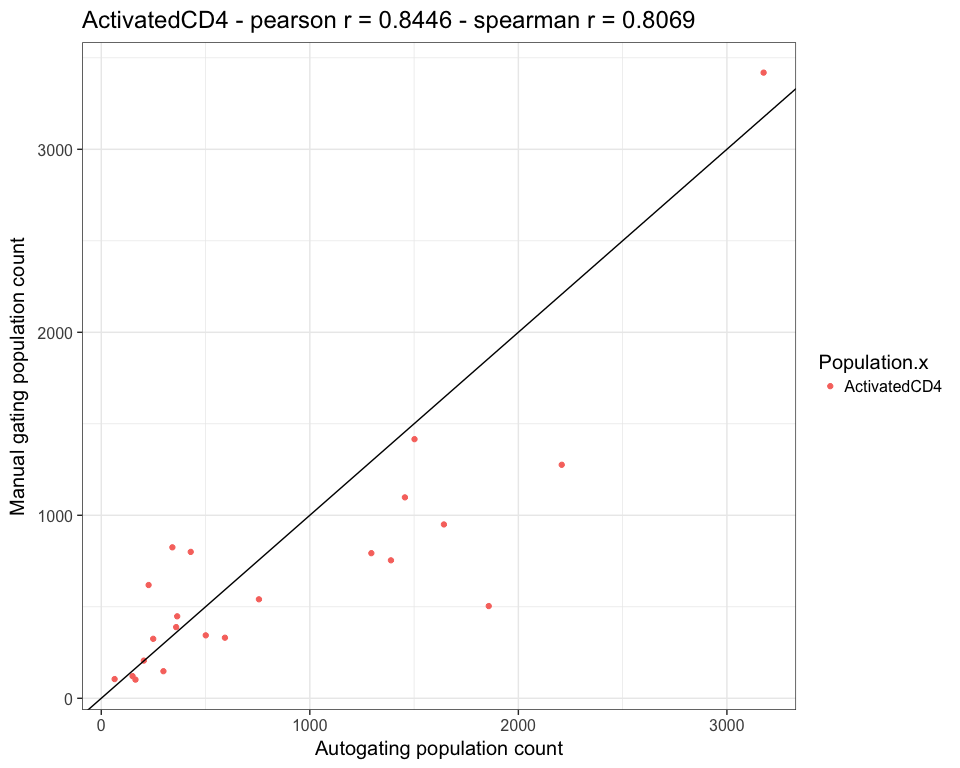<!-- -->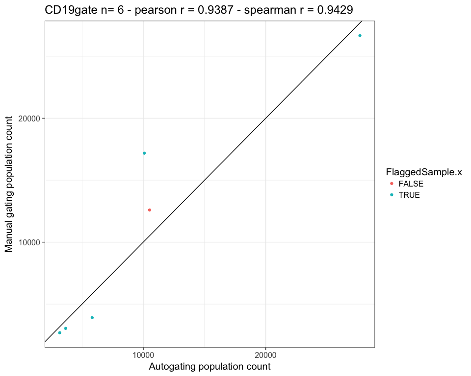<!-- -->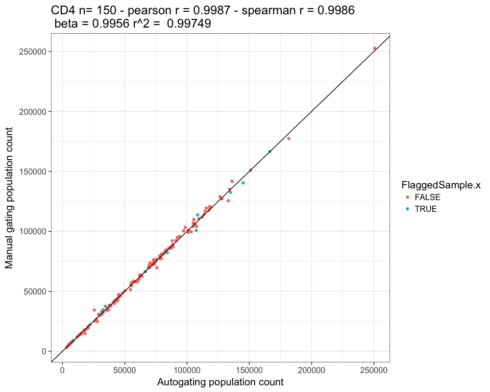<!-- -->

```
## Warning in cor.test.default(sub$Count.x, sub$Count.y, method = "spearman"):
## Cannot compute exact p-value with ties
```

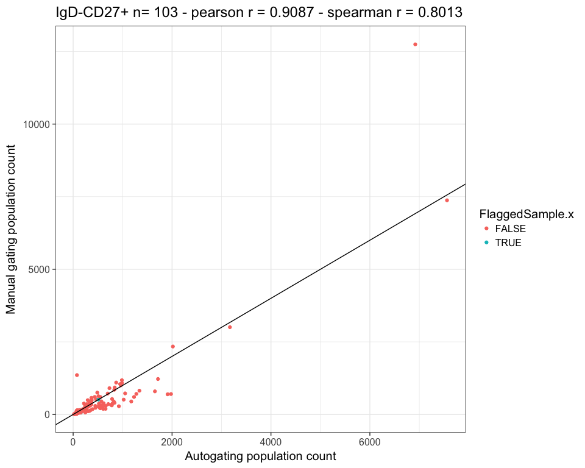<!-- -->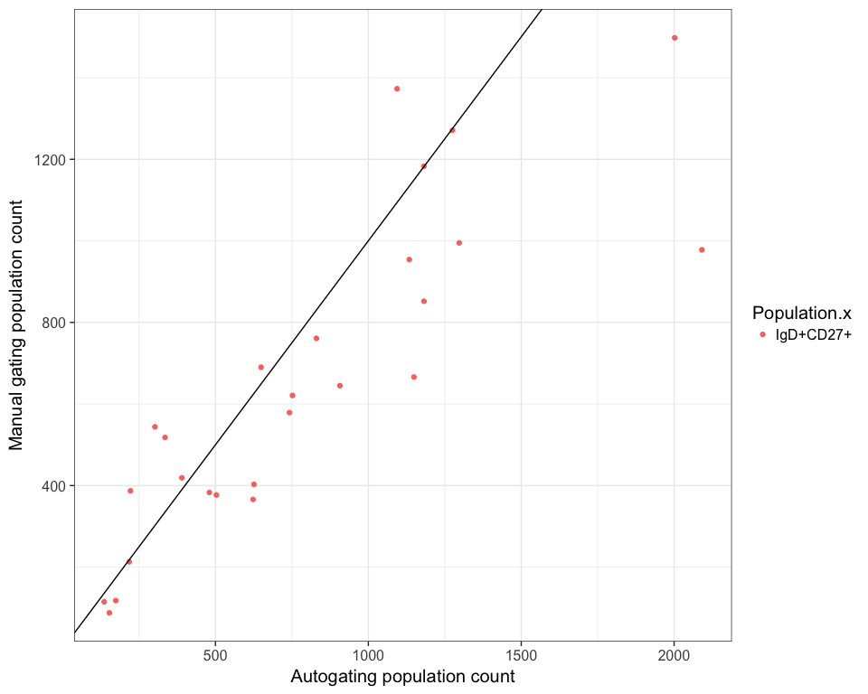<!-- -->

```r
 cor.test(metricCombo$Count.x,metricCombo$Count.y,method = "spearman")
```

```
## Warning in cor.test.default(metricCombo$Count.x, metricCombo$Count.y,
## method = "spearman"): Cannot compute exact p-value with ties
```

```
## 
## 	Spearman's rank correlation rho
## 
## data:  metricCombo$Count.x and metricCombo$Count.y
## S = 13572, p-value < 2.2e-16
## alternative hypothesis: true rho is not equal to 0
## sample estimates:
##       rho 
## 0.9942541
```

```r
# kable(metricCombo[,c("Merge","Count.x","Count.y")])
```

