# Replicate Concordance
JL  
7/12/2017  

TODO 

- manual
- automatic
  - with/without QC
  
1. CV of reps
2. ICC
3. min diff
4. max diff
  


|Var1 | Freq|
|:----|----:|
|A    |   21|
|B    |   11|
|C    |   17|
|D    |   13|
|E    |   16|
|F    |   24|
|G    |   19|
|H    |   16|


Total number of Control fcs files (currently) = 137

Total number of Control groups (currently) = 8

<!-- --><!-- -->

Percent of parent CV summary


|GROUP | GROUP_MEDIAN_CV| GROUP_MAD_CV|
|:-----|---------------:|------------:|
|A     |        12.26435|     11.09480|
|B     |        13.33148|     11.76286|
|C     |        12.99054|     10.14676|
|D     |        22.46977|     12.80152|
|E     |        25.53363|     17.64769|
|F     |        20.54376|     19.90676|
|G     |        14.00589|     14.03718|
|H     |        14.57943|     15.49101|


Percent of lymph CV summary


|GROUP | GROUP_MEDIAN_CV| GROUP_MAD_CV|
|:-----|---------------:|------------:|
|A     |        13.57145|    11.930342|
|B     |        15.71823|    10.150433|
|C     |        13.93569|     8.233016|
|D     |        32.07279|     5.371330|
|E     |        28.17266|    22.784927|
|F     |        27.92368|    25.316248|
|G     |        16.22147|    12.757021|
|H     |        32.46109|    14.221776|

```
## Warning: Removed 13 rows containing non-finite values (stat_boxplot).
```

<!-- -->

```
## Warning: Removed 13 rows containing non-finite values (stat_boxplot).
```

<!-- -->

```
## Warning: Removed 16 rows containing non-finite values (stat_boxplot).
```

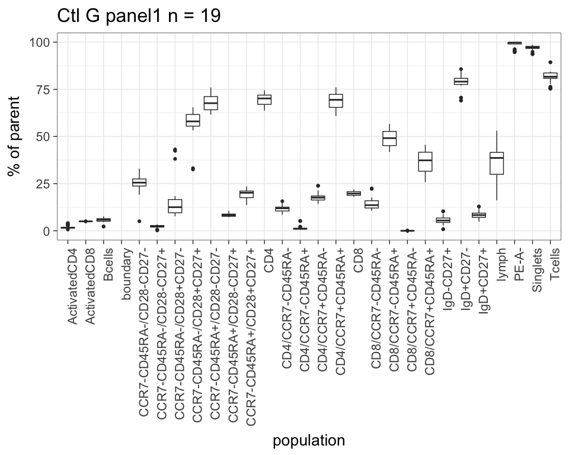<!-- -->

```
## Warning: Removed 16 rows containing non-finite values (stat_boxplot).
```

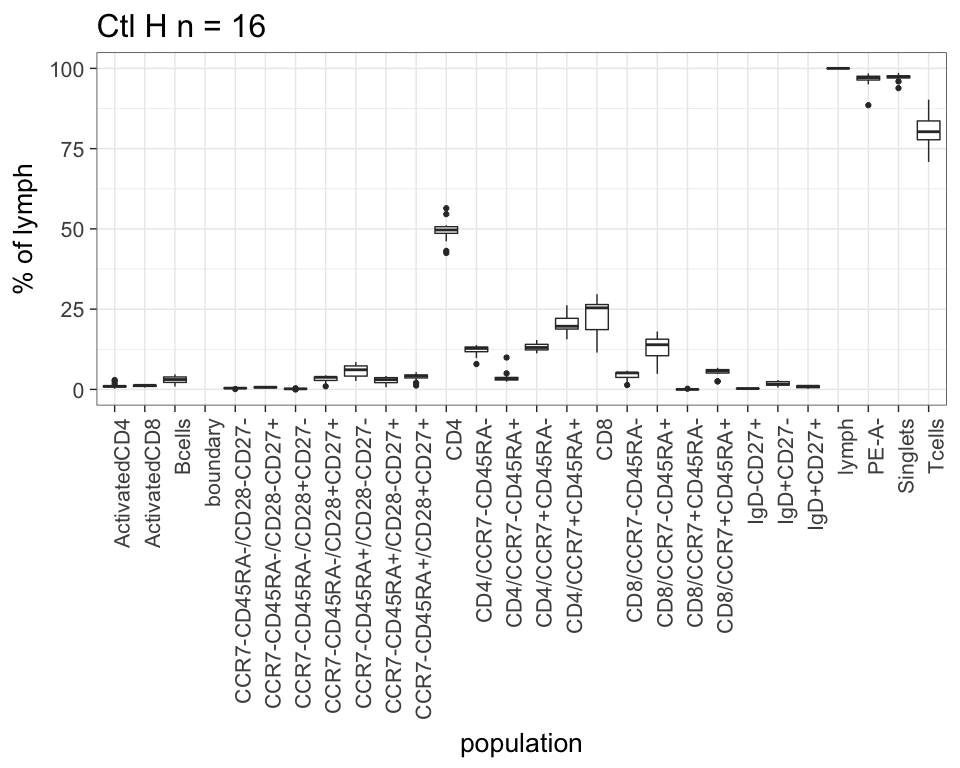<!-- -->

```
## Warning: Removed 16 rows containing non-finite values (stat_boxplot).
```

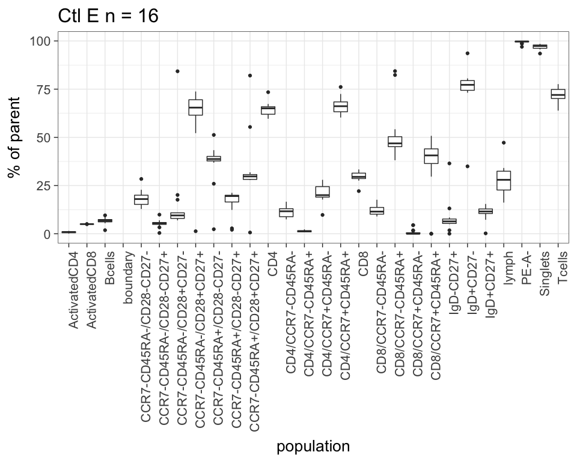<!-- -->

```
## Warning: Removed 16 rows containing non-finite values (stat_boxplot).
```

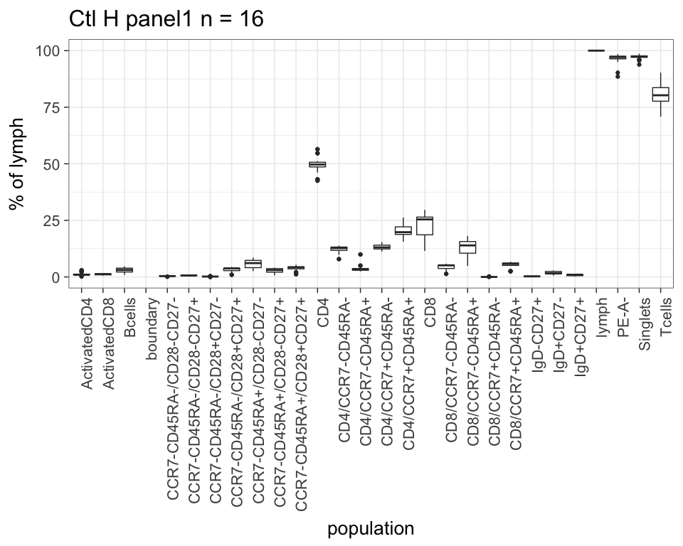<!-- -->

```
## Warning: Removed 21 rows containing non-finite values (stat_boxplot).
```

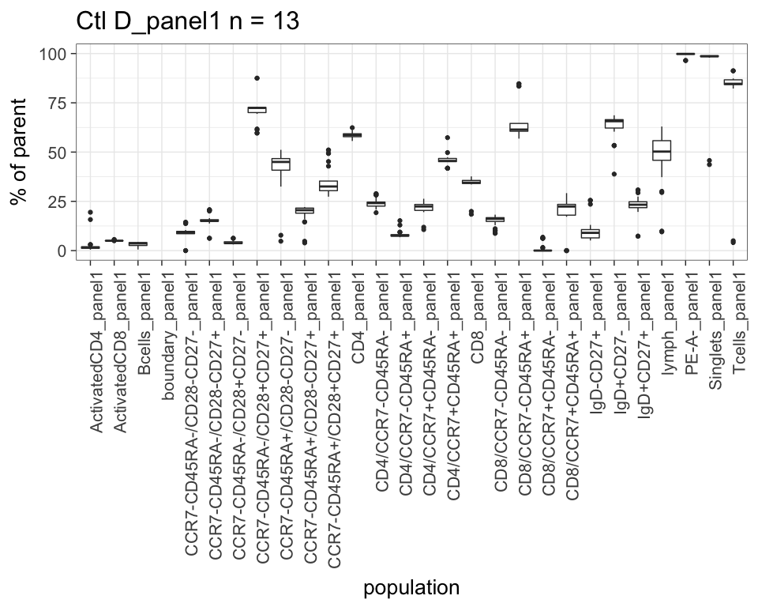<!-- -->

```
## Warning: Removed 21 rows containing non-finite values (stat_boxplot).
```

<!-- -->

```
## Warning: Removed 19 rows containing non-finite values (stat_boxplot).
```

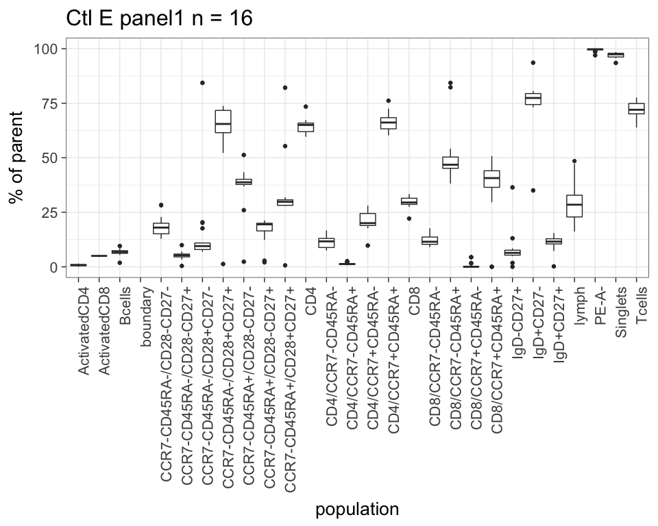<!-- -->

```
## Warning: Removed 19 rows containing non-finite values (stat_boxplot).
```

<!-- -->

```
## Warning: Removed 17 rows containing non-finite values (stat_boxplot).
```

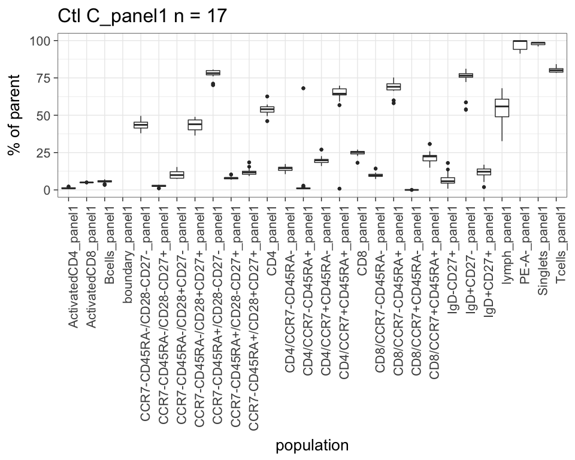<!-- -->

```
## Warning: Removed 17 rows containing non-finite values (stat_boxplot).
```

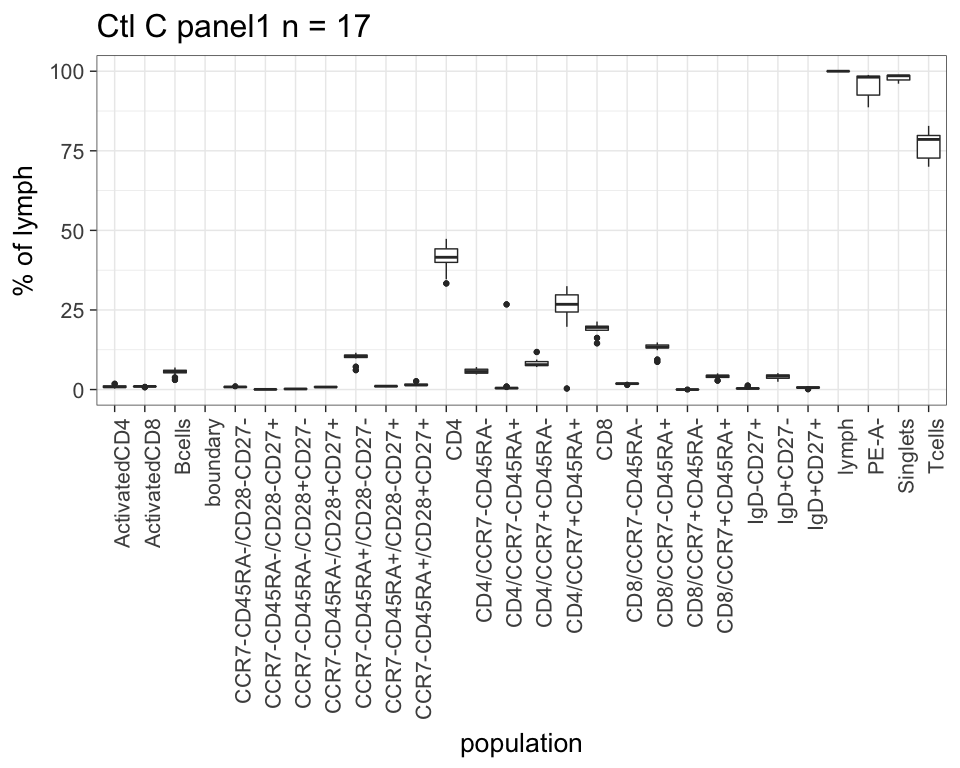<!-- -->

```
## Warning: Removed 11 rows containing non-finite values (stat_boxplot).
```

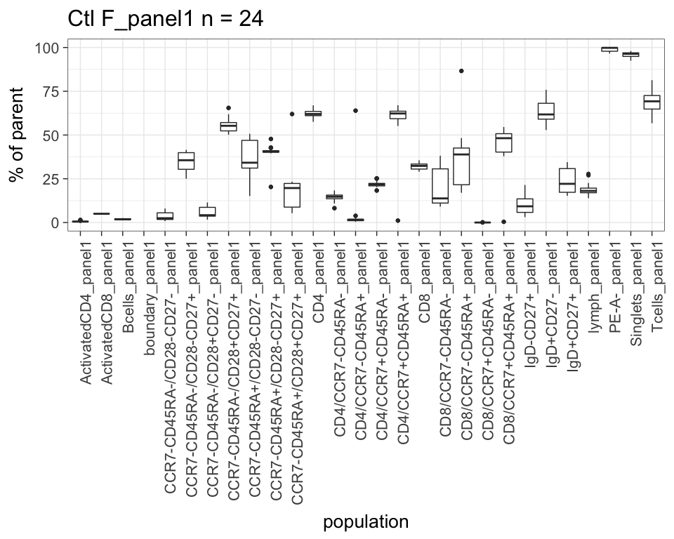<!-- -->

```
## Warning: Removed 11 rows containing non-finite values (stat_boxplot).
```

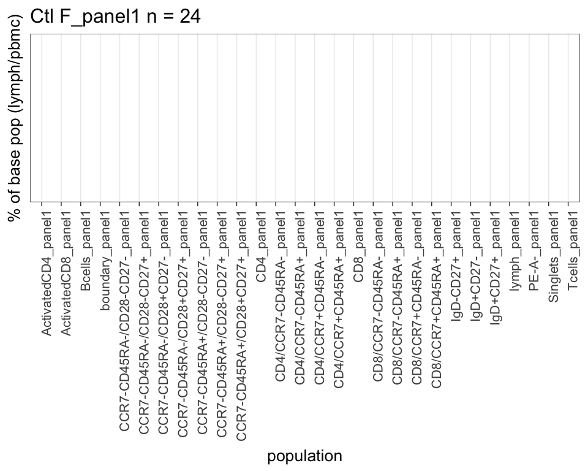<!-- -->

```
## Warning: Removed 24 rows containing non-finite values (stat_boxplot).
```

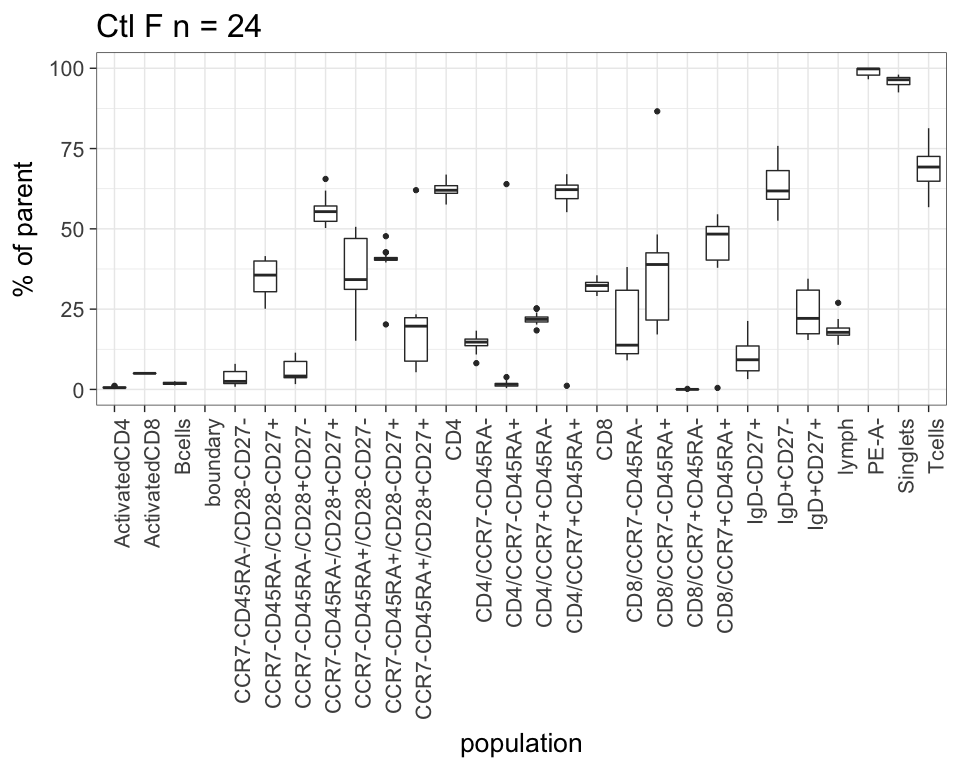<!-- -->

```
## Warning: Removed 24 rows containing non-finite values (stat_boxplot).
```

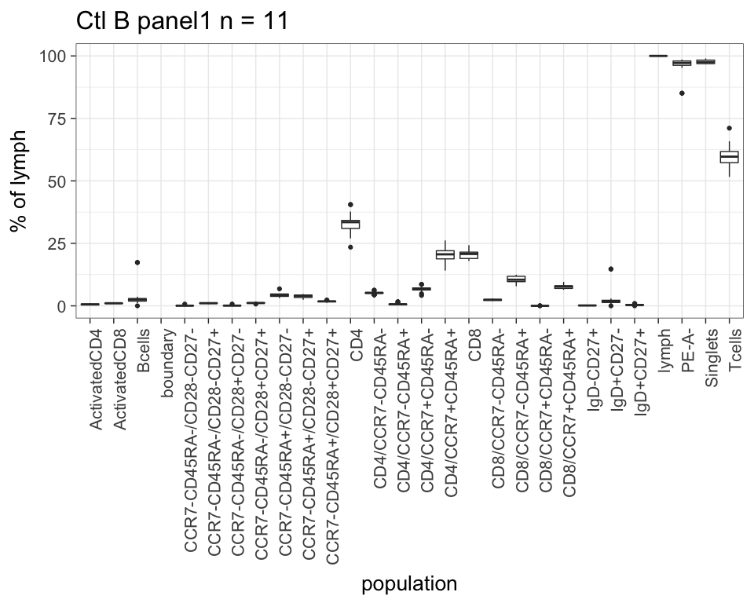<!-- -->
