# Replicate Concordance
JL  
7/12/2017  

TODO 

- manual
- automatic
  - with/without QC
  
1. CV of reps
2. ICC
3. min diff
4. max diff
  

|REPLICATE         | NUMBER_FCS_FILES|
|:-----------------|----------------:|
|A_panel1_QC_FALSE |               21|
|A_panel1_QC_TRUE  |               21|
|A_panel2_QC_FALSE |               15|
|A_panel2_QC_TRUE  |               15|
|B_panel1_QC_FALSE |               11|
|B_panel1_QC_TRUE  |               11|
|B_panel2_QC_FALSE |                6|
|B_panel2_QC_TRUE  |                6|
|C_panel1_QC_FALSE |               17|
|C_panel1_QC_TRUE  |               17|
|C_panel2_QC_FALSE |               10|
|C_panel2_QC_TRUE  |               10|
|D_panel1_QC_FALSE |               13|
|D_panel1_QC_TRUE  |               13|
|D_panel2_QC_FALSE |                7|
|D_panel2_QC_TRUE  |                7|
|E_panel1_QC_FALSE |               16|
|E_panel1_QC_TRUE  |               16|
|E_panel2_QC_FALSE |               11|
|E_panel2_QC_TRUE  |               11|
|F_panel1_QC_FALSE |               24|
|F_panel1_QC_TRUE  |               24|
|F_panel2_QC_FALSE |               17|
|F_panel2_QC_TRUE  |               17|
|G_panel1_QC_FALSE |               19|
|G_panel1_QC_TRUE  |               19|
|G_panel2_QC_FALSE |               12|
|G_panel2_QC_TRUE  |               12|
|H_panel1_QC_FALSE |               16|
|H_panel1_QC_TRUE  |               16|
|H_panel2_QC_FALSE |               13|
|H_panel2_QC_TRUE  |               13|

Prop of  files with lymph counts > 50K  = 0.9709101
Prop of  files with lymph counts < 50K  = 0.0290899

Total number of Control fcs files (currently) = 228

Total number of Control groups (currently) = 32

<!-- --><!-- -->

Percent of parent CV summary

<!-- -->

|GROUP             | GROUP_MEDIAN_CV| GROUP_MAD_CV|
|:-----------------|---------------:|------------:|
|A_panel1_QC_FALSE |       12.272625|    11.107100|
|A_panel1_QC_TRUE  |       12.436942|    11.325725|
|A_panel2_QC_FALSE |       28.538720|    32.665617|
|A_panel2_QC_TRUE  |       18.864053|    20.993672|
|B_panel1_QC_FALSE |       13.331114|    11.763628|
|B_panel1_QC_TRUE  |        9.701616|     7.589086|
|B_panel2_QC_FALSE |       20.462495|    12.525710|
|B_panel2_QC_TRUE  |       20.825569|    17.852932|
|C_panel1_QC_FALSE |       13.000531|    10.160992|
|C_panel1_QC_TRUE  |       13.047864|    10.229029|
|C_panel2_QC_FALSE |       13.066676|     8.490787|
|C_panel2_QC_TRUE  |       11.408774|     7.949658|
|D_panel1_QC_FALSE |       22.467768|    12.798744|
|D_panel1_QC_TRUE  |       22.251881|    13.631918|
|D_panel2_QC_FALSE |       24.106595|    22.723597|
|D_panel2_QC_TRUE  |       22.456713|    24.929498|
|E_panel1_QC_FALSE |       25.533634|    17.647690|
|E_panel1_QC_TRUE  |       25.543367|    18.212987|
|E_panel2_QC_FALSE |       13.685761|    15.974898|
|E_panel2_QC_TRUE  |       14.190213|    14.782765|
|F_panel1_QC_FALSE |       20.543881|    19.909704|
|F_panel1_QC_TRUE  |       20.695217|    22.166562|
|F_panel2_QC_FALSE |       18.362233|    20.396598|
|F_panel2_QC_TRUE  |       14.688611|    16.206750|
|G_panel1_QC_FALSE |       14.005662|    14.037513|
|G_panel1_QC_TRUE  |       13.789122|    12.771582|
|G_panel2_QC_FALSE |       19.133298|    17.710588|
|G_panel2_QC_TRUE  |       17.992290|    22.402413|
|H_panel1_QC_FALSE |       14.579431|    15.491014|
|H_panel1_QC_TRUE  |       14.494121|    15.508870|
|H_panel2_QC_FALSE |       29.211024|    35.232166|
|H_panel2_QC_TRUE  |       26.626490|    31.497145|

Percent of base population (lymph/PBMC) CV summary

|GROUP             | GROUP_MEDIAN_CV| GROUP_MAD_CV|
|:-----------------|---------------:|------------:|
|A_panel1_QC_FALSE |        13.57277|    11.934829|
|A_panel1_QC_TRUE  |        13.31459|    12.239107|
|A_panel2_QC_FALSE |        46.57730|    57.204416|
|A_panel2_QC_TRUE  |        44.31405|    56.224622|
|B_panel1_QC_FALSE |        15.71970|    10.153693|
|B_panel1_QC_TRUE  |        14.40379|    10.024843|
|B_panel2_QC_FALSE |        26.31572|    35.680507|
|B_panel2_QC_TRUE  |        40.12923|    47.780114|
|C_panel1_QC_FALSE |        13.93732|     8.238980|
|C_panel1_QC_TRUE  |        13.88289|     8.225841|
|C_panel2_QC_FALSE |        33.96949|    34.041385|
|C_panel2_QC_TRUE  |        20.69576|    26.506678|
|D_panel1_QC_FALSE |        32.07195|     5.371037|
|D_panel1_QC_TRUE  |        32.39314|     4.717194|
|D_panel2_QC_FALSE |        38.63686|    49.272540|
|D_panel2_QC_TRUE  |        38.79263|    49.441531|
|E_panel1_QC_FALSE |        28.17266|    22.784927|
|E_panel1_QC_TRUE  |        28.13049|    22.737928|
|E_panel2_QC_FALSE |        27.75145|    37.136524|
|E_panel2_QC_TRUE  |        30.82295|    32.735358|
|F_panel1_QC_FALSE |        27.92320|    25.322427|
|F_panel1_QC_TRUE  |        28.03086|    25.306427|
|F_panel2_QC_FALSE |        21.38813|    26.820678|
|F_panel2_QC_TRUE  |        22.32373|    24.866998|
|G_panel1_QC_FALSE |        16.22027|    12.756416|
|G_panel1_QC_TRUE  |        15.84141|    12.125204|
|G_panel2_QC_FALSE |        35.58814|    28.654717|
|G_panel2_QC_TRUE  |        34.54508|    46.149196|
|H_panel1_QC_FALSE |        32.46109|    14.221776|
|H_panel1_QC_TRUE  |        32.23588|    14.591901|
|H_panel2_QC_FALSE |        72.18926|    86.660400|
|H_panel2_QC_TRUE  |        73.23556|   102.525342|

<!-- --><!-- --><!-- --><!-- --><!-- --><!-- --><!-- --><!-- --><!-- --><!-- --><!-- --><!-- --><!-- --><!-- --><!-- --><!-- --><!-- --><!-- --><!-- --><!-- --><!-- --><!-- --><!-- --><!-- --><!-- --><!-- --><!-- --><!-- --><!-- --><!-- --><!-- --><!-- --><!-- --><!-- -->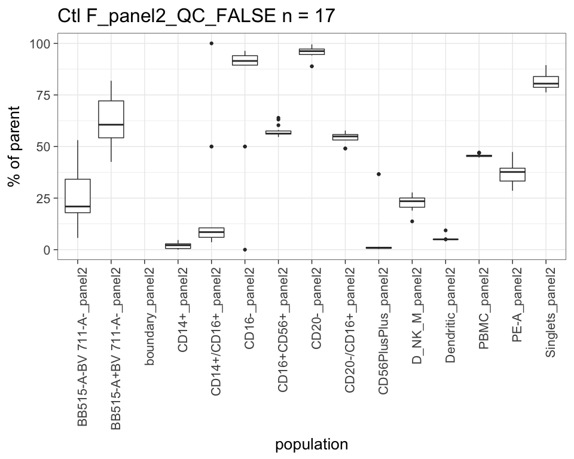<!-- --><!-- --><!-- --><!-- --><!-- --><!-- --><!-- -->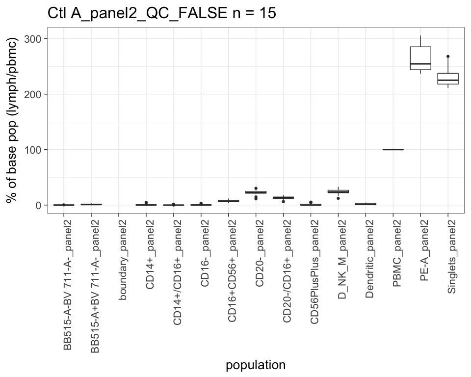<!-- --><!-- --><!-- --><!-- -->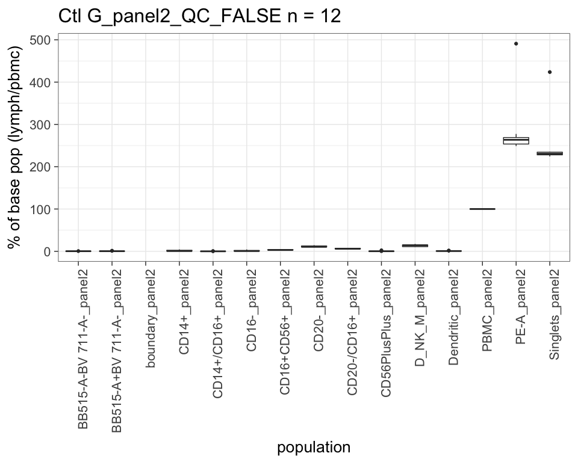<!-- --><!-- --><!-- --><!-- -->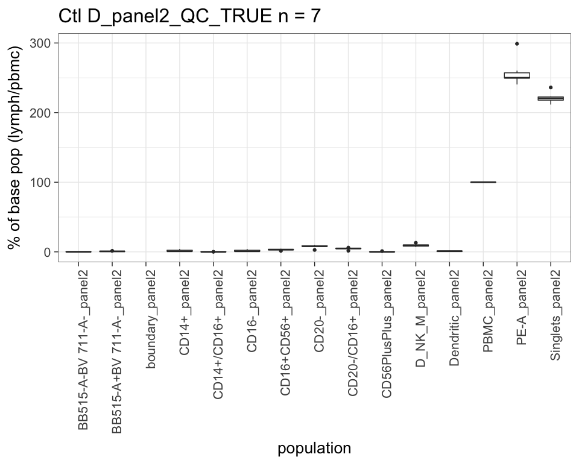<!-- --><!-- --><!-- --><!-- --><!-- --><!-- -->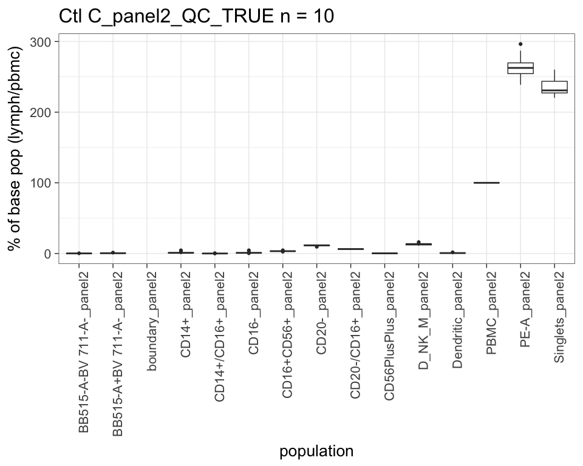<!-- --><!-- --><!-- --><!-- --><!-- --><!-- --><!-- --><!-- --><!-- -->

# Replicate data clustering

<!-- -->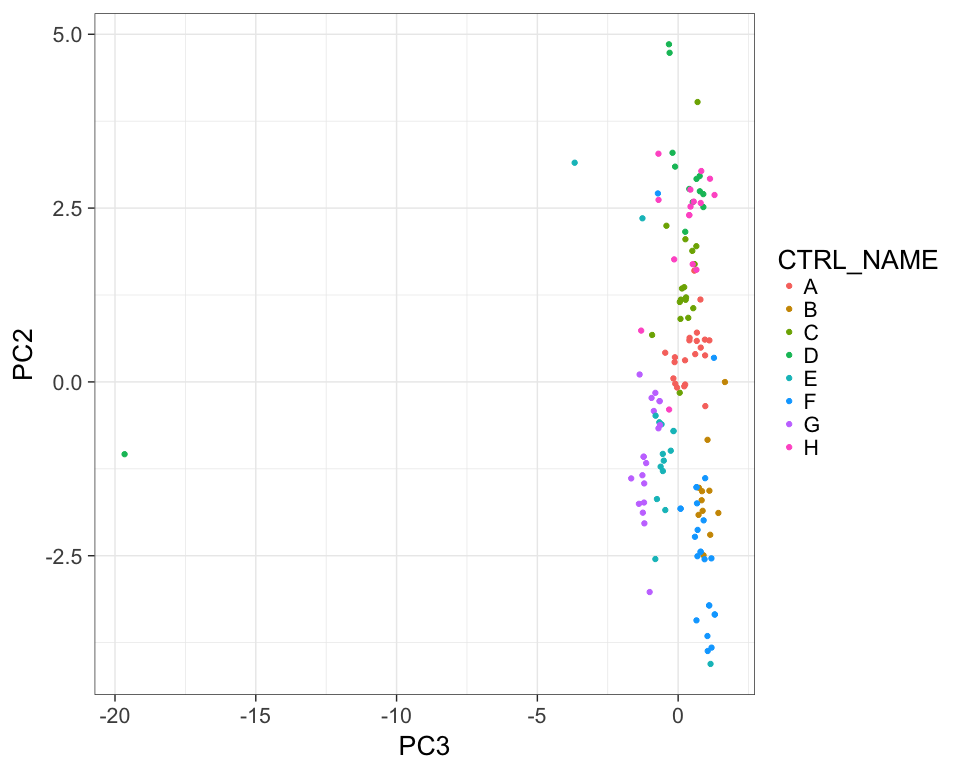<!-- -->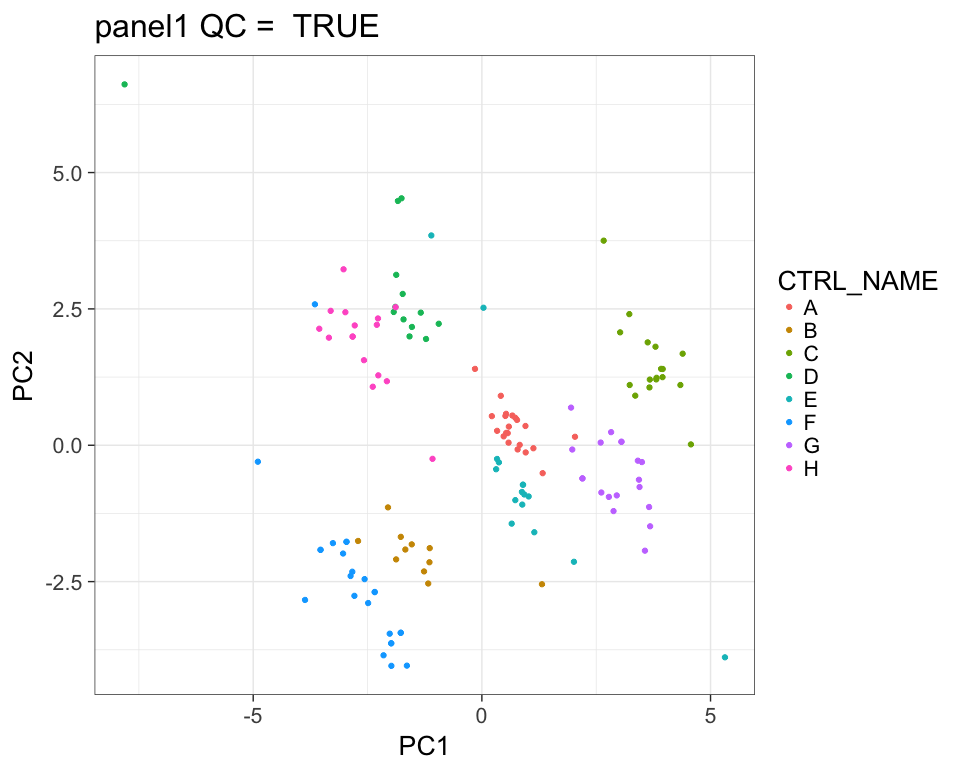<!-- -->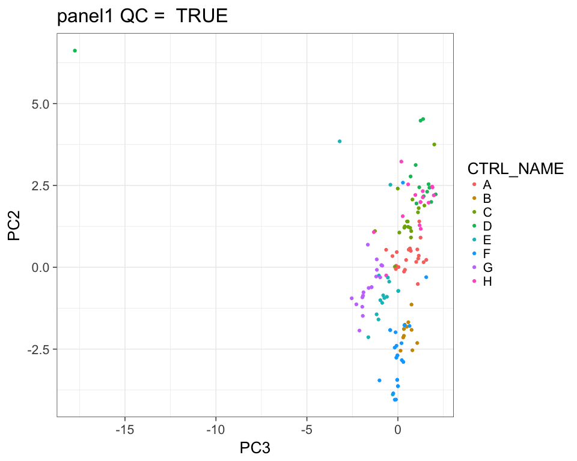<!-- -->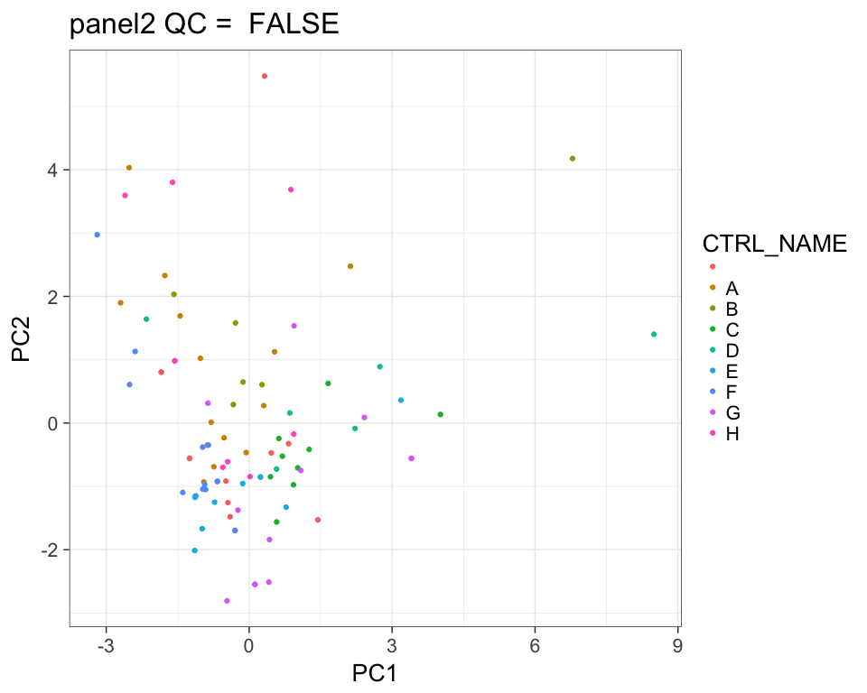<!-- -->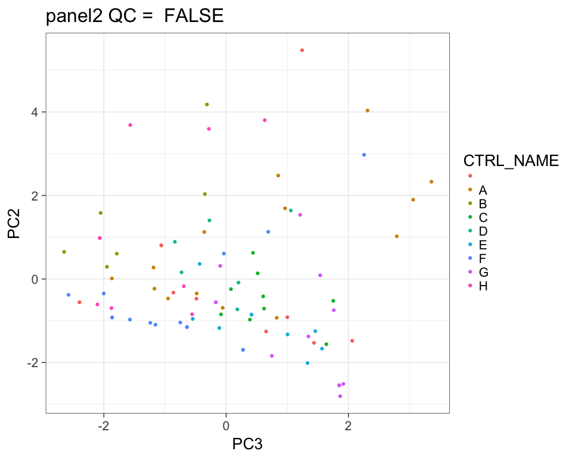<!-- -->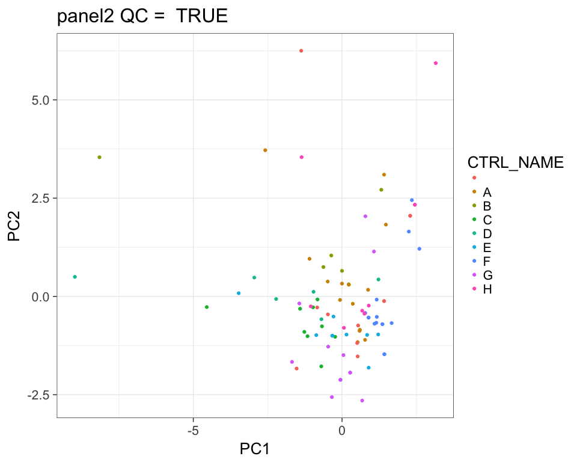<!-- -->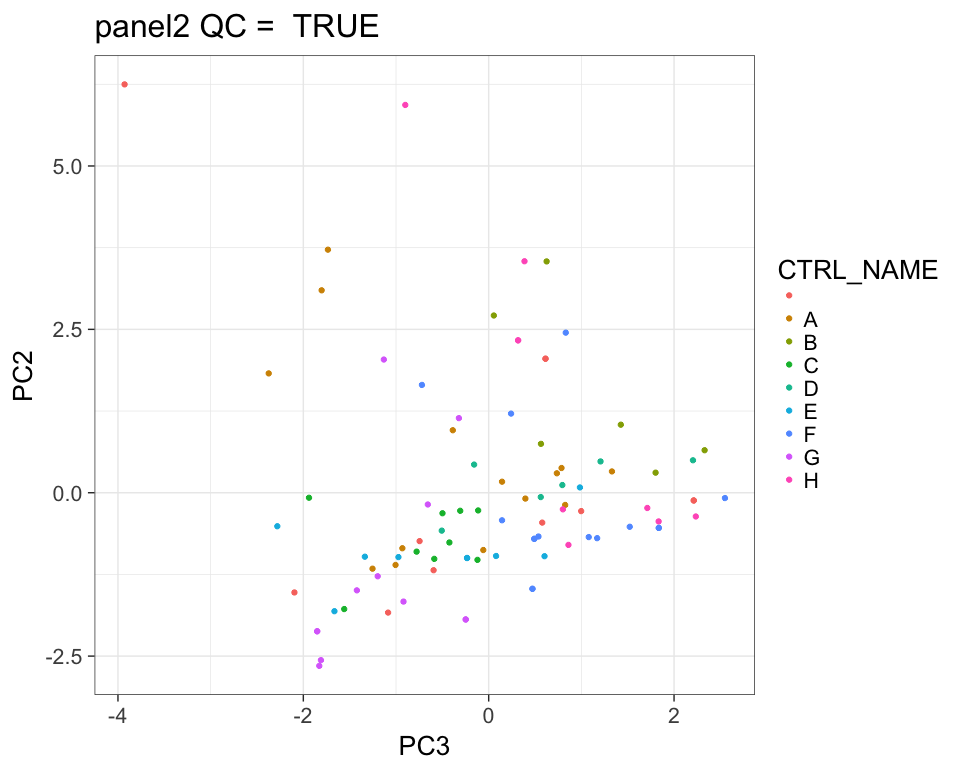<!-- -->
