# Replicate Concordance
JL  
7/12/2017  

TODO 

- manual
- automatic X
  - with/without QC X 
  
1. CV of reps X
2. ICC ?

  

<!-- Prop of  files with lymph counts > 50K  = 0.9709101 -->
<!-- Prop of  files with lymph counts < 50K  = 0.0290899 -->

Total number of Control fcs files (currently) = 228

Total number of Control groups (currently) = 32

<!-- --><!-- -->

Percent of parent CV summary

<!-- -->

|PANEL_QC        | GROUP_MEDIAN_CV| GROUP_MAD_CV|
|:---------------|---------------:|------------:|
|panel1 QC FALSE |        15.81245|     15.73181|
|panel1 QC TRUE  |        15.46096|     15.75382|
|panel2 QC FALSE |        20.07977|     20.91956|
|panel2 QC TRUE  |        18.93915|     20.55642|

Percent of base population (lymph/PBMC) CV summary

<!-- -->

|PANEL_QC        | GROUP_MEDIAN_CV| GROUP_MAD_CV|
|:---------------|---------------:|------------:|
|panel1 QC FALSE |        23.00272|     19.67767|
|panel1 QC TRUE  |        23.05160|     19.76023|
|panel2 QC FALSE |        42.44411|     48.70975|
|panel2 QC TRUE  |        40.43178|     48.20974|

# Replicate data clustering

<!-- --><!-- --><!-- --><!-- --><!-- --><!-- --><!-- --><!-- -->

<!-- --><!-- --><!-- --><!-- --><!-- --><!-- --><!-- --><!-- -->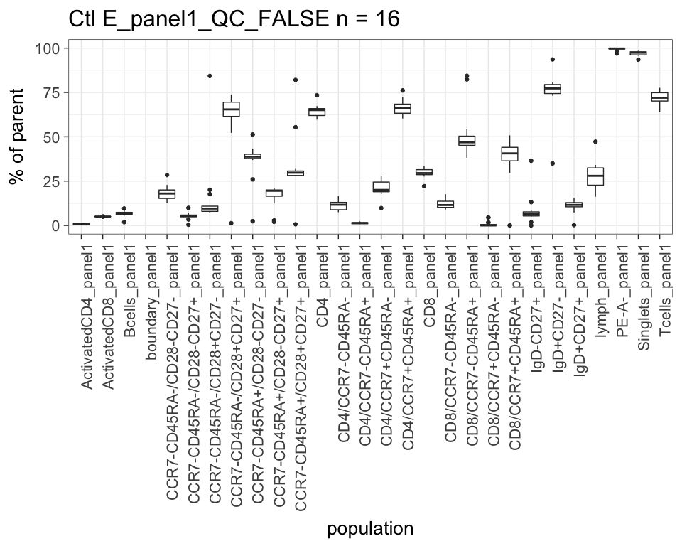<!-- --><!-- --><!-- -->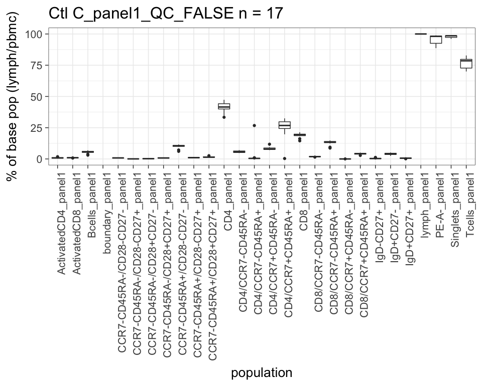<!-- --><!-- --><!-- --><!-- -->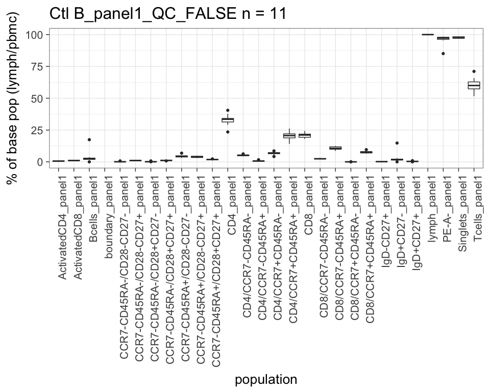<!-- --><!-- --><!-- --><!-- --><!-- --><!-- --><!-- --><!-- --><!-- --><!-- --><!-- -->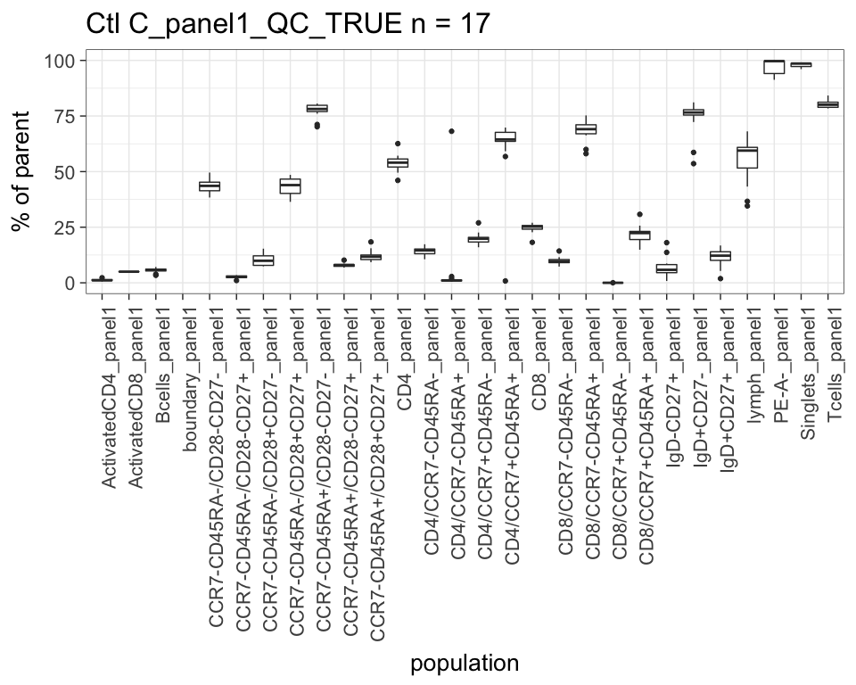<!-- --><!-- --><!-- --><!-- --><!-- --><!-- -->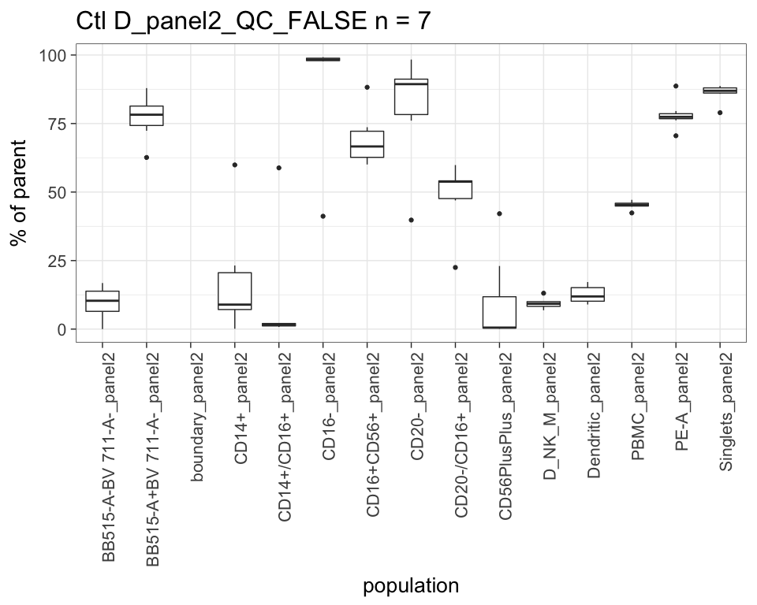<!-- --><!-- --><!-- --><!-- -->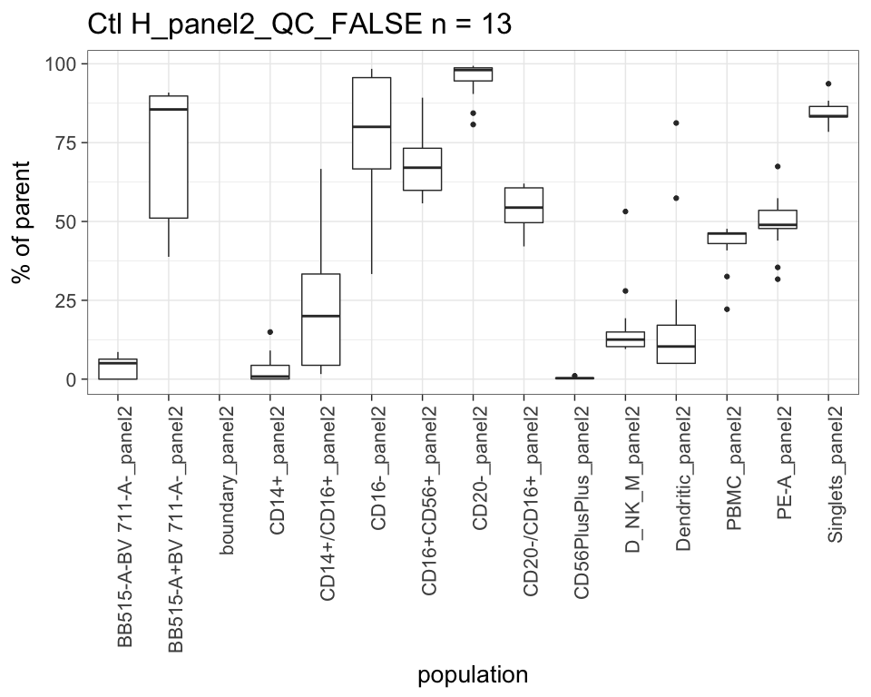<!-- --><!-- -->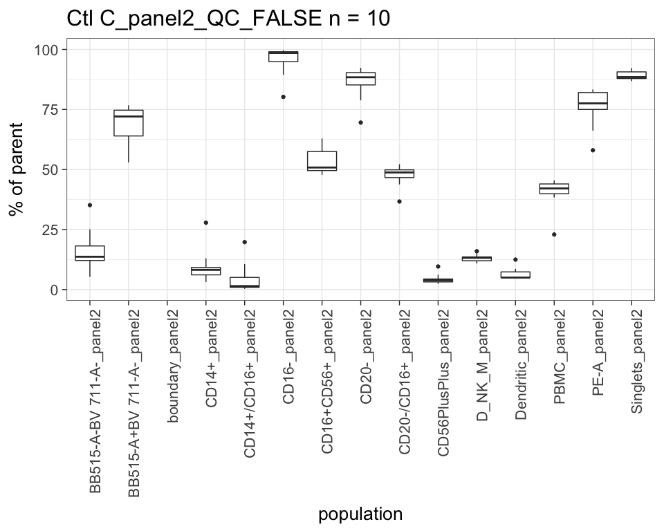<!-- --><!-- --><!-- --><!-- --><!-- --><!-- -->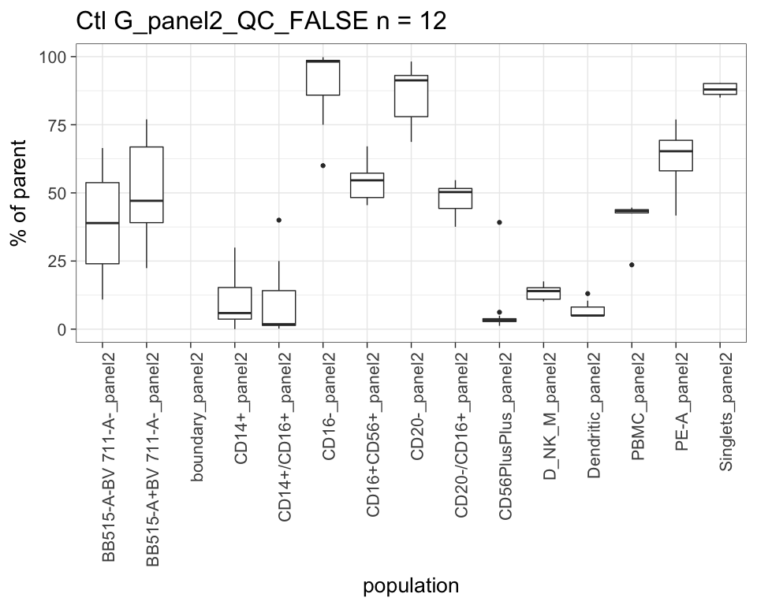<!-- --><!-- -->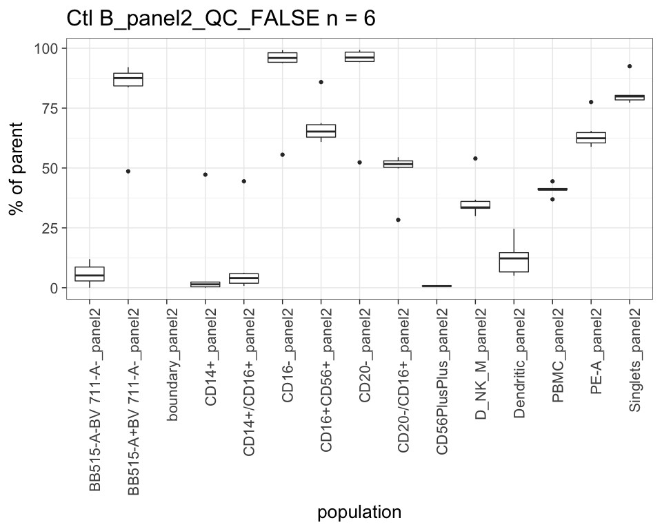<!-- --><!-- --><!-- --><!-- -->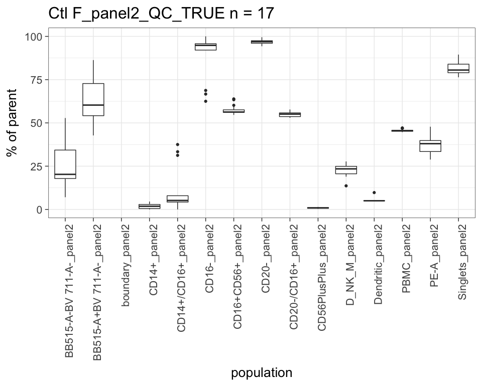<!-- --><!-- -->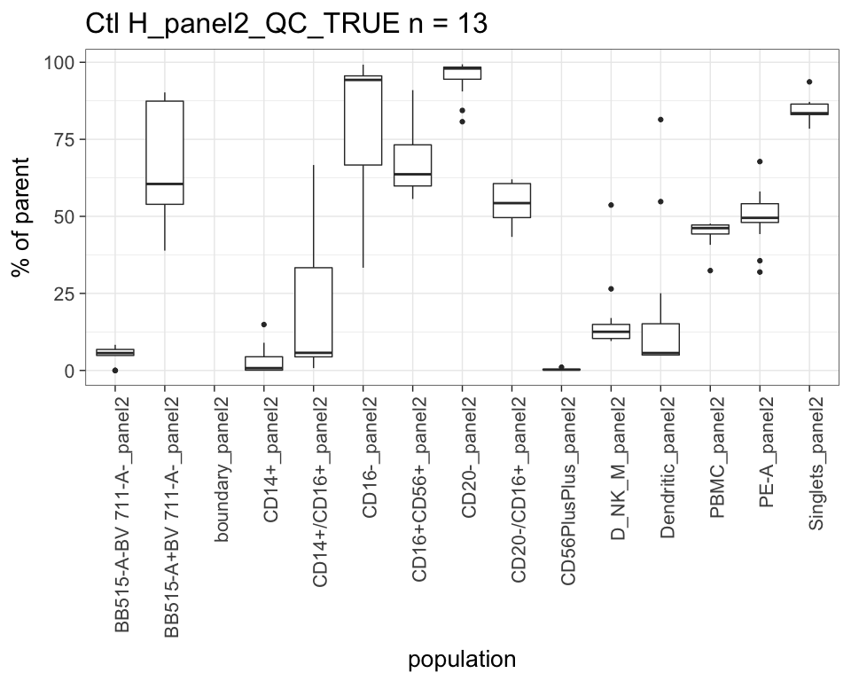<!-- -->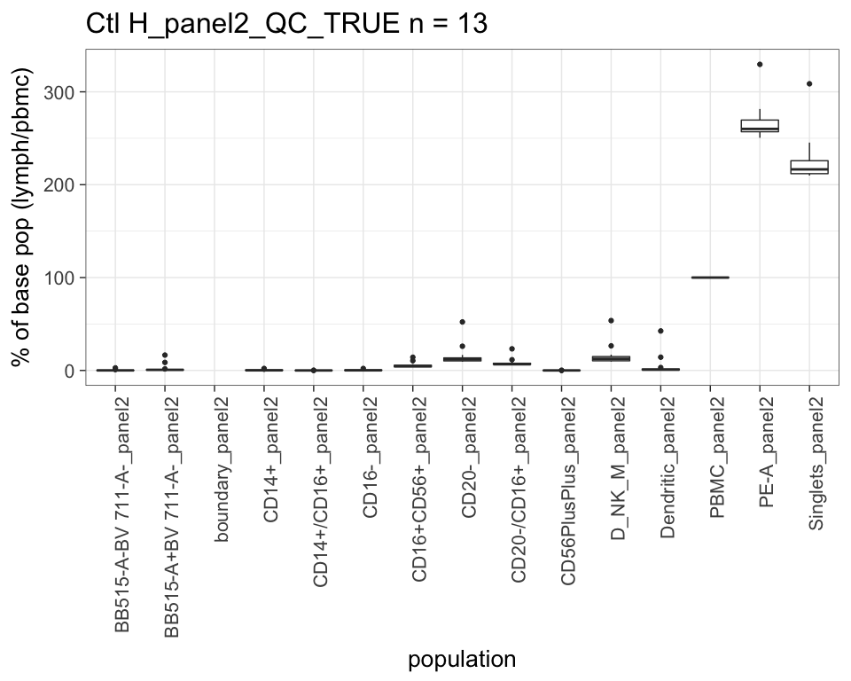<!-- --><!-- --><!-- --><!-- --><!-- --><!-- -->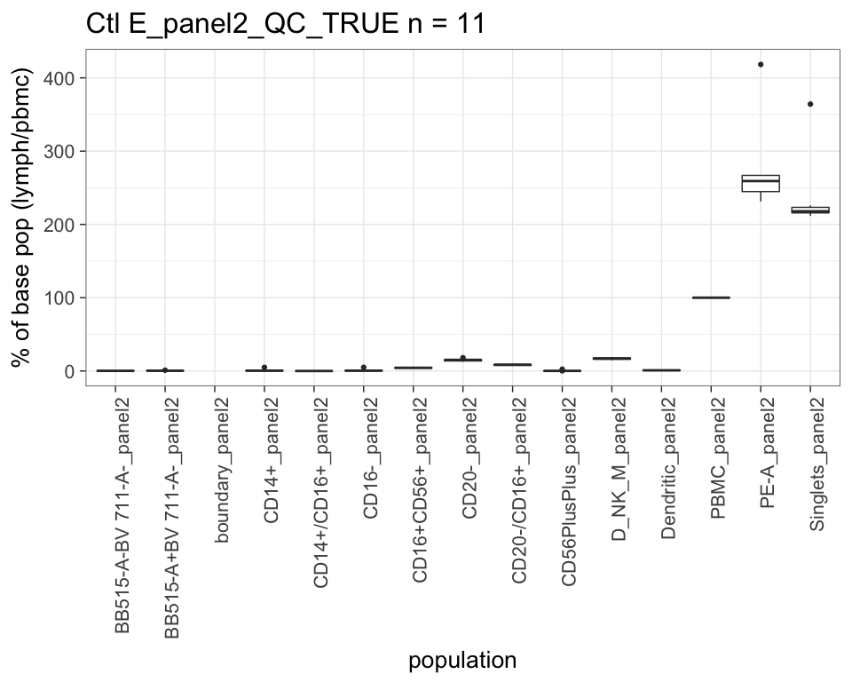<!-- --><!-- --><!-- --><!-- -->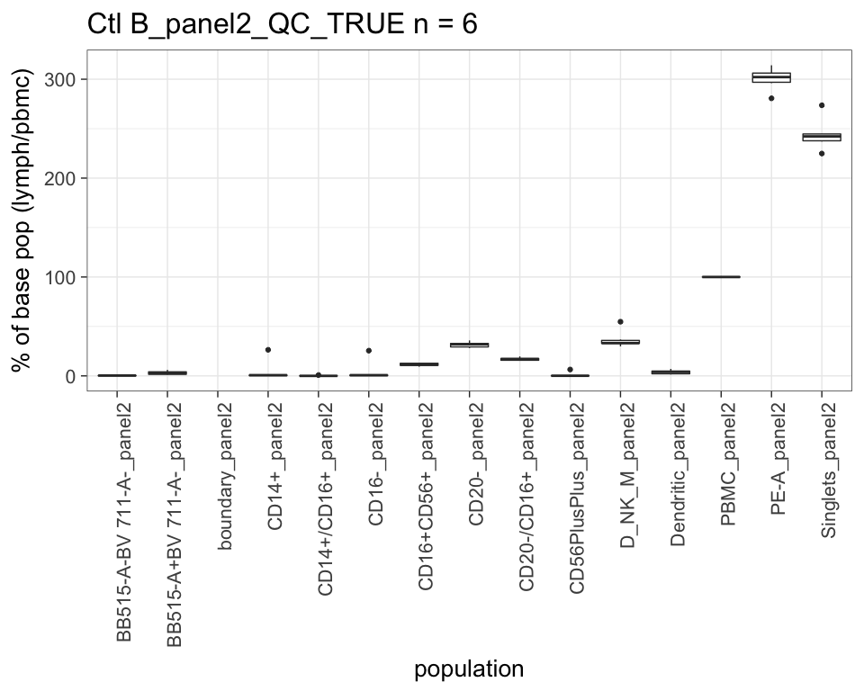<!-- -->
