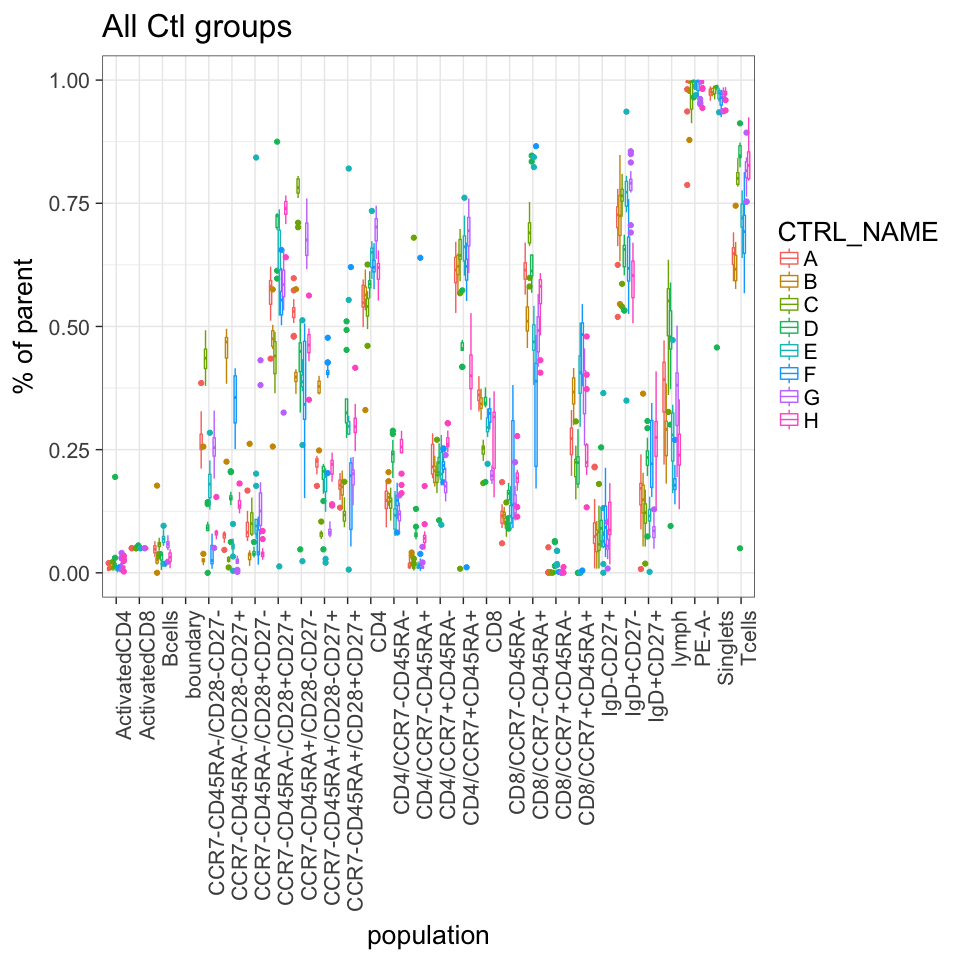
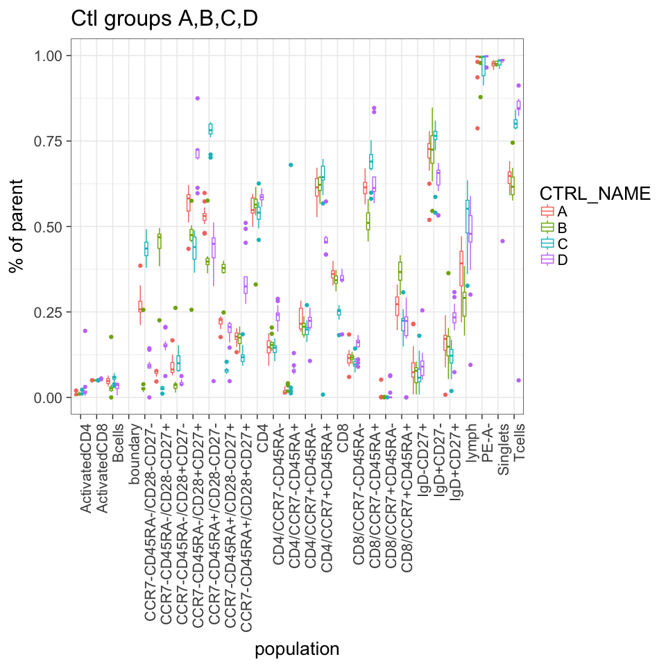
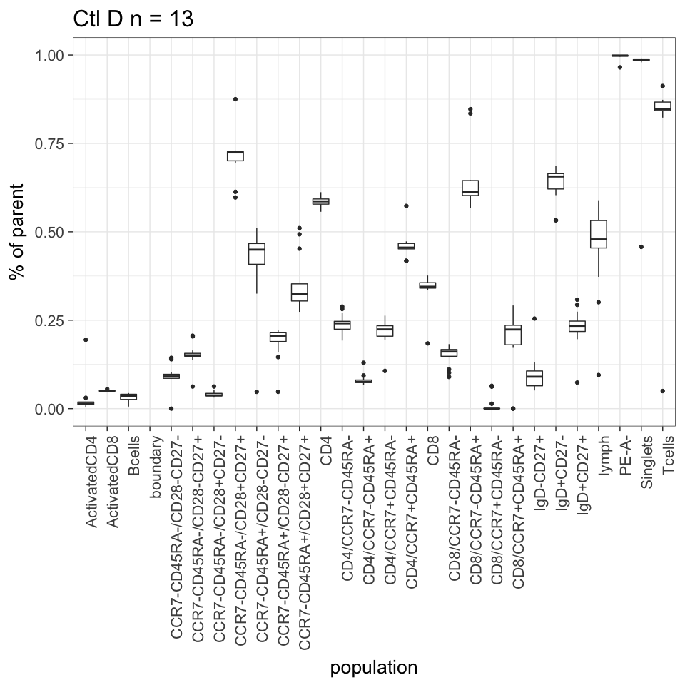
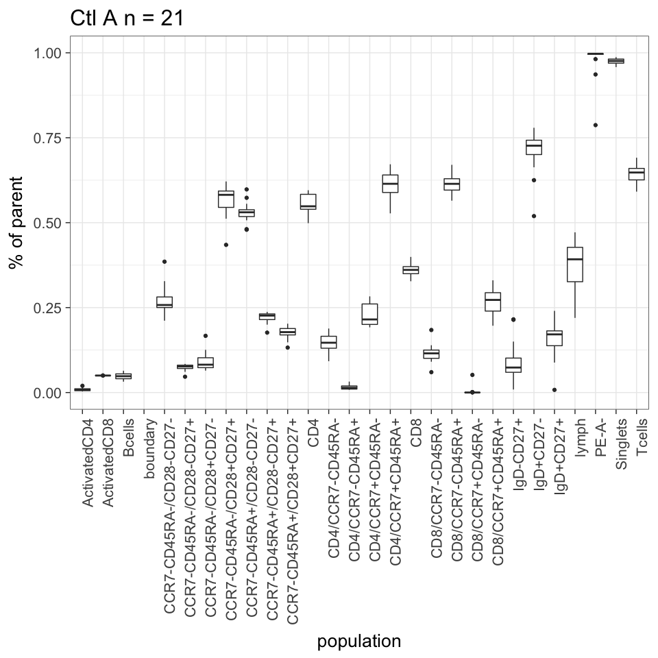
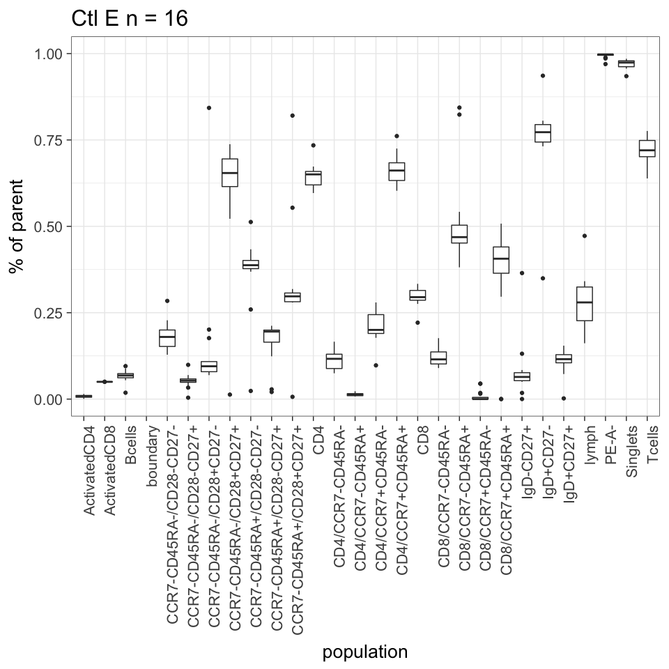
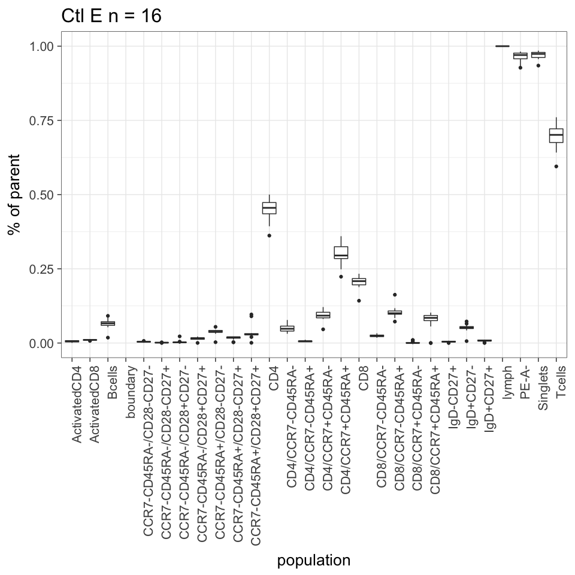
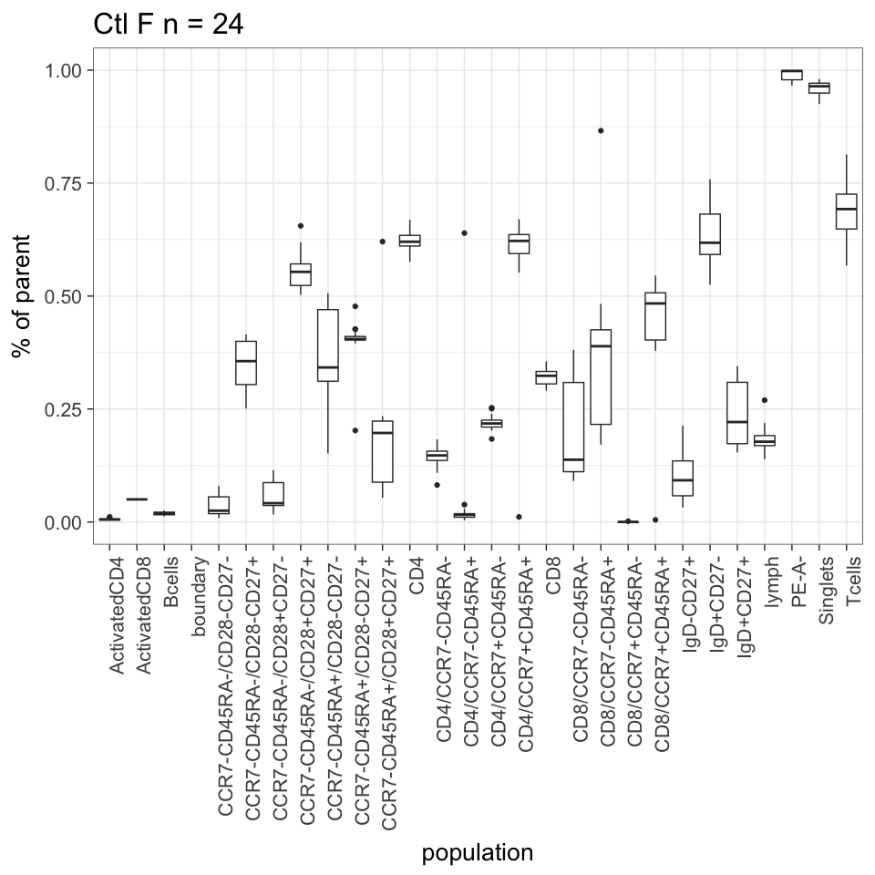

# Replicate Concordance
JL  
7/12/2017  

TODO 

- manual
- automatic
  - with/without QC
  
1. CV of reps
2. ICC
3. min diff
4. max diff
  


|Var1 | Freq|
|:----|----:|
|A    | 1260|
|B    |  660|
|C    | 1020|
|D    |  780|
|E    |  960|
|F    | 1440|
|G    | 1140|
|H    |  960|


Total number of Control fcs files (currently) = 137

Total number of Control groups (currently) = 8


```
## Warning: Removed 137 rows containing non-finite values (stat_boxplot).
```

<!-- -->

```
## Warning: Removed 62 rows containing non-finite values (stat_boxplot).
```

<!-- -->

```
## Warning: Removed 13 rows containing non-finite values (stat_boxplot).
```

<!-- -->

```
## Warning: Removed 16 rows containing non-finite values (stat_boxplot).
```

<!-- -->

```
## Warning: Removed 16 rows containing non-finite values (stat_boxplot).
```

<!-- -->

```
## Warning: Removed 21 rows containing non-finite values (stat_boxplot).
```

<!-- -->

```
## Warning: Removed 19 rows containing non-finite values (stat_boxplot).
```

<!-- -->

```
## Warning: Removed 17 rows containing non-finite values (stat_boxplot).
```

<!-- -->

```
## Warning: Removed 11 rows containing non-finite values (stat_boxplot).
```

<!-- -->

```
## Warning: Removed 24 rows containing non-finite values (stat_boxplot).
```

<!-- --><!-- -->
