# openCyto
JL  
2/16/2017  

# Notes:
Ditching manual gates to be able to load any file


<!-- -->

```
## Registered flowDensity
```

```
## ...
```

```
## done
```

<!-- -->

```
## ...
## done
```

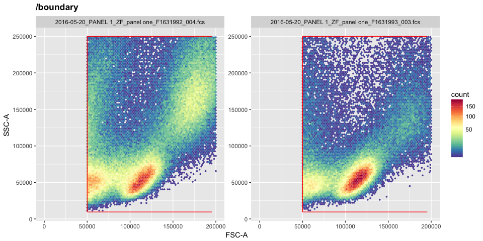<!-- -->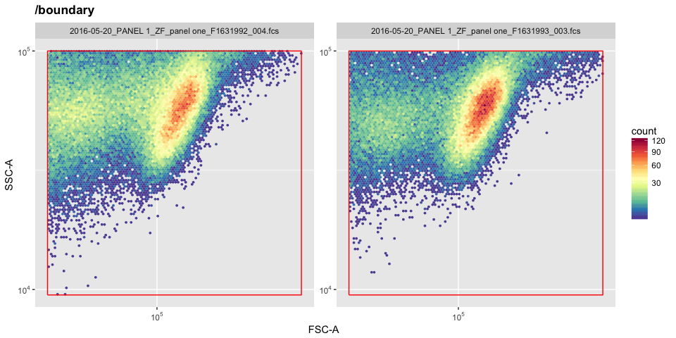<!-- -->

```
## ...
## done
```

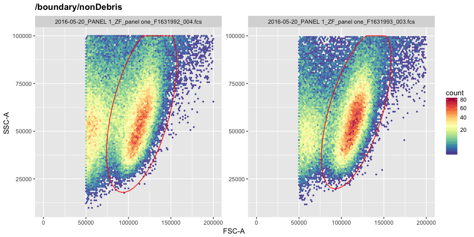<!-- -->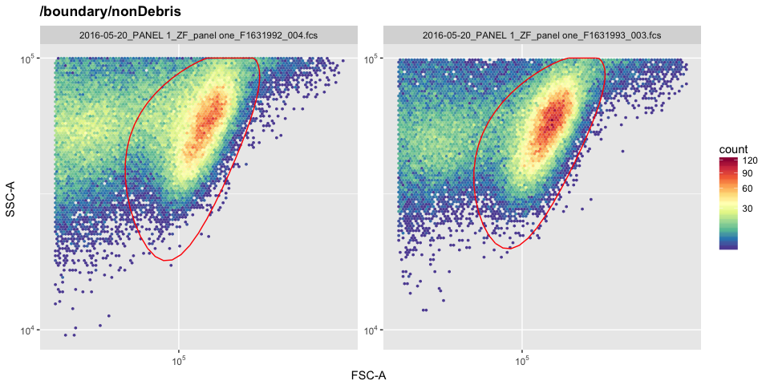<!-- -->

```
## ...
## done
```

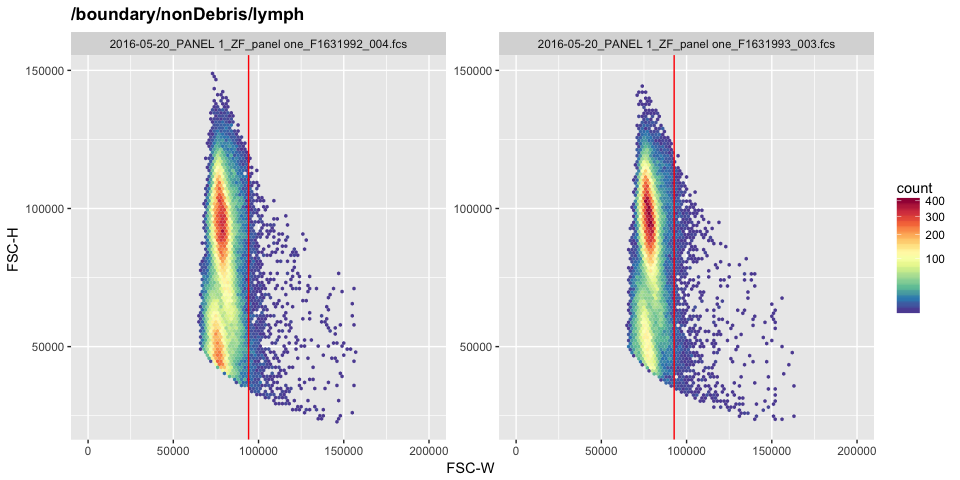<!-- -->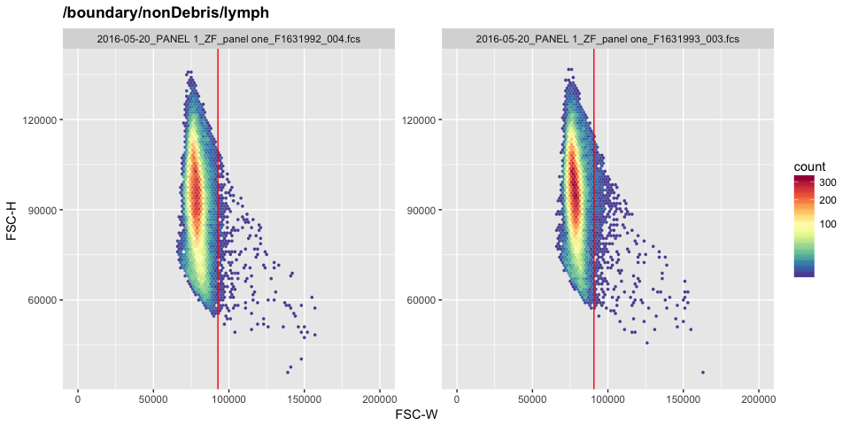<!-- -->

```
## ...
## done
```

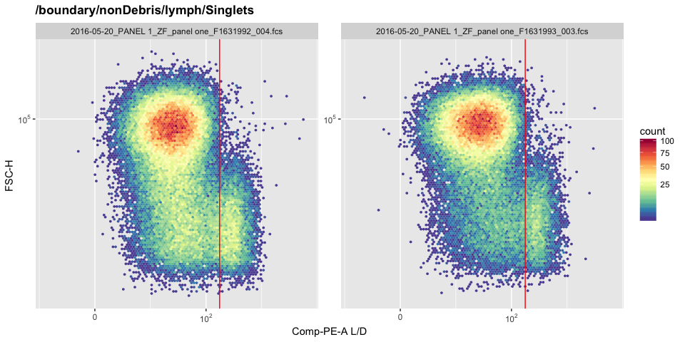<!-- -->

```
## ...
## done
```

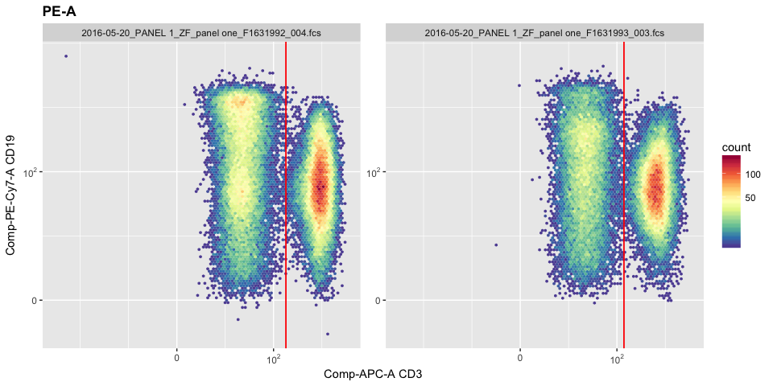<!-- -->

```
## ...
## done
```

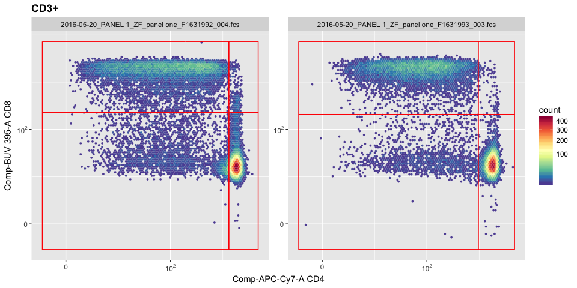<!-- -->

```
## ...
## done
```

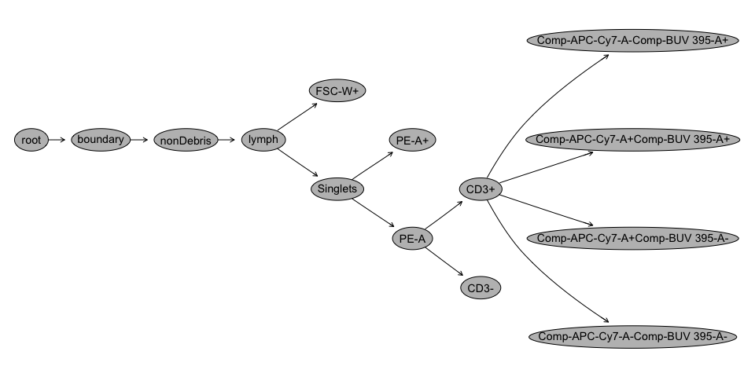<!-- -->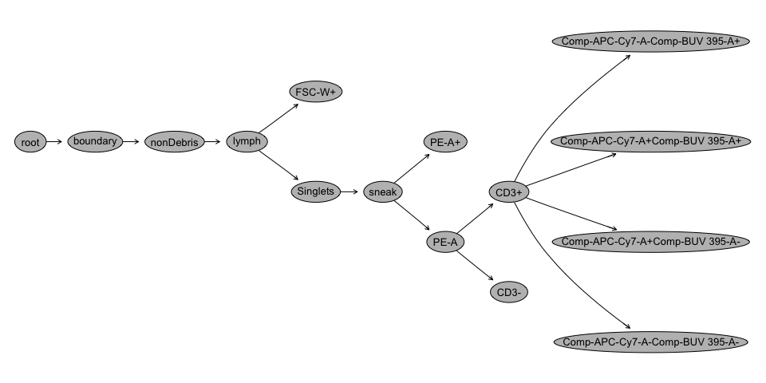<!-- -->

