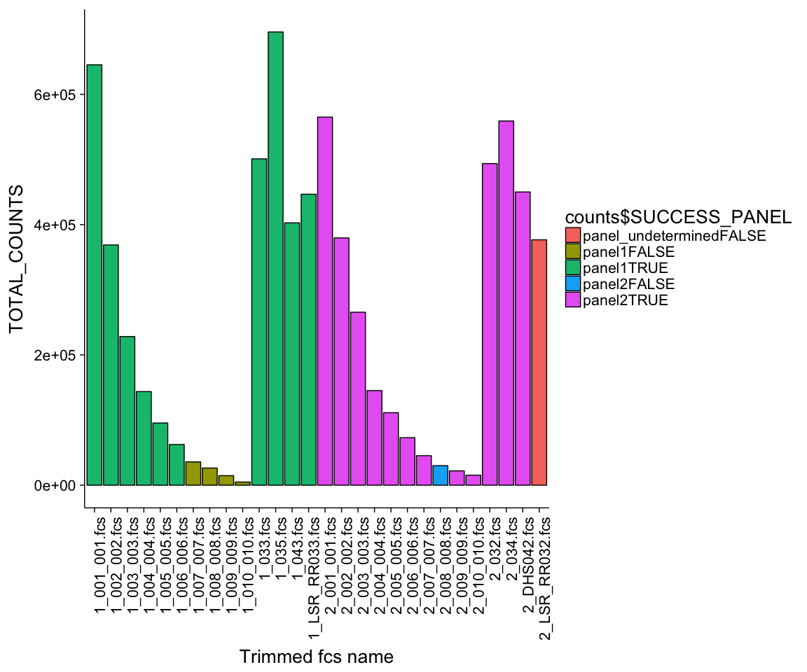
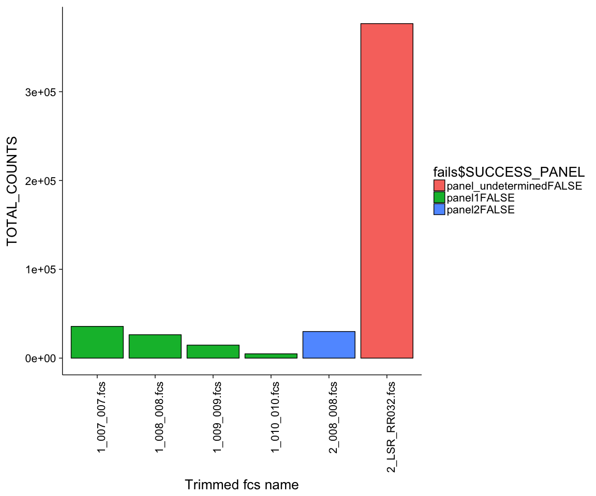

# results_r18 LOD
JL  
10/10/2017  

##  LOD testing

- total of 28 fcs files

<!-- -->

- TOTAL_COUNTS is the total number of cells in the .fcs file
- one sample had an "undetermined panel" , meaning the .fcs file was probably missing a desc column

<!-- -->

- panel1TRUE means the sample was successfully gated
- panel1FALSE means the sample was not successfully gated
- panel2TRUE means the sample was successfully gated
- panel2FALSE means the sample was not successfully gated

<!-- -->

- only the samples that failed gating

### File name mappings 

|FILE                                                          |PLOT_NAME       |
|:-------------------------------------------------------------|:---------------|
|2017-02-13_PANEL 1_ZF_group two_Ctl-G_035.fcs                 |1_035.fcs       |
|2017-02-13_PANEL 2_ZF_group two_Ctl-G_034.fcs                 |2_034.fcs       |
|2017-02-27_PANEL 1_DHS_group two_Ctl-G_043.fcs                |1_043.fcs       |
|2017-02-27_PANEL 2_DHS_group two_Ctl_G_042.fcs                |2_DHS042.fcs    |
|2017-03-02_PANEL 1_FORTESSA_HB_group two_Ctl-G_033.fcs        |1_033.fcs       |
|2017-03-02_PANEL 2_FORTESSA_HB_group two_Ctl-G_032.fcs        |2_032.fcs       |
|2017-03-07_PANEL 1_LSR_RR_Group two_Ctl-G_033.fcs             |1_LSR_RR033.fcs |
|2017-03-07_PANEL 2_LSR_RR_Group two_Ctl-G_032.fcs             |2_LSR_RR032.fcs |
|2017-10-05_PANEL 1_LSR_ZF_LOD_Group one_Ctl-G_LOD_001_001.fcs |1_001_001.fcs   |
|2017-10-05_PANEL 1_LSR_ZF_LOD_Group one_Ctl-G_LOD_002_002.fcs |1_002_002.fcs   |
|2017-10-05_PANEL 1_LSR_ZF_LOD_Group one_Ctl-G_LOD_003_003.fcs |1_003_003.fcs   |
|2017-10-05_PANEL 1_LSR_ZF_LOD_Group one_Ctl-G_LOD_004_004.fcs |1_004_004.fcs   |
|2017-10-05_PANEL 1_LSR_ZF_LOD_Group one_Ctl-G_LOD_005_005.fcs |1_005_005.fcs   |
|2017-10-05_PANEL 1_LSR_ZF_LOD_Group one_Ctl-G_LOD_006_006.fcs |1_006_006.fcs   |
|2017-10-05_PANEL 1_LSR_ZF_LOD_Group one_Ctl-G_LOD_007_007.fcs |1_007_007.fcs   |
|2017-10-05_PANEL 1_LSR_ZF_LOD_Group one_Ctl-G_LOD_008_008.fcs |1_008_008.fcs   |
|2017-10-05_PANEL 1_LSR_ZF_LOD_Group one_Ctl-G_LOD_009_009.fcs |1_009_009.fcs   |
|2017-10-05_PANEL 1_LSR_ZF_LOD_Group one_Ctl-G_LOD_010_010.fcs |1_010_010.fcs   |
|2017-10-05_PANEL 2_LSR_ZF_LOD_Group one_Ctl-G_LOD_001_001.fcs |2_001_001.fcs   |
|2017-10-05_PANEL 2_LSR_ZF_LOD_Group one_Ctl-G_LOD_002_002.fcs |2_002_002.fcs   |
|2017-10-05_PANEL 2_LSR_ZF_LOD_Group one_Ctl-G_LOD_003_003.fcs |2_003_003.fcs   |
|2017-10-05_PANEL 2_LSR_ZF_LOD_Group one_Ctl-G_LOD_004_004.fcs |2_004_004.fcs   |
|2017-10-05_PANEL 2_LSR_ZF_LOD_Group one_Ctl-G_LOD_005_005.fcs |2_005_005.fcs   |
|2017-10-05_PANEL 2_LSR_ZF_LOD_Group one_Ctl-G_LOD_006_006.fcs |2_006_006.fcs   |
|2017-10-05_PANEL 2_LSR_ZF_LOD_Group one_Ctl-G_LOD_007_007.fcs |2_007_007.fcs   |
|2017-10-05_PANEL 2_LSR_ZF_LOD_Group one_Ctl-G_LOD_008_008.fcs |2_008_008.fcs   |
|2017-10-05_PANEL 2_LSR_ZF_LOD_Group one_Ctl-G_LOD_009_009.fcs |2_009_009.fcs   |
|2017-10-05_PANEL 2_LSR_ZF_LOD_Group one_Ctl-G_LOD_010_010.fcs |2_010_010.fcs   |

