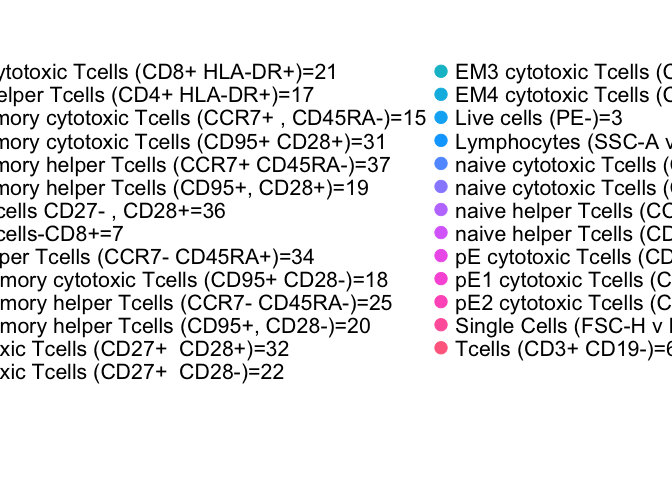

# Collecting notes for LLFS proposal


## Automatic Gating of flow cytometry data

>  Automated gating was able to match the performance of central manual analysis for all tested panels, exhibiting little to no bias and comparable variability. Standardized staining, data collection, and automated gating can increase power, reduce variability, and streamline analysis for immunophenotyping.

> The two top performing gating algorithms - OpenCyto (v. 1.7.4), flowDensity (v. 1.4.0) - in a study run by the FlowCAP consortium aimed at selecting the best performing algorithms for this larger study were chosen for the analysis presented in this paper. 

***Standardizing Flow Cytometry Immunophenotyping Analysis from the Human ImmunoPhenotyping Consortium***
<a name=cite-Finak_2016></a>[Finak, Langweiler, Jaimes, et al. (2016)](https://doi.org/10.1038%2Fsrep20686)

### OpenCyto <a name=cite-Finak_2014></a>[Finak, Frelinger, Jiang, et al. (2014)](https://doi.org/10.1371%2Fjournal.pcbi.1003806)


We propose to use OpenCyto to perform systematic and reproducible gating of 28 immune cell subsets. Gating is standardized via a **[.csv](https://github.com/PankratzLab/auto-fcs/blob/master/explore/openCyto/lymph.dev.b.csv)** file describing the algorithmic approach for each step of the gating hierarchy. Importantly, this methodology allows for unbiased gating of thousands of samples.

OpenCyto gives the user many options to refine algorithmic parameters to improve the performance of each step in the gating hierarchy. We evaluated the performance of our OpenCyto template using internal data for 151 manually gated (Jflow software) samples across 15 gates. The global correlation between the population counts of manual and OpenCyto gating was high (rho=0.9846 ,p-value <2e-16). Despite a high global concordance, certain subsets were less well correlated (e.g Activated CD4 counts, rho=0.6222 ,p-value <2e-16).

While OpenCyto can automate the classification of known subsets by following a traditional gating hierarchy that incoporates domain knowledge, it does not easily facilitate the discovery of novel populations. 


<!-- -->


- Mimics manual gating by focusing on 2 channels at a time
    - can follow traditional gate hierarchy
    - e.g. gate lymph, then single, then live, etc
- Pipeline templates defined in .csv file
  - defines algorithmic approach for each gate to be applied across many samples
  - not "just push go", takes some setup for a decent template
- Results are interpretable and labelled populations 
  - not geared toward detecting novel cell types


## Novel subsets


t-SNE is a visualization method, and not sure if it can be directly used for novel subset detection

<!--html_preserve--><div id="htmlwidget-a78b06497a8edd6c7958" style="width:672px;height:480px;" class="visNetwork html-widget"></div>
<script type="application/json" data-for="htmlwidget-a78b06497a8edd6c7958">{"x":{"nodes":{"id":[1,2,3,4,5,6,7],"group":["chr","chr","chr","chr","chr","chr","chr"],"label":["QC (?)","OpenCyto:trim to primary subset","Primary subset (T- or B-Cells?)","Phenograph","Citrus","Find discriminating populations for Case/Control","Visualize with t-SNE"],"shape":["ellipse","ellipse","ellipse","ellipse","ellipse","ellipse","ellipse"]},"edges":{"id":[1,2,3,4,5,6,7],"from":[1,2,3,3,4,5,6],"to":[2,3,4,5,7,6,7],"label":["related","related","related","related","related","related","related"]},"nodesToDataframe":true,"edgesToDataframe":true,"options":{"width":"100%","height":"100%","nodes":{"shape":"dot"},"manipulation":{"enabled":false},"edges":{"arrows":{"to":{"enabled":true,"scaleFactor":1}}},"physics":{"stabilization":{"enabled":true,"onlyDynamicEdges":false,"fit":true}},"layout":{"improvedLayout":true}},"groups":"chr","width":null,"height":null,"idselection":{"enabled":false},"byselection":{"enabled":false},"main":null,"submain":null,"footer":null},"evals":[],"jsHooks":[]}</script><!--/html_preserve--><!--html_preserve--><div id="htmlwidget-da596b4b6098dc503350" style="width:672px;height:480px;" class="grViz html-widget"></div>
<script type="application/json" data-for="htmlwidget-da596b4b6098dc503350">{"x":{"diagram":"digraph {\n\ngraph [layout = \"neato\",\n       outputorder = \"edgesfirst\"]\n\nnode [fontname = \"Helvetica\",\n     fontsize = \"10\",\n     shape = \"circle\",\n     fixedsize = \"true\",\n     width = \"0.5\",\n     style = \"filled\",\n     fillcolor = \"aliceblue\",\n     color = \"gray70\",\n     fontcolor = \"gray50\"]\n\nedge [len = \"1.5\",\n     color = \"gray40\",\n     arrowsize = \"0.5\"]\n\n  \"1\" [label = \"QC (?)\", shape = \"ellipse\"] \n  \"2\" [label = \"OpenCyto:trim to primary subset\", shape = \"ellipse\"] \n  \"3\" [label = \"Primary subset (T- or B-Cells?)\", shape = \"ellipse\"] \n  \"4\" [label = \"Phenograph\", shape = \"ellipse\"] \n  \"5\" [label = \"Citrus\", shape = \"ellipse\"] \n  \"6\" [label = \"Find discriminating populations for Case/Control\", shape = \"ellipse\"] \n  \"7\" [label = \"Visualize with t-SNE\", shape = \"ellipse\"] \n\"1\"->\"2\" [id = \"1\"] \n\"2\"->\"3\" [id = \"2\"] \n\"3\"->\"4\" [id = \"3\"] \n\"3\"->\"5\" [id = \"4\"] \n\"4\"->\"7\" [id = \"5\"] \n\"5\"->\"6\" [id = \"6\"] \n\"6\"->\"7\" [id = \"7\"] \n}","config":{"engine":null,"options":null}},"evals":[],"jsHooks":[]}</script><!--/html_preserve-->

```
## quartz_off_screen 
##                 2
```


### Phenograph
<a name=cite-Levine_2015></a>[Levine, Simonds, Bendall, et al. (2015)](https://doi.org/10.1016%2Fj.cell.2015.05.047)

Phenograph performs unsupervised clustering of high dimensional single cell data allowing for the discovery of novel subtypes. We propose to use OpenCyto to first limit our search space (e.g starting from live,single T-Cells) and then search for novel populations within the clean subset. 

<!-- --><!-- --><!-- -->


### Citrus
<a name=cite-Bruggner_2014></a>[Bruggner, Bodenmiller, Dill, et al. (2014)](https://doi.org/10.1073%2Fpnas.1408792111)

May be good choice for Aim 1:

>  Citrus (cluster identification, characterization, and regression), a data-driven approach for the identification of stratifying subpopulations in multidimensional cytometry datasets.


