

Auto gating update
========================================================
author: 
date: 
autosize: true

April 11th, 2017

OpenCyto
========================================================
[Finak, Frelinger, Jiang, et al. (2014)](https://doi.org/10.1371%2Fjournal.pcbi.1003806)
- Mimics manual gating by focusing on 2 channels at a time
  - can follow traditional gate hierarchy
  - e.g. gate lymph, then single, then live, etc
- Pipeline templates defined in .csv file
  - defines algorithmic approach for each gate to be applied across many samples
  - not "just push go", takes some setup for a decent template
- Results are interpretable and labelled populations 
  - not geared toward detecting novel cell types

OpenCyto
========================================================

> The two top performing gating algorithms - OpenCyto (v. 1.7.4), flowDensity (v. 1.4.0) - in a study run by the FlowCAP consortium aimed at selecting the best performing algorithms for this larger study were chosen for the analysis presented in this paper. ***Standardizing Flow Cytometry Immunophenotyping Analysis from the Human ImmunoPhenotyping Consortium*** [Finak, Langweiler, Jaimes, et al. (2016)](https://doi.org/10.1038%2Fsrep20686)

- Stole template from above as a start
  - our panel 1 template currently lives [here](https://github.com/PankratzLab/auto-fcs/blob/master/explore/openCyto/lymph.dev.b.csv)
  
Current progres overview 
========================================================
class: esmall-table

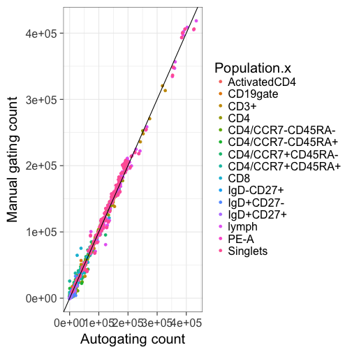

| N_SAMPS| N_DATA|    RHO|   BETA| BETA_SE|     R2|  ICC_1|
|-------:|------:|------:|------:|-------:|------:|------:|
|       5|     75| 0.9356| 0.9228|  0.0102| 0.9911| 0.9918|
***
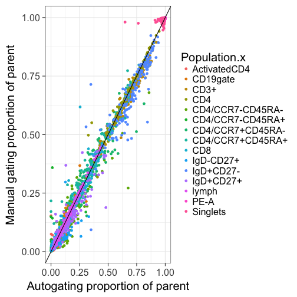

| N_SAMPS| N_DATA|    RHO|   BETA| BETA_SE|     R2|  ICC_1|
|-------:|------:|------:|------:|-------:|------:|------:|
|       5|     75| 0.8775| 0.8928|   0.043| 0.8551| 0.9251|

Lymphocytes (SSC-A v FSC-A)
========================================================
class: esmall-table

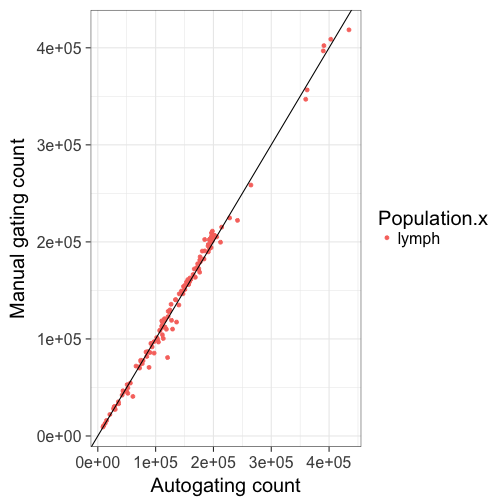

| N_SAMPS| N_DATA| RHO|   BETA| BETA_SE|     R2|  ICC_1|
|-------:|------:|---:|------:|-------:|------:|------:|
|       5|      5| 0.9| 0.9475|  0.0612| 0.9876| 0.9692|
***
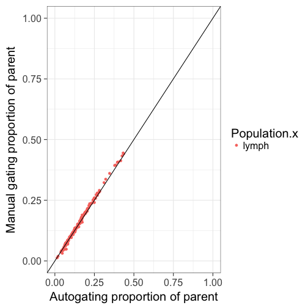

| N_SAMPS| N_DATA| RHO|  BETA| BETA_SE|    R2|  ICC_1|
|-------:|------:|---:|-----:|-------:|-----:|------:|
|       5|      5|   1| 1.024|  0.0191| 0.999| 0.9843|

Single Cells (FSC-H v FSC-W)
========================================================
class: esmall-table

| N_SAMPS| N_DATA| RHO|   BETA| BETA_SE|     R2|  ICC_1|
|-------:|------:|---:|------:|-------:|------:|------:|
|       5|      5| 0.9| 0.9562|  0.0625| 0.9873| 0.9752|
***
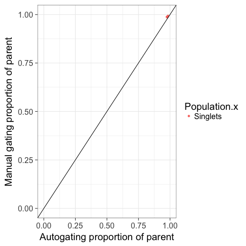

| N_SAMPS| N_DATA| RHO|   BETA| BETA_SE|     R2|   ICC_1|
|-------:|------:|---:|------:|-------:|------:|-------:|
|       5|      5| 0.7| 0.6352|  0.2409| 0.6985| -0.4447|

Live cells (PE-)
========================================================
class: esmall-table

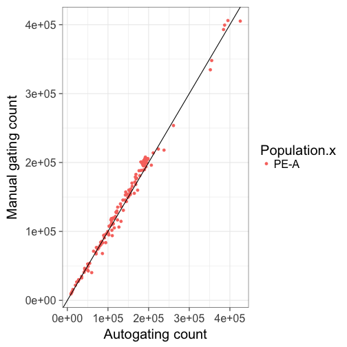

| N_SAMPS| N_DATA| RHO|   BETA| BETA_SE|     R2|  ICC_1|
|-------:|------:|---:|------:|-------:|------:|------:|
|       5|      5| 0.9| 0.9544|  0.0626| 0.9873| 0.9748|
***
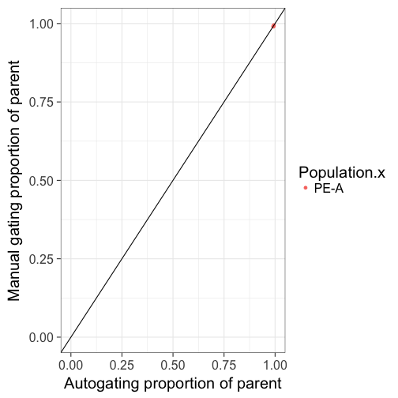

| N_SAMPS| N_DATA| RHO|  BETA| BETA_SE|     R2|  ICC_1|
|-------:|------:|---:|-----:|-------:|------:|------:|
|       5|      5| 0.9| 1.577|  0.2373| 0.9364| 0.8774|

Tcells (CD3+ CD19-)
========================================================
class: esmall-table

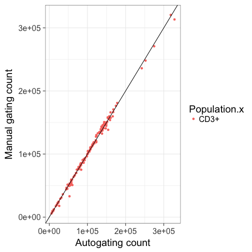

| N_SAMPS| N_DATA| RHO|   BETA| BETA_SE|     R2|  ICC_1|
|-------:|------:|---:|------:|-------:|------:|------:|
|       5|      5| 0.7| 0.9572|   0.017| 0.9991| 0.9949|
***
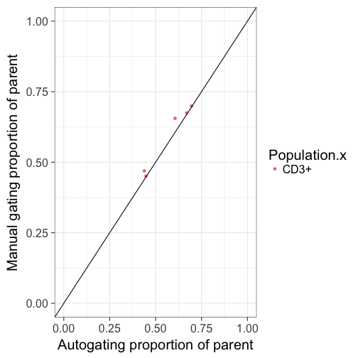

| N_SAMPS| N_DATA| RHO|   BETA| BETA_SE|     R2|  ICC_1|
|-------:|------:|---:|------:|-------:|------:|------:|
|       5|      5| 0.9| 0.9689|   0.097| 0.9708| 0.9761|

Helper Tcells-CD4+
========================================================
class: esmall-table

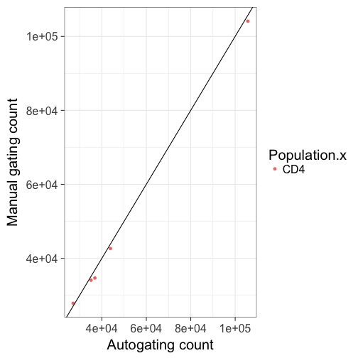

| N_SAMPS| N_DATA| RHO|   BETA| BETA_SE|    R2| ICC_1|
|-------:|------:|---:|------:|-------:|-----:|-----:|
|       5|      5|   1| 0.9861|  0.0184| 0.999| 0.999|
***
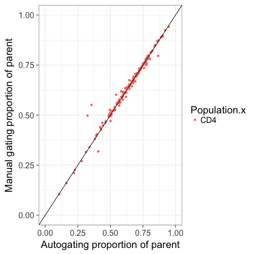

| N_SAMPS| N_DATA| RHO|   BETA| BETA_SE|     R2|  ICC_1|
|-------:|------:|---:|------:|-------:|------:|------:|
|       5|      5| 0.9| 0.9839|  0.0329| 0.9967| 0.9916|

central memory helper Tcells (CCR7+ CD45RA-)
========================================================
class: esmall-table

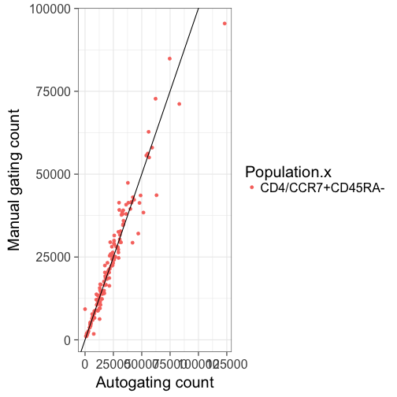

| N_SAMPS| N_DATA| RHO|   BETA| BETA_SE|     R2|  ICC_1|
|-------:|------:|---:|------:|-------:|------:|------:|
|       5|      5| 0.9| 0.6178|  0.0765| 0.9561| 0.8919|
***
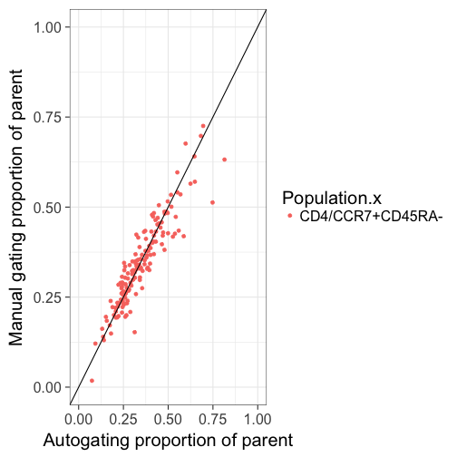

| N_SAMPS| N_DATA| RHO|   BETA| BETA_SE|     R2| ICC_1|
|-------:|------:|---:|------:|-------:|------:|-----:|
|       5|      5| 0.4| 0.1211|  0.1594| 0.1613| 0.325|

effector helper Tcells (CCR7- CD45RA+)
========================================================
class: esmall-table

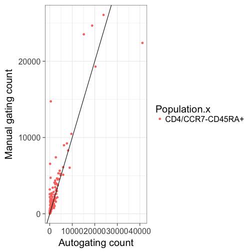

| N_SAMPS| N_DATA|  RHO|   BETA| BETA_SE|     R2|   ICC_1|
|-------:|------:|----:|------:|-------:|------:|-------:|
|       5|      5| -0.5| -2.006|   2.643| 0.1611| -0.4093|
***
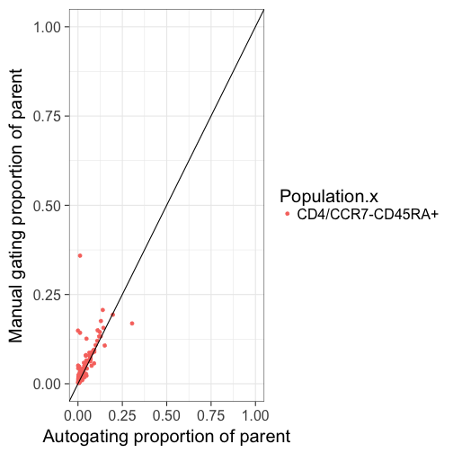

| N_SAMPS| N_DATA|  RHO|   BETA| BETA_SE|     R2|  ICC_1|
|-------:|------:|----:|------:|-------:|------:|------:|
|       5|      5| -0.4| -3.512|    3.36| 0.2669| -0.278|

effector memory helper Tcells (CCR7- CD45RA-)
========================================================
class: esmall-table

| N_SAMPS| N_DATA| RHO|  BETA| BETA_SE|     R2|  ICC_1|
|-------:|------:|---:|-----:|-------:|------:|------:|
|       5|      5| 0.3| 1.077|  0.4636| 0.6428| 0.6567|
***
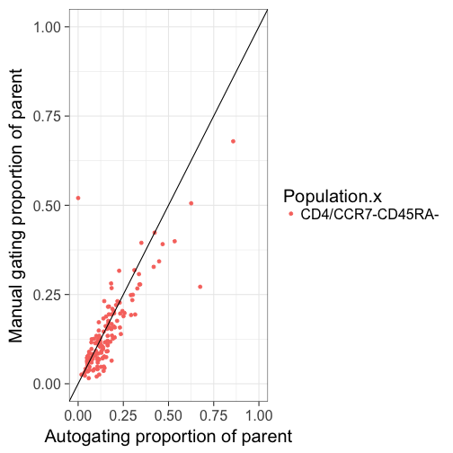

| N_SAMPS| N_DATA|  RHO|   BETA| BETA_SE|     R2|   ICC_1|
|-------:|------:|----:|------:|-------:|------:|-------:|
|       5|      5| -0.1| -1.355|   1.266| 0.2761| -0.4523|

naive helper Tcells (CCR7+ CD45RA+)
========================================================
class: esmall-table

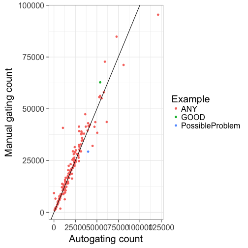

| N_SAMPS| N_DATA| RHO|   BETA| BETA_SE|     R2|   ICC_1|
|-------:|------:|---:|------:|-------:|------:|-------:|
|       5|      5|   0| -1.448|   1.882| 0.1648| -0.1666|
***
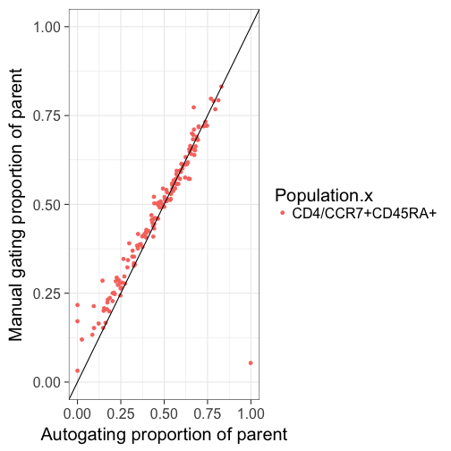

| N_SAMPS| N_DATA|  RHO|    BETA| BETA_SE|     R2|   ICC_1|
|-------:|------:|----:|-------:|-------:|------:|-------:|
|       5|      5| -0.1| -0.3909|  0.4293| 0.2165| -0.4385|

cytotoxic Tcells-CD8+
========================================================
class: esmall-table

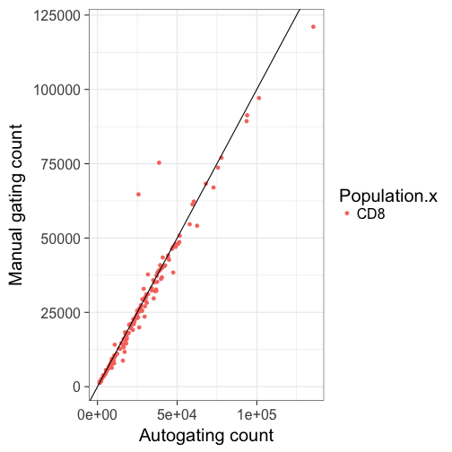

| N_SAMPS| N_DATA| RHO|   BETA| BETA_SE|     R2|  ICC_1|
|-------:|------:|---:|------:|-------:|------:|------:|
|       5|      5|   1| 0.9957|  0.0433| 0.9944| 0.9841|
***
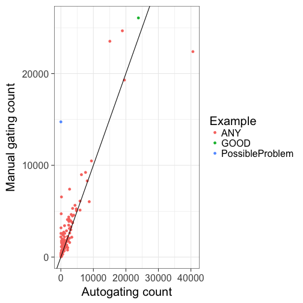

| N_SAMPS| N_DATA| RHO|   BETA| BETA_SE|     R2|  ICC_1|
|-------:|------:|---:|------:|-------:|------:|------:|
|       5|      5|   1| 0.9952|  0.0239| 0.9983| 0.9977|

B cells (CD3- CD19+) 
========================================================
class: esmall-table

| N_SAMPS| N_DATA| RHO|  BETA| BETA_SE|     R2|  ICC_1|
|-------:|------:|---:|-----:|-------:|------:|------:|
|       5|      5| 0.9| 1.244|  0.0588| 0.9933| 0.9618|
***

| N_SAMPS| N_DATA| RHO|  BETA| BETA_SE|     R2|  ICC_1|
|-------:|------:|---:|-----:|-------:|------:|------:|
|       5|      5| 0.9| 1.601|  0.0942| 0.9897| 0.8465|

naive Bcells (CD27- IgD+)
========================================================
class: esmall-table

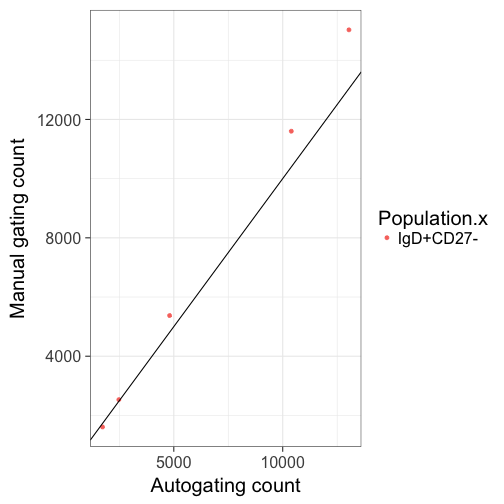

| N_SAMPS| N_DATA| RHO|  BETA| BETA_SE|     R2|  ICC_1|
|-------:|------:|---:|-----:|-------:|------:|------:|
|       5|      5|   1| 1.172|  0.0154| 0.9995| 0.9807|
***
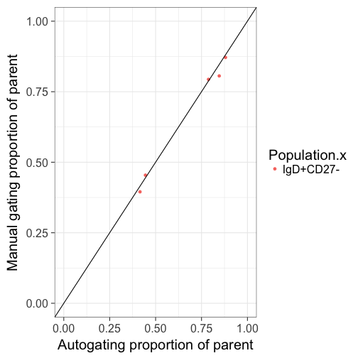

| N_SAMPS| N_DATA| RHO|   BETA| BETA_SE|     R2|  ICC_1|
|-------:|------:|---:|------:|-------:|------:|------:|
|       5|      5|   1| 0.9748|  0.0498| 0.9922| 0.9955|

IgD- memory Bcells (CD27+)
========================================================
class: esmall-table

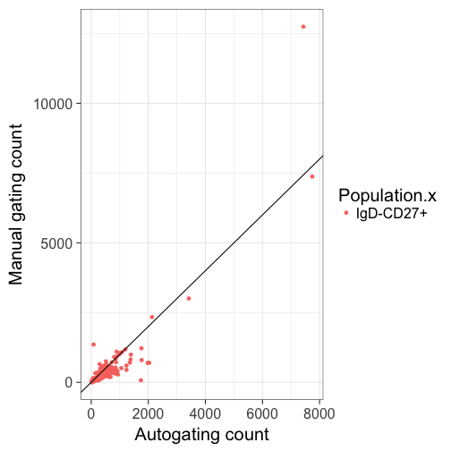

| N_SAMPS| N_DATA| RHO|  BETA| BETA_SE|     R2|  ICC_1|
|-------:|------:|---:|-----:|-------:|------:|------:|
|       5|      5|   1| 1.082|  0.0417| 0.9956| 0.9873|
***
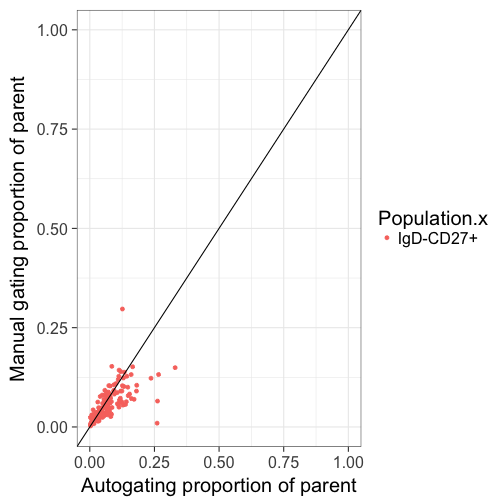

| N_SAMPS| N_DATA| RHO|  BETA| BETA_SE|     R2|  ICC_1|
|-------:|------:|---:|-----:|-------:|------:|------:|
|       5|      5|   1| 1.186|  0.0353| 0.9973| 0.9855|

IgD+ memory Bcells (CD27+)
========================================================
class: esmall-table

| N_SAMPS| N_DATA| RHO|  BETA| BETA_SE|     R2|  ICC_1|
|-------:|------:|---:|-----:|-------:|------:|------:|
|       5|      5|   1| 0.875|  0.0539| 0.9887| 0.9566|
***
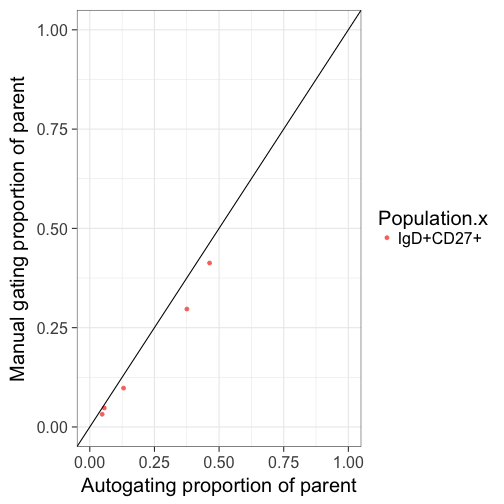

| N_SAMPS| N_DATA| RHO|   BETA| BETA_SE|     R2|  ICC_1|
|-------:|------:|---:|------:|-------:|------:|------:|
|       5|      5|   1| 0.8751|   0.045| 0.9921| 0.9694|

Summary
========================================================

- OpenCyto seems to work
- Lots of room for improvement
- Iterative process

ICC
========================================================

From [Wikipedia](https://en.wikipedia.org/wiki/Intraclass_correlation)

[Cicchetti (1994)](https://doi.org/10.1037%2F1040-3590.6.4.284) gives the following often quoted guidelines for interpretation for kappa or ICC inter-rater agreement measures:

- Less than 0.40—poor.
- Between 0.40 and 0.59—Fair.
- Between 0.60 and 0.74—Good.
- Between 0.75 and 1.00—Excellent.

