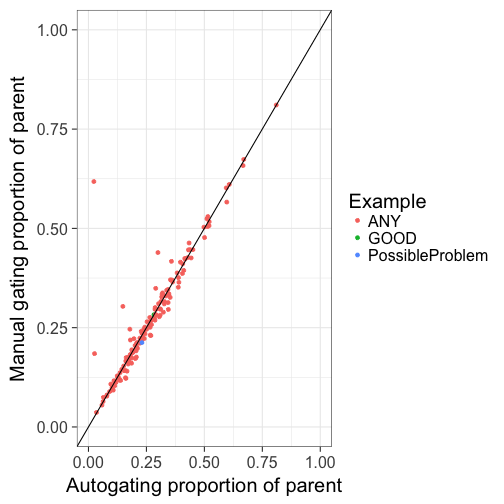
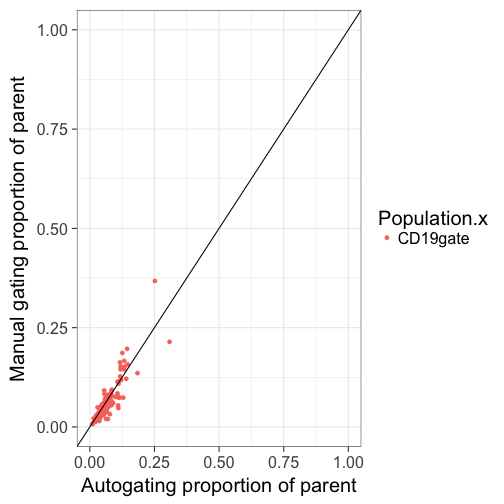
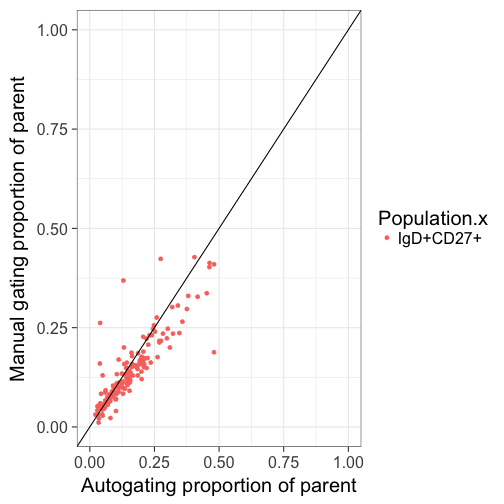

Auto gating update
========================================================
author: 
date: 
autosize: true

April 11th, 2017

OpenCyto
========================================================
[Finak, Frelinger, Jiang, et al. (2014)](https://doi.org/10.1371%2Fjournal.pcbi.1003806)
- Mimics manual gating by focusing on 2 channels at a time
  - can follow traditional gate hierarchy
  - e.g. gate lymph, then single, then live, etc
- Pipeline templates defined in .csv file
  - defines algorithmic approach for each gate to be applied across many samples
  - not "just push go", takes some setup for a decent template
- Results are interpretable and labelled populations 
  - not geared toward detecting novel cell types

OpenCyto
========================================================

> The two top performing gating algorithms - OpenCyto (v. 1.7.4), flowDensity (v. 1.4.0) - in a study run by the FlowCAP consortium aimed at selecting the best performing algorithms for this larger study were chosen for the analysis presented in this paper. ***Standardizing Flow Cytometry Immunophenotyping Analysis from the Human ImmunoPhenotyping Consortium*** [Finak, Langweiler, Jaimes, et al. (2016)](https://doi.org/10.1038%2Fsrep20686)

- Stole template from above as a start
  - our panel 1 template currently lives [here](https://github.com/PankratzLab/auto-fcs/blob/master/explore/openCyto/lymph.dev.b.csv)
  
Current progress overview 
========================================================
class: esmall-table

| N_SAMPS| N_DATA|    RHO|  BETA| BETA_SE|     R2|  ICC_1|
|-------:|------:|------:|-----:|-------:|------:|------:|
|     151|   2265| 0.9846| 1.015|  0.0015| 0.9949| 0.9972|
***

| N_SAMPS| N_DATA|   RHO|   BETA| BETA_SE|     R2| ICC_1|
|-------:|------:|-----:|------:|-------:|------:|-----:|
|     151|   2265| 0.979| 0.9861|  0.0031| 0.9782| 0.989|

Next few slides
========================================================
class: esmall-table

- For each gate
  - a good-ish example of an auto gate
  - a bad example/common problems
  - overview of gate success
 
Lymphocytes (SSC-A v FSC-A)
========================================================
class: esmall-table

|     |   FN|     TN|    TP| FP|    ACC|   SENS| SPEC| PREC|
|:----|----:|------:|-----:|--:|------:|------:|----:|----:|
|Freq | 1490| 142572| 28420|  0| 0.9914| 0.9502|    1|    1|
***

|     |   FN|    FP|     TN|    TP|    ACC|   SENS|   SPEC|   PREC|
|:----|----:|-----:|------:|-----:|------:|------:|------:|------:|
|Freq | 2849| 22579| 778949| 38211| 0.9698| 0.9306| 0.9718| 0.6286|

- may decrease the quantile of lymph cluster from 95% back to 90%

Lymphocytes (SSC-A v FSC-A)
========================================================
class: esmall-table

| N_SAMPS| N_DATA|    RHO|  BETA| BETA_SE|     R2|  ICC_1|
|-------:|------:|------:|-----:|-------:|------:|------:|
|     151|    151| 0.9885| 1.014|  0.0078| 0.9912| 0.9953|
***

| N_SAMPS| N_DATA|    RHO|  BETA| BETA_SE|     R2|  ICC_1|
|-------:|------:|------:|-----:|-------:|------:|------:|
|     151|    151| 0.9968| 1.038|   0.005| 0.9966| 0.9972|

Single Cells (FSC-H v FSC-W)
========================================================
class: esmall-table

|     |  FN|    FP|      TN|    TP|    ACC|   SENS|   SPEC|   PREC|
|:----|---:|-----:|-------:|-----:|------:|------:|------:|------:|
|Freq | 224| 10743| 1096246| 84062| 0.9908| 0.9973| 0.9903| 0.8867|

***

|     |    FN| FP|      TN|     TP|    ACC|   SENS| SPEC|   PREC|
|:----|-----:|--:|-------:|------:|------:|------:|----:|------:|
|Freq | 10397| 46| 1237576| 143142| 0.9925| 0.9323|    1| 0.9997|

- Force FSC-W+ to have a minimum cutoff or make more inclusive ? What is the manual strategy?

Single Cells (FSC-H v FSC-W)
========================================================
class: esmall-table

| N_SAMPS| N_DATA|    RHO|  BETA| BETA_SE|     R2|  ICC_1|
|-------:|------:|------:|-----:|-------:|------:|------:|
|     151|    151| 0.9822| 1.018|  0.0087| 0.9892| 0.9935|
***

| N_SAMPS| N_DATA|    RHO|  BETA| BETA_SE|     R2|   ICC_1|
|-------:|------:|------:|-----:|-------:|------:|-------:|
|     151|    151| 0.0585| 0.032|  0.0225| 0.0134| -0.0278|

Live cells (PE-)
========================================================
class: esmall-table

|     |  FN|    FP|      TN|    TP|    ACC|   SENS|   SPEC|   PREC|
|:----|---:|-----:|-------:|-----:|------:|------:|------:|------:|
|Freq | 213| 10668| 1096940| 83454| 0.9909| 0.9975| 0.9904| 0.8867|

***

|     |    FN|   FP|     TN|     TP|   ACC|   SENS|   SPEC|   PREC|
|:----|-----:|----:|------:|------:|-----:|------:|------:|------:|
|Freq | 17050| 7378| 476522| 178534| 0.964| 0.9128| 0.9848| 0.9603|

Live cells (PE-)
========================================================
class: esmall-table

| N_SAMPS| N_DATA|    RHO|  BETA| BETA_SE|     R2|  ICC_1|
|-------:|------:|------:|-----:|-------:|------:|------:|
|     151|    151| 0.9821| 1.019|  0.0088| 0.9889| 0.9933|
***

| N_SAMPS| N_DATA|    RHO|  BETA| BETA_SE|     R2|  ICC_1|
|-------:|------:|------:|-----:|-------:|------:|------:|
|     151|    151| 0.6801| 1.064|  0.0931| 0.4672| 0.6227|

Tcells (CD3+ CD19-)
========================================================
class: esmall-table

|     |   FN|  FP|      TN|     TP|    ACC|   SENS|   SPEC|  PREC|
|:----|----:|---:|-------:|------:|------:|------:|------:|-----:|
|Freq | 4244| 273| 1454088| 136130| 0.9972| 0.9698| 0.9998| 0.998|

***

|     |   FN|   FP|     TN|    TP|    ACC|   SENS|  SPEC|   PREC|
|:----|----:|----:|------:|-----:|------:|------:|-----:|------:|
|Freq | 1393| 3028| 603276| 43658| 0.9932| 0.9691| 0.995| 0.9351|
    
- can trim sides (and a bit less on left side)

Tcells (CD3+ CD19-)
========================================================
class: esmall-table

| N_SAMPS| N_DATA|    RHO|   BETA| BETA_SE|     R2|  ICC_1|
|-------:|------:|------:|------:|-------:|------:|------:|
|     151|    151| 0.9958| 0.9979|  0.0054| 0.9956| 0.9978|
***

| N_SAMPS| N_DATA|    RHO|   BETA| BETA_SE|     R2|  ICC_1|
|-------:|------:|------:|------:|-------:|------:|------:|
|     151|    151| 0.9784| 0.9059|  0.0133| 0.9687| 0.9711|

Helper Tcells-CD4+
========================================================
class: esmall-table

|     |  FN|  FP|     TN|   TP|    ACC|   SENS|   SPEC|   PREC|
|:----|---:|---:|------:|----:|------:|------:|------:|------:|
|Freq | 880| 104| 524259| 6874| 0.9982| 0.8865| 0.9998| 0.9851|

***

|     |   FN|   FP|     TN|    TP|    ACC|  SENS|   SPEC|   PREC|
|:----|----:|----:|------:|-----:|------:|-----:|------:|------:|
|Freq | 5807| 7577| 963616| 94294| 0.9875| 0.942| 0.9922| 0.9256|

Helper Tcells-CD4+
========================================================
class: esmall-table

| N_SAMPS| N_DATA|    RHO|  BETA| BETA_SE|    R2|  ICC_1|
|-------:|------:|------:|-----:|-------:|-----:|------:|
|     151|    151| 0.9891| 1.015|  0.0113| 0.982| 0.9897|
***

| N_SAMPS| N_DATA|    RHO|   BETA| BETA_SE|     R2|  ICC_1|
|-------:|------:|------:|------:|-------:|------:|------:|
|     151|    151| 0.9709| 0.9173|  0.0215| 0.9241| 0.9539|

central memory helper Tcells (CCR7+ CD45RA-)
========================================================
class: esmall-table

***

central memory helper Tcells (CCR7+ CD45RA-)
========================================================
class: esmall-table

| N_SAMPS| N_DATA|    RHO|   BETA| BETA_SE|     R2|  ICC_1|
|-------:|------:|------:|------:|-------:|------:|------:|
|     151|    151| 0.9643| 0.9344|  0.0238| 0.9121| 0.9542|
***

| N_SAMPS| N_DATA|   RHO|   BETA| BETA_SE|     R2|  ICC_1|
|-------:|------:|-----:|------:|-------:|------:|------:|
|     151|    151| 0.898| 0.7929|  0.0329| 0.7959| 0.8867|

effector helper Tcells (CCR7- CD45RA+)
========================================================
class: esmall-table

|     |   FN|   FP|      TN|    TP|    ACC|  SENS|   SPEC|   PREC|
|:----|----:|----:|-------:|-----:|------:|-----:|------:|------:|
|Freq | 3307| 1114| 2113444| 22741| 0.9979| 0.873| 0.9995| 0.9533|

***

|     |  FN|    FP|     TN|    TP|    ACC|   SENS|   SPEC|   PREC|
|:----|---:|-----:|------:|-----:|------:|------:|------:|------:|
|Freq | 953| 19155| 786225| 21460| 0.9757| 0.9575| 0.9762| 0.5284|

effector helper Tcells (CCR7- CD45RA+)
========================================================
class: esmall-table

| N_SAMPS| N_DATA|    RHO|   BETA| BETA_SE|     R2|  ICC_1|
|-------:|------:|------:|------:|-------:|------:|------:|
|     151|    151| 0.7592| 0.8319|  0.0386| 0.7567| 0.8635|
***

| N_SAMPS| N_DATA|    RHO|   BETA| BETA_SE|   R2| ICC_1|
|-------:|------:|------:|------:|-------:|----:|-----:|
|     151|    151| 0.7198| 0.7991|  0.0695| 0.47| 0.661|

effector memory helper Tcells (CCR7- CD45RA-)
========================================================
class: esmall-table

|     |   FN|  FP|      TN|   TP|    ACC|   SENS|   SPEC|  PREC|
|:----|----:|---:|-------:|----:|------:|------:|------:|-----:|
|Freq | 1509| 240| 1382591| 6821| 0.9987| 0.8188| 0.9998| 0.966|

***

|     |  FN|   FP|     TN|    TP|    ACC|   SENS|  SPEC|   PREC|
|:----|---:|----:|------:|-----:|------:|------:|-----:|------:|
|Freq | 974| 6718| 948445| 12272| 0.9921| 0.9265| 0.993| 0.6462|

effector memory helper Tcells (CCR7- CD45RA-)
========================================================
class: esmall-table

| N_SAMPS| N_DATA|    RHO|   BETA| BETA_SE|     R2|  ICC_1|
|-------:|------:|------:|------:|-------:|------:|------:|
|     151|    151| 0.8323| 0.7918|  0.0357| 0.7677| 0.8681|
***

| N_SAMPS| N_DATA|    RHO|   BETA| BETA_SE|     R2|  ICC_1|
|-------:|------:|------:|------:|-------:|------:|------:|
|     151|    151| 0.7935| 0.7057|  0.0462| 0.6104| 0.7736|

naive helper Tcells (CCR7+ CD45RA+)
========================================================
class: esmall-table

|     |  FN|  FP|     TN|    TP|    ACC|   SENS|   SPEC|  PREC|
|:----|---:|---:|------:|-----:|------:|------:|------:|-----:|
|Freq | 827| 244| 926060| 26892| 0.9989| 0.9702| 0.9997| 0.991|

***

|     |    FN|  FP|     TN|    TP|    ACC|   SENS|   SPEC|   PREC|
|:----|-----:|---:|------:|-----:|------:|------:|------:|------:|
|Freq | 18678| 251| 789709| 19155| 0.9771| 0.5063| 0.9997| 0.9871|

naive helper Tcells (CCR7+ CD45RA+)
========================================================
class: esmall-table

| N_SAMPS| N_DATA|    RHO|   BETA| BETA_SE|     R2|  ICC_1|
|-------:|------:|------:|------:|-------:|------:|------:|
|     151|    151| 0.9714| 0.9777|  0.0133| 0.9733| 0.9853|
***

| N_SAMPS| N_DATA|    RHO|   BETA| BETA_SE|     R2| ICC_1|
|-------:|------:|------:|------:|-------:|------:|-----:|
|     151|    151| 0.9394| 0.7853|  0.0327| 0.7947| 0.885|

cytotoxic Tcells-CD8+
========================================================
class: esmall-table

|     |   FN|   FP|      TN|    TP|    ACC|   SENS|   SPEC|   PREC|
|:----|----:|----:|-------:|-----:|------:|------:|------:|------:|
|Freq | 2478| 2311| 1665944| 30763| 0.9972| 0.9255| 0.9986| 0.9301|

***

|     |   FN|   FP|     TN|    TP|    ACC|   SENS|   SPEC|   PREC|
|:----|----:|----:|------:|-----:|------:|------:|------:|------:|
|Freq | 2892| 5308| 926823| 33386| 0.9915| 0.9203| 0.9943| 0.8628|

cytotoxic Tcells-CD8+
========================================================
class: esmall-table

| N_SAMPS| N_DATA|    RHO|   BETA| BETA_SE|     R2|  ICC_1|
|-------:|------:|------:|------:|-------:|------:|------:|
|     151|    151| 0.9485| 0.9527|  0.0259| 0.9011| 0.9493|
***

| N_SAMPS| N_DATA|    RHO|   BETA| BETA_SE|    R2|  ICC_1|
|-------:|------:|------:|------:|-------:|-----:|------:|
|     151|    151| 0.9343| 0.9315|  0.0324| 0.847| 0.9204|

B cells (CD3- CD19+)
========================================================
class: esmall-table

|     |  FN|  FP|     TN|    TP|    ACC|   SENS|  SPEC|   PREC|
|:----|---:|---:|------:|-----:|------:|------:|-----:|------:|
|Freq | 531| 895| 937430| 15167| 0.9985| 0.9662| 0.999| 0.9443|

***

|     |  FN|   FP|      TN|    TP|    ACC|   SENS|   SPEC|   PREC|
|:----|---:|----:|-------:|-----:|------:|------:|------:|------:|
|Freq | 521| 8506| 2738594| 23528| 0.9967| 0.9783| 0.9969| 0.7345|

- typically over- or under-calling the sneaky Bcells on CD19 dimension

B cells (CD3- CD19+) 
========================================================
class: esmall-table

| N_SAMPS| N_DATA|    RHO|   BETA| BETA_SE|     R2|  ICC_1|
|-------:|------:|------:|------:|-------:|------:|------:|
|     151|    151| 0.9377| 0.9254|  0.0296| 0.8679| 0.9262|
***

| N_SAMPS| N_DATA|    RHO|  BETA| BETA_SE|     R2|  ICC_1|
|-------:|------:|------:|-----:|-------:|------:|------:|
|     151|    151| 0.8809| 1.002|  0.0428| 0.7857| 0.8714|

naive Bcells (CD27- IgD+)
========================================================
class: esmall-table

| N_SAMPS| N_DATA|   RHO|   BETA| BETA_SE|     R2|  ICC_1|
|-------:|------:|-----:|------:|-------:|------:|------:|
|     151|    151| 0.909| 0.8173|  0.0403| 0.7344| 0.8424|
***

| N_SAMPS| N_DATA|    RHO|   BETA| BETA_SE|     R2| ICC_1|
|-------:|------:|------:|------:|-------:|------:|-----:|
|     151|    151| 0.9128| 0.8498|  0.0367| 0.7828| 0.868|

IgD- memory Bcells (CD27+)
========================================================
class: esmall-table

| N_SAMPS| N_DATA|   RHO| BETA| BETA_SE|     R2|  ICC_1|
|-------:|------:|-----:|----:|-------:|------:|------:|
|     151|    151| 0.823| 1.16|  0.0443| 0.8211| 0.8764|
***

| N_SAMPS| N_DATA|    RHO|   BETA| BETA_SE|     R2|  ICC_1|
|-------:|------:|------:|------:|-------:|------:|------:|
|     151|    151| 0.8057| 0.4608|  0.0449| 0.4145| 0.5765|

IgD+ memory Bcells (CD27+)
========================================================
class: esmall-table

| N_SAMPS| N_DATA|    RHO|   BETA| BETA_SE|    R2| ICC_1|
|-------:|------:|------:|------:|-------:|-----:|-----:|
|     151|    151| 0.9212| 0.7128|  0.0113| 0.964| 0.925|
***

| N_SAMPS| N_DATA|    RHO|   BETA| BETA_SE|     R2|  ICC_1|
|-------:|------:|------:|------:|-------:|------:|------:|
|     151|    151| 0.8844| 0.7361|  0.0349| 0.7487| 0.8423|

Summary
========================================================

- OpenCyto seems to work
- Lots of room for improvement
- Iterative process

ICC
========================================================

From [Wikipedia](https://en.wikipedia.org/wiki/Intraclass_correlation)

[Cicchetti (1994)](https://doi.org/10.1037%2F1040-3590.6.4.284) gives the following often quoted guidelines for interpretation for kappa or ICC inter-rater agreement measures:

- Less than 0.40—poor.
- Between 0.40 and 0.59—Fair.
- Between 0.60 and 0.74—Good.
- Between 0.75 and 1.00—Excellent.

