<style>
.esmall-table table {
  border-width: 1px;
  border-spacing: 2px;
  border-style: dotted;
  border-color: gray;
  border-collapse: collapse;
  font-size: 0.4em;
}
 

.esmall-table table tr { line-height: 18px; }


.esmall-table table th {
  border-width: 1px;
  padding-left: 2px;
  padding-right: 2px;
  font-weight: bold;
  border-style: dotted;
  border-color: gray;
}

.esmall-table table td {
  border-width: 1px;
  padding-left: 2px;
  padding-right: 2px;
  border-style: dotted;
  border-color: gray;
}
.small-code pre code {
  font-size: .5em;
}

.small-p p{
  font-size: 8;
}

.small {  
    font-size: 8;
}


</style>

Auto gating update
========================================================
author: 
date: 
autosize: true

April 11th, 2017


OpenCyto
========================================================
<a name=cite-Finak_2014></a>[Finak, Frelinger, Jiang, et al. (2014)](https://doi.org/10.1371%2Fjournal.pcbi.1003806)
- Mimics manual gating by focusing on 2 channels at a time
  - can follow traditional gate hierarchy
  - e.g. gate lymph, then single, then live, etc
- Pipeline templates defined in .csv file
  - defines algorithmic approach for each gate to be applied across many samples
  - not "just push go", takes some setup for a decent template
- Results are interpretable and labelled populations 
  - not geared toward detecting novel cell types

OpenCyto
========================================================

> The two top performing gating algorithms - OpenCyto (v. 1.7.4), flowDensity (v. 1.4.0) - in a study run by the FlowCAP consortium aimed at selecting the best performing algorithms for this larger study were chosen for the analysis presented in this paper. ***Standardizing Flow Cytometry Immunophenotyping Analysis from the Human ImmunoPhenotyping Consortium*** <a name=cite-Finak_2016></a>[Finak, Langweiler, Jaimes, et al. (2016)](https://doi.org/10.1038%2Fsrep20686)

- Stole template from above as a start
  - our panel 1 template currently lives [here](https://github.com/PankratzLab/auto-fcs/blob/master/explore/openCyto/lymph.dev.b.csv)
 
ICC
========================================================

From [Wikipedia](https://en.wikipedia.org/wiki/Intraclass_correlation)

<a name=cite-Cicchetti_1994></a>[Cicchetti (1994)](https://doi.org/10.1037%2F1040-3590.6.4.284) gives the following often quoted guidelines for interpretation for kappa or ICC inter-rater agreement measures:

- Less than 0.40—poor.
- Between 0.40 and 0.59—Fair.
- Between 0.60 and 0.74—Good.
- Between 0.75 and 1.00—Excellent.
  
Current progress overview 
========================================================
class: esmall-table

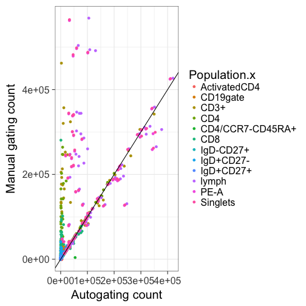


| N_SAMPS| N_DATA|    RHO|   BETA| BETA_SE|     R2|  ICC_1|
|-------:|------:|------:|------:|-------:|------:|------:|
|      70|    840| 0.8323| 0.9333|  0.0375| 0.4254| 0.5775|
***
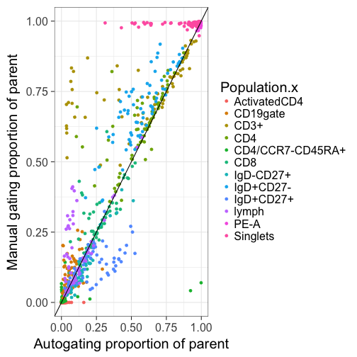


| N_SAMPS| N_DATA|    RHO|   BETA| BETA_SE|     R2|  ICC_1|
|-------:|------:|------:|------:|-------:|------:|------:|
|      70|    840| 0.9207| 0.9804|  0.0136| 0.8604| 0.9217|

Example OpenCyto gates
========================================================
class: esmall-table

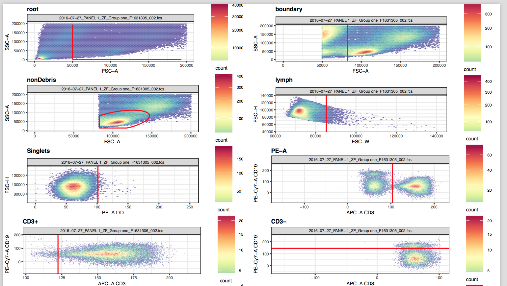

***
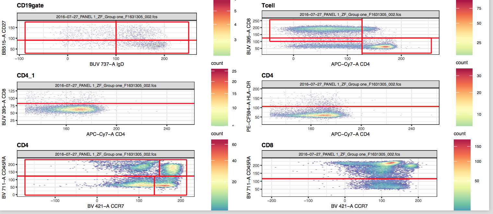

Next few slides
========================================================
class: esmall-table

- For each gate
  - a good-ish example of an auto gate
  - a bad example/common problems
  - overview of gate performance
 
Lymphocytes (SSC-A v FSC-A)
========================================================
class: esmall-table


|     |   FN|     TN|    TP| FP|    ACC|   SENS| SPEC| PREC|
|:----|----:|------:|-----:|--:|------:|------:|----:|----:|
|Freq | 1490| 142572| 28420|  0| 0.9914| 0.9502|    1|    1|
***


|     |   FN|    FP|     TN|    TP|    ACC|   SENS|   SPEC|   PREC|
|:----|----:|-----:|------:|-----:|------:|------:|------:|------:|
|Freq | 2849| 22579| 778949| 38211| 0.9698| 0.9306| 0.9718| 0.6286|

- may decrease the quantile of lymph cluster from 95% back to 90%


Lymphocytes (SSC-A v FSC-A)
========================================================
class: esmall-table

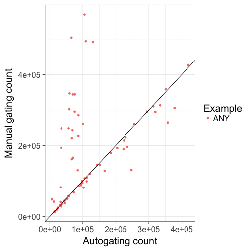


| N_SAMPS| N_DATA|    RHO|   BETA| BETA_SE|     R2|  ICC_1|
|-------:|------:|------:|------:|-------:|------:|------:|
|      70|     70| 0.6457| 0.6378|  0.1412| 0.2308| 0.3835|
***
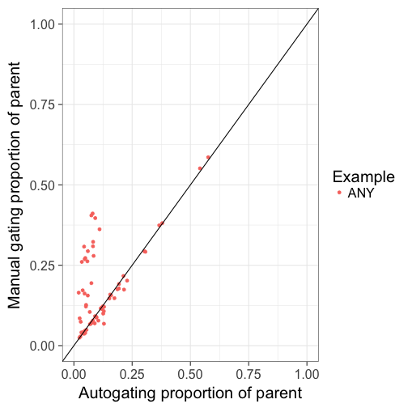


| N_SAMPS| N_DATA|   RHO|   BETA| BETA_SE|     R2|  ICC_1|
|-------:|------:|-----:|------:|-------:|------:|------:|
|      70|     70| 0.453| 0.7265|  0.1106| 0.3884| 0.5385|


Single Cells (FSC-H v FSC-W)
========================================================
class: esmall-table


|     |  FN|    FP|      TN|    TP|    ACC|   SENS|   SPEC|   PREC|
|:----|---:|-----:|-------:|-----:|------:|------:|------:|------:|
|Freq | 224| 10743| 1096246| 84062| 0.9908| 0.9973| 0.9903| 0.8867|

***

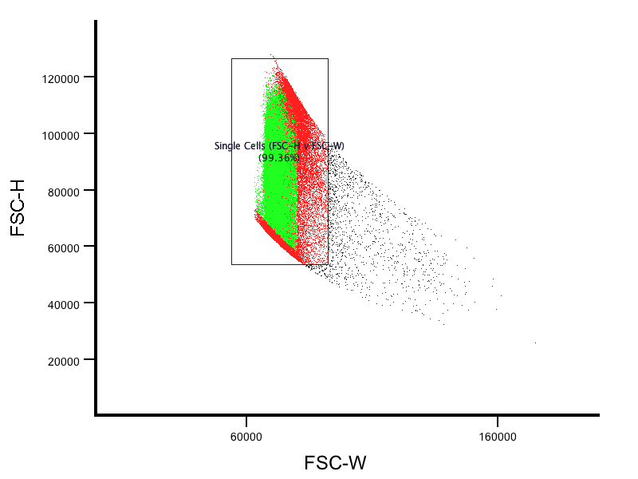


|     |    FN|     TN|     TP| FP|   ACC|  SENS| SPEC| PREC|
|:----|-----:|------:|------:|--:|-----:|-----:|----:|----:|
|Freq | 20389| 869379| 181526|  0| 0.981| 0.899|    1|    1|

- Force FSC-W+ to have a minimum cutoff or make more inclusive ? What is the manual strategy?

Single Cells (FSC-H v FSC-W)
========================================================
class: esmall-table

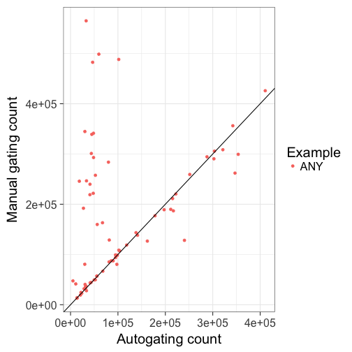


| N_SAMPS| N_DATA|    RHO|   BETA| BETA_SE|     R2|  ICC_1|
|-------:|------:|------:|------:|-------:|------:|------:|
|      70|     70| 0.4826| 0.5068|  0.1477| 0.1477| 0.2706|
***
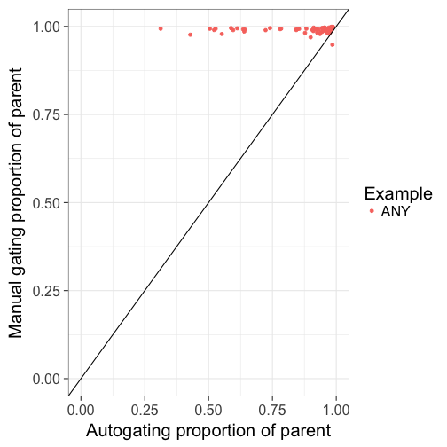


| N_SAMPS| N_DATA|    RHO|   BETA| BETA_SE|    R2|   ICC_1|
|-------:|------:|------:|------:|-------:|-----:|-------:|
|      70|     70| 0.1256| -4e-04|  0.0057| 1e-04| -0.2188|


Live cells (PE-)
========================================================
class: esmall-table


|     |  FN|    FP|      TN|    TP|    ACC|   SENS|   SPEC|   PREC|
|:----|---:|-----:|-------:|-----:|------:|------:|------:|------:|
|Freq | 213| 10668| 1096940| 83454| 0.9909| 0.9975| 0.9904| 0.8867|


***

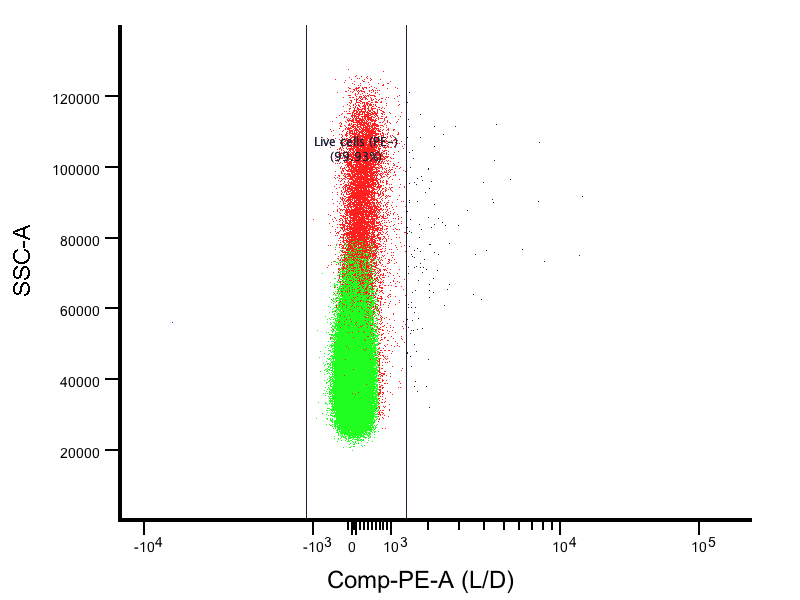


|     |    FN|   FP|     TN|     TP|   ACC|   SENS|   SPEC|   PREC|
|:----|-----:|----:|------:|------:|-----:|------:|------:|------:|
|Freq | 17050| 7378| 476522| 178534| 0.964| 0.9128| 0.9848| 0.9603|

- victim of singlet gate

Live cells (PE-)
========================================================
class: esmall-table


| N_SAMPS| N_DATA|    RHO|   BETA| BETA_SE|     R2|  ICC_1|
|-------:|------:|------:|------:|-------:|------:|------:|
|      70|     70| 0.4872| 0.5117|  0.1487| 0.1483| 0.2699|
***
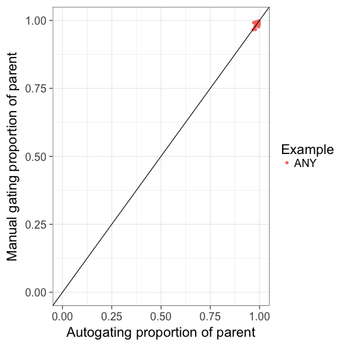


| N_SAMPS| N_DATA|   RHO|   BETA| BETA_SE|     R2|  ICC_1|
|-------:|------:|-----:|------:|-------:|------:|------:|
|      70|     70| 0.458| 0.4491|  0.0965| 0.2417| 0.4896|


Tcells (CD3+ CD19-)
========================================================
class: esmall-table


|     |   FN|  FP|      TN|     TP|    ACC|   SENS|   SPEC|  PREC|
|:----|----:|---:|-------:|------:|------:|------:|------:|-----:|
|Freq | 4244| 273| 1454088| 136130| 0.9972| 0.9698| 0.9998| 0.998|

***


|     |   FN|   FP|     TN|    TP|    ACC|   SENS|  SPEC|   PREC|
|:----|----:|----:|------:|-----:|------:|------:|-----:|------:|
|Freq | 1393| 3028| 603276| 43658| 0.9932| 0.9691| 0.995| 0.9351|
    
- can trim sides (and a bit less on left side)

Tcells (CD3+ CD19-)
========================================================
class: esmall-table

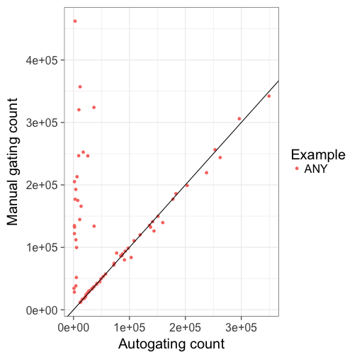


| N_SAMPS| N_DATA|    RHO|   BETA| BETA_SE|     R2|  ICC_1|
|-------:|------:|------:|------:|-------:|------:|------:|
|      70|     70| 0.1769| 0.4263|  0.1419| 0.1172| 0.2126|
***
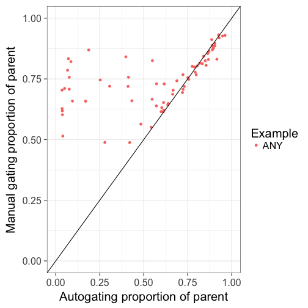


| N_SAMPS| N_DATA|    RHO|  BETA| BETA_SE|     R2|  ICC_1|
|-------:|------:|------:|-----:|-------:|------:|------:|
|      70|     70| 0.6739| 0.198|  0.0375| 0.2904| 0.1873|


Helper Tcells-CD4+
========================================================
class: esmall-table


|     |  FN|  FP|     TN|   TP|    ACC|   SENS|   SPEC|   PREC|
|:----|---:|---:|------:|----:|------:|------:|------:|------:|
|Freq | 880| 104| 524259| 6874| 0.9982| 0.8865| 0.9998| 0.9851|


***


|     |   FN|   FP|     TN|    TP|    ACC|  SENS|   SPEC|   PREC|
|:----|----:|----:|------:|-----:|------:|-----:|------:|------:|
|Freq | 5807| 7577| 963616| 94294| 0.9875| 0.942| 0.9922| 0.9256|

Helper Tcells-CD4+
========================================================
class: esmall-table

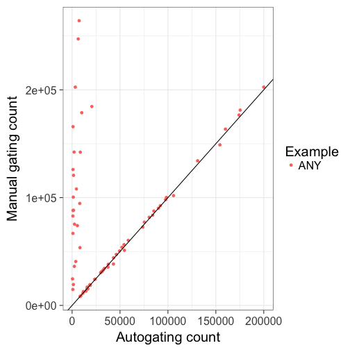


| N_SAMPS| N_DATA|    RHO|   BETA| BETA_SE|     R2|  ICC_1|
|-------:|------:|------:|------:|-------:|------:|------:|
|      70|     70| 0.1555| 0.4438|  0.1441| 0.1224| 0.2063|
***
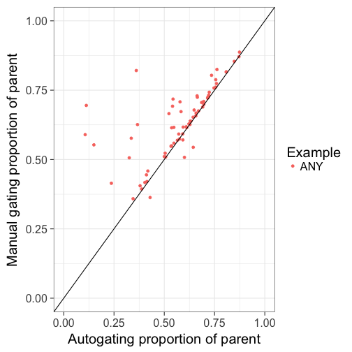


| N_SAMPS| N_DATA|   RHO|   BETA| BETA_SE|     R2|  ICC_1|
|-------:|------:|-----:|------:|-------:|------:|------:|
|      70|     70| 0.788| 0.5159|  0.0657| 0.4756| 0.6041|

central memory helper Tcells (CCR7+ CD45RA-)
========================================================
class: esmall-table


 

|     |   FN|  FP|     TN|    TP|    ACC|   SENS|   SPEC|   PREC|
|:----|----:|---:|------:|-----:|------:|------:|------:|------:|
|Freq | 9690| 660| 764298| 53145| 0.9875| 0.8458| 0.9991| 0.9877|


***


|     |   FN|    FP|      TN|    TP|    ACC|   SENS|   SPEC|  PREC|
|:----|----:|-----:|-------:|-----:|------:|------:|------:|-----:|
|Freq | 1069| 11497| 1698781| 28289| 0.9928| 0.9636| 0.9933| 0.711|

 


central memory helper Tcells (CCR7+ CD45RA-)
========================================================
class: esmall-table


```
Error in `$<-.data.frame`(`*tmp*`, "Example", value = "ANY") : 
  replacement has 1 row, data has 0
```
