

Auto gating update
========================================================
author: 
date: 
autosize: true

April 11th, 2017

Current progress overview 
========================================================
class: esmall-table

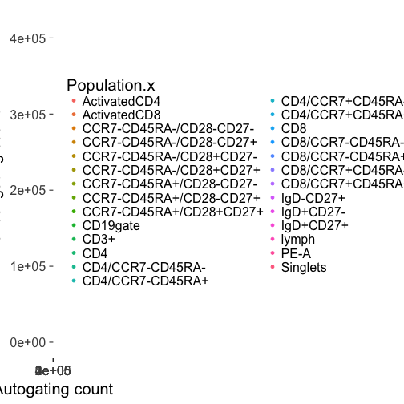

| N_SAMPS| N_DATA|    RHO|   BETA| BETA_SE|     R2|  ICC_1|
|-------:|------:|------:|------:|-------:|------:|------:|
|     151|   4077| 0.9486| 0.9803|  0.0026| 0.9731| 0.9864|
***
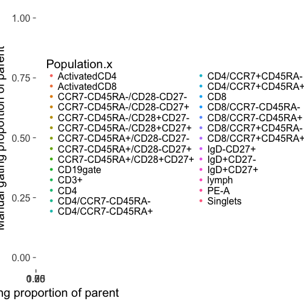

| N_SAMPS| N_DATA|    RHO|   BETA| BETA_SE|     R2|  ICC_1|
|-------:|------:|------:|------:|-------:|------:|------:|
|     151|   4077| 0.9379| 0.9557|  0.0045| 0.9182| 0.9582|

Next few slides
========================================================
class: esmall-table

- For each gate
  - a good-ish example of an auto gate
  - a bad example/common problems
  - overview of gate performance
 

Lymphocytes (SSC-A v FSC-A)
========================================================
class: esmall-table

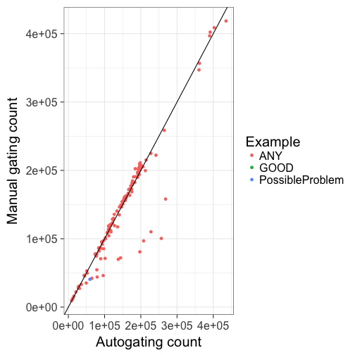

| N_SAMPS| N_DATA|    RHO|  BETA| BETA_SE|     R2|  ICC_1|
|-------:|------:|------:|-----:|-------:|------:|------:|
|     151|    151| 0.9078| 0.969|  0.0269| 0.8971| 0.9457|
***
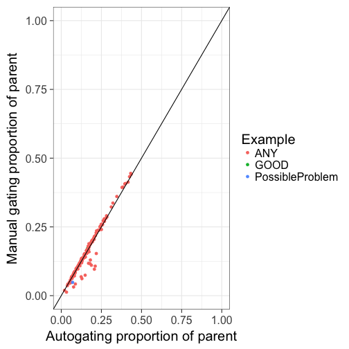

| N_SAMPS| N_DATA|    RHO|  BETA| BETA_SE|     R2| ICC_1|
|-------:|------:|------:|-----:|-------:|------:|-----:|
|     151|    151| 0.9447| 1.035|   0.019| 0.9524| 0.974|

Single Cells (FSC-H v FSC-W)
========================================================
class: esmall-table

| N_SAMPS| N_DATA|    RHO|   BETA| BETA_SE|    R2|  ICC_1|
|-------:|------:|------:|------:|-------:|-----:|------:|
|     151|    151| 0.9061| 0.9759|  0.0274| 0.895| 0.9454|
***
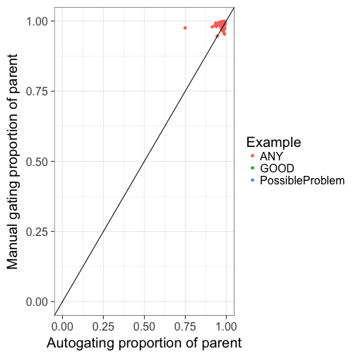

| N_SAMPS| N_DATA|    RHO|   BETA| BETA_SE|     R2|   ICC_1|
|-------:|------:|------:|------:|-------:|------:|-------:|
|     151|    151| 0.1402| 0.0683|  0.0331| 0.0278| -0.0332|

Live cells (PE-)
========================================================
class: esmall-table

| N_SAMPS| N_DATA|    RHO|  BETA| BETA_SE|     R2|  ICC_1|
|-------:|------:|------:|-----:|-------:|------:|------:|
|     151|    151| 0.9105| 0.988|  0.0251| 0.9124| 0.9548|
***

| N_SAMPS| N_DATA|    RHO|   BETA| BETA_SE|     R2|  ICC_1|
|-------:|------:|------:|------:|-------:|------:|------:|
|     151|    151| 0.6048| 0.0486|  0.0094| 0.1511| 0.0774|

Tcells (CD3+ CD19-)
========================================================
class: esmall-table

| N_SAMPS| N_DATA|    RHO|   BETA| BETA_SE|     R2|  ICC_1|
|-------:|------:|------:|------:|-------:|------:|------:|
|     151|    151| 0.9811| 0.9967|  0.0121| 0.9784| 0.9887|
***
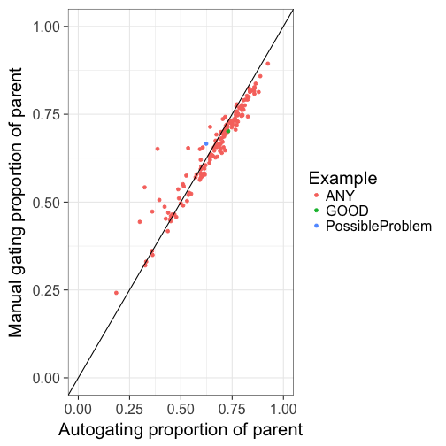

| N_SAMPS| N_DATA|    RHO|   BETA| BETA_SE|     R2|  ICC_1|
|-------:|------:|------:|------:|-------:|------:|------:|
|     151|    151| 0.9698| 0.8094|  0.0203| 0.9144| 0.9414|

Helper Tcells-CD4+
========================================================
class: esmall-table

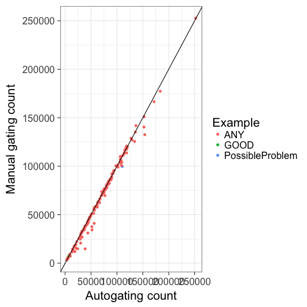

| N_SAMPS| N_DATA|    RHO|  BETA| BETA_SE|     R2|  ICC_1|
|-------:|------:|------:|-----:|-------:|------:|------:|
|     151|    151| 0.9945| 0.996|   0.008| 0.9904| 0.9942|
***
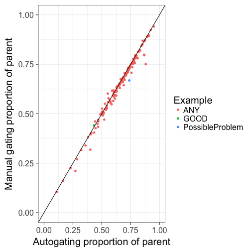

| N_SAMPS| N_DATA|    RHO|   BETA| BETA_SE|     R2|  ICC_1|
|-------:|------:|------:|------:|-------:|------:|------:|
|     151|    151| 0.9912| 0.9926|  0.0105| 0.9836| 0.9895|

central memory helper Tcells (CCR7+ CD45RA-)
========================================================
class: esmall-table

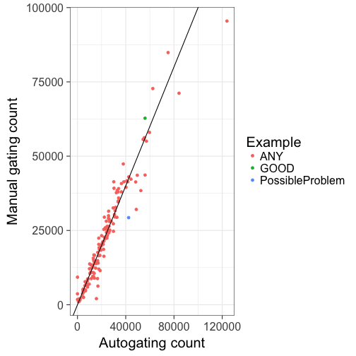

| N_SAMPS| N_DATA|    RHO|   BETA| BETA_SE|     R2| ICC_1|
|-------:|------:|------:|------:|-------:|------:|-----:|
|     151|    151| 0.9708| 0.9251|  0.0216| 0.9249| 0.961|
***
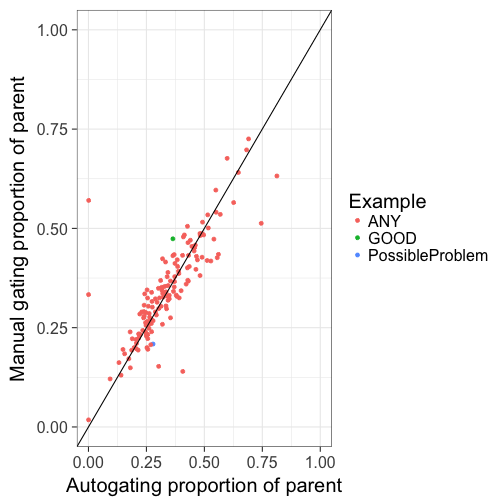

| N_SAMPS| N_DATA|    RHO|   BETA| BETA_SE|     R2|  ICC_1|
|-------:|------:|------:|------:|-------:|------:|------:|
|     151|    151| 0.8531| 0.7354|  0.0416| 0.6768| 0.8183|

effector helper Tcells (CCR7- CD45RA+)
========================================================
class: esmall-table

| N_SAMPS| N_DATA|    RHO|   BETA| BETA_SE|     R2|  ICC_1|
|-------:|------:|------:|------:|-------:|------:|------:|
|     151|    151| 0.7584| 0.5688|  0.0314| 0.6879| 0.7751|
***

| N_SAMPS| N_DATA|    RHO|   BETA| BETA_SE|     R2|  ICC_1|
|-------:|------:|------:|------:|-------:|------:|------:|
|     151|    151| 0.7004| 0.6306|  0.0581| 0.4412| 0.6607|

effector memory helper Tcells (CCR7- CD45RA-)
========================================================
class: esmall-table

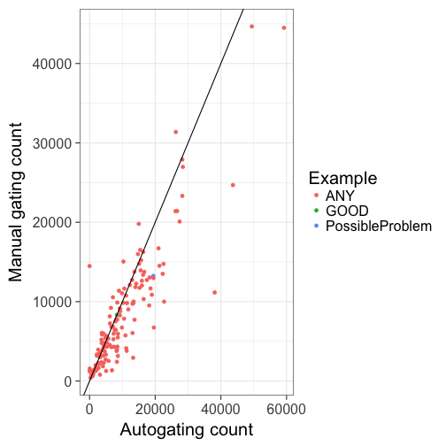

| N_SAMPS| N_DATA|    RHO|   BETA| BETA_SE|     R2|  ICC_1|
|-------:|------:|------:|------:|-------:|------:|------:|
|     151|    151| 0.8772| 0.7078|  0.0289| 0.8013| 0.8459|
***
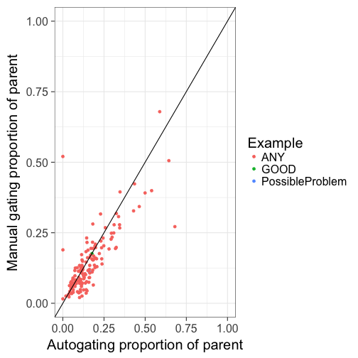

| N_SAMPS| N_DATA|    RHO|   BETA| BETA_SE|   R2|  ICC_1|
|-------:|------:|------:|------:|-------:|----:|------:|
|     151|    151| 0.7775| 0.7035|  0.0442| 0.63| 0.7765|

naive helper Tcells (CCR7+ CD45RA+)
========================================================
class: esmall-table

| N_SAMPS| N_DATA|    RHO|   BETA| BETA_SE|    R2|  ICC_1|
|-------:|------:|------:|------:|-------:|-----:|------:|
|     151|    151| 0.9683| 0.9663|  0.0134| 0.972| 0.9856|
***
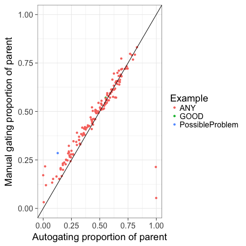

| N_SAMPS| N_DATA|    RHO|  BETA| BETA_SE|     R2| ICC_1|
|-------:|------:|------:|-----:|-------:|------:|-----:|
|     151|    151| 0.9178| 0.738|  0.0381| 0.7162| 0.838|

cytotoxic Tcells-CD8+
========================================================
class: esmall-table

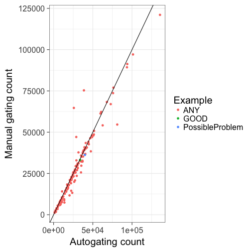

| N_SAMPS| N_DATA|    RHO|   BETA| BETA_SE|     R2|  ICC_1|
|-------:|------:|------:|------:|-------:|------:|------:|
|     151|    151| 0.9786| 0.9468|   0.022| 0.9256| 0.9611|
***
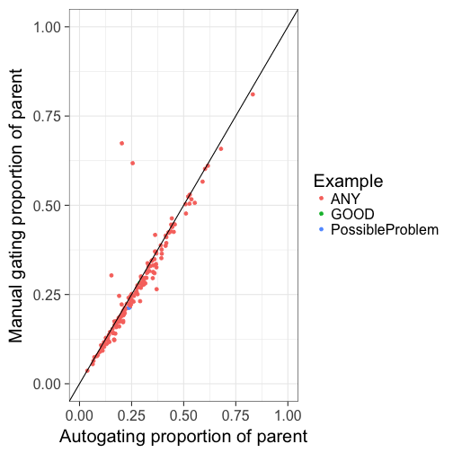

| N_SAMPS| N_DATA|    RHO|   BETA| BETA_SE|     R2|  ICC_1|
|-------:|------:|------:|------:|-------:|------:|------:|
|     151|    151| 0.9505| 0.9599|  0.0327| 0.8524| 0.9221|

activated cytotoxic Tcells (CD8+ HLA-DR+)
========================================================
class: esmall-table

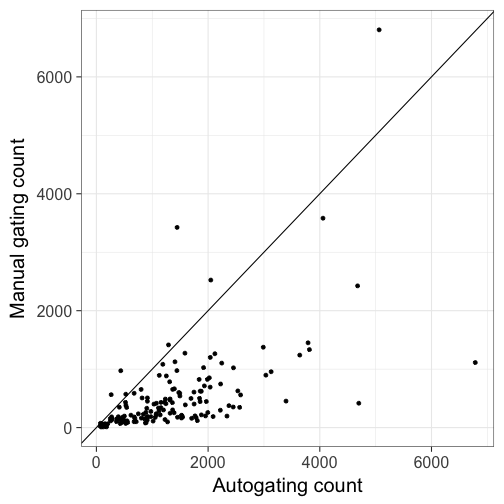

| N_SAMPS| N_DATA|    RHO|   BETA| BETA_SE|     R2|  ICC_1|
|-------:|------:|------:|------:|-------:|------:|------:|
|     151|    151| 0.6857| 0.4096|   0.047| 0.3376| 0.2755|
***
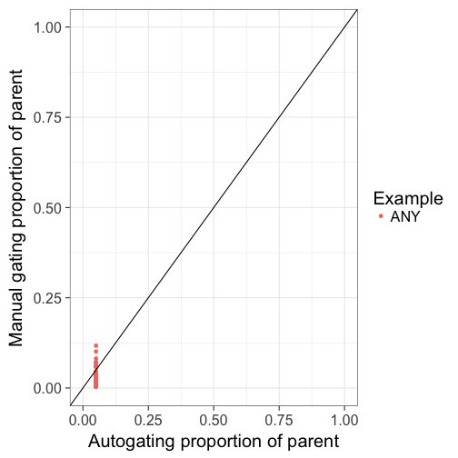

| N_SAMPS| N_DATA|    RHO| BETA| BETA_SE|     R2|  ICC_1|
|-------:|------:|------:|----:|-------:|------:|------:|
|     151|    151| 0.0558| 42.4|   20.96| 0.0267| -0.548|

central memory cytotoxic Tcells (CCR7+ , CD45RA-)
========================================================
class: esmall-table

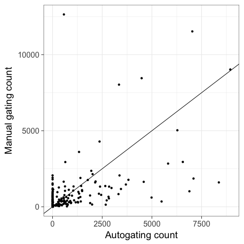

| N_SAMPS| N_DATA|    RHO|   BETA| BETA_SE|     R2|  ICC_1|
|-------:|------:|------:|------:|-------:|------:|------:|
|     151|    151| 0.4222| 0.5092|  0.0724| 0.2491| 0.4988|
***
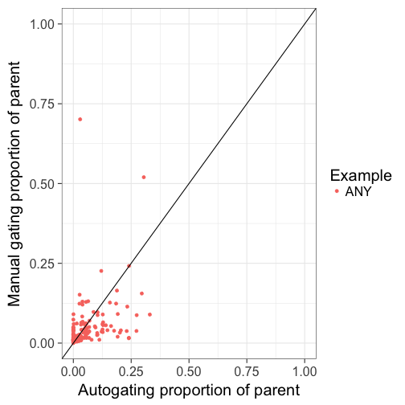

| N_SAMPS| N_DATA|    RHO|   BETA| BETA_SE|     R2|  ICC_1|
|-------:|------:|------:|------:|-------:|------:|------:|
|     151|    151| 0.5344| 0.3619|  0.0789| 0.1236| 0.3473|

effector cytotoxic Tcells  (CCR7-  CD45RA+)
========================================================
class: esmall-table

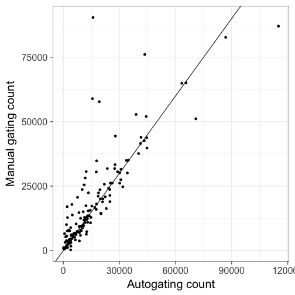

| N_SAMPS| N_DATA|    RHO|   BETA| BETA_SE|     R2|  ICC_1|
|-------:|------:|------:|------:|-------:|------:|------:|
|     151|    151| 0.9009| 0.9028|  0.0462| 0.7196| 0.8391|
***

| N_SAMPS| N_DATA|    RHO|   BETA| BETA_SE|     R2| ICC_1|
|-------:|------:|------:|------:|-------:|------:|-----:|
|     151|    151| 0.7775| 0.6369|  0.0433| 0.5923| 0.692|

pE cytotoxic Tcells (CD27-  CD28-)
========================================================
class: esmall-table

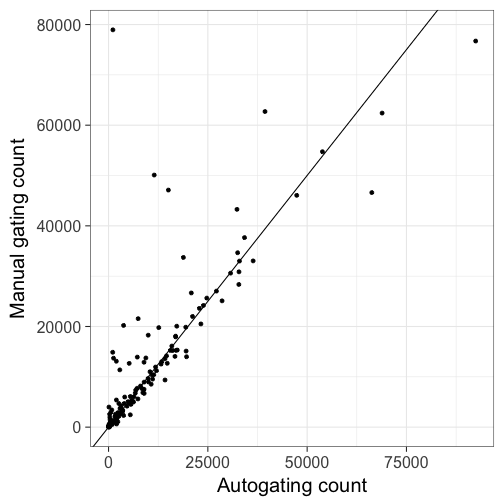

| N_SAMPS| N_DATA|    RHO|   BETA| BETA_SE|     R2|  ICC_1|
|-------:|------:|------:|------:|-------:|------:|------:|
|     151|    151| 0.9032| 0.8906|  0.0496| 0.6844| 0.8204|
***
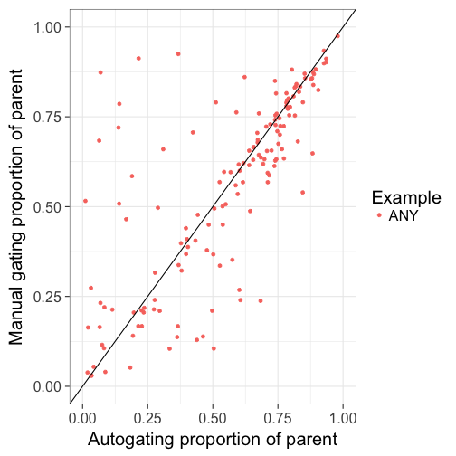

| N_SAMPS| N_DATA|    RHO|   BETA| BETA_SE|     R2|  ICC_1|
|-------:|------:|------:|------:|-------:|------:|------:|
|     151|    151| 0.7637| 0.7166|  0.0529| 0.5517| 0.7435|

pE1 cytotoxic Tcells (CD27+  CD28+)
========================================================
class: esmall-table

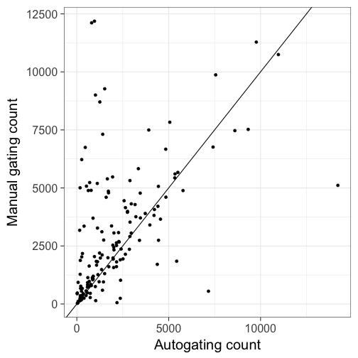

| N_SAMPS| N_DATA|    RHO|   BETA| BETA_SE|    R2|  ICC_1|
|-------:|------:|------:|------:|-------:|-----:|------:|
|     151|    151| 0.5989| 0.6076|   0.081| 0.274| 0.4742|
***
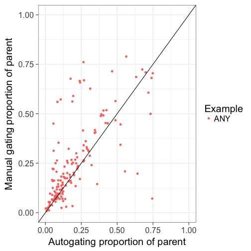

| N_SAMPS| N_DATA|    RHO|   BETA| BETA_SE|    R2|  ICC_1|
|-------:|------:|------:|------:|-------:|-----:|------:|
|     151|    151| 0.7452| 0.7733|  0.0665| 0.476| 0.6625|

pE2 cytotoxic Tcells (CD27+ , CD28-)
========================================================
class: esmall-table

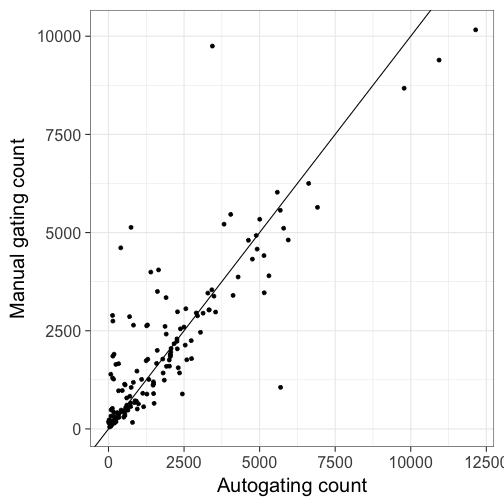

| N_SAMPS| N_DATA|    RHO|   BETA| BETA_SE|     R2|  ICC_1|
|-------:|------:|------:|------:|-------:|------:|------:|
|     151|    151| 0.8056| 0.8013|  0.0408| 0.7212| 0.8461|
***
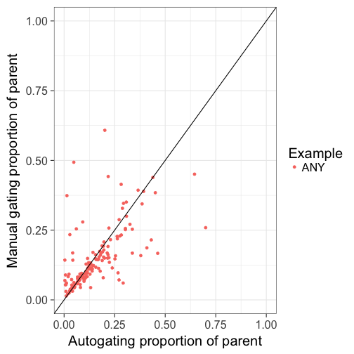

| N_SAMPS| N_DATA|    RHO|   BETA| BETA_SE|     R2|  ICC_1|
|-------:|------:|------:|------:|-------:|------:|------:|
|     151|    151| 0.7387| 0.5502|  0.0554| 0.3986| 0.6246|

effector memory cytotoxic Tcells (CCR7- , CD45RA-)
========================================================
class: esmall-table

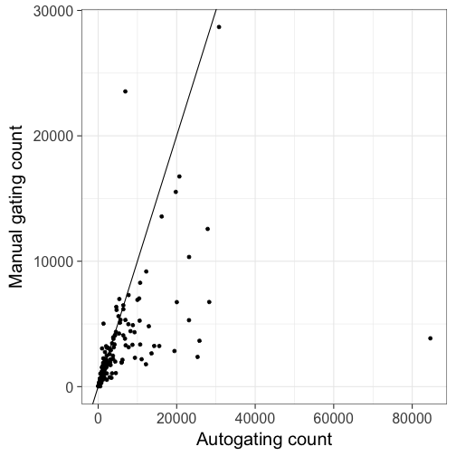

| N_SAMPS| N_DATA|    RHO|   BETA| BETA_SE|     R2|  ICC_1|
|-------:|------:|------:|------:|-------:|------:|------:|
|     151|    151| 0.8575| 0.2053|  0.0307| 0.2307| 0.3077|
***

EM1 cytotoxic Tcells (CD27+  CD28+)
========================================================
class: esmall-table

| N_SAMPS| N_DATA|    RHO|   BETA| BETA_SE|     R2|  ICC_1|
|-------:|------:|------:|------:|-------:|------:|------:|
|     151|    151| 0.8329| 0.3395|   0.032| 0.4299| 0.4687|
***
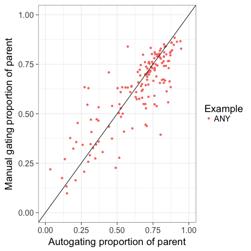

| N_SAMPS| N_DATA|    RHO|   BETA| BETA_SE|    R2|  ICC_1|
|-------:|------:|------:|------:|-------:|-----:|------:|
|     151|    151| 0.7949| 0.7274|  0.0393| 0.697| 0.8239|

EM2 cytotoxic Tcells (CD27+  CD28-)
========================================================
class: esmall-table

| N_SAMPS| N_DATA|    RHO|   BETA| BETA_SE|     R2|  ICC_1|
|-------:|------:|------:|------:|-------:|------:|------:|
|     151|    151| 0.8365| 0.3815|  0.0343| 0.4537| 0.5555|
***

| N_SAMPS| N_DATA|    RHO|   BETA| BETA_SE|     R2|  ICC_1|
|-------:|------:|------:|------:|-------:|------:|------:|
|     151|    151| 0.7438| 0.8394|  0.0506| 0.6488| 0.7939|

EM3 cytotoxic Tcells (CD27- CD28-)
========================================================
class: esmall-table

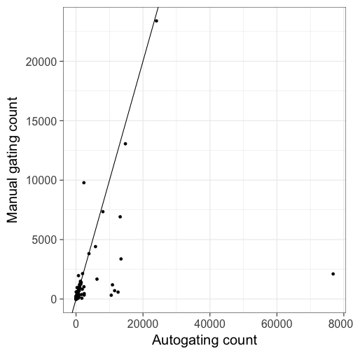

| N_SAMPS| N_DATA|    RHO|   BETA| BETA_SE|     R2|  ICC_1|
|-------:|------:|------:|------:|-------:|------:|------:|
|     151|    151| 0.8882| 0.1425|  0.0264| 0.1631| 0.2457|
***

| N_SAMPS| N_DATA|    RHO|   BETA| BETA_SE|     R2|  ICC_1|
|-------:|------:|------:|------:|-------:|------:|------:|
|     151|    151| 0.8786| 0.8097|  0.0324| 0.8077| 0.8945|

EM4 cytotoxic Tcells (CD27-  CD28+)
========================================================
class: esmall-table

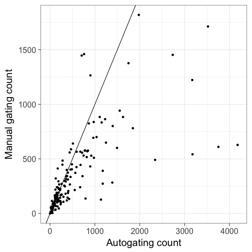

| N_SAMPS| N_DATA|    RHO|   BETA| BETA_SE|     R2|  ICC_1|
|-------:|------:|------:|------:|-------:|------:|------:|
|     151|    151| 0.8765| 0.3334|  0.0279| 0.4896| 0.4941|
***
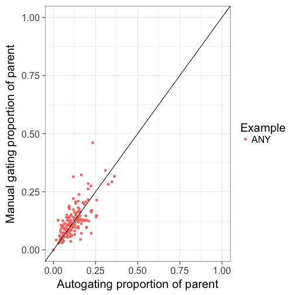

| N_SAMPS| N_DATA|    RHO|   BETA| BETA_SE|     R2|  ICC_1|
|-------:|------:|------:|------:|-------:|------:|------:|
|     151|    151| 0.6876| 0.7492|  0.0627| 0.4892| 0.6968|

naive cytotoxic Tcells (CCR7+ , CD45RA+)
========================================================
class: esmall-table

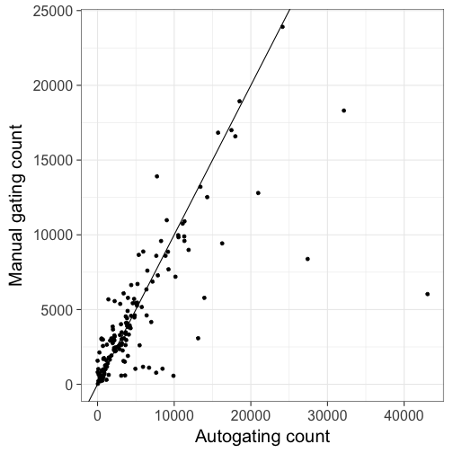

| N_SAMPS| N_DATA|    RHO|  BETA| BETA_SE|     R2|  ICC_1|
|-------:|------:|------:|-----:|-------:|------:|------:|
|     151|    151| 0.7898| 0.507|  0.0376| 0.5499| 0.6849|
***
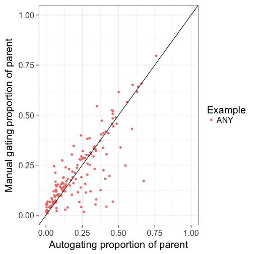

| N_SAMPS| N_DATA|    RHO|   BETA| BETA_SE|     R2|  ICC_1|
|-------:|------:|------:|------:|-------:|------:|------:|
|     151|    151| 0.7797| 0.7605|  0.0458| 0.6493| 0.8042|

B cells (CD3- CD19+) 
========================================================
class: esmall-table

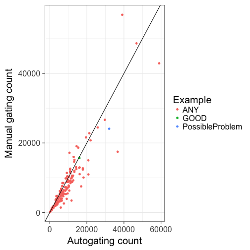

| N_SAMPS| N_DATA|    RHO|   BETA| BETA_SE|     R2|  ICC_1|
|-------:|------:|------:|------:|-------:|------:|------:|
|     151|    151| 0.9333| 0.8809|  0.0313| 0.8413| 0.9057|
***
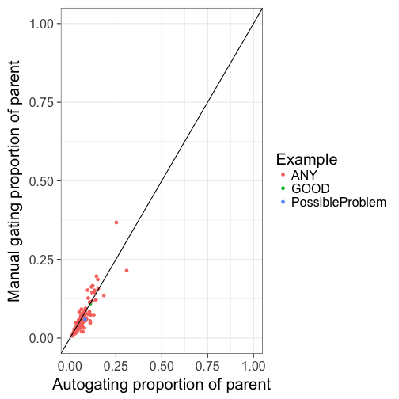

| N_SAMPS| N_DATA|    RHO|  BETA| BETA_SE|     R2|  ICC_1|
|-------:|------:|------:|-----:|-------:|------:|------:|
|     151|    151| 0.8812| 1.001|  0.0431| 0.7836| 0.8703|

naive Bcells (CD27- IgD+)
========================================================
class: esmall-table

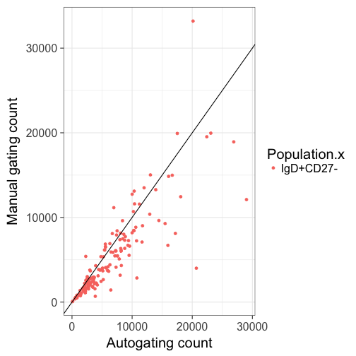

| N_SAMPS| N_DATA|    RHO|   BETA| BETA_SE|     R2|  ICC_1|
|-------:|------:|------:|------:|-------:|------:|------:|
|     151|    151| 0.9158| 0.7545|  0.0397| 0.7076| 0.8119|
***
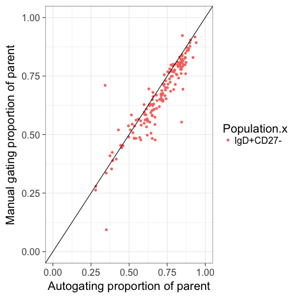

| N_SAMPS| N_DATA|    RHO|   BETA| BETA_SE|     R2|  ICC_1|
|-------:|------:|------:|------:|-------:|------:|------:|
|     151|    151| 0.9245| 0.9087|  0.0327| 0.8381| 0.8906|

IgD- memory Bcells (CD27+)
========================================================
class: esmall-table

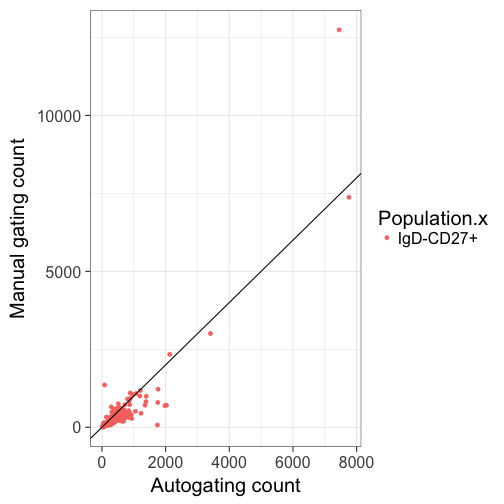

| N_SAMPS| N_DATA|    RHO|  BETA| BETA_SE|     R2|  ICC_1|
|-------:|------:|------:|-----:|-------:|------:|------:|
|     151|    151| 0.8238| 1.162|   0.044| 0.8241| 0.8777|
***
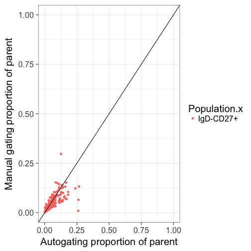

| N_SAMPS| N_DATA|   RHO|   BETA| BETA_SE|     R2| ICC_1|
|-------:|------:|-----:|------:|-------:|------:|-----:|
|     151|    151| 0.808| 0.4831|  0.0483| 0.4012| 0.585|

IgD+ memory Bcells (CD27+)
========================================================
class: esmall-table

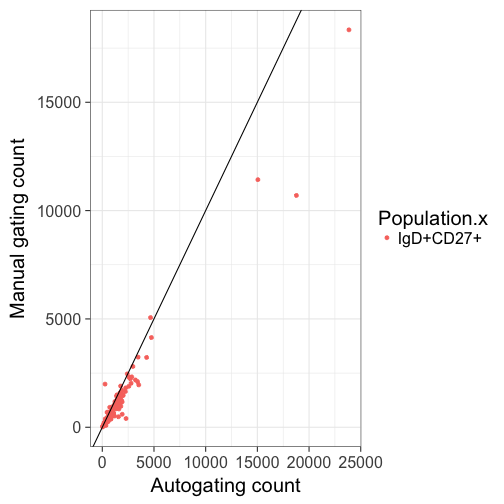

| N_SAMPS| N_DATA|    RHO|   BETA| BETA_SE|     R2|  ICC_1|
|-------:|------:|------:|------:|-------:|------:|------:|
|     151|    151| 0.9063| 0.7114|   0.012| 0.9593| 0.9204|
***
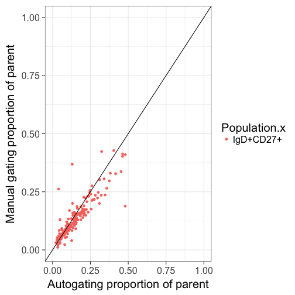

| N_SAMPS| N_DATA|    RHO|   BETA| BETA_SE|     R2|  ICC_1|
|-------:|------:|------:|------:|-------:|------:|------:|
|     151|    151| 0.8944| 0.7471|  0.0337| 0.7673| 0.8523|

